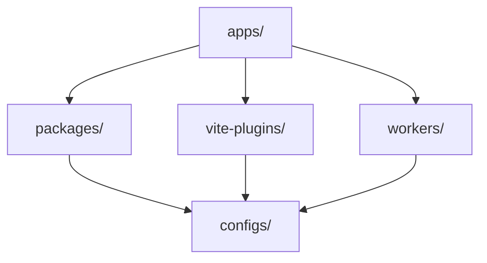

# Mission Platform Architecture

Mission Platform is engineered for maximum reusability and cross-framework flexibility. This document explains the architectural principles, the framework-neutral engine, and the build systems that power the platform.

## Architectural Blueprint

The platform follows a **composable, package-driven architecture**. This means that applications are not monolithic; instead, they are "composed" from many smaller, independent packages that each handle a specific concern (e.g., routing, internationalisation, UI components).

### The Golden Rule: Dependency Direction

A strict one-way dependency flow is enforced across the monorepo to prevent circular dependencies and maintain clear boundaries:

1.  **Applications (`apps/`)**: Consume packages, Vite plugins, and workers. They never export code to other parts of the monorepo.
2.  **Packages (`packages/`)**: Provide reusable logic and components. They can depend on each other but never on applications.
3.  **Configs (`configs/`)**: Shared tooling settings (ESLint, TypeScript, etc.). They are the foundation and depend on nothing within the monorepo.

## Framework-Neutral Engine: Forge

The heart of Mission Platform is `@mission-platform/forge`, a tiny, framework-neutral JSX runtime. It allows developers to author UI components in a dialect that is independent of any specific framework like Vue or React.

### How Forge Works

- **Neutral Hooks**: Provides familiar React-style hooks (`useState`, `useEffect`, `useMemo`) that are translated to the target framework's native primitives during compilation.
- **Serializable VNodes**: Generates a standard `MpElement` tree that can be interpreted by various adapters.
- **Zero Runtime Overhead**: The neutral code is transformed at build time into native framework code, ensuring optimal performance.

## Cross-Framework Compilation Pipeline

Mission Platform uses a custom two-stage compilation process, orchestrated by `@mission-platform/vite-plugin-forge`, to transform neutral components into multiple framework-specific outputs.

### Stage 1: Source Transformation
The neutral `.tsx` source is parsed using the TypeScript Compiler API. It is then transformed into:
- **Vue SFCs**: Translating hooks to the Composition API and generating `<script setup>` blocks.
- **React Components**: Mapping the neutral JSX to standard React modules.
- **Solid/Svelte/Web Components**: Generating the appropriate native code for each target.

### Stage 2: Native Compilation
The generated source trees are then passed to the native framework toolchains (e.g., `@vitejs/plugin-vue`, `reactJsxPlugin`) to produce the final production bundles.

## Design Token System

Visual consistency is maintained through a sophisticated design token system managed by `@mission-platform/tokens`.

- **DTCG Standard**: Tokens are authored in the W3C Design Tokens Community Group format (v2025.10).
- **OKLab Colour Space**: Primitives use the OKLab colour space for perceptually uniform gradients and themes.
- **Automated Artifacts**: `@mission-platform/vite-plugin-tokens` automatically generates SCSS variables, CSS custom properties, and TypeScript constants from a single source of truth.

## Framework-Agnostic Routing & I18n

Core application services like routing and internationalisation are designed to be framework-agnostic.

- **`@mission-platform/router`**: Defines routes as a plain data structure (`MpRoute`). Adapters for Vue translate these into framework-specific router instances and composables.
- **`@mission-platform/i18n`**: A wrapper around `i18next` that provides a universal `createForgeI18N` factory. Framework-specific adapters provide `useI18n` hooks and components for Vue and React.

## Build & Deployment Strategy

### Task Orchestration with Turborepo
Turborepo handles the heavy lifting of building, testing, and linting across the monorepo. It uses a global cache to ensure that tasks are only executed when their inputs have changed.

### Vite-Powered Builds
Each package and app uses Vite for development and production builds, leveraging a shared base configuration from `@mission-platform/vite-config`.

### Cloudflare Deployment
Applications are primarily deployed to **Cloudflare Pages**, with **Cloudflare Workers** (under `workers/`) providing specialised logic for API proxying and SPA asset serving.

## Summary

The Mission Platform architecture prioritises isolation, type safety, and framework flexibility. By decoupling the core logic from the UI framework and enforcing a strict dependency direction, the platform ensures long-term maintainability and scalability for complex application ecosystems.