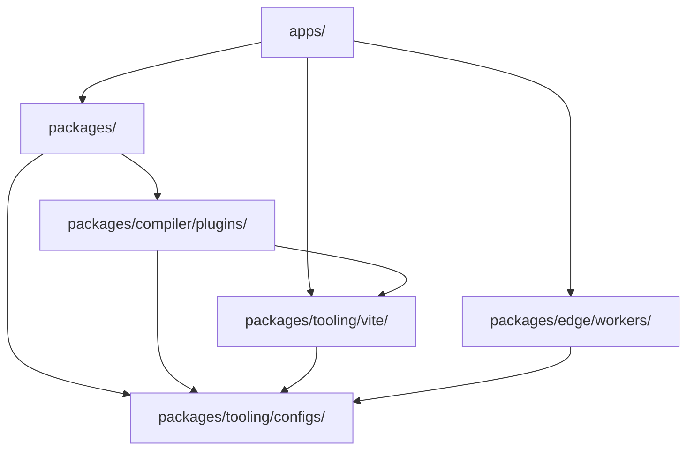

# Mission Platform Architecture

Mission Platform is engineered for maximum reusability and cross-framework flexibility. This document explains the
architectural principles, the framework-neutral engine, and the build systems that power the platform.

## Architectural Blueprint

The platform follows a **composable, package-driven architecture**. This means that applications are not monolithic;
instead, they are "composed" from many smaller, independent packages that each handle a specific concern (e.g., routing,
internationalisation, UI components).

### The Golden Rule: Dependency Direction

A strict one-way dependency flow is enforced across the monorepo to prevent circular dependencies and maintain clear
boundaries:

1. **Applications (`apps/`)**: Consume packages, Vite plugins, and workers. They never export code to other parts of the
   monorepo.
2. **Packages (`packages/`)**: Provide reusable logic and components. They can depend on each other but never on
   applications.
3. **Forge plugins (`packages/compiler/plugins/`)**: Compiler output targets — framework plugins and CMS targets. They may depend on
   `packages/tooling/vite/` and `packages/tooling/configs/`, and never on `apps/` or on each other's siblings; a CMS adapter depends only on
   `forge-cms-plugin-api`.
4. **Configs (`packages/tooling/configs/`)**: Shared tooling settings (ESLint, TypeScript, etc.). They are the foundation and depend on
   nothing within the monorepo.

## Framework-Neutral Engine: Forge

The heart of Mission Platform is `@mission-platform/forge-jsx`, a framework-neutral authoring model for components and
composables. `@mission-platform/vite-plugin-forge` is the neutral compiler driver: it parses and normalizes source,
builds semantic IR, runs shared analysis and optimization, and dispatches to an explicitly supplied
`FrameworkOutputPlugin`.

Framework packages such as `@mission-platform/forge-plugin-react` and `@mission-platform/forge-plugin-vue` own target
lowering, target optimization, native source generation, diagnostics, runtime metadata, and Vite/tsdown adapters. There
is no central framework emitter or string-to-framework registry in the driver. Package build configurations select the
plugin instances they publish, so target implementation dependencies remain at the framework boundary.

The resulting flow is **parse/normalize → neutral optimize → semantic IR → target lower → target optimize → generate →
native build**. The native build is performed by the selected plugin's Vite or tsdown adapter, which also provides the
target's declarations, externals, and output conventions.

A second, orthogonal axis projects the same neutral components onto **content platforms**.
`@mission-platform/forge-cms-plugin-api` owns a platform-neutral content model, the `CmsOutputPlugin` contract, and a
generic driver; the adapter packages `forge-cms-storyblok`, `forge-cms-astro`, `forge-cms-ghost`, `forge-cms-jekyll`,
and `forge-cms-webflow` each own one platform. A CMS target *composes* a framework plugin rather than replacing one, so
any platform pairs with any framework and the output lands in `dist/cms/<cms>/<framework>/**`.

For the complete pipeline, component and hook consumers, CMS projection, and extension guidance, see
[Forge Compiler Pipeline](../packages/tooling/vite/forge/docs/reference/compiler.md). For the build orchestration view, see
[Build System](build-system.md).

## Design Token System

Visual consistency is maintained through a sophisticated design token system managed by `@mission-platform/tokens`.

- **DTCG Standard**: Tokens are authored in the W3C Design Tokens Community Group format (v2025.10).
- **OKLab Colour Space**: Primitives use the OKLab colour space for perceptually uniform gradients and themes.
- **Automated Artifacts**: `@mission-platform/vite-plugin-tokens` automatically generates SCSS variables, CSS custom
  properties, and TypeScript constants from a single source of truth.

## Framework-Agnostic Routing & I18n

Core application services like routing and internationalisation are designed to be framework-agnostic.

- **`@mission-platform/router`**: Provides structured route targets, pure URL/location helpers, and compiler markers such
  as `MpLink`, `useMpRoute`, `useMpRouter`, and `MpRouterView`. It has no UI-framework or router-library runtime
  dependencies and never owns an application's route table.
- **Forge router targets**: `@mission-platform/forge-router-vue`, `-react`, `-solid`, `-svelte`, `-redwood`, and
  `-web-components` lower those markers to the native router selected by the consuming application. Applications retain
  ownership of native route definitions, providers, guards, loaders, and router instances; the target only supplies
  consumption capabilities.
- **`@mission-platform/i18n`**: A wrapper around `i18next` that provides a universal `createForgeI18N` factory.
  Framework-specific adapters provide `useI18n` hooks and components for Vue and React.

## Build & Deployment Strategy

### Task Orchestration with Turborepo

Turborepo handles the heavy lifting of building, testing, and linting across the monorepo. It uses a global cache to
ensure that tasks are only executed when their inputs have changed.

### Vite-Powered Builds

Each package and app uses Vite for development and production builds, leveraging a shared base configuration from
`@mission-platform/vite-config`.

### Cloudflare Deployment

Applications are primarily deployed to **Cloudflare Pages**, with **Cloudflare Workers** (under `packages/edge/workers/`) providing
specialised logic for API proxying and SPA asset serving.

## Summary

The Mission Platform architecture prioritises isolation, type safety, and framework flexibility. By decoupling the core
logic from the UI framework and enforcing a strict dependency direction, the platform ensures long-term maintainability
and scalability for complex application ecosystems.
