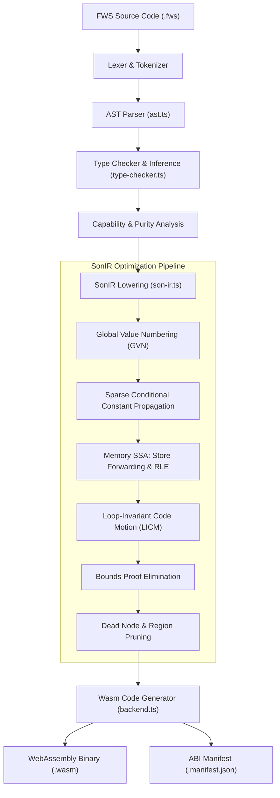
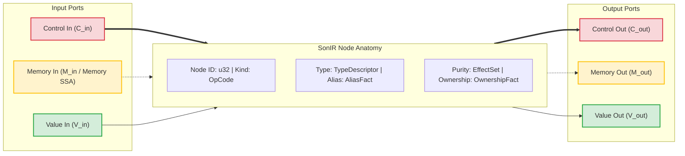
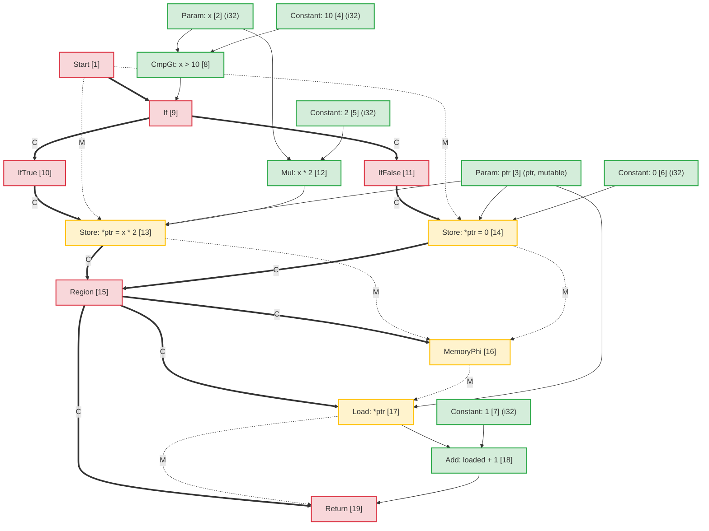
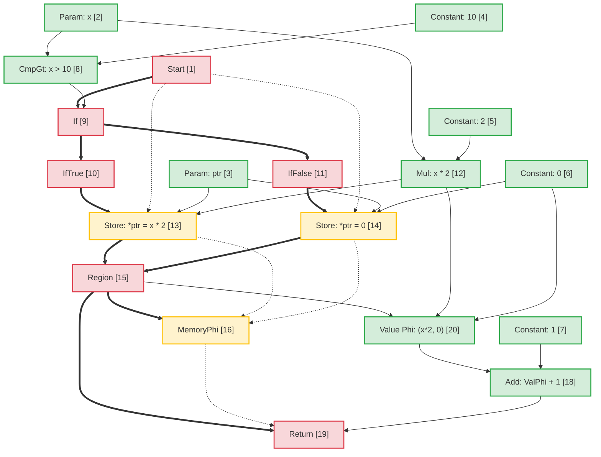
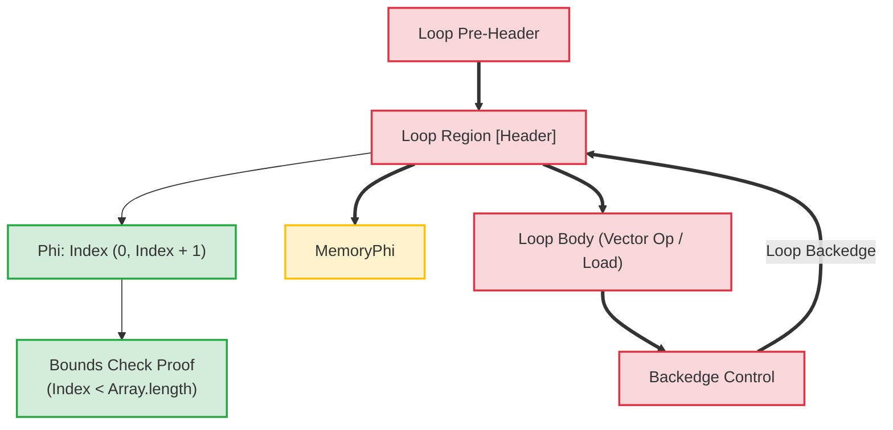

# Forge Web Script Compiler Architecture: Sea-of-Nodes Intermediate Representation (SonIR)

This document provides the architectural specification for the **Forge Web Script (`FWS`)** compiler pipeline, focusing on its core intermediate representation: **SonIR** (Sea-of-Nodes IR).

SonIR adapts Cliff Click's Sea-of-Nodes calculus to high-performance WebAssembly compilation. By unifying control flow, pure dataflow, and memory side effects into a single graph with explicit typed ports, SonIR enables aggressive optimization passes—including Global Value Numbering (GVN), Sparse Conditional Constant Propagation (SCCP), Memory SSA Redundant Load Elimination (RLE), Loop-Invariant Code Motion (LICM), and Compile-Time Bounds Proof Elimination.

---

## 1. High-Level Compilation Pipeline

The FWS compiler pipeline transforms high-level Forge Web Script source code into verified, capability-attenuated WebAssembly:



---

## 2. SonIR Architectural Model: The Triple-Port Sea-of-Nodes

In traditional compiler architectures, control flow is represented as a control flow graph (CFG) of basic blocks, while data flow is represented within basic blocks via SSA registers. This separation creates synchronization overhead during optimization passes like code motion or redundant expression elimination.

SonIR eliminates basic block boundaries. Functions are represented as a unified directed graph where nodes compute values or perform effects, and edges represent dependencies. To maintain soundness, every node explicitly segregates its input and output edges across **three distinct port categories**:



### 2.1 The Three Edge / Port Categories

| Port Category  |   Edge Notation    | Semantics & Ordering Guarantees                                                                                                                                                                                 | Representative Nodes                                           |
| :------------- | :----------------: | :-------------------------------------------------------------------------------------------------------------------------------------------------------------------------------------------------------------- | :------------------------------------------------------------- |
| **Control**    | Solid Bold (`==>`) | Governs sequential execution order, conditional branching decisions, loop headers, and function termination. Pure value nodes have no control inputs.                                                           | `Start`, `Region`, `If`, `IfTrue`, `IfFalse`, `Loop`, `Return` |
| **Memory SSA** |  Dashed (`-.->`)   | Threads abstract memory state tokens representing effect dependencies. Ensures load/store operations adhere to read-after-write and write-after-write constraints without over-constraining independent memory. | `MemoryPhi`, `Load`, `Store`, `HeapAlloc`, `Fence`, `Call`     |
| **Value**      | Solid Thin (`-->`) | Carries pure values and arithmetic results. Free of control-flow constraints; nodes with pure value inputs can float freely in the sea of nodes, subject only to data dependencies.                             | `Constant`, `Add`, `Sub`, `Mul`, `Cmp`, `Phi`, `VectorAdd`     |

---

## 3. Node Anatomy & TypeScript Representation

Within `@mission-platform/forge-web-script`, nodes are represented by the `ForgeWebScriptSoNNode` interface and serialized into deterministic `.sonir.json` module artifacts.

### 3.1 Node Interface Structure

```typescript
export interface ForgeWebScriptSoNNode {
  /** Unique sequential identifier within the compilation unit */
  readonly id: number;
  /** Operation classification (e.g., 'start', 'constant', 'load', 'store', 'region', 'if', 'return') */
  readonly kind: string;
  /** Enclosing function name */
  readonly functionName: string;
  /** Input node dependencies (in SonIR 2.0 partitioned into control, memory, and value inputs) */
  readonly inputs: readonly number[];
  /** Effect classifications: 'pure' | 'read' | 'write' | 'call' | 'control' | 'allocation' | 'unknown' */
  readonly effects: readonly ForgeWebScriptSoNEffect[];
  /** Alias analysis classification: 'none' | 'local' | 'borrowed' | 'mutable' | 'unknown' */
  readonly alias: ForgeWebScriptSoNAliasFact;
  /** Affine ownership classification: 'value' | 'borrowed' | 'owned' | 'shared' | 'unknown' */
  readonly ownership: ForgeWebScriptSoNOwnershipFact;
  /** Value type representation (e.g., 'i32', 'f64', 'bool', 'ptr', 'v128') */
  readonly type?: string;
  /** Literal constant payload */
  readonly value?: boolean | number | string;
  /** Callee name for call nodes */
  readonly callee?: string;
  /** Source span provenance for diagnostics and debugging */
  readonly span?: ForgeWebScriptSourceSpan;
}
```

### 3.2 Node Classifications & Port Routing

```
┌─────────────────┬─────────────────────┬─────────────────────┬──────────────────────┐
│ Node OpCode     │ Incoming Ports      │ Outgoing Ports      │ Description          │
├─────────────────┼─────────────────────┼─────────────────────┼──────────────────────┤
│ Start           │ None                │ Control, Memory     │ Function entry point │
│ Constant        │ None                │ Value               │ Literal constant     │
│ Add / Sub / Mul │ Value, Value        │ Value               │ Pure arithmetic      │
│ If              │ Control, Value      │ Control (T/F proj)  │ Branch predicate     │
│ IfTrue / False  │ Control (from If)   │ Control             │ Branch projection    │
│ Region          │ Control, Control    │ Control             │ Control merge point  │
│ Phi             │ Region, Value, Val  │ Value               │ Value merge point    │
│ MemoryPhi       │ Region, Mem, Mem    │ Memory              │ Memory SSA merge     │
│ Load            │ Control, Mem, Ptr   │ Memory, Value       │ Heap / stack read    │
│ Store           │ Control, Mem, Ptr, V│ Memory              │ Heap / stack write   │
│ Return          │ Control, Mem, Value │ None                │ Function exit        │
└─────────────────┴─────────────────────┴─────────────────────┴──────────────────────┘
```

---

## 4. Alias Analysis & Memory SSA

Memory SSA treats memory as an explicit value token. A `Store` node consumes a memory token $M_{in}$ and emits a new token $M_{out}$. A `Load` node takes a memory token $M_{in}$ and address $V_{ptr}$, emitting the loaded value $V_{out}$ and carrying the memory token forward.

### 4.1 Alias Analysis Classification

Every node carrying or manipulating memory addresses is tagged with an alias fact:

- **`none`**: Pure primitive values (scalars) or nodes with no memory indirection.
- **`local`**: Memory allocated in the current activation frame or region. Guaranteed not to escape the local scope; inaccessible to callers.
- **`borrowed`**: An immutable reference (`&T`) to memory owned elsewhere. Cannot be modified through this handle; concurrent reads are safe.
- **`mutable`**: An exclusive mutable reference (`&mut T`). Guarantees no other reference aliases this memory during its lifetime.
- **`unknown`**: Escaped references, capability imports, or dynamic heap pointers with undetermined provenance.

### 4.2 Disjoint Alias Disambiguation in Store-to-Load Forwarding

When two pointers $P_1$ and $P_2$ have provably disjoint alias domains:
$$\text{AliasClass}(P_1) \cap \text{AliasClass}(P_2) = \emptyset$$

The optimizer proves that a `Store` to $P_2$ cannot alter the contents of $P_1$. This permits:

1. **Redundant Load Elimination (RLE)** across intervening stores to non-aliased memory.
2. **Store-to-Load Forwarding**: A `Load` following a `Store` to the same address directly reuses the stored value operand without waiting on memory.
3. **Dead Store Elimination**: If two stores write to the same `local` or `mutable` pointer without intervening reads, the first store is pruned.

---

## 5. End-to-End Transformation Example: Conditional Memory Mutation

To illustrate how high-level code maps to SonIR, undergoes optimization, and lowers to Wasm, consider this FWS function:

```fws
fn compute(x: i32, ptr: &mut i32) -> i32 {
  if x > 10 {
    *ptr = x * 2;
  } else {
    *ptr = 0;
  }
  return *ptr + 1;
}
```

### 5.1 Initial Lowered SonIR Graph

In the unoptimized graph, both branches perform independent stores to `ptr`. At the merge point, a `Region` node converges control, and a `MemoryPhi` converges the memory state. The subsequent `Load` reads from `ptr` using the converged memory token:



### 5.2 Optimization Passes & Redundant Load Elimination (RLE)

During the optimization pipeline:

1. **Memory SSA Analysis**: The optimizer inspects `Load [17]`. Its address input is `ptr [3]`, and its memory input is `MemoryPhi [16]`.
2. **Predecessor Tracing**:
   - On the `IfTrue` incoming path, `StoreThen [13]` wrote `Mul [12]` (`x * 2`) to `ptr [3]`.
   - On the `IfFalse` incoming path, `StoreElse [14]` wrote `Constant: 0 [6]` to `ptr [3]`.
3. **Store-to-Load Forwarding**: Because `ptr` was unconditionally written on all paths entering `Region [15]` and `ptr` has exclusive `mutable` aliasing with no intervening writes:
   - A pure **Value `Phi`** node is synthesized at `Region [15]`:
     $$\text{Phi}[20] = \text{Phi}(\text{Region}[15], \text{Mul}[12], \text{Constant}[6])$$
   - The output of `Load [17]` is replaced with `Phi [20]`.
   - `Load [17]` has no remaining value users and its memory token simply passes `MemoryPhi [16]` through to `Return [19]`. `Load [17]` is pruned as dead code.

### 5.3 Optimized SonIR Graph



### 5.4 Emitted WebAssembly Instructions

Because the memory read was completely eliminated in SonIR, the emitted WebAssembly avoids an expensive `i32.load` instruction:

```wat
(func $compute (param $x i32) (param $ptr i32) (result i32)
  (local $val i32)
  local.get $x
  i32.const 10
  i32.gt_s
  if
    local.get $x
    i32.const 1
    i32.shl           ;; x * 2 optimized to shift
    local.tee $val
    local.get $ptr
    i32.store         ;; *ptr = x * 2
  else
    i32.const 0
    local.tee $val
    local.get $ptr
    i32.store         ;; *ptr = 0
  end
  local.get $val      ;; Reuses register value directly from Phi
  i32.const 1
  i32.add             ;; val + 1 without reading memory
  return
)
```

---

## 6. Loop Transformations & Compile-Time Bounds Proofs

In array/vector loops, SonIR models loop headers with `Loop` control regions and corresponding `Phi` and `MemoryPhi` nodes.



### Optimization Highlights in Loops:

1. **Loop-Invariant Code Motion (LICM)**: Nodes whose value and memory inputs originate entirely outside the `Loop` region are floated out of the loop body into the pre-header.
2. **Bounds Proof Elimination**: The compiler constructs inductive range intervals for loop indices ($0 \le i < N$). If $N \le \text{length}$, bounds checks are proven safe at compile time and eliminated, eliminating runtime branch instructions from inner loops.
3. **SIMD Vectorization**: Linear sequential array loops matching the pattern are lowered directly into 128-bit SIMD nodes (`v128.load`, `i32x4.add`), processing 4 elements per clock cycle.

---

## 7. Artifact Schema & Tooling Integration

Every compiled FWS module emits its verified SonIR graph alongside Wasm binaries:

- Artifact path convention: `<target>.sonir.json`
- Tools such as `mcp_mission-platform_fws_inspect_sonir` and `mcp_mission-platform_fws_verify_artifact` inspect this artifact to verify bounds checks, graph hashes, and capability compliance before deployment to sandboxes.
