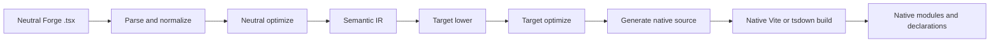
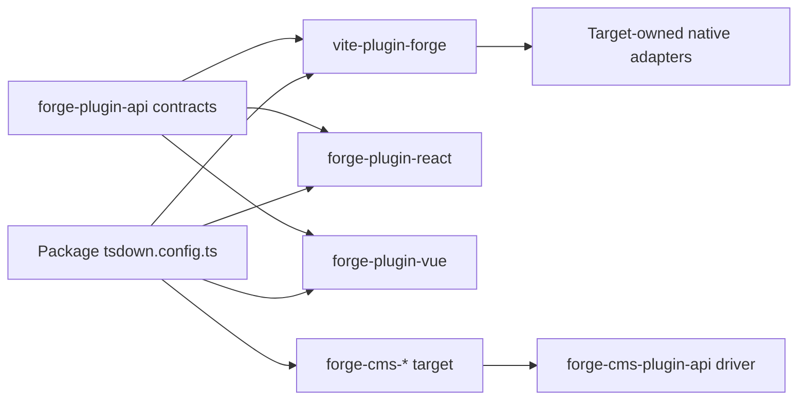
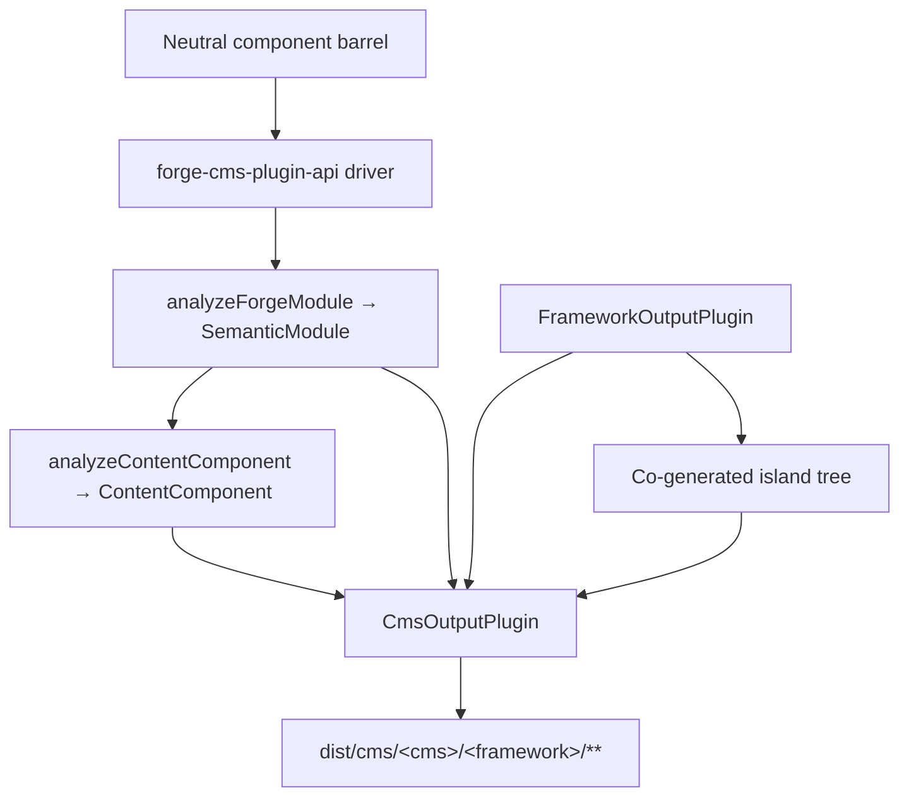

# Forge Compiler Pipeline

This is an architecture explanation for Mission Platform maintainers who need to understand how a framework-neutral
Forge module becomes a native framework package. The important boundary is not “one source emitter per framework” inside
the Vite plugin. Forge has a neutral compiler driver, an explicit target plugin contract, and framework-owned native
build adapters.

## The responsibility split

Forge compilation crosses several packages, each with a deliberately narrow responsibility:

| Layer                                                | Owns                                                                                                                                         | Does not own                                                            |
| :--------------------------------------------------- | :------------------------------------------------------------------------------------------------------------------------------------------- | :---------------------------------------------------------------------- |
| `@mission-platform/vite-plugin-forge`                | Parsing, normalization, neutral analysis, semantic IR, shared optimization, cache/discovery, dispatch, and generic Vite/tsdown orchestration | React, Vue, Solid, Svelte, Web Components, or CMS source emitters       |
| `@mission-platform/forge-plugin-api`                 | `FrameworkOutputPlugin`, semantic target contracts, generated-module types, target metadata, and Vite/tsdown adapter types                   | A framework implementation or target selection registry                 |
| Built-in `@mission-platform/forge-plugin-*` packages | Target lowering, target optimization, source generation, target diagnostics, runtime metadata, and native build adapters                     | Neutral parsing and cross-target orchestration                          |
| `@mission-platform/forge-cms-plugin-api`             | `CmsOutputPlugin`, the neutral content model, the discover→analyse→emit→write driver, island co-generation, and the CMS build helpers        | Any platform-specific schema, template, or manifest shape               |
| `@mission-platform/forge-cms-*` packages             | One content platform each: its field mapping, template dialect, manifest shape, and platform diagnostics                                     | Neutral prop classification or cross-target orchestration               |
| Package `tsdown.config.ts` files                     | Selecting the target plugin instances and package-specific overrides                                                                         | Reimplementing compiler stages or framework switch tables               |

The dependency direction is explicit: a package imports the target plugin it wants, passes that instance to the neutral
driver, and receives a target-specific build configuration. The driver never constructs a target from a string or imports
every framework package just in case it is needed.

## The strict pipeline

The canonical flow is a single neutral front end followed by target-owned stages and a native build. Each target receives
the same semantic facts; it does not need to reconstruct the neutral module from a generated source file.



### Parse and normalize

The driver reads neutral TypeScript/JSX and creates the generic AST representation used by the compiler. Normalization
resolves neutral authoring conventions into stable facts: imports, directives, component and hook boundaries, JSX nodes,
slots, static markers, and other constructs that later stages need. Diagnostics are collected with source locations
instead of being hidden in a target emitter.

### Neutral optimization and semantic IR

Neutral passes operate before a framework is involved. They can discover components and helpers, rewrite imports, strip
compiler directives, infer stable keys, prune neutral dead branches, and cache reusable analysis. The result is a
`SemanticModule`: an explicit representation of the module’s component or composable behavior and its neutral facts.

The semantic IR is the contract between the generic compiler and a target plugin. The frontend also keeps the original
parsed TypeScript `SourceFile` as a non-enumerable runtime detail on the semantic module. Target emitters may consume
that shared parsed tree for source-backed leaves, but they must never call `parseTsx` on the module source again. This
keeps the cache serializable while ensuring the source is parsed only once.

### Target lowering and optimization

The caller supplies a `FrameworkOutputPlugin` instance. The driver calls its `lower` function with the semantic module
and a `TargetContext`, producing `TargetIntentions`. Lowering maps neutral concepts to target concepts: for example,
neutral hooks and slots become the target’s state/lifecycle and slot representation, while neutral elements become the
target’s element or component model.

The plugin’s `optimize` function then performs target-specific simplification. It receives the shared neutral options
alongside an extension point for target options. This keeps framework rules out of the neutral optimizer while allowing a
target to optimize its own generated representation before source generation.

### Source generation and native compilation

The plugin’s `generate` function returns a `GeneratedModule`. It can include the primary source, auxiliary modules, and
target diagnostics. The generated source is deliberately an intermediate artifact owned by the target package: React,
Vue, Solid, Svelte, and Web Components can each choose the source shape their native toolchain expects.

The final stage is not another Forge emitter. The plugin’s `build.vite` or `build.tsdown` adapter supplies the native
framework plugins and build settings for the generated tree. Native Vite/Rolldown compilation, declaration generation,
externalization, and output packaging then happen using that target’s normal toolchain.

### Diagnostics and caching

Diagnostics carry the compiler phase, target, source span, and an actionable reason. A target must report an unsupported
semantic node instead of silently emitting a generic runtime closure or invalid native source. Neutral semantic modules
are cached by source content, module kind, and semantic-affecting options; the target stages receive the same cached
module for each selected framework while keeping target lowering and optimization independent.

## Explicit target ownership

The central contracts live in `forge-plugins/forge-plugin-api/src/framework.ts`:

- `FrameworkOutputPlugin` identifies a target and owns `lower`, `optimize`, `generate`, and `build`.
- `TargetContext` carries generic build context such as module kind, component name, and discovered component folders.
- `TargetIntentions` wraps the semantic module after target lowering while retaining diagnostics.
- `GeneratedModule` describes generated source, its output language, auxiliary modules, and diagnostics.
- `FrameworkBuildAdapters` provides independently typed Vite and tsdown adapters.
- `FrameworkSourceMetadata`, runtime externals, and display-name metadata let generic orchestration derive output details
  without a target switch statement.

Built-in targets are constructed by their own packages, for example `forgeReactFramework()`, `forgeVueFramework()`,
`forgeSolidFramework()`, `forgeSvelteFramework()`, and `forgeWebComponentsFramework()`. A package selects only the
targets it publishes:

```ts
import { defineTsdownForgeComponents } from "@mission-platform/vite-plugin-forge";
import { forgeReactFramework } from "@mission-platform/forge-plugin-react";
import { forgeSolidFramework } from "@mission-platform/forge-plugin-solid";
import { forgeSvelteFramework } from "@mission-platform/forge-plugin-svelte";
import { forgeVueFramework } from "@mission-platform/forge-plugin-vue";
import { forgeWebComponentsFramework } from "@mission-platform/forge-plugin-web-components";

export default defineTsdownForgeComponents({
  rootDir: import.meta.dirname,
  frameworks: [
    forgeVueFramework(),
    forgeReactFramework(),
    forgeSvelteFramework(),
    forgeSolidFramework(),
    forgeWebComponentsFramework(),
  ],
  componentsModule: `${import.meta.dirname}/src/components/index.ts`,
  name: "MissionPlatformComponents",
});
```

The instances are caller-owned. Fresh instances can carry target-specific options and metadata, and an empty plugin list
is a configuration error rather than a request to use a hidden default registry. This makes adding a new target an
additive package change: implement the output-plugin contract, publish its build adapters, and select it in consumers.



The arrows from a consumer to both the driver and target package are intentional. The consumer owns target selection;
the driver owns generic orchestration; and each target package owns the framework implementation.

## Component builds

Component packages author neutral modules against `@mission-platform/forge`, usually through a neutral component barrel.
`defineTsdownForgeComponents` creates one target build for each supplied plugin. For each target it:

1. parses, normalizes, and analyzes the neutral component modules;
2. runs neutral passes and creates semantic modules;
3. invokes the selected plugin’s lowering, optimization, and generation stages;
4. writes target source and auxiliary modules to a target-specific cache;
5. invokes the plugin’s tsdown/Vite adapters;
6. emits the target directory, declarations, runtime externals, and package entry artifacts.

The neutral source is shared, but generated trees and declarations are target-specific. A Vue build can therefore use Vue
SFC and Vue declaration tooling, while a React build can use React JSX and React-native types. Package configuration can
still add caller overrides, CSS handling, declaration plugins, or target-specific Vite options without moving those
concerns into the generic compiler.

## Hook and composable builds

Hooks are neutral composables rather than UI components, but use the same explicit target ownership boundary. A hook
consumer passes one `FrameworkOutputPlugin` to `defineTsdownForgeHooks`. The generic driver parses the neutral entry,
preserves framework-agnostic modules where possible, and sends target-dependent modules through the plugin’s strict
lower/optimize/generate path.

The selected plugin controls the hook output language and native adapter. This allows, for example, a React hook build to
use React-compatible imports and a Vue hook build to expose Vue `Ref`-based behavior, while neutral utility modules remain
unchanged. Each target receives its own declarations from the generated target tree; no shared declaration pretends that
all framework consumers have the same hook types.

## CMS projection

Projecting components onto a *content platform* is an axis orthogonal to framework lowering, not a framework
implementation hidden inside the main driver. A component becomes a Storyblok blok, an Astro island, a Ghost partial, a
Jekyll include, or a Webflow code component — and each of those can be paired with **any** framework output plugin.
`storyblok × vue`, `astro × solid`, and `ghost × web-components` are therefore configuration rather than new code.

`@mission-platform/forge-cms-plugin-api` owns that seam. It contributes three things:

1. **A neutral content model.** `analyzeContentComponent` maps a component's props interface onto ordered
   `ContentField`s with a kind (`text`, `richtext`, `number`, `boolean`, `option`, `asset`, `link`, `children`), a JSDoc
   description, a required flag, a literal default, slot metadata, and a `@cmsSetting` flag. Callback props are dropped
   and a union mixing string literals with `string`/`number` degrades to `text` — decided once, so every platform
   agrees. When the semantic IR is supplied, `ContentComponent.interactive` reports whether the component carries state,
   refs, effects, or events.
2. **A target contract.** `CmsOutputPlugin` *composes* a `FrameworkOutputPlugin` rather than being one, and declares the
   emitters `emitSchema`, `emitTemplate`, `emitManifest`, and `emitEntry`. `defineForgeCmsPlugin` validates it at
   configuration time, including a target's `supportedFrameworks` restriction.
3. **A generic driver and build helpers.** `generateCmsArtifacts` discovers the neutral barrel, obtains each component's
   IR through `analyzeForgeModule`, analyses the content model, calls the target's emitters, and writes every returned
   `CmsArtifact`. `defineTsdownForgeCms(All)` runs it into a per-target cache and emits
   `dist/cms/<cms>/<framework>/**`, mirroring `asset: true` artifacts into `dist/cms/<cms>/`.

The driver never maps a string id onto a target — consumers construct and pass instances, exactly as they do for
framework plugins:

```ts
import { defineTsdownForgeCmsAll } from "@mission-platform/forge-cms-plugin-api";
import { forgeStoryblokCms } from "@mission-platform/forge-cms-storyblok";
import { forgeReactFramework } from "@mission-platform/forge-plugin-react";
import { forgeVueFramework } from "@mission-platform/forge-plugin-vue";

export default defineTsdownForgeCmsAll({
  rootDir: import.meta.dirname,
  targets: [
    forgeStoryblokCms({
      packageName: "@mission-platform/components",
      plugin: forgeReactFramework(),
      storyblokRuntime: "@storyblok/react",
    }),
    forgeStoryblokCms({
      packageName: "@mission-platform/components",
      plugin: forgeVueFramework(),
      storyblokRuntime: "@storyblok/vue",
    }),
  ],
  componentsModule: `${import.meta.dirname}/src/components/index.ts`,
});
```



### The targets

| Package                                    | Factory              | Emits                                                                        |
| :----------------------------------------- | :-------------------- | :---------------------------------------------------------------------------- |
| `@mission-platform/forge-cms-storyblok`    | `forgeStoryblokCms`   | a component object per component, a framework blok wrapper, `components.json`, a typed entry |
| `@mission-platform/forge-cms-astro`        | `forgeAstroCms`       | static `.astro` or a `client:load` island, plus a zod `content.config.ts`     |
| `@mission-platform/forge-cms-ghost`        | `forgeGhostCms`       | Handlebars partials plus a `config.custom` theme fragment                     |
| `@mission-platform/forge-cms-jekyll`       | `forgeJekyllCms`      | Liquid includes plus `_data/forge-components.yml` and a `_config.yml` fragment |
| `@mission-platform/forge-cms-webflow`      | `forgeWebflowCms`     | `declareComponent` code-component declarations plus a `webflow.json` library fragment |

Every unsupported mapping produces a `CompilerDiagnostic` with a phase, a code, and an actionable reason rather than a
silent omission — Ghost warns on numeric fields and on exceeding its ~20-setting cap, Webflow warns when a number
degrades to text, and Astro warns when a prop default cannot cross the island boundary. Warnings are logged; errors abort
the build.

### Islands

A target that declares `island: 'framework'` (Astro, Webflow) needs a real runtime component to hydrate. Rather than
importing the host package's already-built `./vue` or `./react` subpath — which would make CMS output depend on another
build having run first — the driver runs the **bound framework plugin** over the same neutral barrel into a sibling
`island/` directory, and the emitted template imports a file it owns. The island is compiled by that plugin's own tsdown
stage plugins in the very same build.

This is why Astro is a CMS target rather than a framework plugin: it previously shipped a hand-rolled vanilla-DOM island
runtime that re-implemented state, refs, effects, and events from the IR. Composing a framework plugin instead means an
interactive Astro component behaves exactly like the same component in every other build.

## Where to look when debugging

Trace a build by responsibility rather than by generated file first:

1. **Input and diagnostics:** inspect `vite-plugins/forge/src/compiler/` for parsing, discovery, neutral optimization,
   semantic IR construction, and diagnostic aggregation.
2. **Target behavior:** inspect the selected `forge-plugin-*` package and its `lower`, `optimize`, `generate`, and build
   adapter implementations.
3. **Generic build shape:** inspect `vite-plugins/forge/src/generate.ts`, `generate-hooks.ts`, and `tsdown.ts` for cache,
   output, declaration, and caller-override behavior.
4. **CMS output:** inspect `forge-plugins/forge-cms-plugin-api/` for the content model, the driver, and the build
   helpers, then the specific `forge-plugins/forge-cms-*` target for its emitters and platform mapping.
5. **Package selection:** inspect the consuming package’s `tsdown.config.ts` and direct `forge-plugin-*` dependencies.

The most useful evidence is the first failing stage and its diagnostics. If semantic IR is wrong, fix neutral parsing or
analysis. If the IR is correct but native source is wrong, fix the selected target plugin. If generated source is correct
but bundling fails, inspect that plugin’s Vite/tsdown adapter or consumer override configuration.

## Extending Forge with a target

To add a framework target without reintroducing central ownership:

1. create a `forge-plugin-*` package with a factory returning `FrameworkOutputPlugin`;
2. implement lowering from `SemanticModule` to target intentions;
3. add target optimization and source generation, including auxiliary modules and diagnostics;
4. provide target source metadata, runtime external names, and Vite/tsdown adapters;
5. add focused tests for semantic edge cases and generated artifacts;
6. add the plugin as a direct dependency in each package that publishes the target;
7. pass fresh plugin instances in that package’s build configuration.

Do not add a framework ID to a registry in `vite-plugin-forge`, import a framework package from the neutral driver, or add
a target-specific branch to generic parsing and output orchestration. The contract is intentionally open so target
packages can evolve their source representation while the neutral pipeline remains stable.

## Extending Forge with a CMS target

Adding a content platform follows the same additive shape, one layer up:

1. create a `forge-cms-*` package depending on `@mission-platform/forge-cms-plugin-api`;
2. export a factory that returns `defineForgeCmsPlugin({ id, framework, packageName, … })`, taking the framework plugin
   from the caller rather than choosing one;
3. implement `emitTemplate`, and whichever of `emitSchema`, `emitManifest`, and `emitEntry` the platform needs — a
   template-only platform such as Ghost or Jekyll implements just the first two and the driver writes a placeholder
   entry;
4. map the neutral `ContentFieldKind`s onto the platform's field vocabulary in one place, and push a
   `CompilerDiagnostic` for every mapping the platform cannot represent faithfully;
5. set `island: 'framework'` if the platform needs a hydrated runtime, and `supportedFrameworks` if it only accepts
   some framework plugins;
6. add a spec over the shared fixtures exported from `@mission-platform/forge-cms-plugin-api/fixtures`, so the new
   target is exercised against exactly the same inputs as every other one;
7. add the package as a direct dependency of each consumer that publishes the target and pass a fresh instance to
   `defineTsdownForgeCms`.

Do not add prop-classification logic to the target: a fix to union, JSDoc, default, or slot handling belongs in the
shared content model so every platform benefits at once.

For the build-system overview and platform-wide dependency direction, see [Build System](build-system.md) and
[Mission Platform Architecture](architecture.md).
