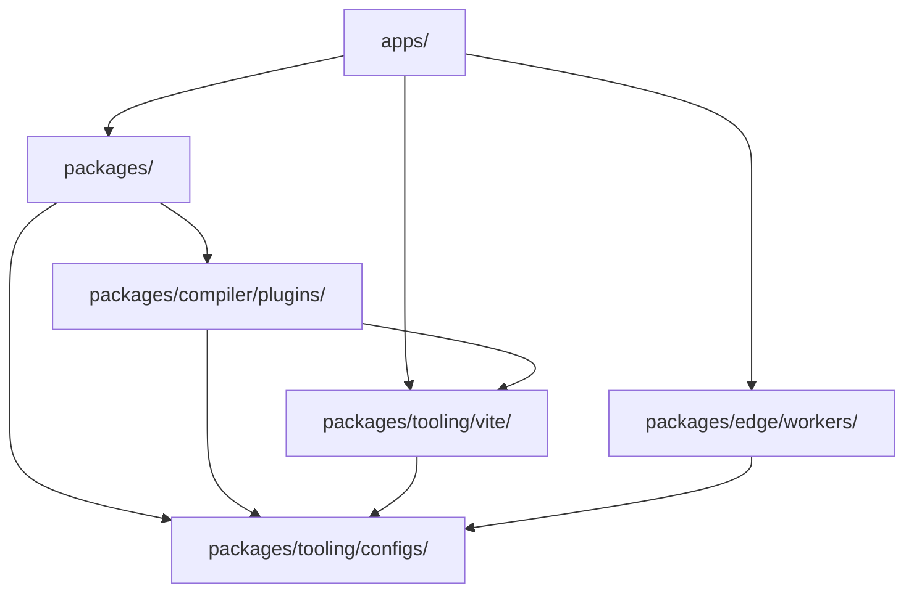

# هندسة منصة المهمة

ترجمة آلية مساعدة من المصدر الإنجليزي الأساسي. تُراجع يدويًا عند الحاجة. تبقى أسماء الحزم والأوامر والمسارات والمعرّفات التقنية دون تغيير.

> docs/architecture.md: [docs/architecture.md](../../architecture.md)
> اللغة: العربية (ar)

تم تصميم Mission Platform لتحقيق أقصى قدر من قابلية إعادة الاستخدام والمرونة عبر الإطارات. تشرح هذه الوثيقة
المبادئ المعمارية، والمحرك المحايد للإطار، وأنظمة البناء التي تعمل على تشغيل النظام الأساسي.

## المخطط المعماري

تتبع المنصة **بنية قابلة للتركيب وقائمة على الحزمة**. وهذا يعني أن التطبيقات ليست متجانسة؛
بدلاً من ذلك، فهي "تتكون" من العديد من الحزم الصغيرة والمستقلة التي تعالج كل منها مشكلة معينة (على سبيل المثال، التوجيه،
التدويل، مكونات واجهة المستخدم).

### القاعدة الذهبية: اتجاه التبعية

يتم فرض تدفق تبعية صارم في اتجاه واحد عبر monorepo لمنع التبعيات الدائرية والحفاظ على الوضوح
الحدود:

1. **التطبيقات (`apps/`)**: تستهلك الحزم، Vite الإضافات والعمال. لا يقومون أبدًا بتصدير التعليمات البرمجية إلى أجزاء أخرى من الملف
   com.monorepo.
2. ** الحزم (`packages/`)**: توفير منطق ومكونات قابلة لإعادة الاستخدام. يمكنهم الاعتماد على بعضهم البعض ولكن ليس عليهم أبدًا
   التطبيقات.
3. ** صياغة الإضافات (`packages/compiler/plugins/`)**: أهداف مخرجات المترجم - المكونات الإضافية لإطار العمل وأهداف CMS. قد يعتمدون عليها
   `packages/tooling/vite/` و `packages/tooling/configs/`، وأبدا `apps/` أو على إخوة بعضهم البعض؛ محول CMS يعتمد فقط على
   `forge-cms-plugin-api`.
4. ** التكوينات (`packages/tooling/configs/`)**: إعدادات الأدوات المشتركة (ESLint, TypeScript، إلخ.). هم الأساس ويعتمدون عليه
   لا شيء داخل monorepo.

## محرك محايد الإطار: صياغة

قلب منصة المهمة هو `@mission-platform/forge`، نموذج تأليف محايد للإطار للمكونات و
مواد مركبة. `@mission-platform/vite-plugin-forge` هو برنامج تشغيل المترجم المحايد: يقوم بتوزيع المصدر وتطبيعه،
يبني IR الدلالي، ويدير التحليل المشترك والتحسين، ويرسل إلى مصدر تم توفيره بشكل صريح
`FrameworkOutputPlugin`.

حزم الإطار مثل `@mission-platform/forge-plugin-react` و `@mission-platform/forge-plugin-vue` الهدف الخاص
التخفيض، وتحسين الهدف، وتوليد المصدر الأصلي، والتشخيصات، وبيانات تعريف وقت التشغيل، و Vite/ محولات tsdown. هناك
لا يوجد باعث إطار مركزي أو تسجيل سلسلة إلى إطار عمل في برنامج التشغيل. تكوينات بناء الحزمة حدد
مثيلات البرنامج المساعد التي ينشرونها، لذلك تظل تبعيات التنفيذ المستهدفة عند حدود إطار العمل.

التدفق الناتج هو **تحليل/تطبيع → تحسين محايد → IR الدلالي → الهدف السفلي → تحسين الهدف → إنشاء →
البناء الأصلي **. يتم تنفيذ البناء الأصلي بواسطة البرنامج المساعد المحدد Vite أو محول tsdown، والذي يوفر أيضًا
إعلانات الهدف، والظواهر الخارجية، واتفاقيات الإخراج.

يعرض المحور المتعامد الثاني نفس المكونات المحايدة على **أنظمة المحتوى**.
`@mission-platform/forge-cms-plugin-api` تمتلك نموذج محتوى محايد للمنصة، وهو `CmsOutputPlugin` العقد، و أ
سائق عام حزم المحول `forge-cms-storyblok`, `forge-cms-astro`, `forge-cms-ghost`, `forge-cms-jekyll`،
و `forge-cms-webflow` كل منها يمتلك منصة واحدة. هدف نظام إدارة المحتوى *يؤلف* مكونًا إضافيًا لإطار العمل بدلاً من استبداله، لذلك
أي أزواج منصة مع أي إطار ويصل الإخراج `dist/cms/<cms>/<framework>/**`.

للحصول على خط الأنابيب الكامل، والمستهلكين المكونين والربط، وإسقاط CMS، وتوجيهات الامتداد، راجع
[صياغة خط أنابيب مترجم](../../../packages/tooling/vite/forge/docs/locales/ar/reference/compiler.md). للحصول على طريقة عرض تزامن البناء، راجع
[بناء النظام](build-system.md).

## تصميم نظام رمزي

يتم الحفاظ على الاتساق البصري من خلال نظام رمزي متطور للتصميم تتم إدارته بواسطة `@mission-platform/tokens`.

- **معيار DTCG**: تم تأليف الرموز المميزة بتنسيق مجموعة W3C Design Tokens Community Group (الإصدار 2025.10).
- **مساحة ألوان OKLab**: تستخدم البدائيات مساحة ألوان OKLab للتدرجات والسمات الموحدة بشكل إدراكي.
- **التحف الآلية**: `@mission-platform/vite-plugin-tokens` يقوم تلقائيًا بإنشاء متغيرات SCSS، ومتغيرات CSS المخصصة
  خصائص، و TypeScript الثوابت من مصدر واحد للحقيقة.

## إطار التوجيه الملحد وI18n

تم تصميم خدمات التطبيقات الأساسية مثل التوجيه والتدويل لتكون مستقلة عن إطار العمل.

- **`@mission-platform/router`**: يوفر أهداف مسار منظمة، ومساعدين محددين لعنوان URL/الموقع، وعلامات المترجم مثل
  كما `MpLink`, `useMpRoute`, `useMpRouter`، و `MpRouterView`. ليس لديه إطار عمل لواجهة المستخدم أو وقت تشغيل مكتبة جهاز التوجيه
  التبعيات ولا يمتلك أبدًا جدول توجيه التطبيق.
- ** صياغة أهداف جهاز التوجيه **: `@mission-platform/forge-router-vue`, `-react`, `-solid`, `-svelte`, `-redwood`، و
  `-web-components` قم بخفض تلك العلامات إلى جهاز التوجيه الأصلي الذي حدده التطبيق المستهلك. تحتفظ التطبيقات
  ملكية تعريفات المسار الأصلي، والموفرين، والحراس، والمحملين، ومثيلات جهاز التوجيه؛ الهدف يزود فقط
  قدرات الاستهلاك.
- **`@mission-platform/i18n`**: غلاف حولها `i18next` الذي يوفر عالمية `createForgeI18N` مصنع.
  توفر المحولات الخاصة بالإطار `useI18n` السنانير والمكونات ل Vue و React.

## استراتيجية البناء والنشر

### تنسيق المهام مع Turborepo

يتعامل Turborepo مع الرفع الثقيل للبناء والاختبار والبطانة عبر monorepo. ويستخدم ذاكرة تخزين مؤقت عالمية ل
التأكد من أن المهام يتم تنفيذها فقط عندما تتغير مدخلاتها.

### Vite-بنيات مدعومة

تستخدم كل حزمة وتطبيق Vite للتطوير والإنتاج، والاستفادة من التكوين الأساسي المشترك من
`@mission-platform/vite-config`.

### نشر Cloudflare

يتم نشر التطبيقات بشكل أساسي على **Cloudflare Pages**، مع **Cloudflare Workers** (تحت `packages/edge/workers/`) توفير
منطق متخصص لوكيل API وخدمة أصول SPA.

## ملخص

تعطي بنية Mission Platform الأولوية للعزل وسلامة النوع ومرونة الإطار. عن طريق فصل النواة
المنطق من إطار عمل واجهة المستخدم وفرض اتجاه تبعية صارم، يضمن النظام الأساسي إمكانية الصيانة على المدى الطويل
وقابلية التوسع للأنظمة البيئية للتطبيقات المعقدة.
