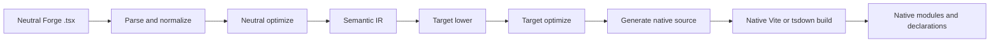
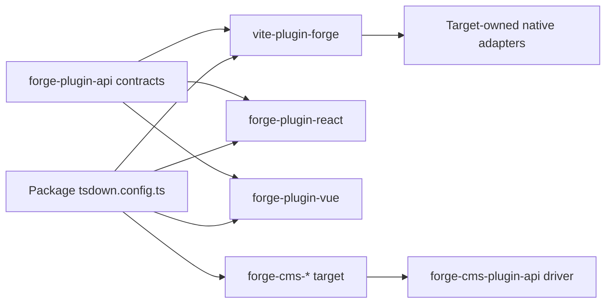
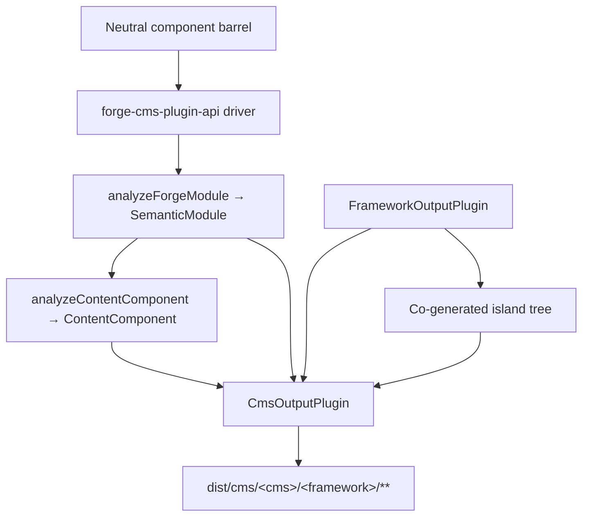

# صياغة خط أنابيب مترجم

ترجمة آلية مساعدة من المصدر الإنجليزي الأساسي. تُراجع يدويًا عند الحاجة. تبقى أسماء الحزم والأوامر والمسارات والمعرّفات التقنية دون تغيير.

> المصدر الإنجليزي: [docs/forge-compiler.md](../../forge-compiler.md)
> اللغة: العربية (ar)

هذا هو شرح البنية لمشرفي Mission Platform الذين يحتاجون إلى فهم كيفية محايدة الإطار
تصبح وحدة Forge حزمة إطار عمل أصلية. الحدود المهمة ليست "باعث مصدر واحد لكل إطار" في الداخل
ال Vite البرنامج المساعد. لدى Forge برنامج تشغيل مترجم محايد، وعقد مكون إضافي مستهدف واضح، وموطن أصلي مملوك لإطار العمل
بناء محولات.

## انقسمت المسؤولية

تتقاطع مجموعة Forge مع العديد من الحزم، ولكل منها مسؤولية محدودة بشكل متعمد:

| طبقة | يملك | لا يملك |
| :--------------------------------------------------- | :------------------------------------------------------------------------------------------------------------------------------------------- | :---------------------------------------------------------------------- |
| `@mission-platform/vite-plugin-forge`                | التحليل والتطبيع والتحليل المحايد والأشعة تحت الحمراء الدلالية والتحسين المشترك وذاكرة التخزين المؤقت/الاكتشاف والإرسال والعامة Vite/ تنسيق tsdown | React, Vue, Solid, Svelteأو مكونات الويب أو بواعث مصدر CMS |
| `@mission-platform/forge-plugin-api`                 | `FrameworkOutputPlugin`والعقود المستهدفة الدلالية، وأنواع الوحدات التي تم إنشاؤها، والبيانات الوصفية المستهدفة، و Vite/ أنواع محول tsdown | تنفيذ الإطار أو تسجيل اختيار الهدف |
| مدمج `@mission-platform/forge-plugin-*` حزم | خفض الهدف، وتحسين الهدف، وإنشاء المصدر، وتشخيص الهدف، وبيانات تعريف وقت التشغيل، ومحولات البناء الأصلية | التحليل المحايد والتنسيق عبر الأهداف |
| `@mission-platform/forge-cms-plugin-api`             | `CmsOutputPlugin`، نموذج المحتوى المحايد، اكتشاف → تحليل → إرسال → برنامج تشغيل الكتابة، التوليد المشترك للجزيرة، ومساعدي بناء CMS | أي مخطط أو قالب أو شكل بيان خاص بالمنصة |
| `@mission-platform/forge-cms-*` حزم | منصة محتوى واحدة لكل منها: رسم الخرائط الميدانية ولهجة القالب وشكل البيان وتشخيص النظام الأساسي | تصنيف الدعامة المحايدة أو التنسيق عبر الأهداف |
| طَرد `tsdown.config.ts` ملفات | تحديد مثيلات البرنامج المساعد الهدف والتجاوزات الخاصة بالحزمة | إعادة تنفيذ مراحل المترجم أو جداول تبديل الإطار |

اتجاه التبعية واضح: تستورد الحزمة المكون الإضافي المستهدف الذي تريده، وتمرر هذا المثيل إلى الحياد
برنامج التشغيل، ويتلقى تكوين بناء خاص بالهدف. لا يقوم برنامج التشغيل أبدًا بإنشاء هدف من سلسلة أو عمليات استيراد
كل حزمة إطارية فقط في حالة الحاجة إليها.

## خط الأنابيب الصارم

التدفق الأساسي عبارة عن واجهة أمامية محايدة واحدة تليها مراحل مملوكة للهدف وبناء أصلي. يتلقى كل هدف
نفس الحقائق الدلالية. لا يحتاج إلى إعادة بناء الوحدة المحايدة من ملف مصدر تم إنشاؤه.



### تحليل وتطبيع

يقرأ السائق محايدًا TypeScript/JSX ويقوم بإنشاء تمثيل AST العام الذي يستخدمه المترجم. التطبيع
يحل اصطلاحات التأليف المحايدة إلى حقائق ثابتة: الواردات، والتوجيهات، وحدود المكونات والربط، وعقد JSX،
الفتحات والعلامات الثابتة والبنيات الأخرى التي تحتاجها المراحل اللاحقة. يتم جمع التشخيصات مع مواقع المصدر
بدلا من أن تكون مخفية في باعث الهدف.

### التحسين المحايد والأشعة تحت الحمراء الدلالية

تعمل التمريرات المحايدة قبل مشاركة الإطار. يمكنهم اكتشاف المكونات والمساعدين، وإعادة كتابة الواردات، والتجريد
توجيهات المترجم، واستنتاج المفاتيح المستقرة، وتقليم الفروع الميتة المحايدة، وتحليل ذاكرة التخزين المؤقت القابلة لإعادة الاستخدام. والنتيجة هي أ
`SemanticModule`: تمثيل صريح لمكون الوحدة أو السلوك القابل للتركيب وحقائقه المحايدة.

IR الدلالي هو العقد بين المترجم العام والمكون الإضافي المستهدف. تحافظ الواجهة الأمامية أيضًا على النسخة الأصلية
تحليل TypeScript `SourceFile` كتفاصيل وقت تشغيل غير قابلة للتعداد في الوحدة الدلالية. قد تستهلك بواعث الهدف
تلك الشجرة المُحللة المشتركة للأوراق المدعومة من المصدر، لكن يجب ألا يتصلوا بها أبدًا `parseTsx` على مصدر الوحدة مرة أخرى. هذا
يحافظ على إمكانية تسلسل ذاكرة التخزين المؤقت مع ضمان تحليل المصدر مرة واحدة فقط.

### خفض الهدف والتحسين

المتصل يزود أ `FrameworkOutputPlugin` مثال. السائق يدعو لها `lower` وظيفة مع الوحدة الدلالية
و أ `TargetContext`، إنتاج `TargetIntentions`. خفض خرائط المفاهيم المحايدة لاستهداف المفاهيم: على سبيل المثال،
تصبح الخطافات والفتحات المحايدة هي حالة/دورة حياة الهدف وتمثيل الفتحة، بينما تصبح العناصر المحايدة هي
عنصر الهدف أو نموذج المكون.

البرنامج المساعد `optimize` تقوم الوظيفة بعد ذلك بالتبسيط الخاص بالهدف. يتلقى الخيارات المحايدة المشتركة
بجانب نقطة تمديد لخيارات الهدف. يؤدي هذا إلى إبقاء قواعد إطار العمل خارج المُحسِّن المحايد مع السماح بـ
الهدف لتحسين التمثيل الذي تم إنشاؤه قبل إنشاء المصدر.

### توليد المصدر والتجميع الأصلي

البرنامج المساعد `generate` ترجع الدالة أ `GeneratedModule`. ويمكن أن تشمل المصدر الأساسي، والوحدات المساعدة، و
التشخيص المستهدف. المصدر الذي تم إنشاؤه هو قطعة أثرية وسيطة مملوكة للحزمة المستهدفة عمدًا: React,
Vue, Solid, Svelteويمكن لكل من مكونات الويب اختيار شكل المصدر الذي تتوقعه سلسلة الأدوات الأصلية الخاصة بها.

المرحلة النهائية ليست باعثًا آخر للتشكيل. البرنامج المساعد `build.vite` أو `build.tsdown` محول لوازم الأم
المكونات الإضافية لإطار العمل وإعدادات البناء للشجرة التي تم إنشاؤها. محلي Vite/ تجميع القائمة المنسدلة، وإنشاء الإعلان،
ويتم بعد ذلك الإضفاء الخارجي وتغليف المخرجات باستخدام سلسلة الأدوات العادية لذلك الهدف.

### التشخيص والتخزين المؤقت

تحمل التشخيصات مرحلة المترجم والهدف وامتداد المصدر وسببًا قابلاً للتنفيذ. يجب أن يقوم الهدف بالإبلاغ عن حالة غير مدعومة
دلالي node بدلاً من إصدار إغلاق وقت تشغيل عام أو مصدر أصلي غير صالح بصمت. وحدات دلالية محايدة
يتم تخزينها مؤقتًا حسب محتوى المصدر ونوع الوحدة والخيارات المؤثرة على الدلالات؛ تتلقى المراحل المستهدفة نفس ذاكرة التخزين المؤقت
وحدة لكل إطار عمل محدد مع الحفاظ على استقلالية خفض الهدف وتحسينه.

## ملكية الهدف الصريحة

العقود المركزية تعيش في `forge-plugins/forge-plugin-api/src/framework.ts`:

- `FrameworkOutputPlugin` يحدد الهدف ويمتلك `lower`, `optimize`, `generate`، و `build`.
- `TargetContext` يحمل سياق بناء عام مثل نوع الوحدة واسم المكون ومجلدات المكونات المكتشفة.
- `TargetIntentions` يلتف الوحدة الدلالية بعد خفض الهدف مع الاحتفاظ بالتشخيصات.
- `GeneratedModule` يصف المصدر الذي تم إنشاؤه ولغة الإخراج والوحدات المساعدة والتشخيصات.
- `FrameworkBuildAdapters` يوفر كتابتها بشكل مستقل Vite ومحولات tsdown.
- `FrameworkSourceMetadata`والعناصر الخارجية لوقت التشغيل وبيانات تعريف اسم العرض تتيح للتنسيق العام استخلاص تفاصيل الإخراج
  بدون بيان التبديل الهدف.

على سبيل المثال، يتم إنشاء الأهداف المضمنة بواسطة حزمها الخاصة `forgeReactFramework()`, `forgeVueFramework()`,
`forgeSolidFramework()`, `forgeSvelteFramework()`، و `forgeWebComponentsFramework()`. الحزمة تختار فقط
الأهداف التي ينشرها:

```ts
import { defineTsdownForgeComponents } from "@mission-platform/vite-plugin-forge";
import { forgeReactFramework } from "@mission-platform/forge-plugin-react";
import { forgeSolidFramework } from "@mission-platform/forge-plugin-solid";
import { forgeSvelteFramework } from "@mission-platform/forge-plugin-svelte";
import { forgeVueFramework } from "@mission-platform/forge-plugin-vue";
import { forgeWebComponentsFramework } from "@mission-platform/forge-plugin-web-components";

export default defineTsdownForgeComponents({
  rootDir: import.meta.dirname,
  frameworks: [
    forgeVueFramework(),
    forgeReactFramework(),
    forgeSvelteFramework(),
    forgeSolidFramework(),
    forgeWebComponentsFramework(),
  ],
  componentsModule: `${import.meta.dirname}/src/components/index.ts`,
  name: "MissionPlatformComponents",
});
```

المثيلات مملوكة للمتصل. يمكن أن تحمل المثيلات الجديدة خيارات وبيانات تعريفية خاصة بالهدف وقائمة مكونات إضافية فارغة
هو خطأ في التكوين وليس طلبًا لاستخدام سجل افتراضي مخفي. وهذا يجعل إضافة هدف جديد
تغيير الحزمة الإضافية: تنفيذ عقد البرنامج الإضافي للإخراج، ونشر محولات البناء الخاصة به، وتحديده لدى المستهلكين.



الأسهم من المستهلك إلى كل من برنامج التشغيل والحزمة المستهدفة مقصودة. يمتلك المستهلك اختيار الهدف؛
يمتلك السائق تزامنًا عامًا؛ وكل حزمة مستهدفة تمتلك تنفيذ الإطار.

## يبني المكون

تقوم حزم المكونات بتأليف وحدات محايدة ضدها `@mission-platform/forge`، عادة من خلال برميل مكون محايد.
`defineTsdownForgeComponents` ينشئ بنية مستهدفة واحدة لكل مكون إضافي متوفر. لكل هدف:

1. توزيع وتطبيع وتحليل الوحدات المكونة المحايدة؛
2. يدير تمريرات محايدة وينشئ وحدات دلالية؛
3. يستدعي مراحل التخفيض والتحسين والتوليد للمكون الإضافي المحدد؛
4. يكتب المصدر المستهدف والوحدات المساعدة إلى ذاكرة تخزين مؤقت خاصة بالهدف؛
5. يستدعي tsdown / البرنامج المساعدVite محولات.
6. يصدر الدليل الهدف، والإعلانات، والعناصر الخارجية لوقت التشغيل، وعناصر إدخال الحزمة.

المصدر المحايد مشترك، لكن الأشجار والإعلانات التي تم إنشاؤها تكون خاصة بالهدف. أ Vue وبالتالي يمكن استخدام البناء Vue
اس اف سي و Vue أدوات الإعلان، في حين أ React يمكن استخدام البناء React جي إس إكس و React-أنواع أصلية. يمكن تكوين الحزمة
لا تزال تضيف تجاوزات المتصل، أو معالجة CSS، أو المكونات الإضافية للإعلان، أو الهدف المحدد Vite الخيارات دون تحريك تلك
المخاوف في المترجم العام.

## خطاف وبنيات قابلة للتركيب

الخطافات عبارة عن مكونات محايدة قابلة للتركيب وليست مكونات لواجهة المستخدم، ولكنها تستخدم نفس حدود ملكية الهدف الصريحة. خطاف
يمر المستهلك واحد `FrameworkOutputPlugin` ل `defineTsdownForgeHooks`. يقوم برنامج التشغيل العام بتوزيع الإدخال المحايد،
يحافظ على الوحدات الحيادية لإطار العمل حيثما أمكن، ويرسل الوحدات المعتمدة على الهدف من خلال الضوابط الصارمة للمكون الإضافي
خفض/تحسين/إنشاء المسار.

يتحكم البرنامج المساعد المحدد في لغة إخراج الخطاف والمحول الأصلي. وهذا يسمح، على سبيل المثال، أ React هوك بناء ل
استخدام React- الواردات المتوافقة و Vue بناء هوك لفضح Vue `Ref`السلوك القائم على السلوك، في حين تبقى وحدات المنفعة المحايدة
دون تغيير. يتلقى كل هدف إعلاناته الخاصة من شجرة الهدف التي تم إنشاؤها؛ ولا يوجد إعلان مشترك يدعي ذلك
جميع مستهلكي الإطار لديهم نفس أنواع الخطاف.

## إسقاط CMS

يعد عرض المكونات على *منصة المحتوى* محورًا متعامدًا لخفض إطار العمل، وليس إطار عمل
تنفيذ مخفي داخل برنامج التشغيل الرئيسي. يصبح أحد المكونات كتلة Storyblok، وجزيرة Astro، وجزئيًا من Ghost، وa
يتضمن Jekyll، أو مكون كود Webflow - ويمكن إقران كل منهما مع ** أي ** مكون إضافي لإخراج إطار العمل.
`storyblok × vue`, `astro × solid`، و `ghost × web-components` لذلك يتم التكوين بدلاً من التعليمات البرمجية الجديدة.

`@mission-platform/forge-cms-plugin-api` يملك هذا التماس. يساهم بثلاثة أشياء:

1. **نموذج محتوى محايد** `analyzeContentComponent` يقوم بتعيين واجهة الدعائم الخاصة بالمكون على الترتيب
   `ContentField`ق مع نوع (`text`, `richtext`, `number`, `boolean`, `option`, `asset`, `link`, `children`)، JSDoc
   الوصف، والعلامة المطلوبة، والافتراضي الحرفي، وبيانات تعريف الفتحة، و `@cmsSetting` علَم. تم إسقاط دعائم رد الاتصال
   واتحاد خلط سلسلة حرفية مع `string`/`number` يحط ل `text` — قررت مرة واحدة، لذلك كل منصة
   يوافق. عندما يتم توفير IR الدلالي، `ContentComponent.interactive` تقارير ما إذا كان المكون يحمل الحالة،
   المراجع أو التأثيرات أو الأحداث.
2. **عقد مستهدف.** `CmsOutputPlugin` *يؤلف* أ `FrameworkOutputPlugin` بدلا من أن تكون واحدة، وتعلن
   بواعث `emitSchema`, `emitTemplate`, `emitManifest`، و `emitEntry`. `defineForgeCmsPlugin` التحقق من صحة ذلك في
   وقت التكوين، بما في ذلك الوقت المستهدف `supportedFrameworks` تقييد.
3. **برنامج تشغيل عام ومساعدو بناء.** `generateCmsArtifacts` يكتشف البرميل المحايد، ويحصل على كل مكون
   الأشعة تحت الحمراء من خلال `analyzeForgeModule`، ويحلل نموذج المحتوى، ويستدعي بواعث الهدف، ويكتب كل ما يتم إرجاعه
   `CmsArtifact`. `defineTsdownForgeCms(All)` يقوم بتشغيله في ذاكرة تخزين مؤقت لكل هدف ويصدره
   `dist/cms/<cms>/<framework>/**`، النسخ المتطابق `asset: true` التحف في `dist/cms/<cms>/`.

لا يقوم برنامج التشغيل أبدًا بتعيين معرف سلسلة على الهدف - حيث يقوم المستهلكون ببناء المثيلات وتمريرها، تمامًا كما يفعلون
ملحقات الإطار:

```ts
import { defineTsdownForgeCmsAll } from "@mission-platform/forge-cms-plugin-api";
import { forgeStoryblokCms } from "@mission-platform/forge-cms-storyblok";
import { forgeReactFramework } from "@mission-platform/forge-plugin-react";
import { forgeVueFramework } from "@mission-platform/forge-plugin-vue";

export default defineTsdownForgeCmsAll({
  rootDir: import.meta.dirname,
  targets: [
    forgeStoryblokCms({
      packageName: "@mission-platform/components",
      plugin: forgeReactFramework(),
      storyblokRuntime: "@storyblok/react",
    }),
    forgeStoryblokCms({
      packageName: "@mission-platform/components",
      plugin: forgeVueFramework(),
      storyblokRuntime: "@storyblok/vue",
    }),
  ],
  componentsModule: `${import.meta.dirname}/src/components/index.ts`,
});
```



### الأهداف

| الحزمة | مصنع | ينبعث |
| :----------------------------------------- | :-------------------- | :---------------------------------------------------------------------------- |
| `@mission-platform/forge-cms-storyblok`    | `forgeStoryblokCms`   | كائن مكون لكل مكون، مجمع كتلة الإطار، `components.json`، إدخال مكتوب |
| `@mission-platform/forge-cms-astro`        | `forgeAstroCms`       | ثابت `.astro` أو أ `client:load` جزيرة، بالإضافة إلى زود `content.config.ts`     |
| `@mission-platform/forge-cms-ghost`        | `forgeGhostCms`       | أجزاء المقاود بالإضافة إلى أ `config.custom` جزء الموضوع |
| `@mission-platform/forge-cms-jekyll`       | `forgeJekyllCms`      | السائل يشمل زائد `_data/forge-components.yml` و أ `_config.yml` جزء |
| `@mission-platform/forge-cms-webflow`      | `forgeWebflowCms`     | `declareComponent` إعلانات مكون التعليمات البرمجية بالإضافة إلى أ `webflow.json` جزء من المكتبة |

ينتج عن كل تعيين غير مدعوم ملف `CompilerDiagnostic` بمرحلة ورمز وسبب قابل للتنفيذ بدلاً من
الإغفال الصامت - يحذر Ghost من الحقول الرقمية وعند تجاوز الحد الأقصى البالغ 20 إعدادًا، يحذر Webflow عندما يكون هناك رقم
يتحلل إلى نص، ويحذر Astro عندما يتعذر على الدعامة الافتراضية عبور حدود الجزيرة. يتم تسجيل التحذيرات. إحباط الأخطاء
البناء.

### جزر

هدف يعلن `island: 'framework'` (Astro، Webflow) يحتاج إلى مكون حقيقي في وقت التشغيل للترطيب. بدلا من
استيراد الحزمة المضيفة المبنية بالفعل `./vue` أو `./react` مسار فرعي - مما يجعل مخرجات نظام إدارة المحتوى (CMS) تعتمد على مسار فرعي آخر
البناء بعد التشغيل أولاً - يقوم برنامج التشغيل بتشغيل **البرنامج الإضافي لإطار العمل المنضم** على نفس البرميل المحايد إلى أحد الأخوة
`island/` الدليل، والقالب المنبعث يستورد الملف الذي يملكه. يتم تجميع الجزيرة بواسطة tsdown الخاص بهذا البرنامج المساعد
الإضافات المرحلة في نفس البنية.

هذا هو السبب في أن Astro هو هدف CMS وليس مكونًا إضافيًا لإطار العمل: لقد قام سابقًا بشحن جزيرة Vanilla-DOM ملفوفة يدويًا
وقت التشغيل الذي أعاد تنفيذ الحالة والمراجع والتأثيرات والأحداث من IR. إن إنشاء مكون إضافي لإطار العمل يعني بدلاً من ذلك
يتصرف مكون Astro التفاعلي تمامًا مثل نفس المكون في كل إصدار آخر.

## أين ننظر عند التصحيح

تتبع البناء حسب المسؤولية بدلاً من الملف الذي تم إنشاؤه أولاً:

1. **الإدخال والتشخيص:** الفحص `vite-plugins/forge/src/compiler/` للتحليل والاكتشاف والتحسين المحايد،
   بناء الأشعة تحت الحمراء الدلالية، وتجميع التشخيص.
2. **السلوك المستهدف:** فحص العناصر المحددة `forge-plugin-*` الحزمة ولها `lower`, `optimize`, `generate`، وبناء
   تطبيقات المحول.
3. **شكل البناء العام:** الفحص `vite-plugins/forge/src/generate.ts`, `generate-hooks.ts`، و `tsdown.ts` لذاكرة التخزين المؤقت،
   الإخراج والإعلان وسلوك تجاوز المتصل.
4. ** إخراج CMS: ** فحص `forge-plugins/forge-cms-plugin-api/` لنموذج المحتوى والسائق والبناء
   المساعدين، ثم محددة `forge-plugins/forge-cms-*` الهدف للبواعث ورسم خرائط المنصة.
5. **اختيار الحزمة:** فحص العبوة المستهلكة `tsdown.config.ts` ومباشرة `forge-plugin-*` التبعيات.

الدليل الأكثر فائدة هو مرحلة الفشل الأولى وتشخيصها. إذا كان IR الدلالي خاطئًا، فقم بإصلاح التحليل المحايد أو
التحليل. إذا كان IR صحيحًا ولكن المصدر الأصلي خاطئ، فقم بإصلاح المكون الإضافي المستهدف المحدد. إذا كان المصدر الذي تم إنشاؤه صحيحا
ولكن فشل التجميع، قم بفحص هذا البرنامج المساعد Vite/tsdown محول أو تكوين تجاوز المستهلك.

## تمديد صياغة مع الهدف

لإضافة هدف إطار عمل دون إعادة تقديم الملكية المركزية:

1. إنشاء أ `forge-plugin-*` الحزمة مع عودة المصنع `FrameworkOutputPlugin`;
2. تنفيذ التخفيض من `SemanticModule` لاستهداف النوايا؛
3. إضافة تحسين الهدف وتوليد المصدر، بما في ذلك الوحدات المساعدة والتشخيصات؛
4. توفير بيانات تعريف المصدر المستهدف، والأسماء الخارجية لوقت التشغيل، و Vite/ محولات tsdown؛
5. إضافة اختبارات مركزة لحالات الحافة الدلالية والتحف المولدة؛
6. إضافة البرنامج المساعد باعتباره تبعية مباشرة في كل حزمة تنشر الهدف؛
7. قم بتمرير مثيلات المكونات الإضافية الجديدة في تكوين بناء تلك الحزمة.

لا تقم بإضافة معرف إطار عمل إلى التسجيل في `vite-plugin-forge`أو قم باستيراد حزمة إطار عمل من برنامج التشغيل المحايد أو قم بإضافتها
فرع خاص بالهدف للتحليل العام وتنسيق الإخراج. العقد مفتوح عمدا لذلك الهدف
يمكن للحزم أن تطور تمثيل مصدرها بينما يظل خط الأنابيب المحايد مستقرًا.

## توسيع Forge باستخدام هدف CMS

تتبع إضافة منصة محتوى نفس الشكل الإضافي، طبقة واحدة للأعلى:

1. إنشاء أ `forge-cms-*` الحزمة اعتمادا على `@mission-platform/forge-cms-plugin-api`;
2. تصدير مصنع يعود `defineForgeCmsPlugin({ id, framework, packageName, … })`، مع أخذ البرنامج المساعد الإطار
   من المتصل بدلاً من اختيار واحد؛
3. تنفيذ `emitTemplate`، وأيهما `emitSchema`, `emitManifest`، و `emitEntry` احتياجات المنصة — أ
   يقوم النظام الأساسي للقالب فقط مثل Ghost أو Jekyll بتنفيذ أول اثنين فقط ويقوم السائق بكتابة عنصر نائب
   دخول؛
4. خريطة محايدة `ContentFieldKind`قم بالدخول إلى المفردات الميدانية الخاصة بالمنصة في مكان واحد، ثم اضغط على a
   `CompilerDiagnostic` لكل رسم خريطة لا يمكن للمنصة تمثيلها بأمانة؛
5. مجموعة `island: 'framework'` إذا كانت المنصة تحتاج إلى وقت تشغيل رطب، و `supportedFrameworks` إذا كان يقبل فقط
   بعض الإضافات الإطارية؛
6. إضافة مواصفات على التركيبات المشتركة المصدرة منها `@mission-platform/forge-cms-plugin-api/fixtures`، لذلك الجديد
   يتم ممارسة الهدف ضد نفس المدخلات تمامًا مثل أي هدف آخر؛
7. أضف الحزمة باعتبارها تبعية مباشرة لكل مستهلك ينشر الهدف وتمرير مثيل جديد إليه
   `defineTsdownForgeCms`.

لا تقم بإضافة منطق تصنيف الدعامة إلى الهدف: ينتمي إصلاح الوحدة أو JSDoc أو الافتراضي أو معالجة الفتحة إلى
نموذج محتوى مشترك بحيث تستفيد كل منصة في وقت واحد.

للحصول على نظرة عامة على نظام البناء واتجاه التبعية على مستوى النظام الأساسي، راجع [بناء النظام](build-system.md) و
[هندسة منصة المهمة](architecture.md).
