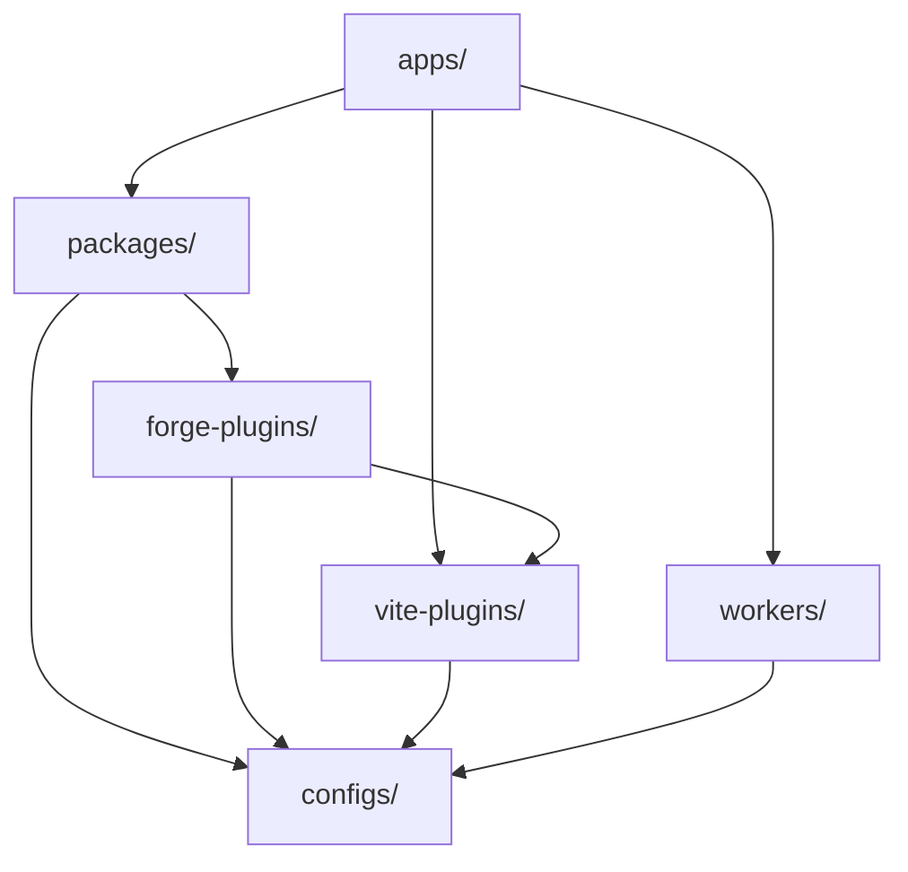

# Missionsplattformarchitektur

Maschinenunterstützte Übersetzung aus der kanonischen englischen Quelle. Bei Bedarf manuell nachprüfen. Paketnamen, Befehle, Pfade und technische Bezeichner bleiben unverändert.

> Englische Quelle: [docs/architecture.md](../../architecture.md)
> Sprache: Deutsch (de)

Mission Platform ist auf maximale Wiederverwendbarkeit und rahmenübergreifende Flexibilität ausgelegt. Dieses Dokument erklärt die
Architekturprinzipien, die Framework-neutrale Engine und die Build-Systeme, die die Plattform antreiben.

## Architektonischer Entwurf

Die Plattform folgt einer **zusammensetzbaren, paketgesteuerten Architektur**. Das bedeutet, dass Anwendungen nicht monolithisch sind;
Stattdessen sind sie aus vielen kleineren, unabhängigen Paketen „zusammengesetzt“, die jeweils ein bestimmtes Anliegen behandeln (z. B. Routing,
Internationalisierung, UI-Komponenten).

### Die goldene Regel: Abhängigkeitsrichtung

Im gesamten Monorepo wird ein strikter unidirektionaler Abhängigkeitsfluss erzwungen, um zirkuläre Abhängigkeiten zu verhindern und die Übersichtlichkeit zu gewährleisten
Grenzen:

1. **Anwendungen (`apps/`)**: Pakete verbrauchen, Vite Plugins und Worker. Sie exportieren niemals Code in andere Teile des
   Monorepo.
2. **Pakete (`packages/`)**: Stellen Sie wiederverwendbare Logik und Komponenten bereit. Sie können sich aufeinander verlassen, aber niemals aufeinander
   Anwendungen.
3. **Forge-Plugins (`forge-plugins/`)**: Compiler-Ausgabeziele – Framework-Plugins und CMS-Ziele. Sie können sich darauf verlassen
   `vite-plugins/` Und `configs/`, und niemals an `apps/` oder auf die Geschwister des anderen; Ein CMS-Adapter hängt nur davon ab
   `forge-cms-plugin-api`.
4. **Konfigurationen (`configs/`)**: Gemeinsam genutzte Werkzeugeinstellungen (ESLint, TypeScript, usw.). Sie sind das Fundament und auf sie angewiesen
   nichts im Monorepo.

## Framework-neutrale Engine: Forge

Das Herzstück der Mission Platform ist `@mission-platform/forge`, ein Framework-neutrales Autorenmodell für Komponenten und
Composables. `@mission-platform/vite-plugin-forge` ist der neutrale Compiler-Treiber: Er analysiert und normalisiert den Quellcode.
erstellt semantische IR, führt gemeinsame Analysen und Optimierungen durch und sendet sie an eine explizit angegebene Adresse
`FrameworkOutputPlugin`.

Framework-Pakete wie `@mission-platform/forge-plugin-react` Und `@mission-platform/forge-plugin-vue` eigenes Ziel
Senkung, Zieloptimierung, native Quellgenerierung, Diagnose, Laufzeitmetadaten und Vite/tsdown-Adapter. Da
Es gibt keinen zentralen Framework-Emitter oder keine String-to-Framework-Registrierung im Treiber. Paketerstellungskonfigurationen wählen die aus
Plugin-Instanzen, die sie veröffentlichen, sodass Zielimplementierungsabhängigkeiten an der Framework-Grenze bleiben.

Der resultierende Fluss ist **analysieren/normalisieren → neutral optimieren → semantische IR → Ziel senken → Ziel optimieren → generieren →
nativer Build**. Der native Build wird von den ausgewählten Plugins durchgeführt Vite oder tsdown-Adapter, der auch das bereitstellt
Deklarationen, Externals und Ausgabekonventionen des Ziels.

Eine zweite, orthogonale Achse projiziert dieselben neutralen Komponenten auf **Inhaltsplattformen**.
`@mission-platform/forge-cms-plugin-api` besitzt ein plattformneutrales Content-Modell, das `CmsOutputPlugin` Vertrag und a
generischer Treiber; die Adapterpakete `forge-cms-storyblok`, `forge-cms-astro`, `forge-cms-ghost`, `forge-cms-jekyll`,
Und `forge-cms-webflow` Jeder besitzt eine Plattform. Ein CMS-Ziel *erstellt* ein Framework-Plugin, anstatt eines zu ersetzen
Jede Plattform paart sich mit jedem Framework und die Ausgabe landet darin `dist/cms/<cms>/<framework>/**`.

Die vollständige Pipeline, Komponenten- und Hook-Konsumenten, CMS-Projektion und Erweiterungsanleitungen finden Sie unter
[Forge-Compiler-Pipeline](forge-compiler.md). Informationen zur Build-Orchestrierungsansicht finden Sie unter [Build-System](build-system.md).

## Design-Token-System

Die visuelle Konsistenz wird durch ein ausgeklügeltes Design-Token-System gewährleistet, das von verwaltet wird `@mission-platform/tokens`.

- **DTCG-Standard**: Token werden im W3C Design Tokens Community Group-Format (v2025.10) erstellt.
- **OKLab-Farbraum**: Primitive nutzen den OKLab-Farbraum für wahrnehmungsmäßig einheitliche Farbverläufe und Themen.
- **Automatisierte Artefakte**: `@mission-platform/vite-plugin-tokens` Erzeugt automatisch SCSS-Variablen, CSS-Benutzerdefiniert
  Eigenschaften und TypeScript Konstanten aus einer einzigen Quelle der Wahrheit.

## Framework-unabhängiges Routing und I18n

Kernanwendungsdienste wie Routing und Internationalisierung sind Framework-unabhängig konzipiert.

- **`@mission-platform/router`**: Definiert Routen als einfache Datenstruktur (`MpRoute`). Adapter für Vue Übersetzen Sie diese
  in Framework-spezifische Router-Instanzen und Composables.
- **`@mission-platform/i18n`**: Eine Hülle herum `i18next` das sorgt für ein Universelles `createForgeI18N` Fabrik.
  Framework-spezifische Adapter bieten `useI18n` Haken und Komponenten für Vue Und React.

## Build- und Bereitstellungsstrategie

### Aufgabenorchestrierung mit Turborepo

Turborepo übernimmt die schwere Arbeit des Aufbaus, Testens und Flusens im gesamten Monorepo. Es verwendet einen globalen Cache, um
Stellen Sie sicher, dass Aufgaben nur dann ausgeführt werden, wenn sich ihre Eingaben geändert haben.

### Vite-Angetriebene Builds

Jedes Paket und jede App verwendet Vite für Entwicklungs- und Produktions-Builds unter Nutzung einer gemeinsam genutzten Basiskonfiguration von
`@mission-platform/vite-config`.

### Cloudflare-Bereitstellung

Anwendungen werden hauptsächlich auf **Cloudflare-Seiten** bereitgestellt, mit **Cloudflare-Workern** (unter `workers/`) bereitstellen
Speziallogik für API-Proxying und SPA-Asset-Serving.

## Zusammenfassung

Bei der Mission Platform-Architektur stehen Isolation, Typsicherheit und Framework-Flexibilität im Vordergrund. Durch die Entkopplung des Kerns
Durch die Integration der Logik aus dem UI-Framework und die Durchsetzung einer strikten Abhängigkeitsrichtung gewährleistet die Plattform eine langfristige Wartbarkeit
und Skalierbarkeit für komplexe Anwendungsökosysteme.
