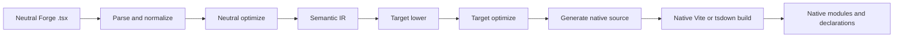
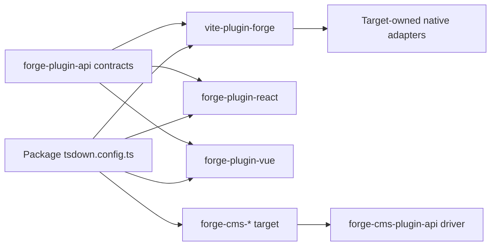
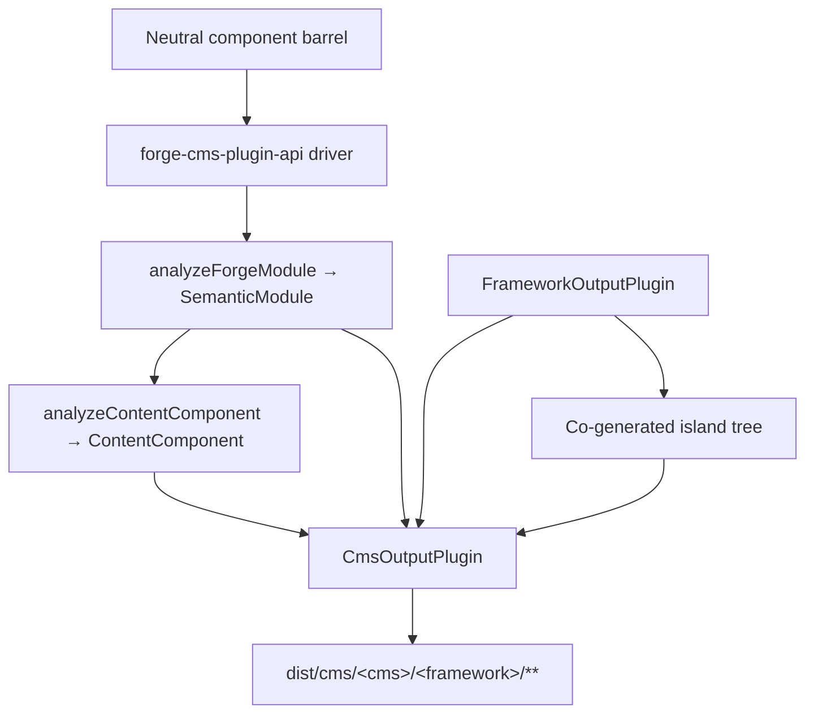

# Forge-Compiler-Pipeline

Maschinenunterstützte Übersetzung aus der kanonischen englischen Quelle. Bei Bedarf manuell nachprüfen. Paketnamen, Befehle, Pfade und technische Bezeichner bleiben unverändert.

> Englische Quelle: [docs/forge-compiler.md](../../forge-compiler.md)
> Sprache: Deutsch (de)

Dies ist eine Architekturerklärung für Mission Platform-Betreuer, die verstehen müssen, wie ein Framework neutral ist
Das Forge-Modul wird zu einem nativen Framework-Paket. Die wichtige Grenze ist nicht „ein Quellenemitter pro Framework“ im Inneren
die Vite Plugin. Forge verfügt über einen neutralen Compiler-Treiber, einen expliziten Ziel-Plugin-Vertrag und ein Framework-eigenes Native
Adapter bauen.

## Die Verantwortung wurde aufgeteilt

Die Kompilierung von Forge umfasst mehrere Pakete, jedes mit einer bewusst begrenzten Verantwortung:

| Schicht | Besitzt | Besitzt nicht |
| :--------------------------------------------------- | :------------------------------------------------------------------------------------------------------------------------------------------- | :---------------------------------------------------------------------- |
| `@mission-platform/vite-plugin-forge`                | Parsing, Normalisierung, neutrale Analyse, semantische IR, gemeinsame Optimierung, Cache/Erkennung, Versand und generisch Vite/tsdown-Orchestrierung | React, Vue, Solid, Svelte, Webkomponenten oder CMS-Quellemitter |
| `@mission-platform/forge-plugin-api`                 | `FrameworkOutputPlugin`, semantische Zielverträge, generierte Modultypen, Zielmetadaten und Vite/tsdown-Adaptertypen | Eine Framework-Implementierung oder Zielauswahl-Registrierung |
| Eingebaut `@mission-platform/forge-plugin-*` Pakete | Zielsenkung, Zieloptimierung, Quellgenerierung, Zieldiagnose, Laufzeitmetadaten und native Build-Adapter | Neutrales Parsen und zielübergreifende Orchestrierung |
| `@mission-platform/forge-cms-plugin-api`             | `CmsOutputPlugin`, das neutrale Inhaltsmodell, der Discover→Analyse→Emit→Write-Treiber, die Insel-Kraft-Wärme-Kopplung und die CMS-Build-Helfer | Jedes plattformspezifische Schema, jede Vorlage oder jede Manifestform |
| `@mission-platform/forge-cms-*` Pakete | Jeweils eine Inhaltsplattform: Feldzuordnung, Vorlagendialekt, Manifestform und Plattformdiagnose | Neutrale Requisitenklassifizierung oder zielübergreifende Orchestrierung |
| Paket `tsdown.config.ts` Dateien | Auswählen der Ziel-Plugin-Instanzen und paketspezifischen Überschreibungen | Compilerstufen oder Framework-Switch-Tabellen neu implementieren |

Die Abhängigkeitsrichtung ist explizit: Ein Paket importiert das gewünschte Ziel-Plugin und übergibt diese Instanz an den Neutralen
Treiber und erhält eine zielspezifische Build-Konfiguration. Der Treiber erstellt niemals ein Ziel aus einer Zeichenfolge oder importiert
jedes Framework-Paket für den Fall, dass es benötigt wird.

## Die strenge Pipeline

Der kanonische Ablauf ist ein einzelnes neutrales Frontend, gefolgt von zieleigenen Phasen und einem nativen Build. Jedes Ziel erhält
die gleichen semantischen Fakten; Es ist nicht erforderlich, das neutrale Modul aus einer generierten Quelldatei zu rekonstruieren.



### Analysieren und normalisieren

Der Fahrer zeigt Neutral an TypeScript/JSX und erstellt die vom Compiler verwendete generische AST-Darstellung. Normalisierung
löst neutrale Autorenkonventionen in stabile Fakten auf: Importe, Direktiven, Komponenten- und Hook-Grenzen, JSX-Knoten,
Slots, statische Markierungen und andere Konstrukte, die spätere Stufen benötigen. Diagnosen werden mit Quellstandorten erfasst
anstatt in einem Zielemitter versteckt zu sein.

### Neutrale Optimierung und semantische IR

Neutrale Pässe funktionieren, bevor ein Rahmen beteiligt ist. Sie können Komponenten und Helfer entdecken, Importe umschreiben, entfernen
Compiler-Anweisungen, leiten stabile Schlüssel ab, bereinigen neutrale tote Zweige und führen wiederverwendbare Analysen im Cache durch. Das Ergebnis ist ein
`SemanticModule`: eine explizite Darstellung der Komponente oder des zusammensetzbaren Verhaltens des Moduls und seiner neutralen Fakten.

Die semantische IR ist der Vertrag zwischen dem generischen Compiler und einem Ziel-Plugin. Auch das Frontend behält das Original
analysiert TypeScript `SourceFile` als nicht aufzählbares Laufzeitdetail im semantischen Modul. Zielemitter können verbrauchen
Dieser gemeinsam genutzte analysierte Baum für quellengestützte Blätter, darf jedoch niemals aufgerufen werden `parseTsx` erneut auf der Modulquelle. Dies
Hält den Cache serialisierbar und stellt gleichzeitig sicher, dass die Quelle nur einmal analysiert wird.

### Zielsenkung und -optimierung

Der Anrufer liefert a `FrameworkOutputPlugin` Beispiel. Der Fahrer ruft es an `lower` Funktion mit dem semantischen Modul
und a `TargetContext`, produzierend `TargetIntentions`. Das Absenken ordnet neutrale Konzepte Zielkonzepten zu: zum Beispiel
Neutrale Hooks und Slots werden zum Zustand/Lebenszyklus und zur Slot-Repräsentation des Ziels, während neutrale Elemente zum Ziel werden
Element- oder Komponentenmodell des Ziels.

Die Plugins `optimize` Die Funktion führt dann eine zielspezifische Vereinfachung durch. Es erhält die gemeinsamen neutralen Optionen
neben einem Erweiterungspunkt für Zieloptionen. Dies hält Framework-Regeln vom neutralen Optimierer fern und ermöglicht gleichzeitig eine
Ziel ist es, seine eigene generierte Darstellung vor der Quellgenerierung zu optimieren.

### Quellgenerierung und native Kompilierung

Die Plugins `generate` Funktion gibt a zurück `GeneratedModule`. Es kann die Primärquelle, Hilfsmodule usw. umfassen
Zieldiagnostik. Die generierte Quelle ist bewusst ein Zwischenartefakt, der dem Zielpaket gehört: React,
Vue, Solid, Svelteund Webkomponenten können jeweils die Quellform auswählen, die ihre native Toolchain erwartet.

Die letzte Stufe ist kein weiterer Forge-Emitter. Die Plugins `build.vite` oder `build.tsdown` Adapter liefert die native
Framework-Plugins und Build-Einstellungen für den generierten Baum. Einheimisch Vite/Rolldown-Kompilierung, Deklarationsgenerierung,
Die Externalisierung und die Ausgabeverpackung erfolgen dann über die normale Toolchain des Ziels.

### Diagnose und Caching

Die Diagnose enthält die Compilerphase, das Ziel, die Quellspanne und einen umsetzbaren Grund. Ein Ziel muss eine nicht unterstützte Meldung melden
semantisch node anstatt stillschweigend einen generischen Laufzeitabschluss oder eine ungültige native Quelle auszugeben. Neutrale semantische Module
werden nach Quellinhalt, Modultyp und semantisch beeinflussenden Optionen zwischengespeichert; Die Zielstufen erhalten dasselbe zwischengespeichert
Modul für jedes ausgewählte Framework, wobei die Zielsenkung und -optimierung unabhängig bleibt.

## Explizite Zielinhaberschaft

Die zentralen Verträge leben darin `forge-plugins/forge-plugin-api/src/framework.ts`:

- `FrameworkOutputPlugin` identifiziert ein Ziel und besitzt es `lower`, `optimize`, `generate`, Und `build`.
- `TargetContext` enthält generischen Build-Kontext wie Modultyp, Komponentenname und erkannte Komponentenordner.
- `TargetIntentions` Umschließt das semantische Modul nach der Zielabsenkung und behält dabei die Diagnose bei.
- `GeneratedModule` Beschreibt die generierte Quelle, ihre Ausgabesprache, Hilfsmodule und Diagnosen.
- `FrameworkBuildAdapters` bietet unabhängig getippt Vite und tsdown-Adapter.
- `FrameworkSourceMetadata`, Laufzeit-Externals und Anzeigenamen-Metadaten ermöglichen es der generischen Orchestrierung, Ausgabedetails abzuleiten
  ohne eine Ziel-Switch-Anweisung.

Integrierte Ziele werden beispielsweise durch eigene Pakete erstellt `forgeReactFramework()`, `forgeVueFramework()`,
`forgeSolidFramework()`, `forgeSvelteFramework()`, Und `forgeWebComponentsFramework()`. Ein Paket wählt nur die aus
Ziele, die es veröffentlicht:

```ts
import { defineTsdownForgeComponents } from "@mission-platform/vite-plugin-forge";
import { forgeReactFramework } from "@mission-platform/forge-plugin-react";
import { forgeSolidFramework } from "@mission-platform/forge-plugin-solid";
import { forgeSvelteFramework } from "@mission-platform/forge-plugin-svelte";
import { forgeVueFramework } from "@mission-platform/forge-plugin-vue";
import { forgeWebComponentsFramework } from "@mission-platform/forge-plugin-web-components";

export default defineTsdownForgeComponents({
  rootDir: import.meta.dirname,
  frameworks: [
    forgeVueFramework(),
    forgeReactFramework(),
    forgeSvelteFramework(),
    forgeSolidFramework(),
    forgeWebComponentsFramework(),
  ],
  componentsModule: `${import.meta.dirname}/src/components/index.ts`,
  name: "MissionPlatformComponents",
});
```

Die Instanzen sind Eigentum des Anrufers. Neue Instanzen können zielspezifische Optionen und Metadaten sowie eine leere Plugin-Liste enthalten
handelt es sich eher um einen Konfigurationsfehler als um eine Aufforderung zur Verwendung einer versteckten Standardregistrierung. Dies erleichtert das Hinzufügen eines neuen Ziels
Additive Paketänderung: Implementieren Sie den Output-Plugin-Vertrag, veröffentlichen Sie seine Build-Adapter und wählen Sie ihn in Verbrauchern aus.



Die Pfeile von einem Verbraucher zum Treiber- und Zielpaket sind beabsichtigt. Der Verbraucher besitzt die Zielauswahl;
Der Treiber besitzt eine generische Orchestrierung. und jedes Zielpaket besitzt die Framework-Implementierung.

## Komponentenaufbauten

Komponentenpakete erstellen neutrale Module gegen `@mission-platform/forge`, normalerweise durch einen neutralen Komponentenzylinder.
`defineTsdownForgeComponents` Erstellt einen Ziel-Build für jedes bereitgestellte Plugin. Für jedes Ziel gilt Folgendes:

1. analysiert, normalisiert und analysiert die neutralen Komponentenmodule;
2. führt neutrale Durchgänge durch und erstellt semantische Module;
3. ruft die Reduzierungs-, Optimierungs- und Generierungsstufen des ausgewählten Plugins auf;
4. schreibt Zielquell- und Hilfsmodule in einen zielspezifischen Cache;
5. ruft den tsdown/ des Plugins aufVite Adapter;
6. Gibt das Zielverzeichnis, Deklarationen, Laufzeit-Externals und Paketeintragsartefakte aus.

Die neutrale Quelle wird gemeinsam genutzt, generierte Bäume und Deklarationen sind jedoch zielspezifisch. A Vue Build kann daher verwendet werden Vue
SFC und Vue Deklarationstools, während a React Build verwenden kann React JSX und React-native Typen. Paketkonfiguration kann
Fügen Sie weiterhin Aufrufer-Überschreibungen, CSS-Verarbeitung, Deklarations-Plugins oder zielspezifische hinzu Vite Optionen, ohne diese zu verschieben
Bedenken in den generischen Compiler.

## Hook- und zusammensetzbare Builds

Hooks sind neutrale Composables und keine UI-Komponenten, verwenden jedoch dieselbe explizite Zielbesitzgrenze. Ein Haken
Der Verbraucher übergibt einen `FrameworkOutputPlugin` Zu `defineTsdownForgeHooks`. Der generische Treiber analysiert den neutralen Eintrag.
Behält, soweit möglich, Framework-agnostische Module bei und sendet zielabhängige Module über die Strict-Funktion des Plugins
Pfad senken/optimieren/generieren.

Das ausgewählte Plugin steuert die Hook-Ausgabesprache und den nativen Adapter. Dies ermöglicht beispielsweise a React Haken bauen zu
verwenden React-kompatible Importe und a Vue Hook-Build zum Freilegen Vue `Ref`-basiertes Verhalten, während neutrale Nutzenmodule bestehen bleiben
unverändert. Jedes Ziel erhält seine eigenen Deklarationen vom generierten Zielbaum; Keine gemeinsame Erklärung behauptet das
Alle Framework-Konsumenten haben die gleichen Hook-Typen.

## CMS-Projektion

Das Projizieren von Komponenten auf eine *Inhaltsplattform* ist eine Achse orthogonal zur Rahmenabsenkung, kein Rahmen
Implementierung im Haupttreiber versteckt. Eine Komponente wird zu einem Storyblok-Block, einer Astro-Insel, einem Ghost-Teil, einem
Jekyll-Include oder eine Webflow-Codekomponente – und jede davon kann mit **jedem** Framework-Ausgabe-Plugin gepaart werden.
`storyblok × vue`, `astro × solid`, Und `ghost × web-components` Es handelt sich also eher um Konfiguration als um neuen Code.

`@mission-platform/forge-cms-plugin-api` besitzt diese Naht. Es trägt drei Dinge bei:

1. **Ein neutrales Inhaltsmodell.** `analyzeContentComponent` Ordnet die Requisitenschnittstelle einer Komponente einer geordneten Komponente zu
   `ContentField`s mit einer Art (`text`, `richtext`, `number`, `boolean`, `option`, `asset`, `link`, `children`), ein JSDoc
   Beschreibung, ein erforderliches Flag, ein Literalstandard, Slot-Metadaten und a `@cmsSetting` Flagge. Rückruf-Requisiten werden entfernt
   und eine Union, mit der String-Literale gemischt werden `string`/`number` degradiert zu `text` — einmal entschieden, also jede Plattform
   stimmt zu. Wenn die semantische IR bereitgestellt wird, `ContentComponent.interactive` meldet, ob die Komponente den Status trägt,
   Referenzen, Effekte oder Ereignisse.
2. **Ein Zielvertrag.** `CmsOutputPlugin` *komponiert* a `FrameworkOutputPlugin` anstatt eins zu sein, und erklärt das
   Emitter `emitSchema`, `emitTemplate`, `emitManifest`, Und `emitEntry`. `defineForgeCmsPlugin` validiert es bei
   Konfigurationszeit, einschließlich eines Ziels `supportedFrameworks` Beschränkung.
3. **Ein generischer Treiber und Build-Helfer.** `generateCmsArtifacts` entdeckt das neutrale Fass und erhält die einzelnen Komponenten
   IR durch `analyzeForgeModule`, analysiert das Inhaltsmodell, ruft die Emitter des Ziels auf und schreibt alle zurückgegebenen Daten
   `CmsArtifact`. `defineTsdownForgeCms(All)` führt es in einen Pro-Ziel-Cache aus und gibt es aus
   `dist/cms/<cms>/<framework>/**`, Spiegelung `asset: true` Artefakte in `dist/cms/<cms>/`.

Der Treiber ordnet niemals eine Zeichenfolgen-ID einem Ziel zu – Verbraucher erstellen und übergeben Instanzen genau so, wie sie es tun
Framework-Plugins:

```ts
import { defineTsdownForgeCmsAll } from "@mission-platform/forge-cms-plugin-api";
import { forgeStoryblokCms } from "@mission-platform/forge-cms-storyblok";
import { forgeReactFramework } from "@mission-platform/forge-plugin-react";
import { forgeVueFramework } from "@mission-platform/forge-plugin-vue";

export default defineTsdownForgeCmsAll({
  rootDir: import.meta.dirname,
  targets: [
    forgeStoryblokCms({
      packageName: "@mission-platform/components",
      plugin: forgeReactFramework(),
      storyblokRuntime: "@storyblok/react",
    }),
    forgeStoryblokCms({
      packageName: "@mission-platform/components",
      plugin: forgeVueFramework(),
      storyblokRuntime: "@storyblok/vue",
    }),
  ],
  componentsModule: `${import.meta.dirname}/src/components/index.ts`,
});
```



### Die Ziele

| Paket | Fabrik | Emittiert |
| :----------------------------------------- | :-------------------- | :---------------------------------------------------------------------------- |
| `@mission-platform/forge-cms-storyblok`    | `forgeStoryblokCms`   | ein Komponentenobjekt pro Komponente, ein Framework-Block-Wrapper, `components.json`, ein getippter Eintrag |
| `@mission-platform/forge-cms-astro`        | `forgeAstroCms`       | statisch `.astro` oder ein `client:load` Insel, plus ein Zod `content.config.ts`     |
| `@mission-platform/forge-cms-ghost`        | `forgeGhostCms`       | Lenkerteile plus a `config.custom` Themenfragment |
| `@mission-platform/forge-cms-jekyll`       | `forgeJekyllCms`      | Flüssigkeit inklusive Plus `_data/forge-components.yml` und a `_config.yml` Fragment |
| `@mission-platform/forge-cms-webflow`      | `forgeWebflowCms`     | `declareComponent` Codekomponentendeklarationen plus a `webflow.json` Bibliotheksfragment |

Jede nicht unterstützte Zuordnung erzeugt eine `CompilerDiagnostic` mit einer Phase, einem Code und einem umsetzbaren Grund statt einem
Stilles Auslassen – Ghost warnt bei numerischen Feldern und bei Überschreitung der eingestellten Obergrenze von ~20, Webflow warnt bei einer Zahl
wird zu Text degradiert und Astro warnt, wenn eine Requisite die Inselgrenze nicht überschreiten kann. Warnungen werden protokolliert; Fehler brechen ab
der Bau.

### Inseln

Ein Ziel, das deklariert `island: 'framework'` (Astro, Webflow) benötigt zur Hydratation eine echte Laufzeitkomponente. Eher als
Importieren der bereits erstellten Host-Pakete `./vue` oder `./react` Unterpfad – was dazu führen würde, dass die CMS-Ausgabe von einem anderen Pfad abhängt
Build muss zuerst ausgeführt werden – der Treiber führt das **gebundene Framework-Plugin** über dasselbe neutrale Barrel in einem Geschwister aus
`island/` Verzeichnis, und die ausgegebene Vorlage importiert eine Datei, deren Eigentümer sie ist. Die Insel wird durch den eigenen Tsdown dieses Plugins kompiliert
Stage-Plugins im selben Build.

Aus diesem Grund ist Astro ein CMS-Ziel und kein Framework-Plugin: Zuvor wurde eine handgerollte Vanilla-DOM-Insel ausgeliefert
Laufzeit, die Status, Referenzen, Effekte und Ereignisse aus der IR neu implementierte. Das Erstellen eines Framework-Plugins bedeutet stattdessen ein
Die interaktive Astro-Komponente verhält sich in jedem anderen Build genauso wie dieselbe Komponente.

## Worauf beim Debuggen zu achten ist

Verfolgen Sie einen Build zunächst anhand der Verantwortung und nicht anhand der generierten Datei:

1. **Eingabe und Diagnose:** prüfen `vite-plugins/forge/src/compiler/` für Parsing, Entdeckung, neutrale Optimierung,
   semantische IR-Konstruktion und diagnostische Aggregation.
2. **Zielverhalten:** Überprüfen Sie die Auswahl `forge-plugin-*` Paket und seine `lower`, `optimize`, `generate`, und bauen
   Adapterimplementierungen.
3. **Generische Build-Form:** prüfen `vite-plugins/forge/src/generate.ts`, `generate-hooks.ts`, Und `tsdown.ts` für Cache,
   Ausgabe, Deklaration und Aufrufer-Override-Verhalten.
4. **CMS-Ausgabe:** prüfen `forge-plugins/forge-cms-plugin-api/` für das Inhaltsmodell, den Treiber und den Build
   Helfer, dann das Spezifische `forge-plugins/forge-cms-*` Ziel für seine Emitter und Plattformzuordnung.
5. **Paketauswahl:** Überprüfen Sie die verbrauchenden Pakete `tsdown.config.ts` und direkt `forge-plugin-*` Abhängigkeiten.

Der nützlichste Beweis ist das erste Fehlerstadium und seine Diagnose. Wenn die semantische IR falsch ist, korrigieren Sie die neutrale Analyse oder
Analyse. Wenn die IR korrekt ist, die native Quelle jedoch falsch, korrigieren Sie das ausgewählte Ziel-Plugin. Wenn die generierte Quelle korrekt ist
Aber die Bündelung schlägt fehl. Überprüfen Sie die Plugins Vite/tsdown-Adapter- oder Consumer-Override-Konfiguration.

## Forge mit einem Ziel erweitern

So fügen Sie ein Framework-Ziel hinzu, ohne die zentrale Eigentümerschaft erneut einzuführen:

1. Erstellen Sie eine `forge-plugin-*` Paket mit Werksrücksendung `FrameworkOutputPlugin`;
2. Absenken durchführen `SemanticModule` gezielte Absichten verfolgen;
3. Zieloptimierung und Quellengenerierung hinzufügen, einschließlich Hilfsmodulen und Diagnosen;
4. Bereitstellung von Zielquellenmetadaten, externen Laufzeitnamen usw Vite/tsdown-Adapter;
5. gezielte Tests für semantische Randfälle und generierte Artefakte hinzufügen;
6. Fügen Sie das Plugin als direkte Abhängigkeit in jedem Paket hinzu, das das Ziel veröffentlicht.
7. Übergeben Sie neue Plugin-Instanzen in der Build-Konfiguration dieses Pakets.

Fügen Sie einer Registrierung in keine Framework-ID hinzu `vite-plugin-forge`, importieren Sie ein Framework-Paket vom neutralen Treiber oder fügen Sie hinzu
ein zielspezifischer Zweig zur generischen Analyse und Ausgabeorchestrierung. Der Vertrag ist absichtlich offen, also zielführend
Pakete können ihre Quelldarstellung weiterentwickeln, während die neutrale Pipeline stabil bleibt.

## Erweiterung von Forge um ein CMS-Ziel

Das Hinzufügen einer Content-Plattform folgt der gleichen additiven Form, eine Ebene höher:

1. Erstellen Sie eine `forge-cms-*` Paket je nach `@mission-platform/forge-cms-plugin-api`;
2. Exportieren Sie eine Fabrik, die zurückkehrt `defineForgeCmsPlugin({ id, framework, packageName, … })`, unter Verwendung des Framework-Plugins
   vom Anrufer, anstatt einen auszuwählen;
3. umsetzen `emitTemplate`, und was auch immer `emitSchema`, `emitManifest`, Und `emitEntry` Die Plattform benötigt – a
   Nur-Template-Plattformen wie Ghost oder Jekyll implementieren nur die ersten beiden und der Treiber schreibt einen Platzhalter
   Eintrag;
4. Ordnen Sie den Neutralleiter zu `ContentFieldKind`s an einer Stelle auf das Feldvokabular der Plattform setzen und a drücken
   `CompilerDiagnostic` für jede Zuordnung kann die Plattform nicht getreu darstellen;
5. eingestellt `island: 'framework'` wenn die Plattform eine hydratisierte Laufzeit benötigt, und `supportedFrameworks` wenn es nur akzeptiert
   einige Framework-Plugins;
6. Fügen Sie eine Spezifikation zu den gemeinsam genutzten Vorrichtungen hinzu, aus denen exportiert wurde `@mission-platform/forge-cms-plugin-api/fixtures`, also das Neue
   Das Ziel wird gegen genau dieselben Eingaben wie alle anderen ausgeübt.
7. Fügen Sie das Paket als direkte Abhängigkeit jedes Verbrauchers hinzu, der das Ziel veröffentlicht, und übergeben Sie eine neue Instanz an
   `defineTsdownForgeCms`.

Fügen Sie dem Ziel keine Prop-Klassifizierungslogik hinzu: Ein Fix für Union, JSDoc, Default oder Slot-Handling gehört dazu
Shared-Content-Modell, sodass jede Plattform gleichzeitig davon profitiert.

Eine Übersicht über das Buildsystem und die plattformweite Abhängigkeitsrichtung finden Sie unter [Build-System](build-system.md) Und
[Missionsplattformarchitektur](architecture.md).
