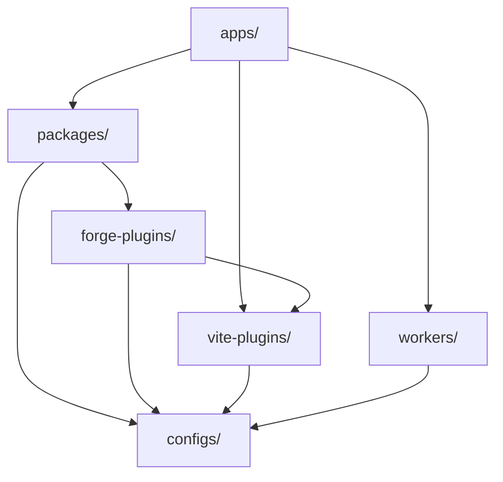

# Arquitectura de la plataforma de la misión

Traducción asistida por máquina a partir de la fuente canónica en inglés. Revisar manualmente cuando sea necesario. Los nombres de paquetes, comandos, rutas e identificadores técnicos no se modifican.

> Fuente en inglés: [docs/architecture.md](../../architecture.md)
> Idioma: Español (es)

Mission Platform está diseñada para ofrecer la máxima reutilización y flexibilidad entre marcos. Este documento explica la
principios arquitectónicos, el motor neutral del marco y los sistemas de construcción que impulsan la plataforma.

## Plano arquitectónico

La plataforma sigue una **arquitectura componible basada en paquetes**. Esto significa que las aplicaciones no son monolíticas;
en cambio, están "compuestos" a partir de muchos paquetes más pequeños e independientes, cada uno de los cuales maneja una preocupación específica (por ejemplo, enrutamiento,
internacionalización, componentes UI).

### La regla de oro: dirección de la dependencia

Se aplica un flujo de dependencia unidireccional estricto en todo el monorepo para evitar dependencias circulares y mantener una relación clara.
límites:

1. **Aplicaciones (`apps/`)**: Consumir paquetes, Vite complementos y trabajadores. Nunca exportan código a otras partes del
   monorepo.
2. **Paquetes (`packages/`)**: Proporciona lógica y componentes reutilizables. Pueden depender unos de otros pero nunca de
   aplicaciones.
3. ** Complementos de Forge (`forge-plugins/`)**: Destinos de salida del compilador: complementos del marco y destinos de CMS. Pueden depender de
   `vite-plugins/` y `configs/`, y nunca en `apps/` o sobre los hermanos de cada uno; un adaptador CMS depende sólo de
   `forge-cms-plugin-api`.
4. **Configuraciones (`configs/`)**: Configuración de herramientas compartidas (ESLint, TypeScript, etc.). Son la base y dependen de
   nada dentro del monorepo.

## Motor neutral en el marco: Forge

El corazón de Mission Platform es `@mission-platform/forge`, un modelo de creación de marco neutral para componentes y
componibles. `@mission-platform/vite-plugin-forge` es el controlador del compilador neutral: analiza y normaliza la fuente,
construye IR semántica, ejecuta análisis y optimización compartidos y envía a un
`FrameworkOutputPlugin`.

Paquetes marco como `@mission-platform/forge-plugin-react` y `@mission-platform/forge-plugin-vue` propio objetivo
reducción, optimización de objetivos, generación de fuentes nativas, diagnósticos, metadatos en tiempo de ejecución y ViteAdaptadores /tsdown. allí
No hay ningún emisor de marco central ni registro de cadena a marco en el controlador. Configuraciones de compilación de paquetes seleccione el
Las instancias de complementos que publican, por lo que las dependencias de implementación de destino permanecen en el límite del marco.

El flujo resultante es **analizar/normalizar → optimizar neutral → IR semántica → objetivo inferior → optimizar objetivo → generar →
compilación nativa**. La compilación nativa la realiza el complemento seleccionado. Vite o adaptador tsdown, que también proporciona la
declaraciones del objetivo, elementos externos y convenciones de salida.

Un segundo eje ortogonal proyecta los mismos componentes neutrales en **plataformas de contenido**.
`@mission-platform/forge-cms-plugin-api` posee un modelo de contenido neutral en cuanto a plataforma, el `CmsOutputPlugin` contrato, y un
controlador genérico; los paquetes de adaptadores `forge-cms-storyblok`, `forge-cms-astro`, `forge-cms-ghost`, `forge-cms-jekyll`,
y `forge-cms-webflow` cada uno posee una plataforma. Un destino CMS *compone* un complemento de marco en lugar de reemplazarlo, por lo que
cualquier plataforma se empareja con cualquier marco y la salida aterriza en `dist/cms/<cms>/<framework>/**`.

Para conocer la canalización completa, los consumidores de componentes y ganchos, la proyección de CMS y la guía de extensión, consulte
[Canalización del compilador Forge](forge-compiler.md). Para la vista de orquestación de compilación, consulte [Sistema de construcción](build-system.md).

## Sistema de tokens de diseño

La coherencia visual se mantiene a través de un sofisticado sistema de tokens de diseño administrado por `@mission-platform/tokens`.

- **Estándar DTCG**: los tokens se crean en el formato del grupo comunitario de tokens de diseño del W3C (v2025.10).
- **Espacio de color OKLab**: los primitivos utilizan el espacio de color OKLab para gradientes y temas perceptualmente uniformes.
- **Artefactos automatizados**: `@mission-platform/vite-plugin-tokens` genera automáticamente variables SCSS, CSS personalizado
  propiedades, y TypeScript constantes de una única fuente de verdad.

## Enrutamiento independiente del marco e I18n

Los servicios de aplicaciones centrales, como el enrutamiento y la internacionalización, están diseñados para ser independientes del marco.

- **`@mission-platform/router`**: Define rutas como una estructura de datos simple (`MpRoute`). Adaptadores para Vue traducir estos
  en instancias de enrutador específicas del marco y elementos componibles.
- **`@mission-platform/i18n`**: Una envoltura alrededor `i18next` que proporciona un universal `createForgeI18N` fábrica.
  Los adaptadores específicos del marco proporcionan `useI18n` ganchos y componentes para Vue y React.

## Estrategia de construcción e implementación

### Orquestación de tareas con Turborepo

Turborepo se encarga del trabajo pesado de construcción, pruebas y linting en todo el monorepo. Utiliza un caché global para
Asegúrese de que las tareas solo se ejecuten cuando sus entradas hayan cambiado.

### Vite-Construcciones impulsadas

Cada paquete y aplicación utiliza Vite para desarrollo y producción, aprovechando una configuración base compartida de
`@mission-platform/vite-config`.

### Implementación de Cloudflare

Las aplicaciones se implementan principalmente en **Páginas de Cloudflare**, con **Trabajadores de Cloudflare** (en `workers/`) proporcionando
Lógica especializada para proxy API y servicio de activos SPA.

## Resumen

La arquitectura de Mission Platform prioriza el aislamiento, la seguridad de tipos y la flexibilidad del marco. Al desacoplar el núcleo
Lógica del marco de la interfaz de usuario y al aplicar una estricta dirección de dependencia, la plataforma garantiza la mantenibilidad a largo plazo.
y escalabilidad para ecosistemas de aplicaciones complejos.
