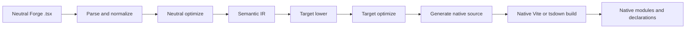
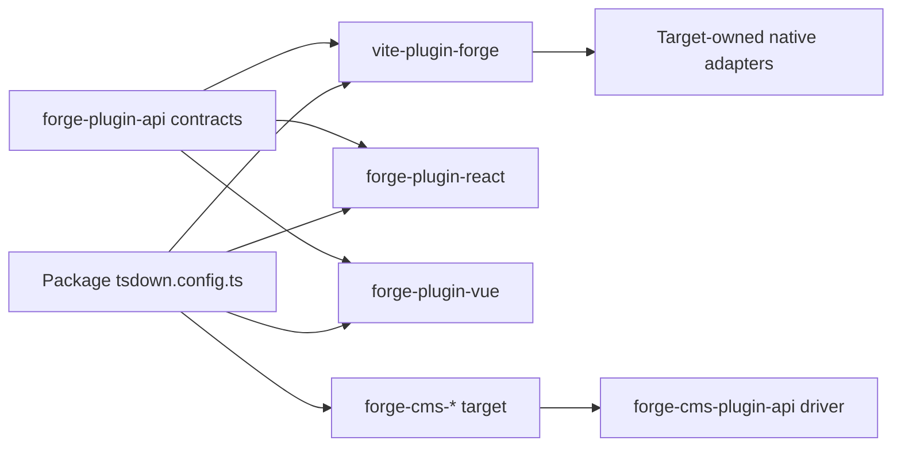
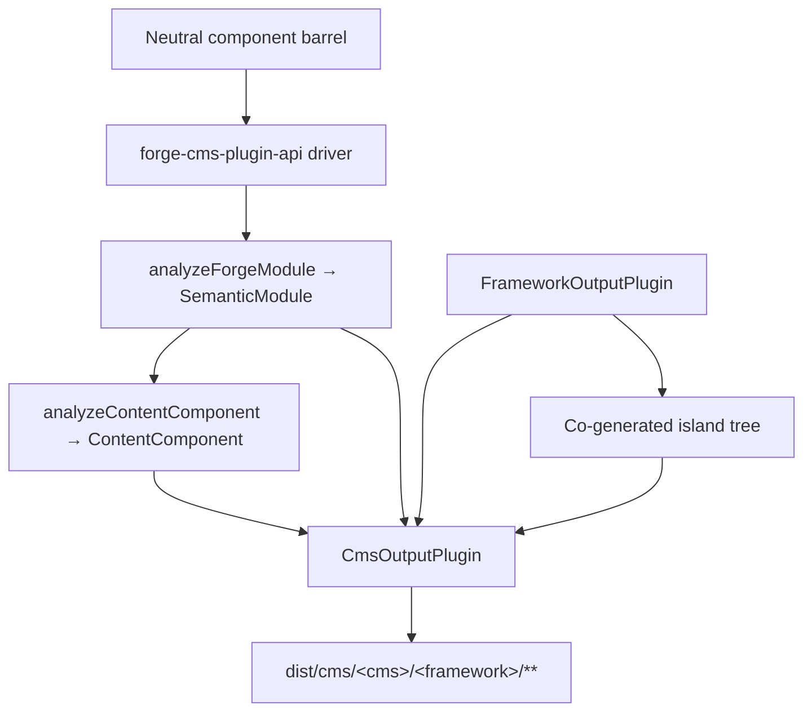

# Canalización del compilador Forge

Traducción asistida por máquina a partir de la fuente canónica en inglés. Revisar manualmente cuando sea necesario. Los nombres de paquetes, comandos, rutas e identificadores técnicos no se modifican.

> Fuente en inglés: [docs/forge-compiler.md](../../forge-compiler.md)
> Idioma: Español (es)

Esta es una explicación de la arquitectura para los mantenedores de Mission Platform que necesitan comprender cómo funciona un framework neutral.
El módulo Forge se convierte en un paquete de marco nativo. El límite importante no es “una fuente emisora por marco” dentro
el Vite complemento. Forge tiene un controlador de compilación neutral, un contrato de complemento de destino explícito y un marco nativo propio.
construir adaptadores.

## La responsabilidad dividida

La compilación de Forge cruza varios paquetes, cada uno con una responsabilidad deliberadamente limitada:

| Capa | Posee | No posee |
| :--------------------------------------------------- | :------------------------------------------------------------------------------------------------------------------------------------------- | :---------------------------------------------------------------------- |
| `@mission-platform/vite-plugin-forge`                | Análisis, normalización, análisis neutral, IR semántica, optimización compartida, caché/descubrimiento, despacho y genérico. Vite/tsdown orquestación | React, Vue, Solid, Svelte, componentes web o emisores de origen CMS |
| `@mission-platform/forge-plugin-api`                 | `FrameworkOutputPlugin`, contratos de destino semánticos, tipos de módulos generados, metadatos de destino y Vite/tsdown tipos de adaptadores | Un registro de implementación del marco o de selección de objetivos |
| Incorporado `@mission-platform/forge-plugin-*` paquetes | Reducción de objetivos, optimización de objetivos, generación de fuentes, diagnóstico de objetivos, metadatos de tiempo de ejecución y adaptadores de compilación nativos | Análisis neutral y orquestación entre objetivos |
| `@mission-platform/forge-cms-plugin-api`             | `CmsOutputPlugin`, el modelo de contenido neutral, el controlador descubrir→analizar→emitir→escribir, la cogeneración de islas y los ayudantes de compilación de CMS | Cualquier esquema, plantilla o forma de manifiesto específico de la plataforma |
| `@mission-platform/forge-cms-*` paquetes | Una plataforma de contenido para cada una: su mapeo de campos, dialecto de plantilla, forma de manifiesto y diagnóstico de plataforma | Clasificación de utilería neutral u orquestación entre objetivos |
| Paquete `tsdown.config.ts` archivos | Seleccionar las instancias del complemento de destino y las anulaciones específicas del paquete | Reimplementación de etapas del compilador o tablas de cambio de marco |

La dirección de la dependencia es explícita: un paquete importa el complemento de destino que desea, pasa esa instancia al neutral
controlador y recibe una configuración de compilación específica del objetivo. El controlador nunca construye un objetivo a partir de una cadena ni importa
cada paquete de marco en caso de que sea necesario.

## El estricto oleoducto

El flujo canónico es una única interfaz neutral seguida de etapas propiedad del objetivo y una compilación nativa. Cada objetivo recibe
los mismos hechos semánticos; no necesita reconstruir el módulo neutral a partir de un archivo fuente generado.



### Analizar y normalizar

El conductor lee punto muerto. TypeScript/JSX y crea la representación AST genérica utilizada por el compilador. Normalización
resuelve convenciones de creación neutrales en hechos estables: importaciones, directivas, límites de componentes y enlaces, nodos JSX,
ranuras, marcadores estáticos y otras construcciones que se necesitan en etapas posteriores. Los diagnósticos se recopilan con ubicaciones de origen.
en lugar de estar oculto en un emisor objetivo.

### Optimización neutral e IR semántica

Los pases neutrales operan antes de que intervenga un marco. Pueden descubrir componentes y ayudas, reescribir importaciones, eliminar
directivas del compilador, inferir claves estables, podar ramas muertas neutrales y análisis reutilizables en caché. El resultado es un
`SemanticModule`: una representación explícita del componente del módulo o comportamiento componible y sus hechos neutrales.

El IR semántico es el contrato entre el compilador genérico y un complemento de destino. La interfaz también mantiene el original.
analizado TypeScript `SourceFile` como un detalle de tiempo de ejecución no enumerable en el módulo semántico. Los emisores objetivo pueden consumir
ese árbol analizado compartido para hojas respaldadas por el código fuente, pero nunca deben llamar `parseTsx` en la fuente del módulo nuevamente. esto
mantiene la caché serializable y al mismo tiempo garantiza que la fuente se analice solo una vez.

### Reducción y optimización de objetivos.

La persona que llama proporciona un `FrameworkOutputPlugin` instancia. El conductor llama a su `lower` funcionar con el módulo semántico
y un `TargetContext`, produciendo `TargetIntentions`. La reducción asigna conceptos neutrales a conceptos objetivo: por ejemplo,
Los ganchos y ranuras neutrales se convierten en el estado/ciclo de vida y la representación de ranura del objetivo, mientras que los elementos neutrales se convierten en el
elemento del objetivo o modelo de componente.

El complemento `optimize` Luego, la función realiza una simplificación específica del objetivo. Recibe las opciones neutrales compartidas.
junto con un punto de extensión para opciones de destino. Esto mantiene las reglas del marco fuera del optimizador neutral al tiempo que permite una
objetivo para optimizar su propia representación generada antes de la generación de la fuente.

### Generación de fuentes y compilación nativa.

El complemento `generate` la función devuelve un `GeneratedModule`. Puede incluir la fuente primaria, módulos auxiliares y
diagnóstico objetivo. La fuente generada es deliberadamente un artefacto intermedio propiedad del paquete de destino: React,
Vue, Solid, Sveltey los componentes web pueden elegir la forma de origen que espera su cadena de herramientas nativa.

La etapa final no es otro emisor de Forge. El complemento `build.vite` o `build.tsdown` El adaptador suministra el nativo.
complementos de framework y configuraciones de compilación para el árbol generado. Nativo Vite/Compilación rolldown, generación de declaraciones,
la externalización y el empaquetado de resultados se realizan utilizando la cadena de herramientas normal de ese objetivo.

### Diagnóstico y almacenamiento en caché

Los diagnósticos incluyen la fase del compilador, el destino, el intervalo de origen y un motivo procesable. Un objetivo debe informar un no compatible
semántico node en lugar de emitir silenciosamente un cierre de tiempo de ejecución genérico o una fuente nativa no válida. Módulos semánticos neutros
se almacenan en caché por contenido fuente, tipo de módulo y opciones que afectan la semántica; las etapas de destino reciben el mismo contenido en caché
módulo para cada marco seleccionado manteniendo la reducción y optimización de objetivos independientes.

## Propiedad explícita del objetivo

Los contratos centrales viven en `forge-plugins/forge-plugin-api/src/framework.ts`:

- `FrameworkOutputPlugin` identifica un objetivo y posee `lower`, `optimize`, `generate`, y `build`.
- `TargetContext` lleva un contexto de compilación genérico, como el tipo de módulo, el nombre del componente y las carpetas de los componentes descubiertos.
- `TargetIntentions` envuelve el módulo semántico después de bajar el objetivo mientras conserva el diagnóstico.
- `GeneratedModule` describe la fuente generada, su lenguaje de salida, módulos auxiliares y diagnósticos.
- `FrameworkBuildAdapters` proporciona escritura independiente Vite y adaptadores tsdown.
- `FrameworkSourceMetadata`, los elementos externos del tiempo de ejecución y los metadatos del nombre para mostrar permiten que la orquestación genérica derive detalles de salida
  sin una declaración de cambio de destino.

Los objetivos integrados se construyen mediante sus propios paquetes, por ejemplo `forgeReactFramework()`, `forgeVueFramework()`,
`forgeSolidFramework()`, `forgeSvelteFramework()`, y `forgeWebComponentsFramework()`. Un paquete selecciona sólo el
objetivos que publica:

```ts
import { defineTsdownForgeComponents } from "@mission-platform/vite-plugin-forge";
import { forgeReactFramework } from "@mission-platform/forge-plugin-react";
import { forgeSolidFramework } from "@mission-platform/forge-plugin-solid";
import { forgeSvelteFramework } from "@mission-platform/forge-plugin-svelte";
import { forgeVueFramework } from "@mission-platform/forge-plugin-vue";
import { forgeWebComponentsFramework } from "@mission-platform/forge-plugin-web-components";

export default defineTsdownForgeComponents({
  rootDir: import.meta.dirname,
  frameworks: [
    forgeVueFramework(),
    forgeReactFramework(),
    forgeSvelteFramework(),
    forgeSolidFramework(),
    forgeWebComponentsFramework(),
  ],
  componentsModule: `${import.meta.dirname}/src/components/index.ts`,
  name: "MissionPlatformComponents",
});
```

Las instancias son propiedad de la persona que llama. Las instancias nuevas pueden contener opciones y metadatos específicos del objetivo, y una lista de complementos vacía
es un error de configuración en lugar de una solicitud para utilizar un registro predeterminado oculto. Esto hace que agregar un nuevo objetivo sea una
Cambio de paquete aditivo: implemente el contrato del complemento de salida, publique sus adaptadores de compilación y selecciónelo en los consumidores.



Las flechas desde un consumidor hacia el conductor y hacia el paquete objetivo son intencionales. El consumidor es dueño de la selección de objetivos;
el conductor posee orquestación genérica; y cada paquete de destino posee la implementación del marco.

## Construcciones de componentes

Los paquetes de componentes crean módulos neutrales contra `@mission-platform/forge`, generalmente a través de un cañón de componente neutro.
`defineTsdownForgeComponents` crea una compilación de destino para cada complemento suministrado. Para cada objetivo:

1. analiza, normaliza y analiza los módulos de componentes neutros;
2. ejecuta pases neutrales y crea módulos semánticos;
3. invoca las etapas de reducción, optimización y generación del complemento seleccionado;
4. escribe los módulos auxiliares y de origen de destino en una memoria caché específica del destino;
5. invoca el tsdown/ del complementoVite adaptadores;
6. emite el directorio de destino, las declaraciones, los elementos externos del tiempo de ejecución y los artefactos de entrada del paquete.

La fuente neutral se comparte, pero los árboles y las declaraciones generados son específicos del objetivo. A Vue por lo tanto, build puede usar Vue
SFC y Vue herramientas de declaración, mientras que un React construir puede usar React JSX y React-tipos nativos. La configuración del paquete puede
aún agregue anulaciones de llamadas, manejo de CSS, complementos de declaración o objetivos específicos Vite opciones sin moverlas
preocupaciones en el compilador genérico.

## Construcciones de gancho y componibles

Los ganchos son componentes componibles neutrales en lugar de componentes de la interfaz de usuario, pero utilizan el mismo límite de propiedad de destino explícito. un gancho
el consumidor pasa uno `FrameworkOutputPlugin` a `defineTsdownForgeHooks`. El controlador genérico analiza la entrada neutral,
conserva los módulos independientes del marco siempre que sea posible y envía módulos dependientes del objetivo a través del estricto protocolo del complemento.
bajar/optimizar/generar ruta.

El complemento seleccionado controla el idioma de salida del enlace y el adaptador nativo. Esto permite, por ejemplo, una React gancho de construcción para
usar React-importaciones compatibles y un Vue construcción de gancho para exponer Vue `Ref`comportamiento basado en, mientras que los módulos de utilidad neutrales permanecen
sin cambios. Cada objetivo recibe sus propias declaraciones del árbol de objetivos generado; ninguna declaración compartida pretende que
Todos los consumidores de marcos tienen los mismos tipos de ganchos.

## Proyección CMS

Proyectar componentes en una *plataforma de contenido* es un eje ortogonal al descenso del marco, no un marco
Implementación oculta dentro del controlador principal. Un componente se convierte en un bloque Storyblok, una isla Astro, un parcial Fantasma, un
Incluye Jekyll o un componente de código de Webflow, y cada uno de ellos se puede combinar con **cualquier** complemento de salida del marco.
`storyblok × vue`, `astro × solid`, y `ghost × web-components` Por lo tanto, son configuración en lugar de código nuevo.

`@mission-platform/forge-cms-plugin-api` es dueño de esa costura. Aporta tres cosas:

1. **Un modelo de contenido neutral.** `analyzeContentComponent` asigna la interfaz de accesorios de un componente a ordenado
   `ContentField`s con un tipo (`text`, `richtext`, `number`, `boolean`, `option`, `asset`, `link`, `children`), un documento JSD
   descripción, una bandera requerida, un valor predeterminado literal, metadatos de ranura y un `@cmsSetting` bandera. Se eliminan los accesorios de devolución de llamada
   y una unión que mezcla literales de cadena con `string`/`number` se degrada a `text` — decidido una vez, por lo que cada plataforma
   está de acuerdo. Cuando se suministra el IR semántico, `ContentComponent.interactive` informa si el componente lleva el estado,
   árbitros, efectos o eventos.
2. **Un contrato objetivo.** `CmsOutputPlugin` *compone* un `FrameworkOutputPlugin` en lugar de serlo, y declara la
   emisores `emitSchema`, `emitTemplate`, `emitManifest`, y `emitEntry`. `defineForgeCmsPlugin` lo valida en
   tiempo de configuración, incluido el tiempo de configuración del objetivo. `supportedFrameworks` restricción.
3. **Un controlador genérico y ayudantes de compilación.** `generateCmsArtifacts` descubre el cañón neutro, obtiene la información de cada componente
   IR a través `analyzeForgeModule`, analiza el modelo de contenido, llama a los emisores del objetivo y escribe todos los resultados devueltos.
   `CmsArtifact`. `defineTsdownForgeCms(All)` lo ejecuta en un caché por objetivo y emite
   `dist/cms/<cms>/<framework>/**`, reflejando `asset: true` artefactos en `dist/cms/<cms>/`.

El controlador nunca asigna una identificación de cadena a un objetivo: los consumidores construyen y pasan instancias, exactamente como lo hacen para
complementos de marco:

```ts
import { defineTsdownForgeCmsAll } from "@mission-platform/forge-cms-plugin-api";
import { forgeStoryblokCms } from "@mission-platform/forge-cms-storyblok";
import { forgeReactFramework } from "@mission-platform/forge-plugin-react";
import { forgeVueFramework } from "@mission-platform/forge-plugin-vue";

export default defineTsdownForgeCmsAll({
  rootDir: import.meta.dirname,
  targets: [
    forgeStoryblokCms({
      packageName: "@mission-platform/components",
      plugin: forgeReactFramework(),
      storyblokRuntime: "@storyblok/react",
    }),
    forgeStoryblokCms({
      packageName: "@mission-platform/components",
      plugin: forgeVueFramework(),
      storyblokRuntime: "@storyblok/vue",
    }),
  ],
  componentsModule: `${import.meta.dirname}/src/components/index.ts`,
});
```



### los objetivos

| Paquete | Fábrica | Emite |
| :----------------------------------------- | :-------------------- | :---------------------------------------------------------------------------- |
| `@mission-platform/forge-cms-storyblok`    | `forgeStoryblokCms`   | un objeto componente por componente, un contenedor de bloques de marco, `components.json`, una entrada mecanografiada |
| `@mission-platform/forge-cms-astro`        | `forgeAstroCms`       | estático `.astro` o un `client:load` isla, más un zod `content.config.ts`     |
| `@mission-platform/forge-cms-ghost`        | `forgeGhostCms`       | Manillar parcial más un `config.custom` fragmento de tema |
| `@mission-platform/forge-cms-jekyll`       | `forgeJekyllCms`      | Líquido incluye plus `_data/forge-components.yml` y un `_config.yml` fragmento |
| `@mission-platform/forge-cms-webflow`      | `forgeWebflowCms`     | `declareComponent` declaraciones de componentes de código más un `webflow.json` fragmento de biblioteca |

Cada mapeo no soportado produce un `CompilerDiagnostic` con una fase, un código y una razón procesable en lugar de una
omisión silenciosa: Ghost advierte sobre campos numéricos y al exceder su límite de configuración de ~20, Webflow advierte cuando un número
se degrada a texto y Astro advierte cuando un accesorio predeterminado no puede cruzar el límite de la isla. Las advertencias se registran; errores abortar
la construcción.

### islas

Un objetivo que declara `island: 'framework'` (Astro, Webflow) necesita un componente de tiempo de ejecución real para hidratarse. en lugar de
importando el paquete de host ya creado `./vue` o `./react` subruta: lo que haría que la salida del CMS dependiera de otra
la compilación se ejecutó primero: el controlador ejecuta el **complemento de marco vinculado** sobre el mismo barril neutral en un hermano
`island/` directorio, y la plantilla emitida importa un archivo de su propiedad. La isla está compilada por el propio tsdown de ese complemento.
complementos de escenario en la misma compilación.

Esta es la razón por la que Astro es un objetivo de CMS en lugar de un complemento de marco: anteriormente incluía una isla DOM de vainilla enrollada a mano.
tiempo de ejecución que volvió a implementar el estado, las referencias, los efectos y los eventos del IR. En cambio, componer un complemento de marco significa una
El componente Astro interactivo se comporta exactamente como el mismo componente en cualquier otra compilación.

## Dónde buscar al depurar

Primero rastree una compilación por responsabilidad en lugar de por el archivo generado:

1. **Entrada y diagnóstico:** inspeccionar `vite-plugins/forge/src/compiler/` para análisis, descubrimiento, optimización neutral,
   construcción semántica de IR y agregación de diagnóstico.
2. **Comportamiento objetivo:** inspeccionar lo seleccionado `forge-plugin-*` paquete y su `lower`, `optimize`, `generate`y construir
   Implementaciones de adaptadores.
3. **Forma de construcción genérica:** inspeccionar `vite-plugins/forge/src/generate.ts`, `generate-hooks.ts`, y `tsdown.ts` para caché,
   comportamiento de salida, declaración y anulación de llamadas.
4. **Salida de CMS:** inspeccionar `forge-plugins/forge-cms-plugin-api/` para el modelo de contenido, el controlador y la compilación
   ayudantes, entonces el específico `forge-plugins/forge-cms-*` objetivo para sus emisores y mapeo de plataformas.
5. **Selección de paquete:** inspeccione el paquete consumidor. `tsdown.config.ts` y directo `forge-plugin-*` dependencias.

La evidencia más útil es la primera etapa fallida y su diagnóstico. Si la IR semántica es incorrecta, corrija el análisis neutral o
análisis. Si el IR es correcto pero la fuente nativa es incorrecta, corrija el complemento de destino seleccionado. Si la fuente generada es correcta
pero el paquete falla, inspecciona el complemento ViteAdaptador /tsdown o configuración de anulación del consumidor.

## Ampliando Forge con un objetivo

Para agregar un objetivo de marco sin reintroducir la propiedad central:

1. crear un `forge-plugin-*` Paquete con devolución de fábrica. `FrameworkOutputPlugin`;
2. implementar la bajada desde `SemanticModule` apuntar a las intenciones;
3. agregar optimización de objetivos y generación de fuentes, incluidos módulos auxiliares y diagnósticos;
4. proporcionar metadatos de origen de destino, nombres externos de tiempo de ejecución y Viteadaptadores /tsdown;
5. agregar pruebas enfocadas para casos extremos semánticos y artefactos generados;
6. agregue el complemento como una dependencia directa en cada paquete que publica el destino;
7. pasar nuevas instancias de complementos en la configuración de compilación de ese paquete.

No agregue una ID de marco a un registro en `vite-plugin-forge`, importe un paquete de marco desde el controlador neutral o agregue
una rama específica de destino para el análisis genérico y la orquestación de salida. El contrato está intencionalmente abierto, así que apunte
los paquetes pueden evolucionar su representación de origen mientras la canalización neutral permanece estable.

## Ampliación de Forge con un destino CMS

Agregar una plataforma de contenido sigue la misma forma aditiva, una capa hacia arriba:

1. crear un `forge-cms-*` paquete dependiendo de `@mission-platform/forge-cms-plugin-api`;
2. exportar una fábrica que regresa `defineForgeCmsPlugin({ id, framework, packageName, … })`, tomando el complemento del marco
   de la persona que llama en lugar de elegir uno;
3. implementar `emitTemplate`, y cualquiera de `emitSchema`, `emitManifest`, y `emitEntry` la plataforma necesita: un
   La plataforma de solo plantilla, como Ghost o Jekyll, implementa solo los dos primeros y el controlador escribe un marcador de posición.
   entrada;
4. mapear el neutral `ContentFieldKind`Ingrese al vocabulario de campo de la plataforma en un solo lugar y presione un
   `CompilerDiagnostic` para cada mapeo que la plataforma no puede representar fielmente;
5. conjunto `island: 'framework'` si la plataforma necesita un tiempo de ejecución hidratado, y `supportedFrameworks` si solo acepta
   algunos complementos del marco;
6. agregue una especificación sobre los dispositivos compartidos exportados desde `@mission-platform/forge-cms-plugin-api/fixtures`, entonces el nuevo
   el objetivo se ejerce exactamente contra los mismos insumos que cualquier otro;
7. agregue el paquete como una dependencia directa de cada consumidor que publica el objetivo y pase una nueva instancia a
   `defineTsdownForgeCms`.

No agregue lógica de clasificación de accesorios al destino: una solución para la unión, JSDoc, el valor predeterminado o el manejo de ranuras pertenece al
Modelo de contenido compartido para que todas las plataformas se beneficien al mismo tiempo.

Para obtener una descripción general del sistema de compilación y la dirección de dependencia en toda la plataforma, consulte [Sistema de construcción](build-system.md) y
[Arquitectura de la plataforma de la misión](architecture.md).
