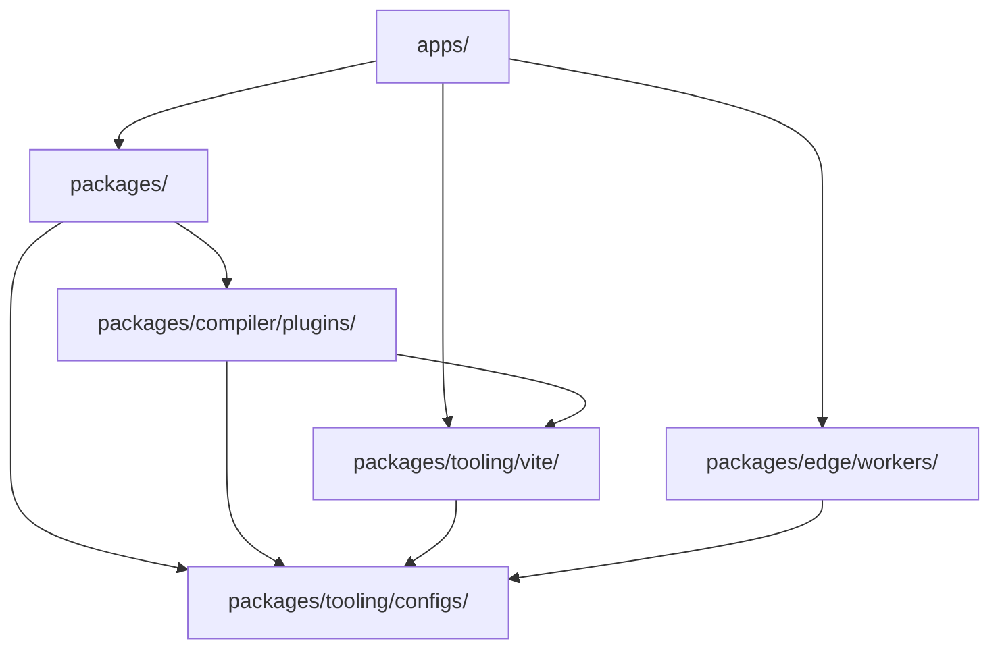

# Architecture de la plateforme de mission

Traduction assistée par machine à partir de la source anglaise canonique. À relire manuellement si besoin. Les noms de paquets, commandes, chemins et identifiants techniques restent inchangés.

> docs/architecture.md: [docs/architecture.md](../../architecture.md)
> Langue: Français (fr)

Mission Platform est conçu pour une réutilisabilité maximale et une flexibilité inter-framework. Ce document explique le
les principes architecturaux, le moteur indépendant du framework et les systèmes de construction qui alimentent la plate-forme.

## Plan architectural

La plate-forme suit une **architecture composable basée sur des packages**. Cela signifie que les applications ne sont pas monolithiques ;
au lieu de cela, ils sont « composés » de nombreux packages plus petits et indépendants qui traitent chacun un problème spécifique (par exemple, le routage,
internationalisation, composants de l'interface utilisateur).

### La règle d'or : la direction des dépendances

Un flux de dépendances unidirectionnel strict est appliqué à travers le monorepo pour éviter les dépendances circulaires et maintenir un flux clair
limites :

1. **Demandes (`apps/`)** : Consommer des forfaits, Vite plugins et travailleurs. Ils n'exportent jamais de code vers d'autres parties du
   monorepo.
2. **Forfaits (`packages/`)** : Fournissez une logique et des composants réutilisables. Ils peuvent dépendre les uns des autres mais jamais de
   candidatures.
3. **Plugins Forge (`packages/compiler/plugins/`)** : cibles de sortie du compilateur – plugins de framework et cibles CMS. Ils peuvent dépendre de
   `packages/tooling/vite/` et `packages/tooling/configs/`, et jamais sur `apps/` ou sur les frères et sœurs de chacun ; un adaptateur CMS dépend uniquement de
   `forge-cms-plugin-api`.
4. **Configurations (`packages/tooling/configs/`)** : Paramètres d'outillage partagés (ESLint, TypeScript, etc.). Ils constituent le fondement et dépendent de
   rien dans le monorepo.

## Moteur indépendant du framework : Forge

Le cœur de Mission Platform est `@mission-platform/forge`, un modèle de création indépendant du framework pour les composants et
composables. `@mission-platform/vite-plugin-forge` est le pilote neutre du compilateur : il analyse et normalise la source,
crée une IR sémantique, exécute une analyse et une optimisation partagées et distribue à un destinataire explicitement fourni
`FrameworkOutputPlugin`.

Des packages-cadres tels que `@mission-platform/forge-plugin-react` et `@mission-platform/forge-plugin-vue` propre cible
abaissement, optimisation de la cible, génération de sources natives, diagnostics, métadonnées d'exécution et Vite/tsdown adaptateurs. Là
il n'y a pas d'émetteur de framework central ni de registre chaîne à framework dans le pilote. Les configurations de build de package sélectionnent le
instances de plugin qu'ils publient, de sorte que les dépendances d'implémentation cibles restent à la limite du framework.

Le flux résultant est **analyser/normaliser → optimiser neutre → IR sémantique → cible inférieure → optimiser la cible → générer →
version native**. La construction native est effectuée par le plugin sélectionné Vite ou un adaptateur tsdown, qui fournit également le
les déclarations de la cible, les éléments externes et les conventions de sortie.

Un deuxième axe orthogonal projette les mêmes composants neutres sur des **plates-formes de contenu**.
`@mission-platform/forge-cms-plugin-api` possède un modèle de contenu neutre en termes de plate-forme, le `CmsOutputPlugin` contrat, et un
pilote générique ; les packages d'adaptateurs `forge-cms-storyblok`, `forge-cms-astro`, `forge-cms-ghost`, `forge-cms-jekyll`,
et `forge-cms-webflow` chacun possède une plateforme. Une cible CMS *compose* un plugin de framework plutôt que d'en remplacer un, donc
n'importe quelle plate-forme s'associe à n'importe quel framework et le résultat arrive dans `dist/cms/<cms>/<framework>/**`.

Pour obtenir le pipeline complet, les consommateurs de composants et de hooks, la projection CMS et les conseils d'extension, voir
[Pipeline du compilateur Forge](../../../packages/tooling/vite/forge/docs/locales/fr/reference/compiler.md). Pour la vue d'orchestration de build, voir
[Construire un système](build-system.md).

## Système de jetons de conception

La cohérence visuelle est maintenue grâce à un système de jetons de conception sophistiqué géré par `@mission-platform/tokens`.

- **Standard DTCG** : les jetons sont créés au format W3C Design Tokens Community Group (v2025.10).
- **Espace colorimétrique OKLab** : les primitives utilisent l'espace colorimétrique OKLab pour des dégradés et des thèmes perceptuellement uniformes.
- **Artefacts automatisés** : `@mission-platform/vite-plugin-tokens` génère automatiquement des variables SCSS, CSS personnalisé
  propriétés, et TypeScript constantes à partir d’une source unique de vérité.

## Routage indépendant du framework et I18n

Les services d'application de base tels que le routage et l'internationalisation sont conçus pour être indépendants du framework.

- **`@mission-platform/router`** : Fournit des cibles d'itinéraire structurées, des aides d'URL/emplacement pures et des marqueurs de compilateur tels que
  comme `MpLink`, `useMpRoute`, `useMpRouter`, et `MpRouterView`. Il n'a pas de framework d'interface utilisateur ni de runtime de bibliothèque de routeur
  dépendances et ne possède jamais la table de routage d’une application.
- **Cibles du routeur Forge** : `@mission-platform/forge-router-vue`, `-react`, `-solid`, `-svelte`, `-redwood`, et
  `-web-components` abaissez ces marqueurs vers le routeur natif sélectionné par l’application consommatrice. Les candidatures sont conservées
  propriété des définitions de routes natives, des fournisseurs, des gardes, des chargeurs et des instances de routeur ; la cible fournit uniquement
  capacités de consommation.
-**`@mission-platform/i18n`** : Un emballage autour `i18next` qui fournit un universel `createForgeI18N` usine.
  Les adaptateurs spécifiques au framework fournissent `useI18n` crochets et composants pour Vue et React.

## Stratégie de construction et de déploiement

### Orchestration des tâches avec Turborepo

Turborepo gère les tâches lourdes de construction, de test et de peluchage à travers le monorepo. Il utilise un cache global pour
assurez-vous que les tâches ne sont exécutées que lorsque leurs entrées ont changé.

### Vite-Constructions alimentées

Chaque package et application utilise Vite pour les versions de développement et de production, en tirant parti d'une configuration de base partagée à partir de
`@mission-platform/vite-config`.

### Déploiement Cloudflare

Les applications sont principalement déployées sur **Cloudflare Pages**, avec **Cloudflare Workers** (sous `packages/edge/workers/`) fournir
logique spécialisée pour le proxy API et le service d'actifs SPA.

## Résumé

L'architecture de la plateforme de mission donne la priorité à l'isolement, à la sécurité des types et à la flexibilité du cadre. En découplant le noyau
logique du cadre d'interface utilisateur et appliquant une direction de dépendance stricte, la plate-forme garantit une maintenabilité à long terme
et l'évolutivité pour les écosystèmes d'applications complexes.
