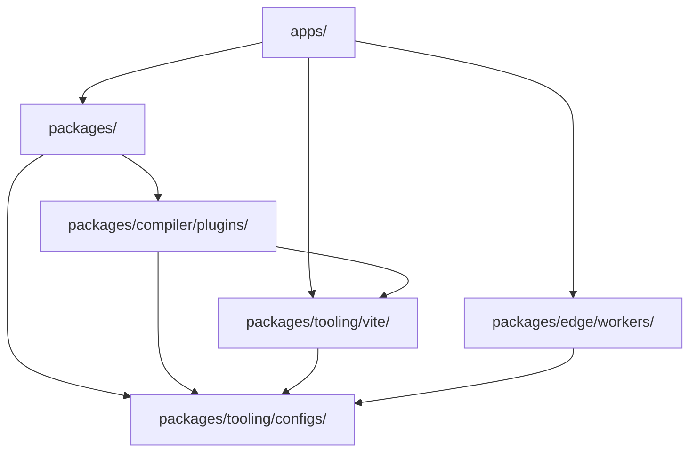

# ארכיטקטורת פלטפורמת המשימה

תרגום בסיוע מכונה מהמקור האנגלי הקנוני. יש לבדוק ידנית בעת הצורך. שמות חבילות, פקודות, נתיבים ומזהים טכניים נשארים ללא שינוי.

> docs/architecture.md: [docs/architecture.md](../../architecture.md)
> שפה: עברית (he)

Mission Platform מתוכננת לשימוש חוזר מקסימלי וגמישות חוצת מסגרות. מסמך זה מסביר את
עקרונות ארכיטקטוניים, המנוע ניטרלי במסגרת ומערכות הבנייה המניעות את הפלטפורמה.

## שרטוט אדריכלי

הפלטפורמה עוקבת אחר ארכיטקטורה **ניתנת להרכבה, מונעת חבילה**. משמעות הדבר היא שיישומים אינם מונוליטיים;
במקום זאת, הם "מורכבים" מחבילות קטנות ועצמאיות רבות שכל אחת מטפלת בבעיה ספציפית (למשל, ניתוב,
בינלאומיות, רכיבי ממשק משתמש).

### כלל הזהב: כיוון התלות

זרימת תלות חד-כיוונית קפדנית נאכפת על פני המונורפו כדי למנוע תלות מעגלית ולשמור על ברור
גבולות:

1. **יישומים (`apps/`)**: לצרוך חבילות, Vite תוספים, ועובדים. הם אף פעם לא מייצאים קוד לחלקים אחרים של
   מונורפו.
2. **חבילות (`packages/`)**: ספק היגיון ורכיבים לשימוש חוזר. הם יכולים לסמוך זה על זה אבל לעולם לא
   יישומים.
3. **זיוף תוספים (`packages/compiler/plugins/`)**: יעדי פלט מהדר - תוספי מסגרת ויעדי CMS. הם עשויים להיות תלויים
   `packages/tooling/vite/` ו `packages/tooling/configs/`, ולעולם לא על `apps/` או על אחיו של זה; מתאם CMS תלוי רק ב
   `forge-cms-plugin-api`.
4. **תצורות (`packages/tooling/configs/`)**: הגדרות כלי עבודה משותפות (ESLint, TypeScriptוכו'). הם הבסיס ותלויים בהם
   שום דבר בתוך המונורפו.

## מנוע ניטרלי מסגרת: Forge

הלב של Mission Platform הוא `@mission-platform/forge-jsx`, מודל עריכת מסגרת ניטרלי עבור רכיבים ו
חומרים מורכבים. `@mission-platform/vite-plugin-forge` הוא מנהל ההדר הנייטרלי: הוא מנתח ומנרמל את המקור,
בונה IR סמנטי, מפעיל ניתוח ואופטימיזציה משותפים, ומשגר למכשיר מסופק במפורש
`FrameworkOutputPlugin`.

חבילות מסגרת כגון `@mission-platform/forge-plugin-react` ו `@mission-platform/forge-plugin-vue` מטרה משלו
הנמכה, אופטימיזציה של יעדים, יצירת מקור מקורי, אבחון, מטא נתונים של זמן ריצה ו Viteמתאמי /tsdown. שם
אינו פולט מסגרת מרכזי או רישום מחרוזת למסגרת במנהל ההתקן. תצורות בניית חבילה בחרו את
מופעי פלאגין שהם מפרסמים, כך שתלות ביישום היעד נשארות בגבול המסגרת.

הזרימה המתקבלת היא **נתח/נרמל → אופטימיזציה ניטראלית → IR סמנטי → יעד נמוך יותר → מיטוב יעד → יצירת →
מבנה מקורי**. הבנייה המקורית מבוצעת על ידי התוספים שנבחרו Vite או מתאם tsdown, אשר מספק גם את
הצהרות היעד, מקורות חיצוניים ומוסכמות פלט.

ציר שני אורתוגונלי מקרין את אותם רכיבים ניטרליים על גבי **פלטפורמות תוכן**.
`@mission-platform/forge-cms-plugin-api` הבעלים של מודל תוכן ניטרלי לפלטפורמה, ה `CmsOutputPlugin` חוזה, וא
נהג גנרי; חבילות המתאמים `forge-cms-storyblok`, `forge-cms-astro`, `forge-cms-ghost`, `forge-cms-jekyll`,
ו `forge-cms-webflow` לכל אחד יש פלטפורמה אחת. יעד CMS *מרכיב* תוסף מסגרת ולא מחליף אחד, אז
כל פלטפורמה משתלבת עם כל מסגרת והפלט נוחת פנימה `dist/cms/<cms>/<framework>/**`.

לקבלת הצינור המלא, צרכני הרכיבים והקרס, הקרנת CMS והנחיית הרחבה, ראה
[Forge Compiler Pipeline](../../../packages/tooling/vite/forge/docs/locales/he/reference/compiler.md). לתצוגת תזמור הבנייה, ראה
[בניית מערכת](build-system.md).

## מערכת אסימון עיצוב

עקביות חזותית נשמרת באמצעות מערכת אסימוני עיצוב מתוחכמת המנוהלת על ידי `@mission-platform/tokens`.

- **DTCG Standard**: האסימונים נכתבו בפורמט W3C Design Tokens Community Group (v2025.10).
- **מרחב צבע OKLab**: פרימיטיבים משתמשים במרחב הצבעים של OKLab עבור מעברים ונושאים אחידים מבחינה תפיסתית.
- **חפצים אוטומטיים**: `@mission-platform/vite-plugin-tokens` מייצר אוטומטית משתני SCSS, CSS מותאם אישית
  נכסים, ו TypeScript קבועים ממקור אחד של אמת.

## Framework-Agnostic Routing & I18n

שירותי ליבה של יישומים כמו ניתוב ובינאום נועדו להיות אגנוסטיים למסגרת.

- **`@mission-platform/router`**: מספק יעדי מסלול מובנים, עוזרי URL/מיקום טהורים וסמני מהדר כגון
  כמו `MpLink`, `useMpRoute`, `useMpRouter`, ו `MpRouterView`. אין לו מסגרת ממשק משתמש או זמן ריצה של ספריית נתב
  תלות ולעולם אינו הבעלים של טבלת המסלולים של יישום.
- **זייף יעדי נתב**: `@mission-platform/forge-router-vue`, `-react`, `-solid`, `-svelte`, `-redwood`, ו
  `-web-components` הורידו את הסמנים האלה לנתב המקורי שנבחר על ידי האפליקציה הצורכת. יישומים נשמרים
  בעלות על הגדרות מסלול מקוריות, ספקים, שומרים, מעמיסים ומופעי נתב; המטרה רק מספקת
  יכולות צריכה.
- **`@mission-platform/i18n`**: עטיפה מסביב `i18next` שמספק אוניברסלי `createForgeI18N` מִפְעָל.
  מספקים מתאמים ספציפיים למסגרת `useI18n` ווים ורכיבים עבור Vue ו React.

## אסטרטגיית בנייה ופריסה

### תזמור משימות עם טורבורפו

Turborepo מטפל בהרמה כבדה של בנייה, בדיקה ומוך על פני המונורפו. הוא משתמש במטמון גלובלי כדי
להבטיח שמשימות מבוצעות רק כאשר התשומות שלהן השתנו.

### Vite-מבנים מופעלים

כל חבילה ואפליקציה משתמשת Vite לבניית פיתוח וייצור, תוך מינוף תצורת בסיס משותפת מ
`@mission-platform/vite-config`.

### פריסת Cloudflare

יישומים נפרסים בעיקר ב-**Cloudflare Pages**, עם **Cloudflare Workers** (תחת `packages/edge/workers/`) מתן
לוגיקה מיוחדת ל-Proxying API והגשת נכסי SPA.

## תַקצִיר

ארכיטקטורת Mission Platform נותנת עדיפות לבידוד, בטיחות סוג וגמישות מסגרת. על ידי ניתוק הליבה
היגיון ממסגרת ממשק המשתמש ואכיפת כיוון תלות קפדני, הפלטפורמה מבטיחה תחזוקה לטווח ארוך
ומדרגיות עבור מערכות אקולוגיות מורכבות של יישומים.
