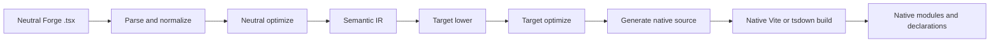
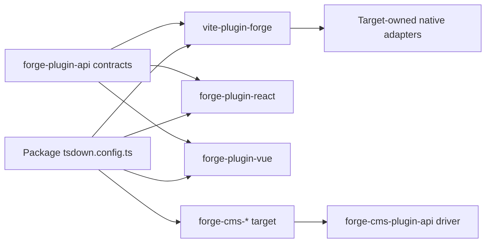
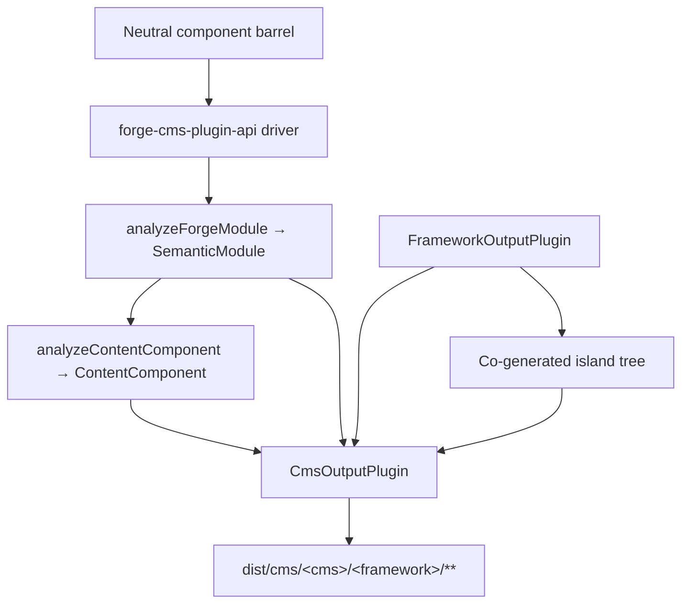

# Forge Compiler Pipeline

תרגום בסיוע מכונה מהמקור האנגלי הקנוני. יש לבדוק ידנית בעת הצורך. שמות חבילות, פקודות, נתיבים ומזהים טכניים נשארים ללא שינוי.

> מקור באנגלית: [docs/forge-compiler.md](../../forge-compiler.md)
> שפה: עברית (he)

זהו הסבר ארכיטקטורה לתחזקי פלטפורמת המשימה שצריכים להבין איך מסגרת ניטראלית
מודול Forge הופך לחבילת מסגרת מקורית. הגבול החשוב אינו "פולט מקור אחד לכל מסגרת" בפנים
את Vite תוסף. ל-Forge יש מנהל התקן מהדר ניטרלי, חוזה תוסף יעד מפורש ומקור בבעלות מסגרת
לבנות מתאמים.

## פיצול האחריות

אוסף Forge חוצה מספר חבילות, שלכל אחת יש אחריות צרה במתכוון:

| שכבה | בעל | אינו בעל |
| :--------------------------------------------------- | :------------------------------------------------------------------------------------------------------------------------------------------- | :---------------------------------------------------------------------- |
| `@mission-platform/vite-plugin-forge`                | ניתוח, נורמליזציה, ניתוח ניטרלי, IR סמנטי, אופטימיזציה משותפת, מטמון/גילוי, שיגור וגנרי Vite/tsdown תזמור | React, Vue, Solid, Svelte, רכיבי אינטרנט או פולטי מקור CMS |
| `@mission-platform/forge-plugin-api`                 | `FrameworkOutputPlugin`, חוזי יעד סמנטיים, סוגי מודול שנוצר, מטא-נתונים של יעד, ו Vite/tsdown סוגי מתאם | רישום יישום מסגרת או בחירת יעד |
| מובנה `@mission-platform/forge-plugin-*` חבילות | הורדת יעדים, אופטימיזציה של יעדים, יצירת מקור, אבחון יעדים, מטא נתונים של זמן ריצה ומתאמי בנייה מקוריים | ניתוח ניטרלי ותזמור חוצה יעדים |
| `@mission-platform/forge-cms-plugin-api`             | `CmsOutputPlugin`, מודל התוכן הנייטרלי, ה- discover→analyse→emit→write driver, יצירת קו-generation באי, ועוזרים לבנות CMS | כל סכימה, תבנית או צורת מניפסט ספציפיים לפלטפורמה |
| `@mission-platform/forge-cms-*` חבילות | פלטפורמת תוכן אחת כל אחת: מיפוי שדות, ניב תבנית, צורת מניפסט ואבחון פלטפורמה | סיווג אבזר ניטרלי או תזמור חוצה מטרות |
| חֲבִילָה `tsdown.config.ts` קבצים | בחירת מופעי הפלאגין היעד ועקיפות ספציפיות לחבילה | יישום מחדש של שלבי מהדר או טבלאות מתג מסגרת |

כיוון התלות הוא מפורש: חבילה מייבאת את תוסף היעד שהיא רוצה, מעבירה את המופע הזה לנייטרלי
מנהל התקן, ומקבל תצורת בנייה ספציפית ליעד. הדרייבר לעולם אינו בונה מטרה ממחרוזת או מייבא
כל חבילת מסגרת למקרה הצורך.

## הצינור הקפדני

הזרימה הקנונית היא חזית נייטרלי אחת ואחריה שלבים בבעלות מטרה ומבנה מקורי. כל יעד מקבל
אותן עובדות סמנטיות; אין צורך לשחזר את המודול הנייטרלי מקובץ מקור שנוצר.



### לנתח ולנרמל

הנהג קורא ניטרלי TypeScript/JSX ויוצר את הייצוג הגנרי של AST המשמש את המהדר. נורמליזציה
פותר מוסכמות יצירה ניטרליות לעובדות יציבות: יבוא, הנחיות, גבולות רכיבים והוק, צמתי JSX,
חריצים, סמנים סטטיים ושאר מבנים שדרושים בשלבים מאוחרים יותר. אבחון נאסף עם מיקומי מקור
במקום להיות מוסתר בפולט מטרה.

### אופטימיזציה ניטראלית ו-IR סמנטי

מעברים ניטרליים פועלים לפני מעורבות של מסגרת. הם יכולים לגלות רכיבים ועוזרים, לשכתב יבוא, להפשיט
הנחיות מהדר, להסיק מפתחות יציבים, לגזום ענפים מתים ניטרליים וניתוח לשימוש חוזר במטמון. התוצאה היא א
`SemanticModule`: ייצוג מפורש של רכיב המודול או ההתנהגות הניתנת לחיבור והעובדות הנייטרליות שלו.

ה-IR הסמנטי הוא החוזה בין המהדר הגנרי לבין תוסף יעד. החזית שומר גם על המקור
מנותח TypeScript `SourceFile` כפרט זמן ריצה שאינו ניתן למספר במודול הסמנטי. פולטי יעד עשויים לצרוך
אותו עץ מנותח משותף לעלים מגובי מקור, אבל אסור להם להתקשר לעולם `parseTsx` שוב במקור המודול. זה
שומר את המטמון ניתן לסידרה תוך הבטחה שהמקור מנותח פעם אחת בלבד.

### הורדת יעד ואופטימיזציה

המתקשר מספק א `FrameworkOutputPlugin` דוּגמָה. הנהג קורא לזה `lower` פונקציה עם המודול הסמנטי
וכן א `TargetContext`, מפיק `TargetIntentions`. הנמכה ממפה מושגים ניטרליים למושגי יעד: למשל,
ווים וחריצים ניטרליים הופכים למצב/מחזור החיים של היעד ולייצוג החריצים, בעוד שאלמנטים ניטרליים הופכים להיות
מודל האלמנט או הרכיב של המטרה.

של התוסף `optimize` לאחר מכן הפונקציה מבצעת פישוט ספציפי ליעד. הוא מקבל את האפשרויות הנייטרליות המשותפות
לצד נקודת הרחבה לאפשרויות יעד. זה מרחיק את כללי המסגרת מהאופטימיזציה הנייטרלית תוך כדי אפשרות א
מטרה לייעל את הייצוג שנוצר בעצמו לפני יצירת המקור.

### יצירת מקורות וקומפילציה מקורית

של התוסף `generate` הפונקציה מחזירה א `GeneratedModule`. זה יכול לכלול את המקור הראשי, מודולי עזר ו
אבחון מטרות. המקור שנוצר הוא בכוונה חפץ ביניים בבעלות חבילת היעד: React,
Vue, Solid, Svelte, ורכיבי אינטרנט יכולים כל אחד לבחור את צורת המקור שמצפה לו שרשרת הכלים המקורית שלו.

השלב האחרון הוא לא עוד פולט פורג'. של התוסף `build.vite` אוֹ `build.tsdown` מתאם מספק את הילידים
תוספי מסגרת והגדרות בנייה עבור העץ שנוצר. יָלִיד Vite/הידור רול-down, הפקת הצהרות,
החצנה ואריזת פלט מתרחשות לאחר מכן באמצעות שרשרת הכלים הרגילה של היעד הזה.

### אבחון ושמירה במטמון

אבחון נושא את שלב המהדר, היעד, טווח המקור וסיבה ניתנת לפעולה. יעד חייב לדווח על לא נתמך
סמנטי node במקום לפלוט בשקט סגירת זמן ריצה גנרית או מקור מקורי לא חוקי. מודולים סמנטיים ניטרליים
מאוחסנים במטמון לפי תוכן מקור, סוג מודול ואפשרויות המשפיעות על סמנטיות; שלבי היעד מקבלים את אותו מטמון
מודול עבור כל מסגרת שנבחרה תוך שמירה על עצמאות הורדת יעד ואופטימיזציה.

## בעלות על יעד מפורש

החוזים המרכזיים חיים `forge-plugins/forge-plugin-api/src/framework.ts`:

- `FrameworkOutputPlugin` מזהה מטרה ומחזיקה `lower`, `optimize`, `generate`, ו `build`.
- `TargetContext` נושא קונטקסט בנייה גנרי כגון סוג מודול, שם רכיב ותיקיות רכיבים שהתגלו.
- `TargetIntentions` עוטף את המודול הסמנטי לאחר הורדת יעד תוך שמירה על אבחון.
- `GeneratedModule` מתאר את המקור שנוצר, שפת הפלט שלו, מודולי עזר ואבחון.
- `FrameworkBuildAdapters` מספק הקלדה עצמאית Vite ומתאמי tsdown.
- `FrameworkSourceMetadata`, רכיבים חיצוניים של זמן ריצה ומטא נתונים של שם תצוגה מאפשרים לתזמור גנרי לגזור פרטי פלט
  ללא הצהרת מתג יעד.

מטרות מובנות בנויות על ידי חבילות משלהן, למשל `forgeReactFramework()`, `forgeVueFramework()`,
`forgeSolidFramework()`, `forgeSvelteFramework()`, ו `forgeWebComponentsFramework()`. חבילה בוחרת רק את
יעדים שהוא מפרסם:

```ts
import { defineTsdownForgeComponents } from "@mission-platform/vite-plugin-forge";
import { forgeReactFramework } from "@mission-platform/forge-plugin-react";
import { forgeSolidFramework } from "@mission-platform/forge-plugin-solid";
import { forgeSvelteFramework } from "@mission-platform/forge-plugin-svelte";
import { forgeVueFramework } from "@mission-platform/forge-plugin-vue";
import { forgeWebComponentsFramework } from "@mission-platform/forge-plugin-web-components";

export default defineTsdownForgeComponents({
  rootDir: import.meta.dirname,
  frameworks: [
    forgeVueFramework(),
    forgeReactFramework(),
    forgeSvelteFramework(),
    forgeSolidFramework(),
    forgeWebComponentsFramework(),
  ],
  componentsModule: `${import.meta.dirname}/src/components/index.ts`,
  name: "MissionPlatformComponents",
});
```

המופעים הם בבעלות המתקשר. מופעים טריים יכולים לשאת אפשרויות ומטא נתונים ספציפיים ליעד, ורשימת תוספים ריקה
הוא שגיאת תצורה ולא בקשה להשתמש ברישום ברירת מחדל נסתר. זה הופך את הוספת יעד חדש ל-an
שינוי חבילת תוסף: יישם את חוזה הפלט-פלאגין, פרסם את מתאמי הבנייה שלו ובחר אותו בצרכנים.



החצים מצרכן הן לחבילת הנהג והן למטרה הם מכוונים. הצרכן הוא הבעלים של בחירת יעד;
הנהג הוא הבעלים של תזמור גנרי; וכל חבילת יעד היא הבעלים של יישום המסגרת.

## בונה רכיבים

חבילות רכיב מחבר מודולים ניטרליים נגד `@mission-platform/forge`, בדרך כלל דרך חבית רכיב ניטרלי.
`defineTsdownForgeComponents` יוצר יעד אחד עבור כל תוסף שסופק. לכל מטרה זה:

1. מנתח, מנרמל ומנתח את מודולי הרכיב הנייטרלי;
2. מפעיל מעברים ניטרליים ויוצר מודולים סמנטיים;
3. מפעיל את שלבי ההורדה, האופטימיזציה והיצירה של התוסף הנבחר;
4. כותב מקור יעד ומודול עזר למטמון ספציפי למטרה;
5. מפעיל את tsdown של התוסף/Vite מתאמים;
6. פולט את ספריית היעד, הצהרות, רכיבי זמן ריצה חיצוניים וחפצי הזנת חבילה.

המקור הנייטרלי משותף, אך העצים וההצהרות שנוצרו הינם ספציפיים למטרה. א Vue לבנות יכול לכן להשתמש Vue
SFC ו Vue כלי ההצהרה, בעוד א React לבנות יכול להשתמש React JSX ו React-טיפוסים מקומיים. תצורת החבילה יכולה
עדיין להוסיף עקיפת מתקשר, טיפול ב-CSS, תוספים להכרזה או יעד ספציפי Vite אפשרויות מבלי להזיז אותן
דאגות לתוך המהדר הגנרי.

## קרס ובנייה ניתנת לחיבור

הוקס הם רכיבי חיבור ניטרליים ולא רכיבי ממשק משתמש, אך משתמשים באותו גבול בעלות יעד מפורש. וו
הצרכן עובר אחד `FrameworkOutputPlugin` אֶל `defineTsdownForgeHooks`. הדרייבר הגנרי מנתח את הערך הנייטרלי,
משמר מודולים אגנוסטיים של מסגרת במידת האפשר, ושולח מודולים תלויי יעד דרך התוסף המחמיר
להוריד/למטב/ליצור נתיב.

התוסף שנבחר שולט בשפת פלט ה-hook ובמתאם המקורי. זה מאפשר, למשל, א React וו לבנות ל
להשתמש React-יבוא תואם וא Vue וו לבנות לחשוף Vue `Ref`התנהגות מבוססת, בעוד שנותרו מודולי שירות ניטרליים
ללא שינוי. כל יעד מקבל הצהרות משלו מעץ המטרה שנוצר; שום הצהרה משותפת לא מתיימרת לזה
לכל צרכני המסגרת יש את אותם סוגי וו.

## הקרנת CMS

הקרנת רכיבים על גבי *פלטפורמת תוכן* היא ציר אורתוגונלי להורדת המסגרת, לא מסגרת
יישום מוסתר בתוך הדרייבר הראשי. רכיב הופך לבלוק של Storyblok, לאי אסטרו, לחלקי רפאים, א
Jekyll כוללים, או רכיב קוד Webflow - וכל אחד מאלה ניתן לשיוך עם **כל** תוסף פלט מסגרת.
`storyblok × vue`, `astro × solid`, ו `ghost × web-components` הם לפיכך תצורה ולא קוד חדש.

`@mission-platform/forge-cms-plugin-api` הבעלים של התפר הזה. זה תורם שלושה דברים:

1. **מודל תוכן ניטרלי.** `analyzeContentComponent` ממפה את ממשק האביזרים של רכיב על הסדר
   `ContentField`עם סוג (`text`, `richtext`, `number`, `boolean`, `option`, `asset`, `link`, `children`), JSDoc
   תיאור, דגל נדרש, ברירת מחדל מילולית, מטא נתונים של משבצת, ו-a `@cmsSetting` דֶגֶל. אביזרי התקשרות חוזרים נשמטים
   ואיגוד מערבב מחרוזת מילולית עם `string`/`number` מבזה ל `text` - החליטו פעם אחת, אז כל פלטפורמה
   מסכים. כאשר ה-IR הסמנטי מסופק, `ContentComponent.interactive` מדווח אם הרכיב נושא מצב,
   שופטים, אפקטים או אירועים.
2. **חוזה יעד.** `CmsOutputPlugin` *מלחין* א `FrameworkOutputPlugin` במקום להיות אחד, ומכריז על
   פולטים `emitSchema`, `emitTemplate`, `emitManifest`, ו `emitEntry`. `defineForgeCmsPlugin` מאמת את זה ב
   זמן הגדרה, כולל של יעד `supportedFrameworks` הַגבָּלָה.
3. **נהג גנרי ועוזרים לבנות.** `generateCmsArtifacts` מגלה את החבית הנייטרלית, משיג את זה של כל רכיב
   IR דרך `analyzeForgeModule`, מנתח את מודל התוכן, מתקשר לפולטות היעד וכותב כל מוחזר
   `CmsArtifact`. `defineTsdownForgeCms(All)` מריץ אותו לתוך מטמון לכל יעד ופולט
   `dist/cms/<cms>/<framework>/**`, שיקוף `asset: true` חפצים לתוך `dist/cms/<cms>/`.

הנהג אף פעם לא ממפה מזהה מחרוזת על יעד - צרכנים בונים ומעבירים מופעים, בדיוק כפי שהם עושים עבור
תוספי מסגרת:

```ts
import { defineTsdownForgeCmsAll } from "@mission-platform/forge-cms-plugin-api";
import { forgeStoryblokCms } from "@mission-platform/forge-cms-storyblok";
import { forgeReactFramework } from "@mission-platform/forge-plugin-react";
import { forgeVueFramework } from "@mission-platform/forge-plugin-vue";

export default defineTsdownForgeCmsAll({
  rootDir: import.meta.dirname,
  targets: [
    forgeStoryblokCms({
      packageName: "@mission-platform/components",
      plugin: forgeReactFramework(),
      storyblokRuntime: "@storyblok/react",
    }),
    forgeStoryblokCms({
      packageName: "@mission-platform/components",
      plugin: forgeVueFramework(),
      storyblokRuntime: "@storyblok/vue",
    }),
  ],
  componentsModule: `${import.meta.dirname}/src/components/index.ts`,
});
```



### המטרות

| חבילה | מפעל | פולט |
| :----------------------------------------- | :-------------------- | :---------------------------------------------------------------------------- |
| `@mission-platform/forge-cms-storyblok`    | `forgeStoryblokCms`   | אובייקט רכיב לכל רכיב, מעטפת בלוק מסגרת, `components.json`, ערך מודפס |
| `@mission-platform/forge-cms-astro`        | `forgeAstroCms`       | סטָטִי `.astro` או א `client:load` אי, בתוספת זוד `content.config.ts`     |
| `@mission-platform/forge-cms-ghost`        | `forgeGhostCms`       | חלקי כידון פלוס א `config.custom` קטע נושא |
| `@mission-platform/forge-cms-jekyll`       | `forgeJekyllCms`      | נוזל כולל פלוס `_data/forge-components.yml` וכן א `_config.yml` שבר |
| `@mission-platform/forge-cms-webflow`      | `forgeWebflowCms`     | `declareComponent` הצהרות רכיבי קוד בתוספת א `webflow.json` קטע ספרייה |

כל מיפוי לא נתמך מייצר א `CompilerDiagnostic` עם שלב, קוד וסיבה ניתנת לפעולה ולא א
השמטה שקטה - Ghost מתריע על שדות מספריים ועל חריגה מהמכסה של ~20 הגדרות, Webflow מזהיר כאשר מספר
מדרדר לטקסט, ואסטרו מזהירה כאשר ברירת מחדל של אבזר לא יכולה לחצות את גבול האי. אזהרות נרשמות; שגיאות לבטל
המבנה.

### איים

מטרה שמצהירה `island: 'framework'` (Astro, Webflow) צריך רכיב זמן ריצה אמיתי כדי לחות. במקום
ייבוא החבילה המארח כבר בנויה `./vue` אוֹ `./react` תת נתיב - מה שיגרום לפלט CMS להיות תלוי באחר
לבנות לאחר הפעלה ראשונה - הנהג מריץ את **תוסף המסגרת הכרוכה** על אותה חבית ניטראלית לתוך אח
`island/` ספרייה, והתבנית הנפלטת מייבאת קובץ שבבעלותה. האי מורכב על ידי ה-tsdown של התוסף עצמו
פלאגין שלב באותו מבנה ממש.

זו הסיבה שאסטרו היא יעד CMS ולא תוסף מסגרת: היא שלחה בעבר אי וניל-DOM מגולגל ביד
זמן ריצה שהטמיע מחדש את המצב, הפסים, האפקטים והאירועים מה-IR. חיבור תוסף מסגרת פירושו במקום זאת
רכיב Astro אינטראקטיבי מתנהג בדיוק כמו אותו רכיב בכל מבנה אחר.

## היכן לחפש בעת ניפוי באגים

עקוב תחילה אחר מבנה לפי אחריות ולא לפי קובץ שנוצר:

1. **קלט ואבחון:** בדוק `vite-plugins/forge/src/compiler/` לניתוח, גילוי, אופטימיזציה ניטרלית,
   בניית IR סמנטי, וצבירה אבחנתית.
2. **התנהגות יעד:** בדוק את הנבחר `forge-plugin-*` החבילה ושלה `lower`, `optimize`, `generate`, ולבנות
   יישומי מתאם.
3. **צורת מבנה כללית:** בדוק `vite-plugins/forge/src/generate.ts`, `generate-hooks.ts`, ו `tsdown.ts` עבור מטמון,
   פלט, הצהרה והתנהגות של ביטול מתקשר.
4. **פלט CMS:** בדוק `forge-plugins/forge-cms-plugin-api/` עבור מודל התוכן, הדרייבר והמבנה
   עוזרים, ואז הספציפיים `forge-plugins/forge-cms-*` מטרה לפולטות שלה ומיפוי הפלטפורמה.
5. **בחירת חבילה:** בדוק את החבילה הצורכת `tsdown.config.ts` וישיר `forge-plugin-*` תלות.

העדות השימושית ביותר היא שלב הכשל הראשון והאבחון שלו. אם IR סמנטי שגוי, תקן ניתוח ניטרלי או
ניתוח. אם ה-IR תקין אך המקור המקורי שגוי, תקן את תוסף היעד שנבחר. אם המקור שנוצר נכון
אבל האגד נכשל, בדוק את התוסף הזה Viteמתאם /tsdown או תצורת דריסת צרכן.

## הרחבת פורג' עם מטרה

כדי להוסיף יעד מסגרת מבלי להכניס מחדש בעלות מרכזית:

1. ליצור א `forge-plugin-*` חבילה עם מפעל חוזר `FrameworkOutputPlugin`;
2. ליישם הנמכה מ `SemanticModule` לכוון כוונות;
3. להוסיף אופטימיזציה של יעדים ויצירת מקור, כולל מודולי עזר ואבחון;
4. לספק מטא נתונים של מקור יעד, שמות חיצוניים של זמן ריצה, וכן Viteמתאמי /tsdown;
5. הוסף בדיקות ממוקדות למקרי קצה סמנטיים וחפצים שנוצרו;
6. הוסף את התוסף כתלות ישירה בכל חבילה שמפרסמת את היעד;
7. להעביר מופעי פלאגין חדשים בתצורת ה-build של אותה חבילה.

אל תוסיף מזהה מסגרת לרישום ב `vite-plugin-forge`, לייבא חבילת מסגרת מהמנהל התקן הנייטרלי, או להוסיף
ענף ספציפי למטרה לניתוח ותזמור גנרי של פלט. החוזה פתוח בכוונה אז המטרה
חבילות יכולות לפתח את ייצוג המקור שלהן בעוד שהצינור הנייטרלי נשאר יציב.

## הרחבת Forge עם יעד CMS

הוספת פלטפורמת תוכן עוקבת אחר אותה צורה תוסף, שכבה אחת למעלה:

1. ליצור א `forge-cms-*` חבילה בהתאם `@mission-platform/forge-cms-plugin-api`;
2. ייצא מפעל שמחזיר `defineForgeCmsPlugin({ id, framework, packageName, … })`, לוקח את תוסף המסגרת
   מהמתקשר במקום לבחור אחד;
3. ליישם `emitTemplate`, ומה מביניהם `emitSchema`, `emitManifest`, ו `emitEntry` הפלטפורמה צריכה - א
   פלטפורמת תבניות בלבד כגון Ghost או Jekyll מיישמת רק את השניים הראשונים והנהג כותב מציין מיקום
   כניסה;
4. מפה את הנייטרלי `ContentFieldKind`s על אוצר המילים של הפלטפורמה במקום אחד, ולחץ על א
   `CompilerDiagnostic` על כל מיפוי הפלטפורמה לא יכולה לייצג נאמנה;
5. סט `island: 'framework'` אם הפלטפורמה זקוקה לזמן ריצה עם מים, וכן `supportedFrameworks` אם רק יקבל
   כמה תוספי מסגרת;
6. הוסף מפרט על המתקנים המשותפים שמיוצאים מהם `@mission-platform/forge-cms-plugin-api/fixtures`, אז החדש
   המטרה מופעלת כנגד אותן תשומות בדיוק כמו כל אחת אחרת;
7. להוסיף את החבילה כתלות ישירה של כל צרכן שמפרסם את היעד ולהעביר מופע חדש אל
   `defineTsdownForgeCms`.

אל תוסיף לוגיקת סיווג אבזרי למטרה: תיקון לאיחוד, JSDoc, ברירת מחדל או טיפול במשבצת שייך ל-
מודל תוכן משותף כך שכל פלטפורמה מרוויחה בבת אחת.

לסקירה כללית של בניית מערכת וכיוון התלות בפלטפורמה, ראה [בניית מערכת](build-system.md) ו
[ארכיטקטורת פלטפורמת המשימה](architecture.md).
