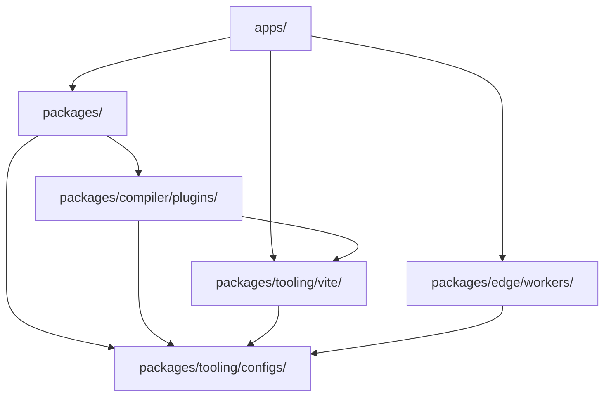

# Architettura della piattaforma di missione

Traduzione assistita da macchina dalla fonte inglese canonica. Da rivedere manualmente se necessario. Nomi di pacchetti, comandi, percorsi e identificatori tecnici restano invariati.

> docs/architecture.md: [docs/architecture.md](../../architecture.md)
> Lingua: Italiano (it)

Mission Platform è progettata per la massima riutilizzabilità e flessibilità tra framework. Questo documento spiega il
principi architettonici, il motore indipendente dal framework e i sistemi di creazione che alimentano la piattaforma.

## Progetto architettonico

La piattaforma segue un'**architettura componibile e basata su pacchetti**. Ciò significa che le applicazioni non sono monolitiche;
sono invece "composti" da molti pacchetti più piccoli e indipendenti, ciascuno dei quali gestisce un problema specifico (ad esempio, routing,
internazionalizzazione, componenti UI).

### La regola d'oro: direzione della dipendenza

Viene applicato un rigido flusso di dipendenza unidirezionale nel monorepo per prevenire dipendenze circolari e mantenerlo chiaro
confini:

1. **Applicazioni (`apps/`)**: Consuma pacchetti, Vite plugin e lavoratori. Non esportano mai il codice in altre parti del
   monorepo.
2. **Pacchetti (`packages/`)**: fornire logica e componenti riutilizzabili. Possono dipendere l'uno dall'altro, ma mai l'uno dall'altro
   applicazioni.
3. **Forgia plugin (`packages/compiler/plugins/`)**: obiettivi di output del compilatore: plug-in del framework e obiettivi CMS. Possono dipendere da
   `packages/tooling/vite/` E `packages/tooling/configs/`, e mai acceso `apps/` o sui fratelli dell'altro; un adattatore CMS dipende solo da
   `forge-cms-plugin-api`.
4. **Configurazioni (`packages/tooling/configs/`)**: Impostazioni degli strumenti condivisi (ESLint, TypeScript, ecc.). Sono il fondamento e da cui dipendono
   niente all'interno del monorepo.

## Motore neutro rispetto al framework: Forge

Il cuore di Mission Platform è `@mission-platform/forge`, un modello di creazione indipendente dal framework per componenti e
componibili. `@mission-platform/vite-plugin-forge` è il driver del compilatore neutro: analizza e normalizza il sorgente,
crea IR semantico, esegue analisi e ottimizzazione condivise e invia a un file fornito esplicitamente
`FrameworkOutputPlugin`.

Pacchetti quadro come `@mission-platform/forge-plugin-react` E `@mission-platform/forge-plugin-vue` proprio bersaglio
riduzione, ottimizzazione del target, generazione di sorgenti native, diagnostica, metadati di runtime e Vite/tsdown adattatori. Lì
non esiste un emettitore di framework centrale o un registro da stringa a framework nel driver. Le configurazioni di creazione del pacchetto selezionano
istanze di plugin che pubblicano, quindi le dipendenze di implementazione target rimangono al confine del framework.

Il flusso risultante è **analizzare/normalizzare → ottimizzazione neutra → IR semantico → target inferiore → ottimizzazione target → generare →
build nativa**. La compilazione nativa viene eseguita dal plugin selezionato Vite o l'adattatore tsdown, che fornisce anche il file
dichiarazioni di destinazione, elementi esterni e convenzioni di output.

Un secondo asse ortogonale proietta gli stessi componenti neutrali su **piattaforme di contenuto**.
`@mission-platform/forge-cms-plugin-api` possiede un modello di contenuto neutrale rispetto alla piattaforma, the `CmsOutputPlugin` contratto e a
driver generico; i pacchetti di adattatori `forge-cms-storyblok`, `forge-cms-astro`, `forge-cms-ghost`, `forge-cms-jekyll`,
E `forge-cms-webflow` ognuno possiede una piattaforma. Un target CMS *compone* un plugin framework invece di sostituirne uno, quindi
qualsiasi piattaforma si accoppia con qualsiasi framework e l'output arriva `dist/cms/<cms>/<framework>/**`.

Per la pipeline completa, i consumatori di componenti e hook, la proiezione CMS e le indicazioni sull'estensione, vedere
[Pipeline del compilatore Forge](../../../packages/tooling/vite/forge/docs/locales/it/reference/compiler.md). Per la visualizzazione dell'orchestrazione della build, vedere
[Costruisci sistema](build-system.md).

## Sistema di token di progettazione

La coerenza visiva viene mantenuta attraverso un sofisticato sistema di token di progettazione gestito da `@mission-platform/tokens`.

- **Standard DTCG**: i token sono creati nel formato W3C Design Tokens Community Group (v2025.10).
- **Spazio colore OKLab**: le primitive utilizzano lo spazio colore OKLab per gradienti e temi percettivamente uniformi.
- **Artefatti automatizzati**: `@mission-platform/vite-plugin-tokens` genera automaticamente variabili SCSS, CSS personalizzate
  proprietà e TypeScript costanti da un'unica fonte di verità.

## Routing indipendente dal framework e I18n

I servizi applicativi principali come il routing e l'internazionalizzazione sono progettati per essere indipendenti dal framework.

- **`@mission-platform/router`**: fornisce target di percorso strutturati, helper URL/posizione puri e indicatori del compilatore come tali
  come `MpLink`, `useMpRoute`, `useMpRouter`, E `MpRouterView`. Non ha un framework UI o un runtime di libreria router
  dipendenze e non possiede mai la tabella di routing di un'applicazione.
- **Forgia obiettivi router**: `@mission-platform/forge-router-vue`, `-react`, `-solid`, `-svelte`, `-redwood`, E
  `-web-components` abbassare tali indicatori sul router nativo selezionato dall'applicazione che lo utilizza. Le applicazioni vengono mantenute
  proprietà di definizioni di percorsi nativi, fornitori, guardie, caricatori e istanze di router; il bersaglio fornisce solo
  capacità di consumo.
- **`@mission-platform/i18n`**: Un involucro intorno `i18next` che fornisce un universale `createForgeI18N` fabbrica.
  Forniscono adattatori specifici del framework `useI18n` ganci e componenti per Vue E React.

## Strategia di creazione e distribuzione

### Orchestrazione delle attività con Turborepo

Turborepo gestisce il lavoro pesante di creazione, test e rilascio di residui nel monorepo. Utilizza una cache globale per
garantire che le attività vengano eseguite solo quando i loro input sono cambiati.

### Vite-Build potenziati

Ogni pacchetto e app utilizza Vite per build di sviluppo e produzione, sfruttando una configurazione di base condivisa da
`@mission-platform/vite-config`.

### Distribuzione di Cloudflare

Le applicazioni vengono distribuite principalmente su **Cloudflare Pages**, con **Cloudflare Workers** (sotto `packages/edge/workers/`) fornendo
logica specializzata per il proxy API e il servizio di risorse SPA.

## Riepilogo

L'architettura Mission Platform dà priorità all'isolamento, alla sicurezza dei tipi e alla flessibilità del framework. Disaccoppiando il nucleo
logica dal framework dell'interfaccia utente e imponendo una rigorosa direzione delle dipendenze, la piattaforma garantisce la manutenibilità a lungo termine
e scalabilità per ecosistemi applicativi complessi.
