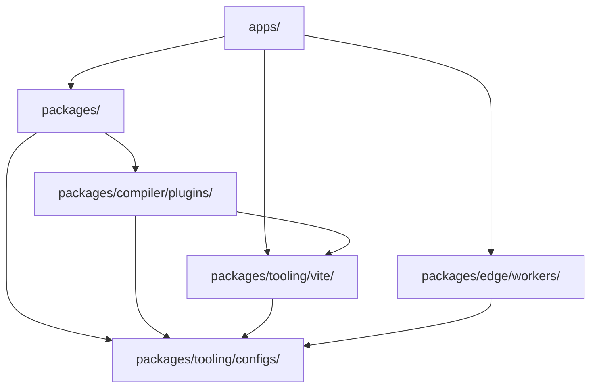

# ミッションプラットフォームのアーキテクチャ

正規の英語ソースからの機械支援翻訳です。必要に応じて人手で確認してください。パッケージ名、コマンド、パス、技術識別子は変更しません。

> docs/architecture.md: [docs/architecture.md](../../architecture.md)
> 言語: 日本語 (ja)

Mission Platform は、最大限の再利用性とフレームワーク間の柔軟性を実現するように設計されています。この文書では、
アーキテクチャの原則、フレームワーク中立のエンジン、プラットフォームを駆動するビルド システムです。

## 建築設計図

このプラットフォームは、**構成可能なパッケージ駆動型アーキテクチャ**に従っています。これは、アプリケーションがモノリシックではないことを意味します。
代わりに、それらは、それぞれが特定の懸念事項 (例: ルーティング、
国際化、UI コンポーネント)。

### 黄金律: 依存関係の方向

厳密な一方向の依存関係フローがモノリポジトリ全体に適用され、循環依存関係を防止し、明確な依存関係を維持します。
境界線:

1. **アプリケーション (`apps/`)**: パッケージを消費します。 Vite プラグインとワーカー。コードを他の部分にエクスポートすることはありません。
   モノレポ。
2. **パッケージ (`packages/`)**: 再利用可能なロジックとコンポーネントを提供します。彼らはお互いに依存することはできますが、決して依存することはありません
   アプリケーション。
3. **プラグインを鍛造する (`packages/compiler/plugins/`)**: コンパイラ出力ターゲット - フレームワーク プラグインと CMS ターゲット。彼らは次のものに依存している可能性があります
   `packages/tooling/vite/` そして `packages/tooling/configs/`、そして決してオンになりません `apps/` またはお互いの兄弟について。 CMS アダプターは以下にのみ依存します
   `forge-cms-plugin-api`。
4. **構成 (`packages/tooling/configs/`)**: 共有ツール設定 (ESLint, TypeScript、など）。それらは基盤であり、依存しています
   モノリポジトリ内には何もありません。

## フレームワーク中立エンジン: Forge

ミッションプラットフォームの中心となるのは、 `@mission-platform/forge-jsx`、コンポーネントのフレームワーク中立なオーサリング モデル、および
コンポーザブル。 `@mission-platform/vite-plugin-forge` 中立的なコンパイラ ドライバです。ソースを解析して正規化します。
セマンティック IR を構築し、共有分析と最適化を実行し、明示的に提供された IR にディスパッチします。
`FrameworkOutputPlugin`.

フレームワークパッケージなど `@mission-platform/forge-plugin-react` そして `@mission-platform/forge-plugin-vue` 自分のターゲット
低減、ターゲットの最適化、ネイティブ ソースの生成、診断、ランタイム メタデータ、 Vite/tsdown アダプター。そこに
ドライバー内の中央のフレームワーク エミッターまたは文字列からフレームワークへのレジストリではありません。パッケージのビルド構成では、
プラグイン インスタンスが公開されるため、ターゲット実装の依存関係はフレームワーク境界に残ります。

結果として得られるフローは、**解析/正規化 → ニュートラル最適化 → セマンティック IR → ターゲットの下限 → ターゲット最適化 → 生成 →
ネイティブビルド**。ネイティブ ビルドは選択したプラグインによって実行されます Vite または tsdown アダプターも提供します。
ターゲットの宣言、外部、および出力規則。

2 番目の直交軸は、同じ中立コンポーネントを **コンテンツ プラットフォーム** に投影します。
`@mission-platform/forge-cms-plugin-api` プラットフォームに依存しないコンテンツ モデルを所有しており、 `CmsOutputPlugin` 契約書と
汎用ドライバー。アダプターパッケージ `forge-cms-storyblok`, `forge-cms-astro`, `forge-cms-ghost`, `forge-cms-jekyll`、
そして `forge-cms-webflow` それぞれが 1 つのプラットフォームを所有します。 CMS ターゲットは、フレームワーク プラグインを置き換えるのではなく、フレームワーク プラグインを「構成」します。
任意のプラットフォームと任意のフレームワークを組み合わせると、出力が次のようになります。 `dist/cms/<cms>/<framework>/**`.

完全なパイプライン、コンポーネントとフックのコンシューマ、CMS プロジェクション、および拡張機能のガイダンスについては、以下を参照してください。
[Forge コンパイラ パイプライン](../../../packages/tooling/vite/forge/docs/locales/ja/reference/compiler.md)。ビルド オーケストレーション ビューについては、次を参照してください。
[ビルドシステム](build-system.md).

## デザイントークンシステム

視覚的な一貫性は、次のように管理される洗練されたデザインのトークン システムによって維持されます。 `@mission-platform/tokens`.

- **DTCG 標準**: トークンは、W3C デザイン トークン コミュニティ グループ形式 (v2025.10) で作成されます。
- **OKLab カラー スペース**: プリミティブは、知覚的に均一なグラデーションとテーマに OKLab カラー スペースを使用します。
- **自動化されたアーティファクト**: `@mission-platform/vite-plugin-tokens` SCSS変数、CSSカスタムを自動的に生成します
  プロパティ、および TypeScript 単一の信頼できる情報源からの定数。

## フレームワークに依存しないルーティングと I18n

ルーティングや国際化などのコア アプリケーション サービスは、フレームワークに依存しないように設計されています。

- **`@mission-platform/router`**: 構造化されたルート ターゲット、純粋な URL/場所ヘルパー、およびコンパイラ マーカーを提供します。
  として `MpLink`, `useMpRoute`, `useMpRouter`、 そして `MpRouterView`。 UI フレームワークやルーター ライブラリ ランタイムはありません
  依存関係を管理し、アプリケーションのルート テーブルを所有することはありません。
- **ルーターターゲットを偽造**: `@mission-platform/forge-router-vue`, `-react`, `-solid`, `-svelte`, `-redwood`、 そして
  `-web-components` これらのマーカーを、消費側アプリケーションによって選択されたネイティブ ルーターに下げます。アプリケーションは保持します
  ネイティブ ルート定義、プロバイダー、ガード、ローダー、およびルーター インスタンスの所有権。ターゲットは供給のみ
  消費能力。
- **`@mission-platform/i18n`**: ラッパーアラウンド `i18next` 普遍的なものを提供する `createForgeI18N` 工場。
  フレームワーク固有のアダプターが提供するもの `useI18n` フックとコンポーネント Vue そして React.

## 構築と導入戦略

### Turborepo を使用したタスク オーケストレーション

Turborepo は、モノレポ全体にわたる構築、テスト、リンティングという重労働を処理します。グローバルキャッシュを使用して、
タスクの入力が変更された場合にのみタスクが実行されるようにします。

### Vite-強化されたビルド

各パッケージとアプリは使用します Vite 開発および運用ビルドでは、共有の基本構成を活用します。
`@mission-platform/vite-config`.

### Cloudflareの導入

アプリケーションは主に **Cloudflare Workers** を使用して **Cloudflare Pages** にデプロイされます ( `packages/edge/workers/`) 提供する
API プロキシと SPA アセット サービスに特化したロジック。

## まとめ

Mission Platform アーキテクチャは、分離、型安全性、およびフレームワークの柔軟性を優先します。コアを切り離すことで
UI フレームワークからのロジックを統合し、厳密な依存関係の方向を強制することで、プラットフォームは長期的な保守性を保証します。
複雑なアプリケーションエコシステムのためのスケーラビリティ。
