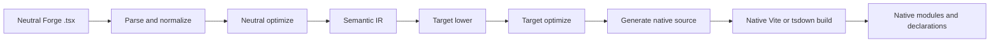
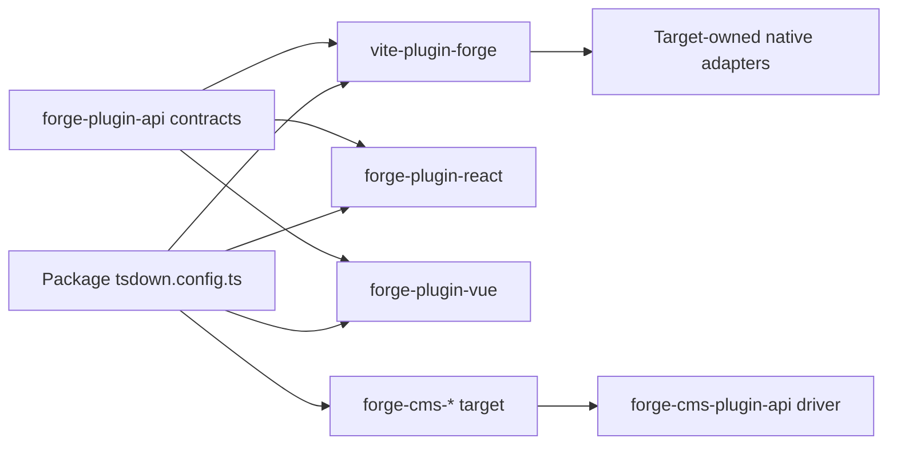
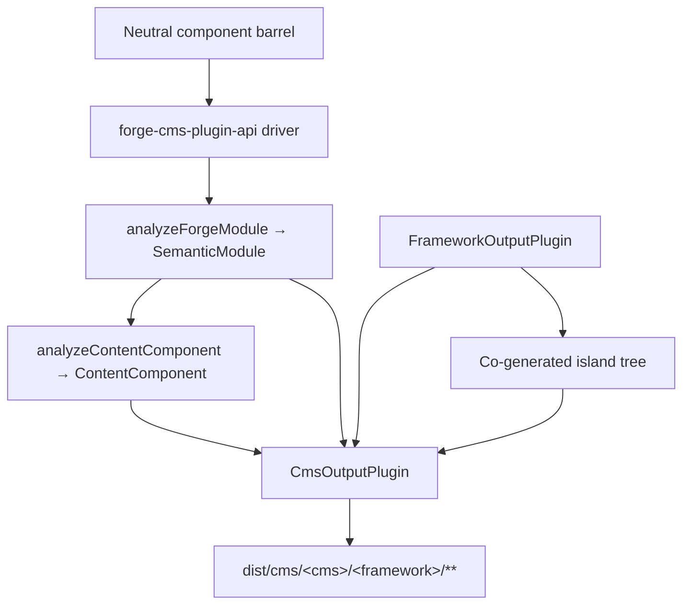

# Forge コンパイラ パイプライン

正規の英語ソースからの機械支援翻訳です。必要に応じて人手で確認してください。パッケージ名、コマンド、パス、技術識別子は変更しません。

> 英語の原典: [docs/forge-compiler.md](../../forge-compiler.md)
> 言語: 日本語 (ja)

これは、フレームワークに依存しないミッション プラットフォームの管理者を対象としたアーキテクチャの説明です。
Forge モジュールはネイティブ フレームワーク パッケージになります。重要な境界は、内部の「フレームワークごとに 1 つのソース エミッター」ではありません。
の Vite プラグイン。 Forge には中立的なコンパイラ ドライバー、明示的なターゲット プラグイン コントラクト、およびフレームワーク所有のネイティブがあります。
アダプターを構築します。

## 責任分担

Forge のコンパイルは複数のパッケージにまたがっており、それぞれのパッケージの責任は意図的に限定されています。

|レイヤー |所有 |所有していない |
| :--------------------------------------------------- | :------------------------------------------------------------------------------------------------------------------------------------------- | :---------------------------------------------------------------------- |
| `@mission-platform/vite-plugin-forge`                |解析、正規化、中立分析、セマンティック IR、共有最適化、キャッシュ/検出、ディスパッチ、汎用 Vite/tsdown オーケストレーション | React, Vue, Solid, Svelte、Web コンポーネント、または CMS ソース エミッター |
| `@mission-platform/forge-plugin-api`                 | `FrameworkOutputPlugin`、セマンティック ターゲット コントラクト、生成されたモジュール タイプ、ターゲット メタデータ、および Vite/tsdown アダプターのタイプ |フレームワーク実装またはターゲット選択レジストリ |
|内蔵 `@mission-platform/forge-plugin-*` パッケージ |ターゲットの引き下げ、ターゲットの最適化、ソース生成、ターゲット診断、ランタイム メタデータ、およびネイティブ ビルド アダプター |中立的な解析とターゲット間のオーケストレーション |
| `@mission-platform/forge-cms-plugin-api`             | `CmsOutputPlugin`、ニュートラル コンテンツ モデル、発見→分析→放出→書き込みドライバー、アイランド コジェネレーション、CMS ビルド ヘルパー |プラットフォーム固有のスキーマ、テンプレート、またはマニフェスト形状 |
| `@mission-platform/forge-cms-*` パッケージ |それぞれ 1 つのコンテンツ プラットフォーム: フィールド マッピング、テンプレートダイアレクト、マニフェスト形状、プラットフォーム診断 |中立的なプロップ分類またはターゲット間のオーケストレーション |
|パッケージ `tsdown.config.ts` ファイル |ターゲットのプラグイン インスタンスとパッケージ固有のオーバーライドの選択 |コンパイラ ステージまたはフレームワーク スイッチ テーブルの再実装 |

依存関係の方向は明示的です。パッケージは必要なターゲット プラグインをインポートし、そのインスタンスをニュートラル プラグインに渡します。
ドライバーを取得し、ターゲット固有のビルド構成を受け取ります。ドライバーは文字列からターゲットを構築したり、インポートしたりすることはありません。
必要な場合に備えて、すべてのフレームワーク パッケージを保存します。

## 厳格なパイプライン

正規のフローは、単一の中立的なフロント エンドと、それに続くターゲット所有のステージとネイティブ ビルドです。各ターゲットが受け取るのは、
同じ意味論的事実。生成されたソース ファイルからニュートラル モジュールを再構築する必要はありません。



### 解析して正規化する

ドライバーはニュートラルを読みます TypeScript/JSX を実行し、コンパイラで使用される汎用 AST 表現を作成します。正規化
中立的なオーサリング規則を安定した事実に解決します: インポート、ディレクティブ、コンポーネントとフックの境界、JSX ノード、
スロット、静的マーカー、および後のステージで必要となるその他の構成要素。診断はソースの場所とともに収集されます
ターゲットエミッタに隠される代わりに。

### 中立的な最適化とセマンティック IR

ニュートラルパスはフレームワークが関与する前に機能します。コンポーネントとヘルパーを検出し、インポートを書き換え、ストリップすることができます。
コンパイラ ディレクティブ、安定したキーの推論、中立的なデッド ブランチのプルーニング、および再利用可能な分析のキャッシュ。結果は、
`SemanticModule`: モジュールのコンポーネントまたはコンポーザブルの動作とその中立的な事実の明示的な表現。

セマンティック IR は、汎用コンパイラーとターゲット プラグインの間の契約です。フロントエンドもオリジナルを維持します
解析された TypeScript `SourceFile` セマンティックモジュールの列挙不可能なランタイム詳細として。ターゲットエミッターは消費する可能性があります
ソースに裏付けされたリーフの共有解析ツリーですが、決して呼び出してはなりません `parseTsx` モジュールソースを再度実行します。これ
ソースが 1 回だけ解析されるようにしながら、キャッシュをシリアル化可能に保ちます。

### 目標の引き下げと最適化

呼び出し側が提供するのは、 `FrameworkOutputPlugin` 実例。ドライバーはそれを呼び出します `lower` セマンティックモジュールを使用した関数
そして `TargetContext`、生産 `TargetIntentions`。下げると、ニュートラルな概念がターゲットの概念にマップされます。たとえば、次のようになります。
ニュートラルなフックとスロットはターゲットの状態/ライフサイクルとスロットの表現になり、ニュートラルな要素はターゲットの状態/ライフサイクルとスロットの表現になります。
ターゲットの要素またはコンポーネント モデル。

プラグインの `optimize` 次に、関数はターゲット固有の単純化を実行します。共有中立オプションを受け取ります
ターゲット オプションの拡張ポイントと並んで。これにより、フレームワーク ルールが中立的なオプティマイザーから除外されると同時に、
ターゲットは、ソース生成前に独自に生成された表現を最適化します。

### ソース生成とネイティブコンパイル

プラグインの `generate` 関数は次の値を返します `GeneratedModule`。これには、一次ソース、補助モジュール、および
ターゲット診断。生成されたソースは、意図的にターゲット パッケージが所有する中間成果物です。 React,
Vue, Solid, Svelte、Web コンポーネントはそれぞれ、ネイティブ ツールチェーンが期待するソース形状を選択できます。

最終ステージは別の Forge エミッターではありません。プラグインの `build.vite` または `build.tsdown` アダプターはネイティブを提供します
フレームワーク プラグインと、生成されたツリーのビルド設定。ネイティブ Vite/ロールダウンコンパイル、宣言生成、
外部化と出力のパッケージ化は、そのターゲットの通常のツールチェーンを使用して行われます。

### 診断とキャッシュ

診断には、コンパイラのフェーズ、ターゲット、ソース スパン、および実行可能な理由が含まれます。ターゲットはサポートされていないことを報告する必要があります
意味論的な node 一般的なランタイム クロージャや無効なネイティブ ソースをサイレントに発行するのではなく、中立的なセマンティックモジュール
ソースコンテンツ、モジュールの種類、セマンティックに影響するオプションによってキャッシュされます。ターゲットステージはキャッシュされたものと同じものを受け取ります
ターゲットの引き下げと最適化を独立した状態に保ちながら、選択したフレームワークごとにモジュールを追加します。

## 明示的なターゲットの所有権

中央のコントラクトは次の場所にあります。 `forge-plugins/forge-plugin-api/src/framework.ts`:

- `FrameworkOutputPlugin` ターゲットを特定し、所有する `lower`, `optimize`, `generate`、 そして `build`.
- `TargetContext` モジュールの種類、コンポーネント名、検出されたコンポーネント フォルダーなどの一般的なビルド コンテキストが含まれます。
- `TargetIntentions` 診断を保持しながら、ターゲットを下げた後にセマンティック モジュールをラップします。
- `GeneratedModule` 生成されたソース、その出力言語、補助モジュール、および診断について説明します。
- `FrameworkBuildAdapters` 独立して型付けされたものを提供します Vite および tsdown アダプター。
- `FrameworkSourceMetadata`、ランタイム外部、および表示名のメタデータにより、汎用オーケストレーションが出力の詳細を導き出すことができます。
  target switch ステートメントなし。

組み込みターゲットは、独自のパッケージによって構築されます。たとえば、 `forgeReactFramework()`, `forgeVueFramework()`,
`forgeSolidFramework()`, `forgeSvelteFramework()`、 そして `forgeWebComponentsFramework()`。パッケージは、
公開するターゲット:

```ts
import { defineTsdownForgeComponents } from "@mission-platform/vite-plugin-forge";
import { forgeReactFramework } from "@mission-platform/forge-plugin-react";
import { forgeSolidFramework } from "@mission-platform/forge-plugin-solid";
import { forgeSvelteFramework } from "@mission-platform/forge-plugin-svelte";
import { forgeVueFramework } from "@mission-platform/forge-plugin-vue";
import { forgeWebComponentsFramework } from "@mission-platform/forge-plugin-web-components";

export default defineTsdownForgeComponents({
  rootDir: import.meta.dirname,
  frameworks: [
    forgeVueFramework(),
    forgeReactFramework(),
    forgeSvelteFramework(),
    forgeSolidFramework(),
    forgeWebComponentsFramework(),
  ],
  componentsModule: `${import.meta.dirname}/src/components/index.ts`,
  name: "MissionPlatformComponents",
});
```

インスタンスは呼び出し元が所有します。新しいインスタンスには、ターゲット固有のオプションとメタデータ、および空のプラグイン リストを含めることができます
これは、非表示のデフォルト レジストリを使用する要求ではなく、構成エラーです。これにより、新しいターゲットを追加できるようになります。
追加のパッケージ変更: 出力プラグイン コントラクトを実装し、そのビルド アダプターを公開して、コンシューマーで選択します。



コンシューマーからドライバーとターゲット パッケージの両方への矢印は意図的なものです。消費者はターゲットの選択を所有します。
ドライバーは汎用オーケストレーションを所有します。各ターゲット パッケージはフレームワーク実装を所有します。

## コンポーネントのビルド

コンポーネント パッケージは中立的なモジュールを作成します `@mission-platform/forge`、通常はニュートラルコンポーネントバレルを介して。
`defineTsdownForgeComponents` 提供されたプラグインごとに 1 つのターゲット ビルドを作成します。ターゲットごとに次のことを行います。

1. ニュートラルコンポーネントモジュールを解析、正規化、分析します。
2. ニュートラルパスを実行し、セマンティックモジュールを作成します。
3. 選択したプラグインの低下、最適化、生成ステージを呼び出します。
4. ターゲット ソースおよび補助モジュールをターゲット固有のキャッシュに書き込みます。
5. プラグインの tsdown/ を呼び出します。Vite アダプター;
6. ターゲット ディレクトリ、宣言、ランタイム外部、およびパッケージ エントリ アーティファクトを生成します。

中立的なソースは共有されますが、生成されるツリーと宣言はターゲット固有です。あ Vue したがって、ビルドは使用できます Vue
SFCと Vue 宣言ツール、 React ビルドで使用できる React JSXと React-ネイティブタイプ。パッケージ構成は、
呼び出し元のオーバーライド、CSS 処理、宣言プラグイン、またはターゲット固有のプラグインを追加します。 Vite オプションを移動せずに
懸念事項を汎用コンパイラに取り込みます。

## フックとコンポーザブルビルド

フックは UI コンポーネントではなく中立的なコンポーザブルですが、同じ明示的なターゲット所有権境界を使用します。フック
消費者が 1 つを渡します `FrameworkOutputPlugin` に `defineTsdownForgeHooks`。汎用ドライバーはニュートラル エントリを解析し、
可能な場合はフレームワークに依存しないモジュールを保持し、プラグインの厳密な機能を介してターゲット依存のモジュールを送信します。
パスを低く/最適化/生成します。

選択したプラグインは、フック出力言語とネイティブ アダプターを制御します。これにより、たとえば、 React ビルドをフックする
使う React-互換性のあるインポートと Vue 公開するフックビルド Vue `Ref`-ベースの動作、中立的なユーティリティモジュールはそのまま残ります
変わらない。各ターゲットは、生成されたターゲット ツリーから独自の宣言を受け取ります。それを装う共有宣言はありません
すべてのフレームワーク コンシューマーは同じフック タイプを持ちます。

## CMS プロジェクション

コンポーネントを *コンテンツ プラットフォーム* に投影することは、フレームワークの降下に直交する軸であり、フレームワークではありません
メインドライバー内に隠された実装。コンポーネントは、Storyblok ブロック、Astro アイランド、Ghost パーシャル、
Jekyll には、Webflow コード コンポーネントが含まれており、これらのそれぞれは、**任意** のフレームワーク出力プラグインと組み合わせることができます。
`storyblok × vue`, `astro × solid`、 そして `ghost × web-components` したがって、これらは新しいコードではなく構成です。

`@mission-platform/forge-cms-plugin-api` その縫い目の所有者です。それは次の 3 つのことに貢献します。

1. **中立的なコンテンツ モデル。** `analyzeContentComponent` コンポーネントの props インターフェイスを順序付けされたものにマップします
   `ContentField`種類が付いています（`text`, `richtext`, `number`, `boolean`, `option`, `asset`, `link`, `children`)、JSDoc
   説明、必須のフラグ、リテラルのデフォルト、スロットのメタデータ、および `@cmsSetting` フラグ。コールバックプロパティは削除されます
   および文字列リテラルを混合する共用体 `string`/`number` に劣化する `text` — 一度決めたことなので、どのプラットフォームでも
   同意します。セマンティック IR が提供されると、 `ContentComponent.interactive` コンポーネントが状態を保持しているかどうかを報告します。
   参照、エフェクト、またはイベント。
2. **対象となる契約** `CmsOutputPlugin` *構成* `FrameworkOutputPlugin` 一つになるのではなく、
   エミッター `emitSchema`, `emitTemplate`, `emitManifest`、 そして `emitEntry`. `defineForgeCmsPlugin` で検証します
   ターゲットを含む構成時間 `supportedFrameworks` 制限。
3. **汎用ドライバーとビルド ヘルパー。** `generateCmsArtifacts` ニュートラルバレルを発見し、各コンポーネントの
   IRスルー `analyzeForgeModule`、コンテンツ モデルを分析し、ターゲットのエミッターを呼び出し、返されたすべてのメッセージを書き込みます。
   `CmsArtifact`. `defineTsdownForgeCms(All)` それをターゲットごとのキャッシュに実行して出力します
   `dist/cms/<cms>/<framework>/**`、ミラーリング `asset: true` アーティファクトを `dist/cms/<cms>/`.

ドライバーは文字列 ID をターゲットにマップすることはありません。コンシューマーはインスタンスを構築して渡します。これは、ドライバーに対して行うのとまったく同じです。
フレームワークプラグイン:

```ts
import { defineTsdownForgeCmsAll } from "@mission-platform/forge-cms-plugin-api";
import { forgeStoryblokCms } from "@mission-platform/forge-cms-storyblok";
import { forgeReactFramework } from "@mission-platform/forge-plugin-react";
import { forgeVueFramework } from "@mission-platform/forge-plugin-vue";

export default defineTsdownForgeCmsAll({
  rootDir: import.meta.dirname,
  targets: [
    forgeStoryblokCms({
      packageName: "@mission-platform/components",
      plugin: forgeReactFramework(),
      storyblokRuntime: "@storyblok/react",
    }),
    forgeStoryblokCms({
      packageName: "@mission-platform/components",
      plugin: forgeVueFramework(),
      storyblokRuntime: "@storyblok/vue",
    }),
  ],
  componentsModule: `${import.meta.dirname}/src/components/index.ts`,
});
```



### ターゲット

|パッケージ |工場 |排出 |
| :----------------------------------------- | :-------------------- | :---------------------------------------------------------------------------- |
| `@mission-platform/forge-cms-storyblok`    | `forgeStoryblokCms`   |コンポーネントごとのコンポーネント オブジェクト、フレームワーク ブロック ラッパー、 `components.json`、入力されたエントリ |
| `@mission-platform/forge-cms-astro`        | `forgeAstroCms`       |静的 `.astro` または `client:load` 島とゾッド `content.config.ts`     |
| `@mission-platform/forge-cms-ghost`        | `forgeGhostCms`       |ハンドルバー部分プラス `config.custom` テーマの断片 |
| `@mission-platform/forge-cms-jekyll`       | `forgeJekyllCms`      |液体にはプラスが含まれています `_data/forge-components.yml` そして `_config.yml` フラグメント |
| `@mission-platform/forge-cms-webflow`      | `forgeWebflowCms`     | `declareComponent` コードコンポーネント宣言と `webflow.json` ライブラリフラグメント |

サポートされていないマッピングはすべて、 `CompilerDiagnostic` フェーズ、コード、および実行可能な理由を伴う
サイレント省略 — Ghost は数値フィールドと最大 20 設定の上限を超えると警告し、Webflow は数値が入力された場合に警告します。
テキストに劣化し、プロップのデフォルトが島の境界を越えられない場合、Astro が警告します。警告はログに記録されます。エラーによる中止
ビルド。

### 島々

宣言するターゲット `island: 'framework'` (Astro、Webflow) には、ハイドレートするための実際のランタイム コンポーネントが必要です。むしろ
ホストパッケージのビルド済みのインポート `./vue` または `./react` サブパス — CMS 出力を別のサブパスに依存させる
ビルドが最初に実行されている - ドライバーは、同じニュートラル バレル上で **バインドされたフレームワーク プラグイン**を兄弟に実行します。
`island/` ディレクトリに配置され、発行されたテンプレートは、そのテンプレートが所有するファイルをインポートします。アイランドはそのプラグイン独自の tsdown によってコンパイルされます
まったく同じビルド内のステージプラグイン。

これが、Astro がフレームワーク プラグインではなく CMS ターゲットである理由です。以前は、手動で作成されたバニラ DOM アイランドが同梱されていました。
IR からの状態、参照、効果、イベントを再実装するランタイム。代わりにフレームワーク プラグインを作成するということは、
インタラクティブな Astro コンポーネントは、他のすべてのビルドの同じコンポーネントとまったく同じように動作します。

## デバッグ時に確認する場所

最初に生成されたファイルではなく、責任によってビルドをトレースします。

1. **入力と診断:** 検査 `vite-plugins/forge/src/compiler/` 解析、発見、中立的な最適化のため、
   セマンティック IR 構築、および診断集約。
2. **ターゲットの動作:** 選択された動作を検査します `forge-plugin-*` パッケージとその `lower`, `optimize`, `generate`、そしてビルドします
   アダプターの実装。
3. **一般的なビルド形状:** 検査 `vite-plugins/forge/src/generate.ts`, `generate-hooks.ts`、 そして `tsdown.ts` キャッシュの場合、
   出力、宣言、および呼び出し元オーバーライドの動作。
4. **CMS 出力:** 検査 `forge-plugins/forge-cms-plugin-api/` コンテンツモデル、ドライバー、ビルドの場合
   ヘルパー、次に特定の `forge-plugins/forge-cms-*` エミッタとプラットフォーム マッピングのターゲット。
5. **パッケージの選択:** 使用するパッケージの検査 `tsdown.config.ts` そして直接 `forge-plugin-*` 依存関係。

最も有用な証拠は、最初の失敗段階とその診断です。セマンティック IR が間違っている場合は、中立的な解析を修正するか、
分析。 IR は正しいが、ネイティブ ソースが間違っている場合は、選択したターゲット プラグインを修正します。生成されたソースが正しい場合
しかしバンドルが失敗する場合は、そのプラグインを調べてください Vite/tsdown アダプターまたはコンシューマーのオーバーライド構成。

## ターゲットを使用して Forge を拡張する

中央所有権を再導入せずにフレームワーク ターゲットを追加するには:

1. を作成します `forge-plugin-*` 工場出荷時のパッケージ `FrameworkOutputPlugin`;
2. implement lowering from `SemanticModule` 意図をターゲットにする。
3. 補助モジュールと診断を含む、ターゲットの最適化とソース生成を追加します。
4. ターゲット ソース メタデータ、ランタイム外部名、および Vite/tsdown アダプター;
5. セマンティックなエッジケースと生成されたアーティファクトに焦点を当てたテストを追加します。
6. ターゲットを公開する各パッケージにプラグインを直接の依存関係として追加します。
7. そのパッケージのビルド構成に新しいプラグイン インスタンスを渡します。

フレームワーク ID をレジストリに追加しないでください。 `vite-plugin-forge`、ニュートラルドライバーからフレームワークパッケージをインポートするか、追加します
汎用解析と出力オーケストレーションへのターゲット固有の分岐。契約は意図的にオープンであるため、ターゲット
パッケージは、中立的なパイプラインが安定したままで、ソース表現を進化させることができます。

## CMS ターゲットを使用した Forge の拡張

コンテンツ プラットフォームの追加は、1 層上の同じ追加形式に従います。

1. を作成します `forge-cms-*` パッケージに応じて `@mission-platform/forge-cms-plugin-api`;
2. を返すファクトリーをエクスポートする `defineForgeCmsPlugin({ id, framework, packageName, … })`、フレームワークプラグインを使用します
   どちらかを選択するのではなく、発信者から。
3.実装する `emitTemplate`、およびいずれか `emitSchema`, `emitManifest`、 そして `emitEntry` プラットフォームが必要とするのは、
   Ghost や Jekyll などのテンプレートのみのプラットフォームは最初の 2 つだけを実装し、ドライバーはプレースホルダーを書き込みます
   エントリー;
4. ニュートラルをマップする `ContentFieldKind`プラットフォームのフィールド語彙を 1 か所にまとめてプッシュします。
   `CompilerDiagnostic` すべてのマッピングをプラットフォームが忠実に表現することはできません。
5.セット `island: 'framework'` プラットフォームがハイドレート ランタイムを必要とする場合、および `supportedFrameworks` 受け入れるだけなら
   いくつかのフレームワークプラグイン。
6. からエクスポートされた共有フィクスチャにスペックを追加します。 `@mission-platform/forge-cms-plugin-api/fixtures`、それで新しい
   target は、他のすべての入力とまったく同じ入力に対して実行されます。
7. ターゲットを公開する各コンシューマーの直接の依存関係としてパッケージを追加し、新しいインスタンスを
   `defineTsdownForgeCms`.

プロパティ分類ロジックをターゲットに追加しないでください。ユニオン、JSDoc、デフォルト、またはスロット処理への修正は、
共有コンテンツ モデルなので、すべてのプラットフォームが同時にメリットを享受できます。

ビルドシステムの概要とプラットフォーム全体の依存関係の方向については、を参照してください。 [ビルドシステム](build-system.md) そして
[ミッションプラットフォームのアーキテクチャ](architecture.md).
