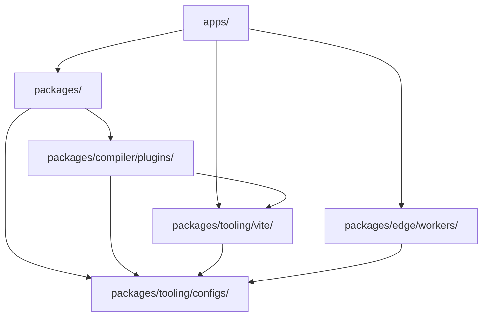

# 미션 플랫폼 아키텍처

정식 영어 원문을 기계 지원으로 번역한 문서입니다. 필요 시 사람이 검수하세요. 패키지 이름, 명령, 경로, 기술 식별자는 그대로 둡니다.

> docs/architecture.md: [docs/architecture.md](../../architecture.md)
> 언어: 한국어 (ko)

Mission Platform은 재사용성과 프레임워크 간 유연성을 극대화하도록 설계되었습니다. 이 문서에서는
아키텍처 원칙, 프레임워크 중립적 엔진, 플랫폼을 구동하는 빌드 시스템입니다.

## 건축 청사진

플랫폼은 **구성 가능한 패키지 중심 아키텍처**를 따릅니다. 이는 애플리케이션이 단일체가 아니라는 것을 의미합니다.
대신에 각각 특정 문제(예: 라우팅,
국제화, UI 구성 요소).

### 황금률: 종속성 방향

순환 종속성을 방지하고 명확성을 유지하기 위해 엄격한 단방향 종속성 흐름이 모노레포 전체에 적용됩니다.
경계:

1. **애플리케이션(`apps/`)**: 패키지 소비, Vite 플러그인 및 작업자. 그들은 절대로 코드를 다른 부분으로 내보내지 않습니다.
   모노레포.
2. **패키지(`packages/`)**: 재사용 가능한 논리 및 구성 요소를 제공합니다. 그들은 서로 의지할 수 있지만 결코 의지하지 않는다
   응용 프로그램.
3. **Forge 플러그인(`packages/compiler/plugins/`)**: 컴파일러 출력 대상 — 프레임워크 플러그인 및 CMS 대상. 그들은 다음에 따라 달라질 수 있습니다
   `packages/tooling/vite/` 그리고 `packages/tooling/configs/`, 그리고 절대 켜지지 않음 `apps/` 또는 서로의 형제자매에 대해; CMS 어댑터는 다음에만 의존합니다.
   `forge-cms-plugin-api`.
4. **구성(`packages/tooling/configs/`)**: 공유 도구 설정(ESLint, TypeScript, 등.). 그들은 기초이며 의존합니다
   모노레포에는 아무것도 없습니다.

## 프레임워크 중립 엔진: Forge

미션플랫폼의 핵심은 `@mission-platform/forge`, 구성 요소에 대한 프레임워크 중립적인 작성 모델 및
컴포저블. `@mission-platform/vite-plugin-forge` 중립 컴파일러 드라이버입니다. 소스를 구문 분석하고 정규화합니다.
의미론적 IR을 구축하고, 공유 분석 및 최적화를 실행하고, 명시적으로 제공된
`FrameworkOutputPlugin`.

다음과 같은 프레임워크 패키지 `@mission-platform/forge-plugin-react` 그리고 `@mission-platform/forge-plugin-vue` 자신의 목표
낮추기, 대상 최적화, 기본 소스 생성, 진단, 런타임 메타데이터 및 Vite/tsdown 어댑터. 거기
드라이버의 중앙 프레임워크 이미터나 문자열-프레임워크 레지스트리가 없습니다. 패키지 빌드 구성에서 다음을 선택합니다.
게시하는 플러그인 인스턴스이므로 대상 구현 종속성은 프레임워크 경계에 유지됩니다.

결과 흐름은 **구문 분석/정규화 → 중립 최적화 → 의미적 IR → 목표 하강 → 목표 최적화 → 생성 →
네이티브 빌드**. 기본 빌드는 선택한 플러그인에 의해 수행됩니다. Vite 또는 tsdown 어댑터도 제공합니다.
대상의 선언, 외부 및 출력 규칙.

두 번째 직교 축은 동일한 중립 구성 요소를 **콘텐츠 플랫폼**에 투영합니다.
`@mission-platform/forge-cms-plugin-api` 플랫폼 중립적인 콘텐츠 모델을 소유하고 있으며, `CmsOutputPlugin` 계약, 그리고
일반 드라이버; 어댑터 패키지 `forge-cms-storyblok`, `forge-cms-astro`, `forge-cms-ghost`, `forge-cms-jekyll`,
그리고 `forge-cms-webflow` 각자 하나의 플랫폼을 소유하고 있습니다. CMS 대상은 프레임워크 플러그인을 교체하는 대신 프레임워크 플러그인을 *구성*하므로
모든 프레임워크와 모든 플랫폼이 쌍을 이루며 출력은 `dist/cms/<cms>/<framework>/**`.

전체 파이프라인, 구성 요소 및 후크 소비자, CMS 프로젝션 및 확장 지침은 다음을 참조하세요.
[Forge 컴파일러 파이프라인](../../../packages/tooling/vite/forge/docs/locales/ko/reference/compiler.md). 빌드 오케스트레이션 보기는 다음을 참조하세요.
[시스템 구축](build-system.md).

## 디자인 토큰 시스템

관리되는 정교한 디자인 토큰 시스템을 통해 시각적 일관성이 유지됩니다. `@mission-platform/tokens`.

- **DTCG 표준**: 토큰은 W3C 디자인 토큰 커뮤니티 그룹 형식(v2025.10)으로 작성됩니다.
- **OKLab 색상 공간**: 프리미티브는 지각적으로 균일한 그라데이션과 테마를 위해 OKLab 색상 공간을 사용합니다.
- **자동화된 아티팩트**: `@mission-platform/vite-plugin-tokens` SCSS 변수, CSS 사용자 정의 자동 생성
  속성 및 TypeScript 단일 진실 소스의 상수입니다.

## 프레임워크에 구애받지 않는 라우팅 및 I18n

라우팅 및 국제화와 같은 핵심 애플리케이션 서비스는 프레임워크에 구애받지 않도록 설계되었습니다.

- **`@mission-platform/router`**: 구조화된 경로 대상, 순수 URL/위치 도우미 및 컴파일러 마커를 제공합니다.
  ~로 `MpLink`, `useMpRoute`, `useMpRouter`, 그리고 `MpRouterView`. UI 프레임워크나 라우터 라이브러리 런타임이 없습니다.
  종속성이 있으며 애플리케이션의 경로 테이블을 소유하지 않습니다.
- **Forge 라우터 대상**: `@mission-platform/forge-router-vue`, `-react`, `-solid`, `-svelte`, `-redwood`, 그리고
  `-web-components` 해당 마커를 소비 애플리케이션에서 선택한 기본 라우터로 낮춥니다. 애플리케이션 유지
  기본 경로 정의, 공급자, 가드, 로더 및 라우터 인스턴스의 소유권 대상은 공급만
  소비능력.
- **`@mission-platform/i18n`**: 래퍼 `i18next` 보편적인 것을 제공하는 `createForgeI18N` 공장.
  프레임워크별 어댑터는 다음을 제공합니다. `useI18n` 후크 및 구성 요소 Vue 그리고 React.

## 구축 및 배포 전략

### Turborepo를 사용한 작업 오케스트레이션

Turborepo는 모노레포 전반에 걸쳐 빌드, 테스트 및 Linting의 무거운 작업을 처리합니다. 글로벌 캐시를 사용하여
입력이 변경된 경우에만 작업이 실행되도록 합니다.

### Vite-Powered 빌드

각 패키지와 앱은 Vite 개발 및 프로덕션 빌드를 위해 다음의 공유 기본 구성을 활용합니다.
`@mission-platform/vite-config`.

### Cloudflare 배포

애플리케이션은 주로 **Cloudflare Workers**(아래)와 함께 **Cloudflare Pages**에 배포됩니다. `packages/edge/workers/`) 제공
API 프록시 및 SPA 자산 제공을 위한 특수 논리.

## 요약

Mission Platform 아키텍처는 격리, 유형 안전성 및 프레임워크 유연성을 우선시합니다. 코어를 분리하여
UI 프레임워크의 로직을 적용하고 엄격한 종속성 방향을 적용함으로써 플랫폼은 장기적인 유지 관리 가능성을 보장합니다.
복잡한 애플리케이션 생태계를 위한 확장성.
