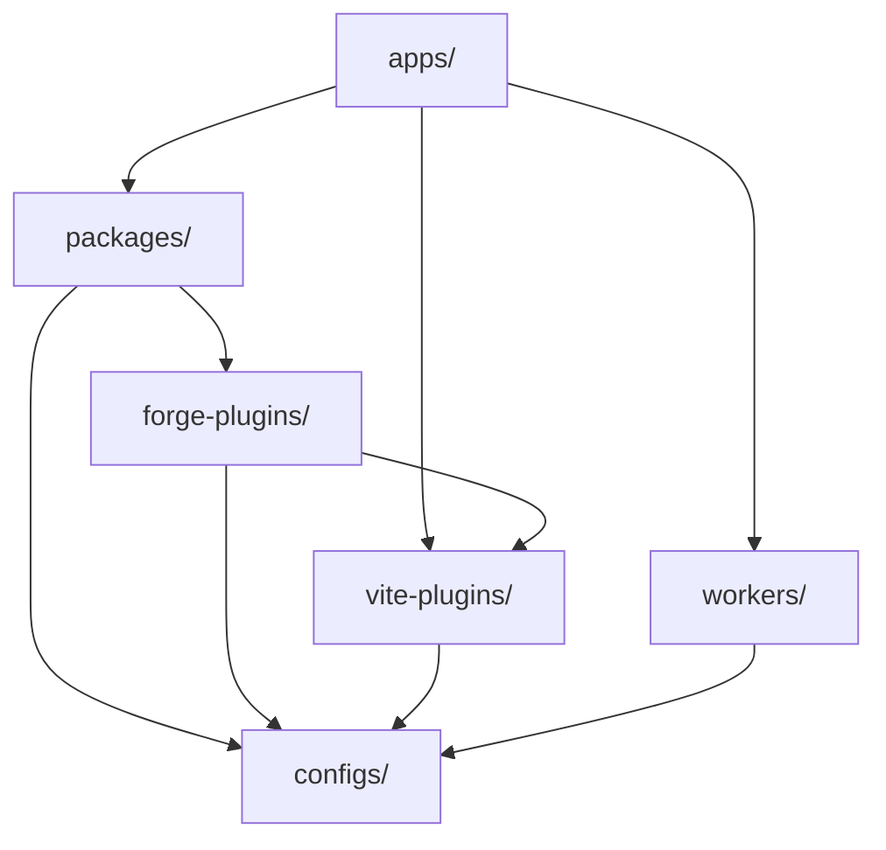

# Missieplatformarchitectuur

Machineondersteunde vertaling van de canonieke Engelse bron. Handmatig nalezen indien nodig. Pakketnamen, opdrachten, paden en technische identificatoren blijven ongewijzigd.

> docs/architecture.md: [docs/architecture.md](../../architecture.md)
> Taal: Nederlands (nl)

Mission Platform is ontworpen voor maximale herbruikbaarheid en cross-framework-flexibiliteit. In dit document wordt uitgelegd
architecturale principes, de raamwerkneutrale engine en de bouwsystemen die het platform aandrijven.

## Architecturale blauwdruk

Het platform volgt een **samenstelbare, pakketgestuurde architectuur**. Dit betekent dat toepassingen niet monolithisch zijn;
in plaats daarvan zijn ze "samengesteld" uit vele kleinere, onafhankelijke pakketten die elk een specifiek probleem behandelen (bijvoorbeeld routering,
internationalisering, UI-componenten).

### De gouden regel: richting van afhankelijkheid

Er wordt binnen de monorepo een strikte eenrichtingsafhankelijkheidsstroom afgedwongen om circulaire afhankelijkheden te voorkomen en overzichtelijk te houden
grenzen:

1. **Toepassingen (`apps/`)**: Consumptiepakketten, Vite plug-ins en werkers. Ze exporteren nooit code naar andere delen van de
   monorepo.
2. **Pakketten (`packages/`)**: Zorg voor herbruikbare logica en componenten. Ze kunnen van elkaar afhankelijk zijn, maar nooit van elkaar
   toepassingen.
3. **Forge-plug-ins (`forge-plugins/`)**: Uitvoerdoelen van de compiler — framework-plug-ins en CMS-doelen. Ze kunnen afhankelijk zijn van
   `vite-plugins/` En `configs/`, en nooit aan `apps/` of op elkaars broers en zussen; een CMS-adapter is alleen afhankelijk van
   `forge-cms-plugin-api`.
4. **Configuraties (`configs/`)**: Gedeelde gereedschapsinstellingen (ESLint, TypeScriptenz.). Zij vormen de basis en zijn afhankelijk van
   niets binnen de monorepo.

## Framework-neutrale engine: Forge

Het hart van Mission Platform is `@mission-platform/forge`, een raamwerkneutraal auteursmodel voor componenten en
Composables. `@mission-platform/vite-plugin-forge` is de neutrale compilerdriver: het parseert en normaliseert de bron,
bouwt semantische IR, voert gedeelde analyse en optimalisatie uit en verzendt naar een expliciet geleverde
`FrameworkOutputPlugin`.

Framework-pakketten zoals `@mission-platform/forge-plugin-react` En `@mission-platform/forge-plugin-vue` eigen doel
verlaging, doeloptimalisatie, het genereren van native bronnen, diagnostiek, runtime-metagegevens en Vite/tsdown-adapters. Daar
Er is geen centrale framework-emitter of string-naar-framework-register in het stuurprogramma. Configuraties voor pakketopbouw selecteren de
plugin-instanties die ze publiceren, zodat de afhankelijkheden van de doelimplementatie op de raamwerkgrens blijven.

De resulterende stroom is **parseren/normaliseren → neutraal optimaliseren → semantische IR → doel lager → doel optimaliseren → genereren →
inheemse bouw**. De native build wordt uitgevoerd door de geselecteerde plug-ins Vite of tsdown-adapter, die ook de
de declaraties, externe waarden en uitvoerconventies van het doel.

Een tweede, orthogonale as projecteert dezelfde neutrale componenten op **contentplatforms**.
`@mission-platform/forge-cms-plugin-api` bezit een platformneutraal contentmodel, de `CmsOutputPlugin` overeenkomst, en een
generiek stuurprogramma; de adapterpakketten `forge-cms-storyblok`, `forge-cms-astro`, `forge-cms-ghost`, `forge-cms-jekyll`,
En `forge-cms-webflow` elk een platform. Een CMS-doel *componeert* een framework-plug-in in plaats van er één te vervangen, dus
elk platform koppelt met elk raamwerk en de uitvoer komt terecht `dist/cms/<cms>/<framework>/**`.

Zie voor de volledige pijplijn-, component- en hook-consumenten, CMS-projectie en uitbreidingsrichtlijnen
[Forge Compiler-pijplijn](../../../vite-plugins/forge/docs/locales/nl/reference/compiler.md). Zie voor de build-orkestratieweergave
[Bouw systeem](build-system.md).

## Ontwerptokensysteem

Visuele consistentie wordt gehandhaafd via een geavanceerd ontwerptokensysteem dat wordt beheerd door `@mission-platform/tokens`.

- **DTCG-standaard**: tokens zijn geschreven in het W3C Design Tokens Community Group-formaat (v2025.10).
- **OKLab-kleurruimte**: Primitieven gebruiken de OKLab-kleurruimte voor perceptueel uniforme verlopen en thema's.
- **Geautomatiseerde artefacten**: `@mission-platform/vite-plugin-tokens` genereert automatisch SCSS-variabelen, CSS aangepast
  eigenschappen, en TypeScript constanten uit één enkele bron van waarheid.

## Framework-agnostische routering en I18n

Kernapplicatiediensten zoals routing en internationalisering zijn ontworpen om raamwerk-agnostisch te zijn.

- **`@mission-platform/router`**: Biedt gestructureerde routedoelen, pure URL/locatie-helpers en compilermarkeringen zoals
  als `MpLink`, `useMpRoute`, `useMpRouter`, En `MpRouterView`. Het heeft geen UI-framework of router-bibliotheek runtime
  afhankelijkheden en is nooit eigenaar van de routetabel van een applicatie.
- **Routerdoelen smeden**: `@mission-platform/forge-router-vue`, `-react`, `-solid`, `-svelte`, `-redwood`, En
  `-web-components` verlaag die markeringen naar de native router die is geselecteerd door de verbruikende applicatie. Toepassingen behouden
  eigendom van eigen routedefinities, providers, bewakers, laders en routerinstanties; het doelwit levert alleen maar
  consumptiemogelijkheden.
- **`@mission-platform/i18n`**: Een wikkel eromheen `i18next` dat zorgt voor een universeel `createForgeI18N` fabriek.
  Framework-specifieke adapters bieden `useI18n` haken en onderdelen voor Vue En React.

## Bouw- en implementatiestrategie

### Taakorkestratie met Turborepo

Turborepo verzorgt het zware werk van het bouwen, testen en pluizen van de monorepo. Het gebruikt een globale cache om
ervoor zorgen dat taken alleen worden uitgevoerd als hun input is veranderd.

### Vite-Aangedreven constructies

Elk pakket en elke app gebruikt Vite voor ontwikkelings- en productiebuilds, waarbij gebruik wordt gemaakt van een gedeelde basisconfiguratie van
`@mission-platform/vite-config`.

### Cloudflare-implementatie

Applicaties worden voornamelijk geïmplementeerd op **Cloudflare Pages**, met **Cloudflare Workers** (onder `workers/`) verstrekken
gespecialiseerde logica voor API-proxying en SPA-activaservice.

## Samenvatting

De Mission Platform-architectuur geeft prioriteit aan isolatie, typeveiligheid en raamwerkflexibiliteit. Door de kern te ontkoppelen
Dankzij de logica van het UI-framework en het afdwingen van een strikte afhankelijkheidsrichting, garandeert het platform onderhoudbaarheid op de lange termijn
en schaalbaarheid voor complexe applicatie-ecosystemen.
