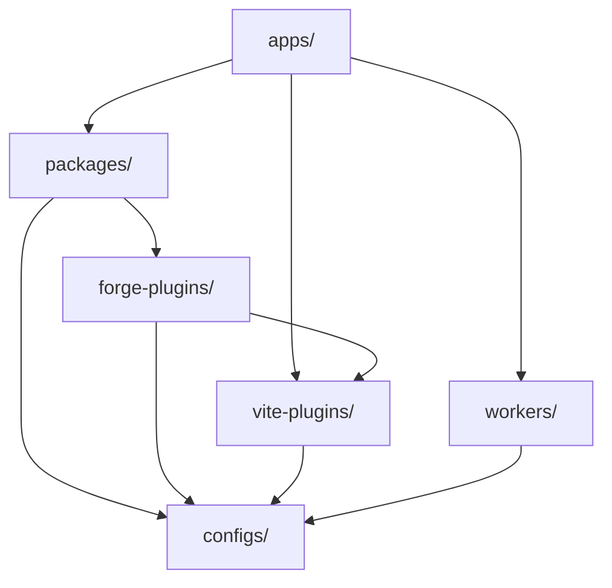

# 任务平台架构

由规范英文源进行的机器辅助翻译。必要时请人工审校。包名、命令、路径与技术标识符保持不变。

> 英文原文: [docs/architecture.md](../../architecture.md)
> 语言: 简体中文 (zh)

Mission Platform 旨在实现最大程度的可重用性和跨框架灵活性。本文档解释了
架构原则、框架中立引擎以及为平台提供支持的构建系统。

## 建筑蓝图

该平台遵循**可组合、包驱动的架构**。这意味着应用程序不是单一的；
相反，它们是由许多较小的、独立的包“组成”的，每个包处理一个特定的问题（例如，路由、
国际化、UI 组件）。

### 黄金法则：依赖方向

在单一存储库中强制执行严格的单向依赖流，以防止循环依赖并保持清晰
边界：

1. **应用（`apps/`)**：消耗包， Vite 插件和工作人员。他们从不将代码导出到系统的其他部分
   单一仓库。
2. **套餐（`packages/`)**：提供可重用的逻辑和组件。他们可以互相依赖，但永远不能依赖
   应用程序。
3. **伪造插件（`forge-plugins/`)**：编译器输出目标 - 框架插件和 CMS 目标。他们可能取决于
   `vite-plugins/` 和 `configs/`，并且从不 `apps/` 或彼此的兄弟姐妹； CMS 适配器仅取决于
   `forge-cms-plugin-api`。
4. **配置（`configs/`)**：共享工具设置（ESLint, TypeScript， ETC。）。它们是基础并依赖于
   monorepo 中没有任何内容。

## 框架中立引擎：Forge

Mission Platform 的核心是 `@mission-platform/forge`，一个框架中立的组件创作模型
可组合项。 `@mission-platform/vite-plugin-forge` 是中立的编译器驱动程序：它解析并规范化源代码，
构建语义 IR，运行共享分析和优化，并分派到显式提供的
`FrameworkOutputPlugin`.

框架包如 `@mission-platform/forge-plugin-react` 和 `@mission-platform/forge-plugin-vue` 自己的目标
降低、目标优化、本机源生成、诊断、运行时元数据以及 Vite/tsdown 适配器。那里
驱动程序中没有中央框架发射器或字符串到框架注册表。包构建配置选择
他们发布的插件实例，因此目标实现依赖关系保留在框架边界。

结果流程是**解析/规范化→中性优化→语义IR→目标降低→目标优化→生成→
本机构建**。本机构建由所选插件执行 Vite 或 tsdown 适配器，它还提供
目标的声明、外部和输出约定。

第二个正交轴将相同的中性组件投射到**内容平台**上。
`@mission-platform/forge-cms-plugin-api` 拥有平台中立的内容模型， `CmsOutputPlugin` 合同，以及一份
通用驱动程序；适配器包 `forge-cms-storyblok`, `forge-cms-astro`, `forge-cms-ghost`, `forge-cms-jekyll`，
和 `forge-cms-webflow` 每个人都有一个平台。 CMS 目标“组成”框架插件而不是替换框架插件，因此
任何平台与任何框架配对，输出落在 `dist/cms/<cms>/<framework>/**`.

有关完整的管道、组件和挂钩使用者、CMS 投影和扩展指南，请参阅
[Forge 编译器管道](forge-compiler.md)。对于构建编排视图，请参见 [构建系统](build-system.md).

## 设计代币系统

视觉一致性是通过复杂的设计令牌系统来维护的，该系统由 `@mission-platform/tokens`.

- **DTCG 标准**：令牌以 W3C 设计令牌社区组格式 (v2025.10) 编写。
- **OKLab 色彩空间**：基元使用 OKLab 色彩空间来实现感知上均匀的渐变和主题。
- **自动化工件**： `@mission-platform/vite-plugin-tokens` 自动生成SCSS变量，CSS自定义
  属性，以及 TypeScript 来自单一事实来源的常数。

## 与框架无关的路由和 I18n

路由和国际化等核心应用程序服务被设计为与框架无关。

- **`@mission-platform/router`**：将路由定义为普通数据结构（`MpRoute`)。适配器用于 Vue 翻译这些
  到特定于框架的路由器实例和可组合项。
- **`@mission-platform/i18n`**：一个包装纸 `i18next` 这提供了一个通用的 `createForgeI18N` 工厂。
  特定于框架的适配器提供 `useI18n` 挂钩和组件 Vue 和 React.

## 构建和部署策略

### 使用 Turborepo 进行任务编排

Turborepo 处理整个 monorepo 的构建、测试和 linting 的繁重工作。它使用全局缓存来
确保任务仅在其输入发生更改时执行。

### Vite- 动力构建

每个包和应用程序都使用 Vite 对于开发和生产构建，利用共享基础配置
`@mission-platform/vite-config`.

### Cloudflare 部署

应用程序主要部署到 **Cloudflare Pages**，以及 **Cloudflare Workers**（在 `workers/`) 提供
API 代理和 SPA 资产服务的专用逻辑。

## 概括

任务平台架构优先考虑隔离、类型安全和框架灵活性。通过解耦核心
来自UI框架的逻辑并强制执行严格的依赖方向，平台确保了长期的可维护性
以及复杂应用生态系统的可扩展性。
