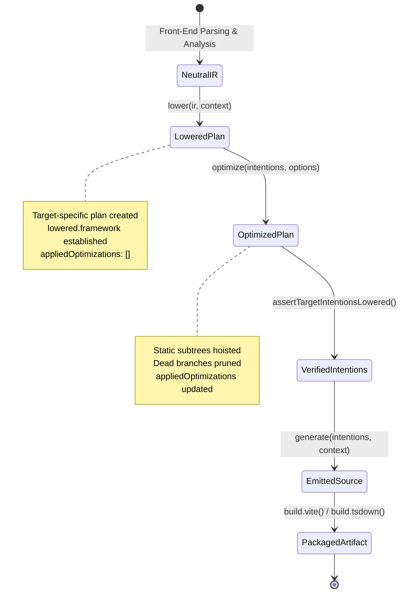

# @mission-platform/forge-plugin-api

Public API contracts, framework-neutral intermediate representation (IR), and pipeline abstractions that power every Forge target plugin and code generator.

Forge translates framework-neutral component definitions into idiomatic code across multiple frontend ecosystems—**React**, **Vue 3**, **Solid**, **Svelte**, and **Web Components**—as well as headless CMS integrations. `@mission-platform/forge-plugin-api` defines the strict architectural contracts governing this multi-target compilation model.

---

## Architecture Overview: The Three-Stage Target Pipeline

Target code generation in Forge is organized around a strict three-stage pipeline contract:

$$\text{Semantic IR} \xrightarrow{\quad\text{lower}\quad} \text{TargetIntentions} \xrightarrow{\quad\text{optimize}\quad} \text{TargetIntentions (Refined)} \xrightarrow{\quad\text{generate}\quad} \text{GeneratedModule}$$

```mermaid
sequenceDiagram
    autonumber
    actor Driver as Compiler Build Driver
    participant Plugin as FrameworkOutputPlugin
    participant Lower as Lowering Stage
    participant Opt as Target Optimizer
    participant Gen as Source Generator
    participant Build as Build Adapters (Vite / tsdown)

    Note over Driver,Plugin: Cross-Module Pre-Pass
    Driver->>Plugin: prepareComponentHosts(modules)
    Plugin-->>Driver: ReadonlyMap<string, TargetComponentHost>

    Note over Driver,Plugin: Stage 1: Target Lowering
    Driver->>Plugin: lower(ir: SemanticModule, context: TargetContext)
    Plugin->>Lower: mapNeutralToTargetPlan(ir, context)
    Lower-->>Plugin: TargetIntentions<TLowered> (lowered plan instantiated)
    Plugin-->>Driver: TargetIntentions<TLowered>

    Note over Driver,Plugin: Stage 2: Target Optimization
    Driver->>Plugin: optimize(intentions, options: TargetOptimizeOptions)
    Plugin->>Opt: refinePlan(intentions.lowered, options)
    Opt-->>Plugin: TargetIntentions (appliedOptimizations recorded)
    Plugin-->>Driver: Optimized TargetIntentions

    Note over Driver,Plugin: Stage 3: Source Code Generation
    Driver->>Plugin: generate(intentions, context: GeneratorContext)
    Plugin->>Gen: assertTargetIntentionsLowered(intentions, frameworkId)
    Gen->>Gen: emitCode(intentions.module, intentions.lowered)
    Gen-->>Plugin: GeneratedModule { code, lang, extraModules?, map? }
    Plugin-->>Driver: GeneratedModule

    Note over Driver,Build: Stage 4: Native Packaging
    Driver->>Build: build.vite(context) / build.tsdown(context)
    Build-->>Driver: Plugin[] / TsdownPlugin[]
```

---

## Pipeline Stages & Contracts

### 1. Stage 1: Lowering (`lower`)

The lowering phase translates framework-neutral semantic AST structures (`SemanticModule`) into target-specific semantic plans encapsulated within a `TargetLoweredModule`.

```typescript
lower: (ir: SemanticModule, context: TargetContext) => TargetIntentions;
```

- **Inputs**:
  - `ir: SemanticModule`: Framework-neutral AST containing declarations, statements, imports, type bindings, and JSX render trees (`GenericElementNode`, `GenericComponentNode`, `GenericSlotNode`, `GenericLoopNode`, `GenericConditionalNode`).
  - `context: TargetContext`: Metadata describing the compilation unit, including `framework` (`FrameworkId`), `moduleKind` (`"component"` | `"composable"`), `componentName`, and sibling `componentHosts` mappings.
- **Responsibilities**:
  - Maps abstract reactive state declarations (e.g., reactive variables, derived values, effects) into target-specific reactive abstractions (React hooks, Vue `ref`/`computed`, Solid `createSignal`/`createMemo`, Svelte runes).
  - Resolves component invocations into target idioms (custom elements, PascalCase JSX tags, or dynamic `is` attributes).
  - Generates the target's discriminated `TargetLoweredModule` plan object.
- **Contract Guarantee**: Must return a valid `TargetIntentions` object with a non-empty `lowered` property discriminated by the plugin's `framework`.

### 2. Stage 2: Optimization (`optimize`)

The optimization phase inspects and refines the target-specific plan prior to source code serialization.

```typescript
optimize: (intentions: TargetIntentions, options: TargetOptimizeOptions) =>
  TargetIntentions;
```

- **Inputs**:
  - `intentions: TargetIntentions`: The lowered target plan produced by Stage 1.
  - `options: TargetOptimizeOptions`: Standardized optimization flags (`neutral.deadBranchPruning`, `neutral.staticMarking`, `neutral.stableKeyInference`) along with target-custom options.
- **Responsibilities**:
  - **Dead Code & Branch Pruning**: Eliminates statically unreachable JSX branches and unused reactive bindings.
  - **Static Subtree Hoisting**: Identifies invariant DOM/JSX nodes and hoists them outside component render functions to avoid re-allocation during rerenders.
  - **Stable Key Inference**: Automatically synthesizes deterministic reconciliation keys for mapped collection items lacking explicit keys.
  - **Optimization Provenance**: Appends applied optimization passes to `lowered.appliedOptimizations` for compiler diagnostics and cache fingerprinting.

### 3. Stage 3: Code Generation (`generate`)

The generator translates the optimized target intentions into final, deployable source code and auxiliary assets.

```typescript
generate: (intentions: TargetIntentions, context: GeneratorContext) =>
  GeneratedModule;
```

- **Inputs**:
  - `intentions: TargetIntentions`: The finalized, optimized target plan.
  - `context: GeneratorContext`: Generator context providing target configuration and naming metadata.
- **Contract Assertion**:
  Target generators **must** invoke `assertTargetIntentionsLowered` at the start of execution. Fallback direct-generation without a verified lowered plan is strictly prohibited.
- **Outputs (`GeneratedModule`)**:
  - `code: string`: The primary source artifact (e.g., `.tsx`, `.vue`, `.svelte`, `.ts`).
  - `lang: OutputLanguage`: Target file language extension identifier.
  - `extraModules?: readonly GeneratedExtraModule[]`: Sidecar modules (CSS modules, auxiliary type definitions, isolated runtime shims).
  - `map?: string | Readonly<Record<string, unknown>>`: Source map mapping emitted code back to original source spans.
  - `declarations?: readonly { name: string; code: string }[]`: Emitted TypeScript `.d.ts` declaration files.
  - `diagnostics?: readonly CompilerDiagnostic[]`: Compiler warnings or errors emitted during code generation.

### 4. Build & Bundling Adapters (`build`)

Each framework plugin exposes build adapters integrating native framework compiler plugins into downstream toolchains:

```typescript
export interface ForgeBuildAdapters {
  readonly vite?: (context: ViteBuildContext) => readonly Plugin[];
  readonly tsdown?: (context: TsdownBuildContext) => readonly TsdownPlugin[];
}
```

These adapters configure appropriate JSX automatic runtimes, Vue Single File Component (SFC) compilers, Svelte preprocessors, or Web Component custom element registries during bundling.

---

## Mandatory Lowering Invariant & Type Narrowing

To eliminate silent failures and undefined behavior across heterogeneous targets, Forge enforces a mandatory runtime and compile-time lowering invariant.

### Contract Definition

```typescript
export interface TargetLoweredModule {
  readonly framework: FrameworkId;
  readonly appliedOptimizations: readonly string[];
}

export interface TargetIntentions<
  TLowered extends TargetLoweredModule = TargetLoweredModule,
> {
  readonly framework: FrameworkId;
  readonly module: SemanticModule;
  readonly context: TargetContext;
  readonly diagnostics?: readonly CompilerDiagnostic[];
  readonly lowered: TLowered;
}
```

### The `assertTargetIntentionsLowered` Assertion

All target plugins must validate their incoming intentions using `assertTargetIntentionsLowered`:

```typescript
import {
  assertTargetIntentionsLowered,
  type FrameworkOutputPlugin,
  type TargetIntentions,
  type GeneratorContext,
  type GeneratedModule,
} from "@mission-platform/forge-plugin-api";

interface CustomLoweredModule extends TargetLoweredModule {
  readonly framework: "custom";
  readonly templatePlan: CustomTemplatePlan;
}

export function generateCustom(
  intentions: TargetIntentions,
  context: GeneratorContext,
): GeneratedModule {
  // Verifies intentions is an object, lowered exists, and lowered.framework === 'custom'
  assertTargetIntentionsLowered<CustomLoweredModule>(intentions, "custom");

  // TypeScript narrows intentions to TargetIntentions<CustomLoweredModule>
  const code = emitCustomTemplate(intentions.lowered.templatePlan);
  return { code, lang: "ts" };
}
```

If `intentions.lowered` is missing or has a mismatched framework discriminator, a descriptive `TypeError` is raised immediately, preventing corrupted output from reaching downstream bundlers.

---

## State Transformation Lifecycle



---

## Implementing a Framework Plugin

Here is a minimal, standard-compliant implementation of a custom `FrameworkOutputPlugin`:

```typescript
import {
  assertTargetIntentionsLowered,
  defineForgeOutputPlugin,
  type FrameworkOutputPlugin,
  type GeneratedModule,
  type GeneratorContext,
  type SemanticModule,
  type TargetContext,
  type TargetIntentions,
  type TargetLoweredModule,
  type TargetOptimizeOptions,
} from "@mission-platform/forge-plugin-api";

interface MyTargetLoweredPlan extends TargetLoweredModule {
  readonly framework: "my-target";
  readonly renderExpressions: readonly string[];
}

export function forgeMyTargetPlugin(): FrameworkOutputPlugin {
  return defineForgeOutputPlugin({
    id: "my-target",
    outputLanguage: "ts",
    source: {
      componentExtension: ".ts",
      componentImportExtension: ".ts",
      composableExtension: ".ts",
      entryExtension: ".ts",
      componentExport: "named",
    },
    lower(
      ir: SemanticModule,
      context: TargetContext,
    ): TargetIntentions<MyTargetLoweredPlan> {
      const renderExpressions = ir.statements.map((s) => s.text.text);
      return {
        framework: "my-target",
        module: ir,
        context,
        lowered: {
          framework: "my-target",
          appliedOptimizations: [],
          renderExpressions,
        },
      };
    },
    optimize(
      intentions: TargetIntentions,
      options: TargetOptimizeOptions,
    ): TargetIntentions {
      assertTargetIntentionsLowered<MyTargetLoweredPlan>(
        intentions,
        "my-target",
      );
      const applied = [...intentions.lowered.appliedOptimizations];

      let expressions = intentions.lowered.renderExpressions;
      if (options.neutral.deadBranchPruning) {
        expressions = expressions.filter(
          (expr) => !expr.includes("/* dead */"),
        );
        applied.push("dead-branch-pruning");
      }

      return {
        ...intentions,
        lowered: {
          ...intentions.lowered,
          appliedOptimizations: applied,
          renderExpressions: expressions,
        },
      };
    },
    generate(
      intentions: TargetIntentions,
      context: GeneratorContext,
    ): GeneratedModule {
      assertTargetIntentionsLowered<MyTargetLoweredPlan>(
        intentions,
        "my-target",
      );
      const code =
        `// Emitted for ${context.componentName ?? "Component"}\n` +
        intentions.lowered.renderExpressions.join("\n");
      return { code, lang: "ts" };
    },
    build: {
      vite: () => [],
      tsdown: () => [],
    },
  });
}
```

---

## Testing Guidelines

When authoring unit tests or integration fixtures for components and compiler passes:

1. **Always supply a valid `lowered` plan object**: Direct mock intentions must include at least `{ framework: '<target>', appliedOptimizations: [] }`.
2. **Execute the full sequence**: When testing custom target plugins, verify `lower` $\to$ `optimize` $\to$ `generate` in order to validate contract invariants and optimization tracking.
3. **Verify Discriminators**: Ensure that passing an intention intended for a different framework (e.g. passing a `react` intention to `forge-vue`) correctly fails fast via `assertTargetIntentionsLowered`.
