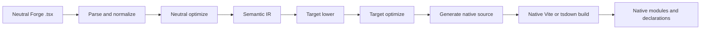
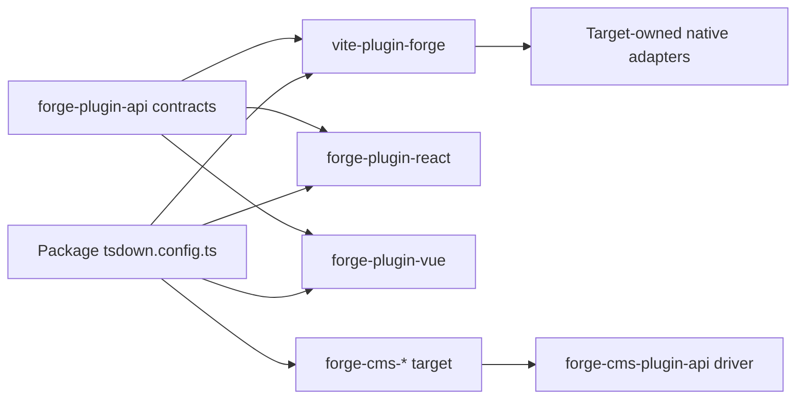
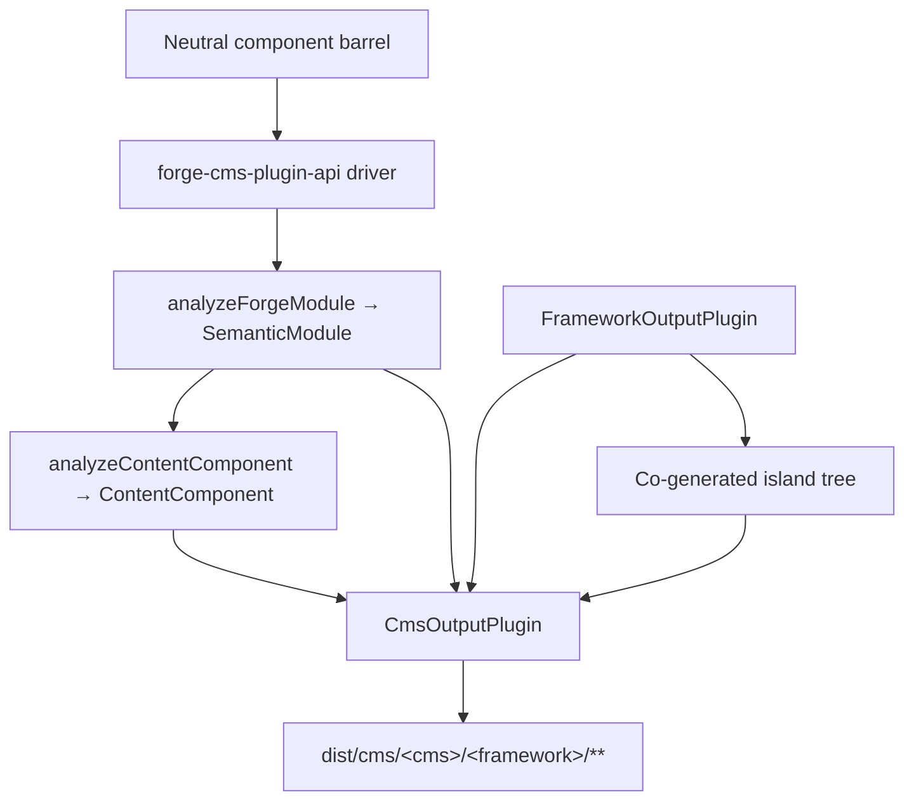

# Forge-Compiler-Pipeline

Maschinenunterstützte Übersetzung aus der kanonischen englischen Quelle. Bei Bedarf manuell nachprüfen. Paketnamen, Befehle, Pfade und technische Bezeichner bleiben unverändert.

> packages/tooling/vite/forge/docs/reference/compiler.md: [packages/tooling/vite/forge/docs/reference/compiler.md](../../../reference/compiler.md)
> Sprache: Deutsch (de)

Dies ist eine Architekturerklärung für Mission Platform-Betreuer, die verstehen müssen, wie ein Framework neutral ist
Das Forge-Modul wird zu einem nativen Framework-Paket. Die wichtige Grenze ist nicht „ein Quellenemitter pro Framework“ im Inneren
das Vite-Plugin. Forge verfügt über einen neutralen Compiler-Treiber, einen expliziten Ziel-Plugin-Vertrag und ein Framework-eigenes Native
Adapter bauen.

## Die Verantwortung wurde aufgeteilt

Die Kompilierung von Forge umfasst mehrere Pakete, von denen jedes eine bewusst begrenzte Verantwortung hat:

| Schicht                                               | Besitzt                                                                                                                                               | Besitzt nicht                                                            |
| :---------------------------------------------------- | :---------------------------------------------------------------------------------------------------------------------------------------------------- | :----------------------------------------------------------------------- |
| `@mission-platform/vite-plugin-forge`                 | Parsing, Normalisierung, neutrale Analyse, semantische IR, gemeinsame Optimierung, Cache/Erkennung, Versand und generische Vite/tsdown-Orchestrierung | React, Vue, Solid, Svelte, Webkomponenten oder CMS-Quellemitter          |
| `@mission-platform/forge-plugin-api`                  | `FrameworkOutputPlugin`, semantische Zielverträge, generierte Modultypen, Zielmetadaten und Vite/tsdown-Adaptertypen                                  | Eine Framework-Implementierung oder Zielauswahl-Registrierung            |
| Integrierte `@mission-platform/forge-plugin-*`-Pakete | Zielsenkung, Zieloptimierung, Quellgenerierung, Zieldiagnose, Laufzeitmetadaten und native Build-Adapter                                              | Neutrales Parsen und zielübergreifende Orchestrierung                    |
| `@mission-platform/forge-cms-plugin-api`              | `CmsOutputPlugin`, das neutrale Inhaltsmodell, der Discover→Analyse→Emit→Write-Treiber, die Insel-Wärmekopplung und die CMS-Build-Helfer              | Jedes plattformspezifische Schema, jede Vorlage oder jede Manifestform   |
| `@mission-platform/forge-cms-*` Pakete                | Jeweils eine Inhaltsplattform: Feldzuordnung, Vorlagendialekt, Manifestform und Plattformdiagnose                                                     | Neutrale Requisitenklassifizierung oder zielübergreifende Orchestrierung |
| Paket `tsdown.config.ts`-Dateien                      | Auswählen der Ziel-Plugin-Instanzen und paketspezifischen Überschreibungen                                                                            | Compilerstufen oder Framework-Switch-Tabellen neu implementieren         |

Die Abhängigkeitsrichtung ist explizit: Ein Paket importiert das gewünschte Ziel-Plugin und übergibt diese Instanz an den Neutralen
Treiber und erhält eine zielspezifische Build-Konfiguration. Der Treiber erstellt niemals ein Ziel aus einer Zeichenfolge oder importiert
jedes Framework-Paket für den Fall, dass es benötigt wird.

## Die strenge Pipeline

Der kanonische Ablauf ist ein einzelnes neutrales Frontend, gefolgt von zieleigenen Phasen und einem nativen Build. Jedes Ziel erhält
die gleichen semantischen Fakten; Es ist nicht erforderlich, das neutrale Modul aus einer generierten Quelldatei zu rekonstruieren.



### Analysieren und normalisieren

Der Treiber liest das neutrale TypeScript/JSX und erstellt die vom Compiler verwendete generische AST-Darstellung. Normalisierung
löst neutrale Autorenkonventionen in stabile Fakten auf: Importe, Direktiven, Komponenten- und Hook-Grenzen, JSX-Knoten,
Slots, statische Markierungen und andere Konstrukte, die spätere Stufen benötigen. Diagnosen werden mit Quellstandorten erfasst
anstatt in einem Zielemitter versteckt zu sein.

### Neutrale Optimierung und semantische IR

Neutrale Pässe funktionieren, bevor ein Rahmen beteiligt ist. Sie können Komponenten und Helfer entdecken, Importe umschreiben, entfernen
Compiler-Anweisungen, leiten stabile Schlüssel ab, bereinigen neutrale tote Zweige und führen wiederverwendbare Analysen im Cache durch. Das Ergebnis ist ein
`SemanticModule`: eine explizite Darstellung der Komponente oder des zusammensetzbaren Verhaltens des Moduls und seiner neutralen Fakten.

Die semantische IR ist der Vertrag zwischen dem generischen Compiler und einem Ziel-Plugin. Auch das Frontend behält das Original
TypeScript `SourceFile` als nicht aufzählbares Laufzeitdetail im semantischen Modul analysiert. Zielemitter können verbrauchen
Dieser gemeinsam genutzte geparste Baum für quellgesicherte Blätter verlässt, aber sie dürfen nie wieder `parseTsx` für die Modulquelle aufrufen. Dies
Hält den Cache serialisierbar und stellt gleichzeitig sicher, dass die Quelle nur einmal analysiert wird.

### Zielsenkung und -optimierung

Der Aufrufer stellt eine `FrameworkOutputPlugin`-Instanz bereit. Der Treiber ruft seine `lower`-Funktion mit dem semantischen Modul auf
und ein `TargetContext`, wodurch `TargetIntentions` entsteht. Das Absenken ordnet neutrale Konzepte Zielkonzepten zu: zum Beispiel
Neutrale Hooks und Slots werden zum Zustand/Lebenszyklus und zur Slot-Repräsentation des Ziels, während neutrale Elemente zum Ziel werden
Element- oder Komponentenmodell des Ziels.

Die `optimize`-Funktion des Plugins führt dann eine zielspezifische Vereinfachung durch. Es erhält die gemeinsamen neutralen Optionen
neben einem Erweiterungspunkt für Zieloptionen. Dies hält Framework-Regeln vom neutralen Optimierer fern und ermöglicht gleichzeitig eine
Ziel ist es, seine eigene generierte Darstellung vor der Quellgenerierung zu optimieren.

### Quellgenerierung und native Kompilierung

Die `generate`-Funktion des Plugins gibt einen `GeneratedModule` zurück. Es kann die Primärquelle, Hilfsmodule usw. umfassen
Zieldiagnostik. Die generierte Quelle ist bewusst ein Zwischenartefakt, der dem Zielpaket gehört: React,
Vue, Solid, Svelte und Webkomponenten können jeweils die Quellform auswählen, die ihre native Toolchain erwartet.

Die letzte Stufe ist kein weiterer Forge-Emitter. Der `build.vite`- oder `build.tsdown`-Adapter des Plugins stellt das native bereit
Framework-Plugins und Build-Einstellungen für den generierten Baum. Native Vite/Rolldown-Kompilierung, Deklarationsgenerierung,
Die Externalisierung und die Ausgabeverpackung erfolgen dann über die normale Toolchain des Ziels.

### Diagnose und Caching

Die Diagnose enthält die Compilerphase, das Ziel, die Quellspanne und einen umsetzbaren Grund. Ein Ziel muss eine nicht unterstützte Meldung melden
semantisches node, anstatt stillschweigend einen generischen Laufzeitabschluss oder eine ungültige native Quelle auszugeben. Neutrale semantische Module
werden nach Quellinhalt, Modultyp und semantisch beeinflussenden Optionen zwischengespeichert; Die Zielstufen erhalten dasselbe zwischengespeichert
Modul für jedes ausgewählte Framework, wobei die Zielsenkung und -optimierung unabhängig bleibt.

## Servicelebenszyklus und inkrementelle Builds

Vite und tsdown-Helfer verwenden ein prozessinternes `ForgeCompilerService` für die Lebensdauer einer Build-Sitzung. Der Dienst besitzt
Quell-Snapshot, Diagramm, analysiertes Frontend, neutrale Optimierung, semantische IR und Zielartefakt-Caches. Es ist sicher
mehrere explizite Ziele nacheinander oder gleichzeitig bedienen; Zielartefakte werden durch die Ziel-ID verschlüsselt und teilen sich niemals eine
generiertes Verzeichnis. One-Shot-Helfer entsorgen den Dienst nach dem Build, während Watch-Helfer ihn bis zum Vite behalten
Der Server wird geschlossen.

Ein effektiver Cache-Schlüssel umfasst den Quell-Fingerabdruck, die Modulart, Compiler- und Router-Optionen sowie Quell-Root/Konfiguration
Fingerabdrücke, Ziel-ID und Plugin-Fingerabdruck sowie relevante Bedingungen. Eine geänderte Datei macht ihr Umkehrdiagramm ungültig
Abhängige, einschließlich transitiver Komponenten- und Hook-Einträge, anstatt nicht verwandte Ziele zu löschen. `tsconfig.json`
`baseUrl` und `paths` sind in der Diagrammvorbereitung enthalten, sodass Aliase in Vite- und tsdown-Builds konsistent aufgelöst werden.
Rufen Sie `invalidate(changedFiles)` aus benutzerdefinierten Überwachungsintegrationen auf und rufen Sie `dispose()` auf, wenn ein Dienst nicht mehr benötigt wird.

Der Servicebericht legt Phasenzeiten, Cache-Treffer/-Fehler, ungültig gemachte Dateien, Warnungen, Fehler und ausgegebene Artefakte offen
zählt. Fehlende Dateien, nicht unterstützte Erweiterungen, nicht aufgelöste Aliase, fehlerhafte Exporte und Zielkonfigurationsfehler
Strukturierte Diagnostik. Warnungen erreichen den Build-Reporter; Fehler verhindern die Generierung und Förderung.

Jeder Ziel-Snapshot verfügt über ein Artefaktmanifest, das generierte Module, zusätzliche Module, Deklarationen, Quellzuordnungen, Assets usw. auflistet.
Einträge und Prüfsummen. Bei der nativen Heraufstufung wird überprüft, ob das Manifest vollständig und zielgerichtet ist, bevor es ersetzt wird
letzte erfolgreiche Ausgabe. Bei einem fehlgeschlagenen, abgebrochenen oder abgelaufenen Build wird nur seine Phase entfernt und die gleichgeordneten Ziele und beibehalten
der vorherige `dist`-Baum.

Die erste Implementierung ist bewusst in Bearbeitung, da Ziel-Plugins anrufereigene und native Funktionen enthalten
Adapter. Ein Worker oder ein prozessübergreifender Transport/Daemon kann später hinter demselben Servicevertrag eingeführt werden; es ist kein
Framework-Registrierung und ist für den aktuellen Vite/tsdown-Workflow nicht erforderlich.

## Explizite Zielinhaberschaft

Die zentralen Verträge leben in `packages/compiler/plugins/forge-plugin-api/src/framework.ts`:

– `FrameworkOutputPlugin` identifiziert ein Ziel und besitzt `lower`, `optimize`, `generate` und `build`.
– `TargetContext` enthält generischen Build-Kontext wie Modultyp, Komponentenname und erkannte Komponentenordner.
– `TargetIntentions` umschließt das semantische Modul nach dem Absenken des Ziels und behält dabei die Diagnose bei.

- `GeneratedModule` beschreibt die generierte Quelle, ihre Ausgabesprache, Hilfsmodule und Diagnosen.
- `FrameworkBuildAdapters` bietet unabhängig typisierte Vite- und tsdown-Adapter.
  – `FrameworkSourceMetadata`, Laufzeit-Externals und Anzeigenamen-Metadaten ermöglichen es der generischen Orchestrierung, Ausgabedetails abzuleiten
  ohne eine Ziel-Switch-Anweisung.

Integrierte Ziele werden durch ihre eigenen Pakete erstellt, zum Beispiel `forgeReactFramework()`, `forgeVueFramework()`,
`forgeSolidFramework()`, `forgeSvelteFramework()` und `forgeWebComponentsFramework()`. Ein Paket wählt nur die aus
Ziele, die es veröffentlicht:

```ts
import { defineTsdownForgeComponents } from '@mission-platform/vite-plugin-forge';
import { forgeReactFramework } from '@mission-platform/forge-plugin-react';
import { forgeSolidFramework } from '@mission-platform/forge-plugin-solid';
import { forgeSvelteFramework } from '@mission-platform/forge-plugin-svelte';
import { forgeVueFramework } from '@mission-platform/forge-plugin-vue';
import { forgeWebComponentsFramework } from '@mission-platform/forge-plugin-web-components';

export default defineTsdownForgeComponents({
  rootDir: import.meta.dirname,
  frameworks: [
    forgeVueFramework(),
    forgeReactFramework(),
    forgeSvelteFramework(),
    forgeSolidFramework(),
    forgeWebComponentsFramework(),
  ],
  componentsModule: `${import.meta.dirname}/src/components/index.ts`,
  name: 'MissionPlatformComponents',
});
```

## Web Components-Anwendungen und `mp:web-component`

Das Web Components-Ziel gibt registrierte benutzerdefinierte Elemente aus und ist der von statischen Dokumenten verwendete Framework-freie Forge-Build
und andere DOM-Konsumenten. Wählen Sie es über die gemeinsame Exportbedingung aus, anstatt ein zielspezifisches Paket zu importieren
Weg; Dadurch bleibt jeder `@mission-platform/*`-Import konsistent und verhindert, dass Vue oder eine andere Framework-Laufzeitumgebung ausgeführt wird
Eingabe des Bundles:

```ts
import { defineConfig } from 'vite';
import { frameworkResolveConditions } from '@mission-platform/vite-config';

export default defineConfig({
  resolve: { conditions: frameworkResolveConditions('mp:web-component') },
});
```

Die passende TypeScript-Voreinstellung ist `@mission-platform/typescript-config/framework-web-component` mit
`customConditions: ['mp:web-component']`. Browseranwendungen können den nativen Browserverlauf verwenden; statische/Prerender-Builds
sollte während des Renderdurchlaufs Speicherverlauf und Registerelemente bereitstellen. Die Router-Ausgangs- und Verbindungselemente akzeptieren
komplexe Routenziele als Eigenschaften und sind unabhängig vom Komponenten-Authoring-Modell des Forge-Compilers.

Die Instanzen sind Eigentum des Anrufers. Neue Instanzen können zielspezifische Optionen und Metadaten sowie eine leere Plugin-Liste enthalten
handelt es sich eher um einen Konfigurationsfehler als um eine Aufforderung zur Verwendung einer versteckten Standardregistrierung. Dies erleichtert das Hinzufügen eines neuen Ziels
Additive Paketänderung: Implementieren Sie den Output-Plugin-Vertrag, veröffentlichen Sie seine Build-Adapter und wählen Sie ihn in Verbrauchern aus.



Die Pfeile von einem Verbraucher zum Treiber- und Zielpaket sind beabsichtigt. Der Verbraucher besitzt die Zielauswahl;
Der Treiber besitzt eine generische Orchestrierung. und jedes Zielpaket besitzt die Framework-Implementierung.

## Komponentenaufbauten

Komponentenpakete erstellen neutrale Module gegen `@mission-platform/forge-jsx`, normalerweise über einen neutralen Komponentenzylinder.
`defineTsdownForgeComponents` erstellt einen Ziel-Build für jedes bereitgestellte Plugin. Für jedes Ziel gilt Folgendes:

1. analysiert, normalisiert und analysiert die neutralen Komponentenmodule;
2. führt neutrale Durchgänge durch und erstellt semantische Module;
3. ruft die Reduzierungs-, Optimierungs- und Generierungsstufen des ausgewählten Plugins auf;
4. schreibt Zielquell- und Hilfsmodule in einen zielspezifischen Cache;
5. ruft die tsdown/Vite-Adapter des Plugins auf;
6. Gibt das Zielverzeichnis, Deklarationen, Laufzeit-Externals und Paketeintragsartefakte aus.

Die neutrale Quelle wird gemeinsam genutzt, generierte Bäume und Deklarationen sind jedoch zielspezifisch. Ein Vue-Build kann daher Vue verwenden
SFC- und Vue-Deklarationstools, während ein React-Build die nativen Typen React JSX und React verwenden kann. Paketkonfiguration kann
Fügen Sie weiterhin Aufruferüberschreibungen, CSS-Verarbeitung, Deklarations-Plugins oder zielspezifische Vite-Optionen hinzu, ohne diese zu verschieben
Bedenken in den generischen Compiler.

## Hook- und zusammensetzbare Builds

Hooks sind neutrale Composables und keine UI-Komponenten, verwenden jedoch dieselbe explizite Zielbesitzgrenze. Ein Haken
Der Verbraucher übergibt ein `FrameworkOutputPlugin` an `defineTsdownForgeHooks`. Der generische Treiber analysiert den neutralen Eintrag.
Behält, soweit möglich, Framework-agnostische Module bei und sendet zielabhängige Module über die Strict-Funktion des Plugins
Pfad senken/optimieren/generieren.

Das ausgewählte Plugin steuert die Hook-Ausgabesprache und den nativen Adapter. Dies ermöglicht beispielsweise die Erstellung eines React-Hooks
Verwenden Sie React-kompatible Importe und einen Vue-Hook-Build, um Vue `Ref`-basiertes Verhalten offenzulegen, während neutrale Dienstprogrammmodule erhalten bleiben
unverändert. Jedes Ziel erhält seine eigenen Deklarationen vom generierten Zielbaum; Keine gemeinsame Erklärung behauptet das
Alle Framework-Konsumenten haben die gleichen Hook-Typen.

## CMS-Projektion

Das Projizieren von Komponenten auf eine _Inhaltsplattform_ ist eine Achse orthogonal zur Rahmenabsenkung, kein Rahmen
Implementierung im Haupttreiber versteckt. Eine Komponente wird zu einem Storyblok-Block, einer Astro-Insel, einem Ghost-Teil, einem
Jekyll-Include oder eine Webflow-Codekomponente – und jede davon kann mit **jedem** Framework-Ausgabe-Plugin gepaart werden.
Bei `storyblok × vue`, `astro × solid` und `ghost × web-components` handelt es sich daher eher um Konfigurationen als um neuen Code.

`@mission-platform/forge-cms-plugin-api` besitzt diese Naht. Es trägt drei Dinge bei:

1. **Ein neutrales Inhaltsmodell.** `analyzeContentComponent` ordnet die Props-Schnittstelle einer Komponente geordnet zu
   `ContentField`s mit einer Art (`text`, `richtext`, `number`, `boolean`, `option`, `asset`, `link`, `children`), ein JSDoc
   Beschreibung, ein erforderliches Flag, einen Literalstandard, Slot-Metadaten und ein `@cmsSetting`-Flag. Rückruf-Requisiten werden entfernt
   und eine Union, die String-Literale mit `string`/`number` mischt, wird zu `text` herabgestuft – einmal entschieden, also auf jeder Plattform
   stimmt zu. Wenn die semantische IR bereitgestellt wird, meldet `ContentComponent.interactive`, ob die Komponente den Status trägt.
   Referenzen, Effekte oder Ereignisse.
2. **Ein Zielvertrag.** `CmsOutputPlugin` _erstellt_ einen `FrameworkOutputPlugin`, anstatt einer zu sein, und deklariert den
   Emitter `emitSchema`, `emitTemplate`, `emitManifest` und `emitEntry`. `defineForgeCmsPlugin` validiert es bei
   Konfigurationszeit, einschließlich der `supportedFrameworks`-Einschränkung eines Ziels.
3. **Ein generischer Treiber und Build-Helfer.** `generateCmsArtifacts` erkennt den neutralen Lauf und ruft die einzelnen Komponenten ab
   IR über `analyzeForgeModule`, analysiert das Inhaltsmodell, ruft die Emitter des Ziels auf und schreibt alle zurückgegebenen Daten
   `CmsArtifact`. `defineTsdownForgeCms(All)` führt es in einen Cache pro Ziel aus und gibt es aus
   `dist/cms/<cms>/<framework>/**`, Spiegelung von `asset: true`-Artefakten in `dist/cms/<cms>/`.

Der Treiber ordnet niemals eine Zeichenfolgen-ID einem Ziel zu – Verbraucher erstellen und übergeben Instanzen genau so, wie sie es tun
Framework-Plugins:

```ts
import { defineTsdownForgeCmsAll } from '@mission-platform/forge-cms-plugin-api';
import { forgeStoryblokCms } from '@mission-platform/forge-cms-storyblok';
import { forgeReactFramework } from '@mission-platform/forge-plugin-react';
import { forgeVueFramework } from '@mission-platform/forge-plugin-vue';

export default defineTsdownForgeCmsAll({
  rootDir: import.meta.dirname,
  targets: [
    forgeStoryblokCms({
      packageName: '@mission-platform/components',
      plugin: forgeReactFramework(),
      storyblokRuntime: '@storyblok/react',
    }),
    forgeStoryblokCms({
      packageName: '@mission-platform/components',
      plugin: forgeVueFramework(),
      storyblokRuntime: '@storyblok/vue',
    }),
  ],
  componentsModule: `${import.meta.dirname}/src/components/index.ts`,
});
```



### Die Ziele

| Paket                                   | Fabrik              | Emittiert                                                                                                     |
| :-------------------------------------- | :------------------ | :------------------------------------------------------------------------------------------------------------ |
| `@mission-platform/forge-cms-storyblok` | `forgeStoryblokCms` | ein Komponentenobjekt pro Komponente, ein Framework-Block-Wrapper, `components.json`, ein typisierter Eintrag |
| `@mission-platform/forge-cms-astro`     | `forgeAstroCms`     | statisches `.astro` oder eine `client:load`-Insel, plus ein zod `content.config.ts`                           |
| `@mission-platform/forge-cms-ghost`     | `forgeGhostCms`     | Lenkerteilteile plus ein `config.custom`-Themenfragment                                                       |
| `@mission-platform/forge-cms-jekyll`    | `forgeJekyllCms`    | Liquid enthält plus `_data/forge-components.yml` und ein `_config.yml`-Fragment                               |
| `@mission-platform/forge-cms-webflow`   | `forgeWebflowCms`   | `declareComponent`-Codekomponentendeklarationen plus ein `webflow.json`-Bibliotheksfragment                   |

Jede nicht unterstützte Zuordnung erzeugt ein `CompilerDiagnostic` mit einer Phase, einem Code und einem umsetzbaren Grund anstelle eines
Stilles Auslassen – Ghost warnt bei numerischen Feldern und bei Überschreitung der eingestellten Obergrenze von ~20, Webflow warnt bei einer Zahl
wird zu Text degradiert und Astro warnt, wenn eine Requisite die Inselgrenze nicht überschreiten kann. Warnungen werden protokolliert; Fehler brechen ab
der Bau.

### Inseln

Ein Ziel, das `island: 'framework'` (Astro, Webflow) deklariert, benötigt zur Hydratation eine echte Laufzeitkomponente. Eher als
Importieren des bereits erstellten Unterpfads `./vue` oder `./react` des Hostpakets – wodurch die CMS-Ausgabe von einem anderen abhängig wäre
Build muss zuerst ausgeführt werden – der Treiber führt das **gebundene Framework-Plugin** über dasselbe neutrale Barrel in einem Geschwister aus
Verzeichnis `island/` und die ausgegebene Vorlage importiert eine Datei, deren Eigentümer sie ist. Die Insel wird durch den eigenen Tsdown dieses Plugins kompiliert
Stage-Plugins im selben Build.

Aus diesem Grund ist Astro ein CMS-Ziel und kein Framework-Plugin: Zuvor wurde eine handgerollte Vanilla-DOM-Insel ausgeliefert
Laufzeit, die Status, Referenzen, Effekte und Ereignisse aus der IR neu implementierte. Das Erstellen eines Framework-Plugins bedeutet stattdessen ein
Die interaktive Astro-Komponente verhält sich in jedem anderen Build genauso wie dieselbe Komponente.

## Worauf beim Debuggen zu achten ist

Verfolgen Sie einen Build zunächst anhand der Verantwortung und nicht anhand der generierten Datei:

1. **Eingabe und Diagnose:** `packages/tooling/vite/forge/src/compiler/` auf Analyse, Erkennung, neutrale Optimierung untersuchen,
   semantische IR-Konstruktion und diagnostische Aggregation.
2. **Zielverhalten:** Überprüfen Sie das ausgewählte `forge-plugin-*`-Paket und seine `lower`, `optimize`, `generate` und erstellen Sie es
   Adapterimplementierungen.
3. **Generische Build-Form:** Überprüfen Sie `packages/tooling/vite/forge/src/generate.ts`, `generate-hooks.ts` und `tsdown.ts` auf Cache.
   Ausgabe, Deklaration und Aufrufer-Override-Verhalten.
4. **CMS-Ausgabe:** Überprüfen Sie `packages/compiler/plugins/forge-cms-plugin-api/` auf das Inhaltsmodell, den Treiber und den Build
   Helfer, dann das spezifische `packages/compiler/plugins/forge-cms-*`-Ziel für seine Emitter und Plattformzuordnung.
5. **Paketauswahl:** Überprüfen Sie die `tsdown.config.ts`- und direkten `forge-plugin-*`-Abhängigkeiten des konsumierenden Pakets.

Überprüfen Sie bei einem wiederholten oder überwachten Build zunächst `ForgeCompilationReport`: Eine niedrige Trefferquote weist auf Quelle/Konfiguration oder Ziel hin
Fingerabdrücke, während ein großer Satz betroffener Dateien auf Diagrammkanten oder Alias-Konfigurationen verweist. Überprüfen Sie das Zielmanifest
bevor Sie die native Bundler-Ausgabe überprüfen; Es unterscheidet ein fehlendes generiertes Artefakt von einem nativen Kompilierungsfehler.

Der nützlichste Beweis ist das erste Fehlerstadium und seine Diagnose. Wenn die semantische IR falsch ist, korrigieren Sie die neutrale Analyse oder
Analyse. Wenn die IR korrekt ist, die native Quelle jedoch falsch, korrigieren Sie das ausgewählte Ziel-Plugin. Wenn die generierte Quelle korrekt ist
aber die Bündelung schlägt fehl. Überprüfen Sie die Vite/tsdown-Adapter- oder Consumer-Override-Konfiguration dieses Plugins.

## Forge mit einem Ziel erweitern

So fügen Sie ein Framework-Ziel hinzu, ohne die zentrale Eigentümerschaft erneut einzuführen:

1. Erstellen Sie ein `forge-plugin-*`-Paket mit einem werkseitig zurückgegebenen `FrameworkOutputPlugin`.
2. Senkung von `SemanticModule` auf Zielabsichten umsetzen;
3. Zieloptimierung und Quellengenerierung hinzufügen, einschließlich Hilfsmodulen und Diagnosen;
4. Bereitstellung von Zielquellenmetadaten, externen Laufzeitnamen und Vite/tsdown-Adaptern;
5. gezielte Tests für semantische Randfälle und generierte Artefakte hinzufügen;
6. Fügen Sie das Plugin als direkte Abhängigkeit in jedem Paket hinzu, das das Ziel veröffentlicht.
7. Übergeben Sie neue Plugin-Instanzen in der Build-Konfiguration dieses Pakets.

Fügen Sie einer Registrierung in `vite-plugin-forge` keine Framework-ID hinzu, importieren Sie kein Framework-Paket vom neutralen Treiber und fügen Sie keine Framework-ID hinzu
ein zielspezifischer Zweig zur generischen Analyse und Ausgabeorchestrierung. Der Vertrag ist absichtlich offen, also zielführend
Pakete können ihre Quelldarstellung weiterentwickeln, während die neutrale Pipeline stabil bleibt.

## Erweiterung von Forge um ein CMS-Ziel

Das Hinzufügen einer Content-Plattform folgt der gleichen additiven Form, eine Ebene höher:

1. Erstellen Sie ein `forge-cms-*`-Paket abhängig von `@mission-platform/forge-cms-plugin-api`;
2. Exportieren Sie eine Factory, die `defineForgeCmsPlugin({ id, framework, packageName, … })` zurückgibt, und nehmen Sie dabei das Framework-Plugin
   vom Anrufer, anstatt einen auszuwählen;
3. Implementieren Sie `emitTemplate` und was auch immer von `emitSchema`, `emitManifest` und `emitEntry` die Plattform benötigt – a
   Nur-Template-Plattformen wie Ghost oder Jekyll implementieren nur die ersten beiden und der Treiber schreibt einen Platzhalter
   Eintrag;
4. Ordnen Sie die neutralen `ContentFieldKind`s an einer Stelle dem Feldvokabular der Plattform zu und drücken Sie a
   `CompilerDiagnostic` für jede Zuordnung, die die Plattform nicht originalgetreu darstellen kann;
5. Legen Sie `island: 'framework'` fest, wenn die Plattform eine hydrierte Laufzeit benötigt, und `supportedFrameworks`, wenn sie nur akzeptiert
   einige Framework-Plugins;
6. Fügen Sie eine Spezifikation über die aus `@mission-platform/forge-cms-plugin-api/fixtures` exportierten freigegebenen Vorrichtungen hinzu, also die neue
   Das Ziel wird gegen genau dieselben Eingaben wie alle anderen ausgeübt.
7. Fügen Sie das Paket als direkte Abhängigkeit jedes Verbrauchers hinzu, der das Ziel veröffentlicht, und übergeben Sie eine neue Instanz an
   `defineTsdownForgeCms`.

Fügen Sie dem Ziel keine Prop-Klassifizierungslogik hinzu: Ein Fix für Union, JSDoc, Default oder Slot-Handling gehört dazu
Shared-Content-Modell, sodass jede Plattform gleichzeitig davon profitiert.

Eine Übersicht über das Buildsystem und die plattformweite Abhängigkeitsrichtung finden Sie unter [Build-System](../../../../../../docs/locales/de/build-system.md) und
[Missionsplattformarchitektur](../../../../../../docs/locales/de/architecture.md).
