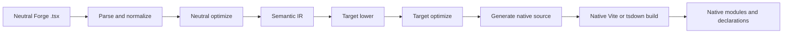
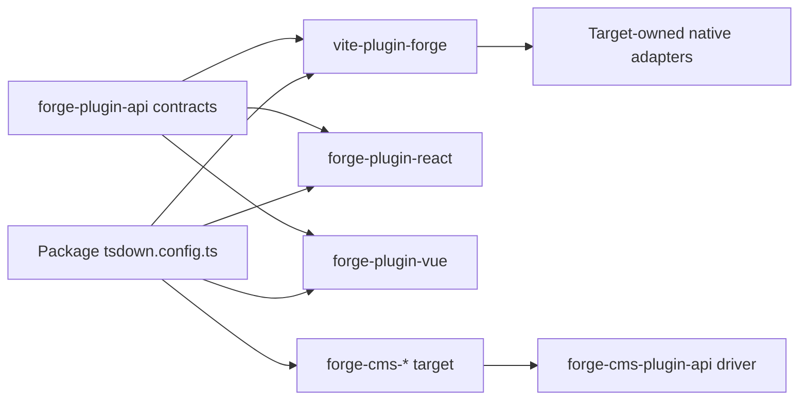
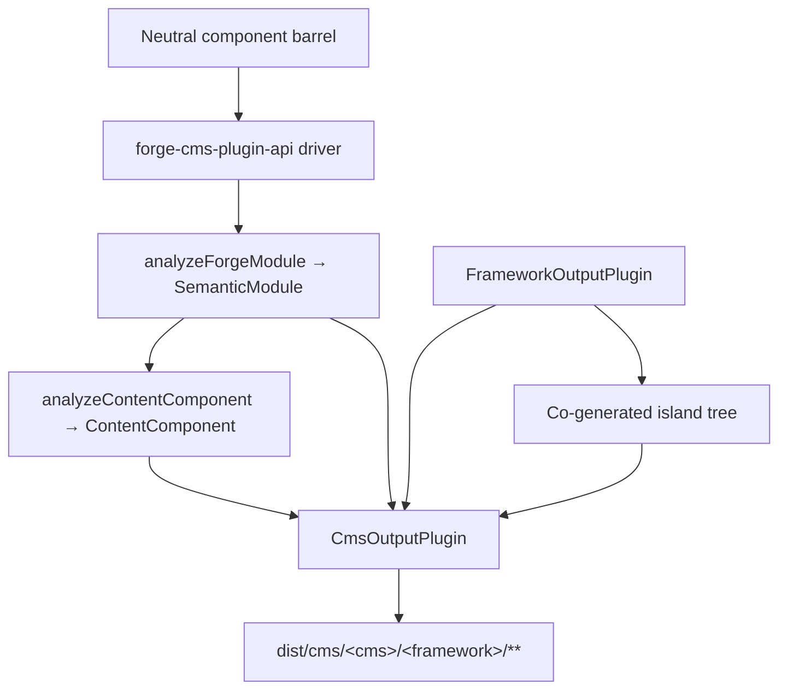

# Pipeline du compilateur Forge

Traduction assistée par machine à partir de la source anglaise canonique. À relire manuellement si besoin. Les noms de paquets, commandes, chemins et identifiants techniques restent inchangés.

> packages/tooling/vite/forge/docs/reference/compiler.md: [packages/tooling/vite/forge/docs/reference/compiler.md](../../../reference/compiler.md)
> Langue: Français (fr)

Il s'agit d'une explication de l'architecture destinée aux responsables de Mission Platform qui ont besoin de comprendre comment un framework neutre
Le module Forge devient un package framework natif. La limite importante n’est pas « un émetteur source par framework » à l’intérieur
le plugin Vite. Forge dispose d'un pilote de compilateur neutre, d'un contrat de plugin cible explicite et d'un framework natif appartenant au framework.
construire des adaptateurs.

## Le partage des responsabilités

La compilation Forge traverse plusieurs packages, chacun avec une responsabilité volontairement étroite :

| Couche                                               | Possède                                                                                                                                                       | Ne possède pas                                                                       |
| :--------------------------------------------------- | :------------------------------------------------------------------------------------------------------------------------------------------------------------ | :----------------------------------------------------------------------------------- |
| `@mission-platform/vite-plugin-forge`                | Analyse syntaxique, normalisation, analyse neutre, IR sémantique, optimisation partagée, cache/découverte, répartition et orchestration générique Vite/tsdown | React, Vue, Solid, Svelte, composants Web ou émetteurs de source CMS                 |
| `@mission-platform/forge-plugin-api`                 | `FrameworkOutputPlugin`, contrats cibles sémantiques, types de modules générés, métadonnées cibles et types d'adaptateurs Vite/tsdown                         | Un registre de mise en œuvre d'un cadre ou de sélection de cibles                    |
| Packages `@mission-platform/forge-plugin-*` intégrés | Abaissement de la cible, optimisation de la cible, génération de source, diagnostics de cible, métadonnées d'exécution et adaptateurs de build natifs         | Analyse neutre et orchestration multi-cibles                                         |
| `@mission-platform/forge-cms-plugin-api`             | `CmsOutputPlugin`, le modèle de contenu neutre, le pilote discover→analyse→emit→write, la cogénération d'îlot et les assistants de construction CMS           | Tout schéma, modèle ou forme de manifeste spécifique à la plate-forme                |
| Paquets `@mission-platform/forge-cms-*`              | Une plate-forme de contenu chacune : son mappage de champs, son dialecte de modèle, sa forme de manifeste et ses diagnostics de plate-forme                   | Classification d'accessoires neutres ou orchestration multi-cibles                   |
| Fichiers du package `tsdown.config.ts`               | Sélection des instances de plug-in cibles et des remplacements spécifiques au package                                                                         | Réimplémentation des étapes du compilateur ou des tables de commutation du framework |

La direction des dépendances est explicite : un package importe le plugin cible qu'il souhaite, transmet cette instance au neutre.
pilote et reçoit une configuration de build spécifique à la cible. Le pilote ne construit jamais de cible à partir d'une chaîne ou importe
chaque paquet-cadre juste au cas où cela serait nécessaire.

## Le pipeline strict

Le flux canonique est un front-end neutre unique suivi d’étapes appartenant à la cible et d’une version native. Chaque cible reçoit
les mêmes faits sémantiques ; il n'est pas nécessaire de reconstruire le module neutre à partir d'un fichier source généré.



### Analyser et normaliser

Le pilote lit TypeScript/JSX neutre et crée la représentation AST générique utilisée par le compilateur. Normalisation
résout les conventions de création neutres en faits stables : importations, directives, limites des composants et des hooks, nœuds JSX,
emplacements, marqueurs statiques et autres constructions dont les étapes ultérieures ont besoin. Les diagnostics sont collectés avec les emplacements sources
au lieu d'être caché dans un émetteur cible.

### Optimisation neutre et IR sémantique

Les passes neutres fonctionnent avant qu'un cadre ne soit impliqué. Ils peuvent découvrir des composants et des assistants, réécrire des importations, supprimer
directives du compilateur, déduire des clés stables, élaguer les branches mortes neutres et mettre en cache une analyse réutilisable. Le résultat est un
`SemanticModule` : une représentation explicite du composant ou du comportement composable du module et de ses faits neutres.

L'IR sémantique est le contrat entre le compilateur générique et un plugin cible. Le frontend conserve également l'original
analysé TypeScript `SourceFile` en tant que détail d'exécution non énumérable sur le module sémantique. Les émetteurs cibles peuvent consommer
cet arbre analysé partagé pour les feuilles sauvegardées par la source, mais ils ne doivent plus jamais appeler `parseTsx` sur la source du module. Ceci
maintient le cache sérialisable tout en garantissant que la source n'est analysée qu'une seule fois.

### Abaissement et optimisation de la cible

L'appelant fournit une instance `FrameworkOutputPlugin`. Le driver appelle sa fonction `lower` avec le module sémantique
et un `TargetContext`, produisant `TargetIntentions`. L'abaissement mappe les concepts neutres aux concepts cibles : par exemple,
les hooks et les slots neutres deviennent l'état/cycle de vie et la représentation des slots de la cible, tandis que les éléments neutres deviennent le
modèle d’élément ou de composant de la cible.

La fonction `optimize` du plugin effectue ensuite une simplification spécifique à la cible. Il reçoit les options neutres partagées
à côté d’un point d’extension pour les options de cible. Cela maintient les règles-cadres hors de l'optimiseur neutre tout en permettant une
target pour optimiser sa propre représentation générée avant la génération de la source.

### Génération de sources et compilation native

La fonction `generate` du plugin renvoie un `GeneratedModule`. Il peut inclure la source primaire, les modules auxiliaires et
diagnostic cible. La source générée est délibérément un artefact intermédiaire appartenant au package cible : React,
Vue, Solid, Svelte et les composants Web peuvent chacun choisir la forme source attendue par leur chaîne d'outils native.

L'étape finale n'est pas un autre émetteur Forge. L'adaptateur `build.vite` ou `build.tsdown` du plugin fournit le natif
plugins de framework et paramètres de construction pour l'arborescence générée. Compilation native Vite/Rolldown, génération de déclarations,
l’externalisation et l’empaquetage des résultats se produisent ensuite à l’aide de la chaîne d’outils normale de cette cible.

### Diagnostic et mise en cache

Les diagnostics contiennent la phase du compilateur, la cible, l'étendue de la source et une raison exploitable. Une cible doit signaler un message non pris en charge
sémantique node au lieu d'émettre silencieusement une fermeture d'exécution générique ou une source native invalide. Modules sémantiques neutres
sont mis en cache par contenu source, type de module et options affectant la sémantique ; les étapes cibles reçoivent le même cache
module pour chaque framework sélectionné tout en gardant l'abaissement et l'optimisation des objectifs indépendants.

## Cycle de vie des services et builds incrémentielles

Vite et les assistants tsdown utilisent un `ForgeCompilerService` en cours pendant toute la durée de vie d'une session de build. Le service possède
l'instantané source, le graphique, l'interface analysée, l'optimisation neutre, l'IR sémantique et les caches d'artefacts cibles. Il est sécuritaire de
servir plusieurs cibles explicites en séquence ou simultanément ; les artefacts cibles sont saisis par ID cible et ne partagent jamais un
répertoire généré. Les assistants ponctuels suppriment le service après la construction, tandis que les assistants de surveillance le conservent jusqu'à Vite.
le serveur se ferme.

Une clé de cache efficace comprend l'empreinte source, le type de module, les options du compilateur et du routeur, la racine source/config.
empreintes digitales, identifiant de cible et empreinte digitale du plugin, ainsi que les conditions pertinentes. Un fichier modifié invalide son graphe inverse
dépendants, y compris les composants transitifs et les entrées de hook, au lieu d'effacer les cibles non liées. `tsconfig.json`
`baseUrl` et `paths` sont inclus dans la préparation du graphique, de sorte que les alias sont résolus de manière cohérente dans les versions Vite et tsdown.
Appelez `invalidate(changedFiles)` à partir des intégrations de surveillance personnalisées et appelez `dispose()` lorsqu'un service n'est plus nécessaire.

Le rapport de service expose les timings de phase, les succès/échecs du cache, les fichiers invalidés, les avertissements, les erreurs et les artefacts émis.
compte. Les fichiers manquants, les extensions non prises en charge, les alias non résolus, les exportations mal formées et les erreurs de configuration cible sont
diagnostic structuré. Les avertissements parviennent au rapporteur de build ; les erreurs empêchent la génération et la promotion.

Chaque instantané cible possède un manifeste d'artefact répertoriant les modules générés, les modules supplémentaires, les déclarations, les cartes sources, les actifs,
entrées et sommes de contrôle. La promotion native valide que le manifeste est complet et ciblé avant de remplacer le
dernière sortie réussie. Une build ayant échoué, annulée ou expirée supprime uniquement son étape et préserve les cibles sœurs et
l'arborescence `dist` précédente.

La première implémentation est délibérément en cours car les plugins cibles contiennent des fonctions appartenant à l'appelant et des fonctionnalités natives.
adaptateurs. Un travailleur ou un transport/démon inter-processus peut être introduit ultérieurement derrière le même contrat de service ; ce n'est pas un
framework et n’est pas requis pour le flux de travail Vite/tsdown actuel.

## Propriété explicite de la cible

Les contrats centraux résident dans `packages/compiler/plugins/forge-plugin-api/src/framework.ts` :

- `FrameworkOutputPlugin` identifie une cible et possède `lower`, `optimize`, `generate` et `build`.
- `TargetContext` contient un contexte de construction générique tel que le type de module, le nom du composant et les dossiers de composants découverts.
- `TargetIntentions` encapsule le module sémantique après l'abaissement de la cible tout en conservant les diagnostics.
- `GeneratedModule` décrit la source générée, son langage de sortie, ses modules auxiliaires et ses diagnostics.
- `FrameworkBuildAdapters` fournit des adaptateurs Vite et tsdown typés indépendamment.
- `FrameworkSourceMetadata`, les éléments externes d'exécution et les métadonnées de nom d'affichage permettent à l'orchestration générique de dériver les détails de sortie
  sans instruction de commutation cible.

Les cibles intégrées sont construites par leurs propres packages, par exemple `forgeReactFramework()`, `forgeVueFramework()`,
`forgeSolidFramework()`, `forgeSvelteFramework()` et `forgeWebComponentsFramework()`. Un package sélectionne uniquement le
cibles qu'il publie :

```ts
import { defineTsdownForgeComponents } from '@mission-platform/vite-plugin-forge';
import { forgeReactFramework } from '@mission-platform/forge-plugin-react';
import { forgeSolidFramework } from '@mission-platform/forge-plugin-solid';
import { forgeSvelteFramework } from '@mission-platform/forge-plugin-svelte';
import { forgeVueFramework } from '@mission-platform/forge-plugin-vue';
import { forgeWebComponentsFramework } from '@mission-platform/forge-plugin-web-components';

export default defineTsdownForgeComponents({
  rootDir: import.meta.dirname,
  frameworks: [
    forgeVueFramework(),
    forgeReactFramework(),
    forgeSvelteFramework(),
    forgeSolidFramework(),
    forgeWebComponentsFramework(),
  ],
  componentsModule: `${import.meta.dirname}/src/components/index.ts`,
  name: 'MissionPlatformComponents',
});
```

## Applications de composants Web et `mp:web-component`

La cible des composants Web émet des éléments personnalisés enregistrés et constitue la version Forge sans framework utilisée par les documents statiques.
et d'autres consommateurs du DOM. Sélectionnez-le via la condition d'exportation partagée plutôt que d'importer un package spécifique à la cible
chemin ; cela maintient chaque importation `@mission-platform/*` cohérente et empêche Vue ou un autre environnement d'exécution de framework de
entrer dans le paquet :

```ts
import { defineConfig } from 'vite';
import { frameworkResolveConditions } from '@mission-platform/vite-config';

export default defineConfig({
  resolve: { conditions: frameworkResolveConditions('mp:web-component') },
});
```

Le préréglage TypeScript correspondant est `@mission-platform/typescript-config/framework-web-component` avec
`customConditions: ['mp:web-component']`. Les applications de navigateur peuvent utiliser l'historique natif du navigateur ; builds statiques/pré-rendu
doit fournir un historique de la mémoire et enregistrer les éléments pendant la passe de rendu. La prise du routeur et les éléments de liaison acceptent
les routes complexes ciblent en tant que propriétés et sont indépendantes du modèle de création de composants du compilateur Forge.

Les instances appartiennent à l'appelant. Les nouvelles instances peuvent contenir des options et des métadonnées spécifiques à la cible, ainsi qu'une liste de plugins vide.
est une erreur de configuration plutôt qu'une demande d'utilisation d'un registre par défaut masqué. Cela fait de l'ajout d'une nouvelle cible un
changement de package additif : implémentez le contrat du plugin de sortie, publiez ses adaptateurs de construction et sélectionnez-le dans les consommateurs.



Les flèches allant d'un consommateur vers le pilote et le package cible sont intentionnelles. Le consommateur est propriétaire de la sélection des cibles ;
le pilote possède une orchestration générique ; et chaque package cible possède l'implémentation du cadre.

## Constructions de composants

Les packages de composants créent des modules neutres par rapport à `@mission-platform/forge`, généralement via un baril de composants neutres.
`defineTsdownForgeComponents` crée une version cible pour chaque plugin fourni. Pour chaque cible, il :

1. analyse, normalise et analyse les modules de composants neutres ;
2. exécute des passes neutres et crée des modules sémantiques ;
3. invoque les étapes de réduction, d'optimisation et de génération du plugin sélectionné ;
4. écrit la source cible et les modules auxiliaires dans un cache spécifique à la cible ;
5. appelle les adaptateurs tsdown/Vite du plugin ;
6. émet le répertoire cible, les déclarations, les éléments externes d'exécution et les artefacts d'entrée de package.

La source neutre est partagée, mais les arbres et déclarations générés sont spécifiques à la cible. Un build Vue peut donc utiliser Vue
Outils de déclaration SFC et Vue, tandis qu'une build React peut utiliser les types natifs React JSX et React. La configuration du package peut
ajoutez toujours des remplacements d'appelant, une gestion CSS, des plugins de déclaration ou des options Vite spécifiques à la cible sans les déplacer
problèmes dans le compilateur générique.

## Constructions hook et composables

Les hooks sont des composables neutres plutôt que des composants d'interface utilisateur, mais utilisent la même limite de propriété cible explicite. Un crochet
le consommateur transmet un `FrameworkOutputPlugin` à `defineTsdownForgeHooks`. Le pilote générique analyse l'entrée neutre,
préserve les modules indépendants du framework lorsque cela est possible et envoie les modules dépendants de la cible via le protocole strict du plugin.
abaisser/optimiser/générer le chemin.

Le plugin sélectionné contrôle le langage de sortie du hook et l'adaptateur natif. Cela permet, par exemple, à une construction de hook React de
utilisez des importations compatibles React et une construction de hook Vue pour exposer le comportement basé sur Vue `Ref`, tandis que les modules utilitaires neutres restent
inchangé. Chaque cible reçoit ses propres déclarations de l'arborescence cible générée ; aucune déclaration partagée ne prétend que
tous les consommateurs de framework ont les mêmes types de hook.

## Projection CMS

La projection de composants sur une _plateforme de contenu_ est un axe orthogonal à l'abaissement du cadre, pas un cadre
implémentation cachée dans le pilote principal. Un composant devient un blok Storyblok, une île Astro, un partiel Ghost, un
Jekyll include, ou un composant de code Webflow - et chacun d'entre eux peut être associé à **n'importe quel** plugin de sortie de framework.
`storyblok × vue`, `astro × solid` et `ghost × web-components` sont donc une configuration plutôt qu'un nouveau code.

`@mission-platform/forge-cms-plugin-api` est propriétaire de cette couture. Il apporte trois choses :

1. **Un modèle de contenu neutre.** `analyzeContentComponent` mappe l'interface des accessoires d'un composant sur celle ordonnée.
   `ContentField`s avec un genre (`text`, `richtext`, `number`, `boolean`, `option`, `asset`, `link`, `children`), un JSDoc
   description, un indicateur obligatoire, une valeur littérale par défaut, des métadonnées d'emplacement et un indicateur `@cmsSetting`. Les accessoires de rappel sont supprimés
   et une union mélangeant des littéraux de chaîne avec `string`/`number` se dégrade en `text` — décidée une fois, donc chaque plateforme
   est d'accord. Lorsque l'IR sémantique est fourni, `ContentComponent.interactive` indique si le composant porte l'état,
   références, effets ou événements.
2. **Un contrat cible.** `CmsOutputPlugin` _compose_ un `FrameworkOutputPlugin` plutôt que d'en être un, et déclare le
   émetteurs `emitSchema`, `emitTemplate`, `emitManifest` et `emitEntry`. `defineForgeCmsPlugin` le valide à
   temps de configuration, y compris la restriction `supportedFrameworks` d'une cible.
3. **Un pilote générique et des aides à la construction.** `generateCmsArtifacts` découvre le canon neutre, obtient le numéro de chaque composant
   IR via `analyzeForgeModule`, analyse le modèle de contenu, appelle les émetteurs de la cible et écrit chaque retour.
   `CmsArtifact`. `defineTsdownForgeCms(All)` l'exécute dans un cache par cible et émet
   `dist/cms/<cms>/<framework>/**`, mettant en miroir les artefacts `asset: true` dans `dist/cms/<cms>/`.

Le pilote ne mappe jamais un identifiant de chaîne sur une cible : les consommateurs construisent et transmettent des instances, exactement comme ils le font pour
plugins de framework :

```ts
import { defineTsdownForgeCmsAll } from '@mission-platform/forge-cms-plugin-api';
import { forgeStoryblokCms } from '@mission-platform/forge-cms-storyblok';
import { forgeReactFramework } from '@mission-platform/forge-plugin-react';
import { forgeVueFramework } from '@mission-platform/forge-plugin-vue';

export default defineTsdownForgeCmsAll({
  rootDir: import.meta.dirname,
  targets: [
    forgeStoryblokCms({
      packageName: '@mission-platform/components',
      plugin: forgeReactFramework(),
      storyblokRuntime: '@storyblok/react',
    }),
    forgeStoryblokCms({
      packageName: '@mission-platform/components',
      plugin: forgeVueFramework(),
      storyblokRuntime: '@storyblok/vue',
    }),
  ],
  componentsModule: `${import.meta.dirname}/src/components/index.ts`,
});
```



### Les cibles

| Forfait                                 | Usine               | Émet                                                                                                  |
| :-------------------------------------- | :------------------ | :---------------------------------------------------------------------------------------------------- |
| `@mission-platform/forge-cms-storyblok` | `forgeStoryblokCms` | un objet composant par composant, un wrapper framework blok, `components.json`, une entrée typée      |
| `@mission-platform/forge-cms-astro`     | `forgeAstroCms`     | `.astro` statique ou un îlot `client:load`, plus un zod `content.config.ts`                           |
| `@mission-platform/forge-cms-ghost`     | `forgeGhostCms`     | Partiels de guidon plus un fragment de thème `config.custom`                                          |
| `@mission-platform/forge-cms-jekyll`    | `forgeJekyllCms`    | Le liquide comprend plus `_data/forge-components.yml` et un fragment `_config.yml`                    |
| `@mission-platform/forge-cms-webflow`   | `forgeWebflowCms`   | Déclarations de composants de code `declareComponent` plus un fragment de bibliothèque `webflow.json` |

Chaque mappage non pris en charge produit un `CompilerDiagnostic` avec une phase, un code et une raison exploitable plutôt qu'un
omission silencieuse - Ghost avertit sur les champs numériques et en cas de dépassement de son plafond de ~20, Webflow avertit lorsqu'un nombre
se dégrade en texte et Astro avertit lorsqu'un accessoire par défaut ne peut pas traverser la limite de l'île. Les avertissements sont enregistrés ; erreurs abandonner
la construction.

### Îles

Une cible qui déclare `island: 'framework'` (Astro, Webflow) a besoin d'un véritable composant d'exécution pour s'hydrater. Plutôt que
importer le sous-chemin `./vue` ou `./react` déjà construit du package hôte - ce qui ferait dépendre la sortie du CMS d'un autre
build ayant été exécuté en premier — le pilote exécute le **plug-in de framework lié** sur le même baril neutre dans un frère
`island/`, et le modèle émis importe un fichier qui lui appartient. L'île est compilée par le propre tsdown de ce plugin
mettre en scène des plugins dans la même version.

C'est pourquoi Astro est une cible CMS plutôt qu'un plugin de framework : il embarquait auparavant un îlot Vanilla-DOM roulé à la main.
runtime qui a réimplémenté l'état, les références, les effets et les événements de l'IR. Composer un plugin de framework signifie plutôt un
Le composant Astro interactif se comporte exactement comme le même composant dans toutes les autres versions.

## Où chercher lors du débogage

Tracez d'abord une build par responsabilité plutôt que par fichier généré :

1. **Entrée et diagnostics :** inspectez `packages/tooling/vite/forge/src/compiler/` pour l'analyse, la découverte, l'optimisation neutre,
   construction IR sémantique et agrégation de diagnostics.
2. **Comportement cible :** inspectez le package `forge-plugin-*` sélectionné et ses `lower`, `optimize`, `generate` et compilez
   implémentations d'adaptateur.
3. **Forme de construction générique :** inspectez `packages/tooling/vite/forge/src/generate.ts`, `generate-hooks.ts` et `tsdown.ts` pour le cache,
   comportement de sortie, de déclaration et de remplacement de l'appelant.
4. **Sortie CMS :** inspectez `packages/compiler/plugins/forge-cms-plugin-api/` pour le modèle de contenu, le pilote et la version
   helpers, puis la cible spécifique `packages/compiler/plugins/forge-cms-*` pour ses émetteurs et le mappage de la plateforme.
5. **Sélection du package :** inspectez le `tsdown.config.ts` du package consommateur et les dépendances directes `forge-plugin-*`.

Pour une build répétée ou surveillée, inspectez d'abord le `ForgeCompilationReport` : un faible taux de réussite pointe vers la source/config ou la cible
empreintes digitales, tandis qu'un grand ensemble de fichiers concernés pointe vers les bords du graphique ou la configuration de l'alias. Vérifiez le manifeste cible
avant d'inspecter la sortie du bundle natif ; il distingue un artefact généré manquant d'une erreur de compilation native.

La preuve la plus utile est la première étape défaillante et son diagnostic. Si l'IR sémantique est erroné, corrigez l'analyse neutre ou
analyse. Si l'IR est correct mais que la source native est erronée, corrigez le plugin cible sélectionné. Si la source générée est correcte
mais le regroupement échoue, inspectez l'adaptateur Vite/tsdown de ce plugin ou la configuration de remplacement du consommateur.

## Extension de Forge avec une cible

Pour ajouter une cible de cadre sans réintroduire la propriété centrale :

1. créer un package `forge-plugin-*` avec un retour d'usine `FrameworkOutputPlugin` ;
2. mettre en œuvre l'abaissement de `SemanticModule` aux intentions cibles ;
3. ajouter l'optimisation des cibles et la génération des sources, y compris les modules auxiliaires et les diagnostics ;
4. fournir les métadonnées de la source cible, les noms externes d'exécution et les adaptateurs Vite/tsdown ;
5. ajouter des tests ciblés pour les cas extrêmes sémantiques et les artefacts générés ;
6. ajoutez le plugin en tant que dépendance directe dans chaque package qui publie la cible ;
7. transmettez de nouvelles instances de plugin dans la configuration de construction de ce package.

N'ajoutez pas d'ID de framework à un registre dans `vite-plugin-forge`, n'importez pas un package de framework à partir du pilote neutre ou n'ajoutez pas
une branche spécifique à la cible vers l'analyse générique et l'orchestration des sorties. Le contrat est intentionnellement ouvert donc ciblez
les packages peuvent faire évoluer leur représentation source tandis que le pipeline neutre reste stable.

## Extension de Forge avec une cible CMS

L'ajout d'une plate-forme de contenu suit la même forme additive, une couche au-dessus :

1. créer un package `forge-cms-*` dépendant de `@mission-platform/forge-cms-plugin-api` ;
2. exporter une usine qui renvoie `defineForgeCmsPlugin({ id, framework, packageName, … })`, en prenant le plugin framework
   de l'appelant plutôt que d'en choisir un ;
3. implémentez `emitTemplate` et celui de `emitSchema`, `emitManifest` et `emitEntry` dont la plate-forme a besoin - un
   une plate-forme composée uniquement de modèles, telle que Ghost ou Jekyll, n'implémente que les deux premiers et le pilote écrit un espace réservé
   entrée;
4. mapper les `ContentFieldKind` neutres sur le vocabulaire de terrain de la plateforme en un seul endroit et pousser un
   `CompilerDiagnostic` pour chaque mappage que la plateforme ne peut pas représenter fidèlement ;
5. définissez `island: 'framework'` si la plateforme a besoin d'un runtime hydraté, et `supportedFrameworks` si elle accepte uniquement
   certains plugins de framework ;
6. ajoutez une spécification sur les appareils partagés exportés depuis `@mission-platform/forge-cms-plugin-api/fixtures`, afin que le nouveau
   la cible est exercée contre exactement les mêmes entrées que toutes les autres ;
7. ajoutez le package en tant que dépendance directe de chaque consommateur qui publie la cible et transmettez une nouvelle instance à
   `defineTsdownForgeCms`.

N'ajoutez pas de logique de classification d'accessoires à la cible : un correctif pour la gestion des unions, JSDoc, par défaut ou des emplacements appartient au
modèle de contenu partagé afin que chaque plate-forme en profite en même temps.

Pour la présentation du système de construction et l'orientation des dépendances à l'échelle de la plate-forme, voir [Construire un système](../../../../../../docs/locales/fr/build-system.md) et
[Architecture de la plateforme de mission](../../../../../../docs/locales/fr/architecture.md).
