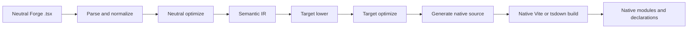
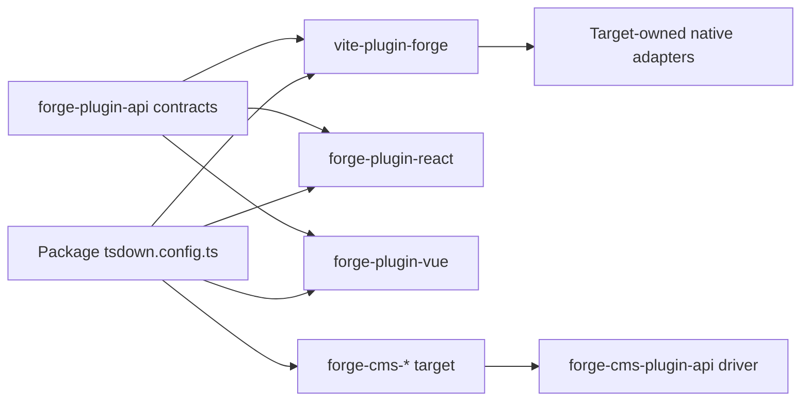
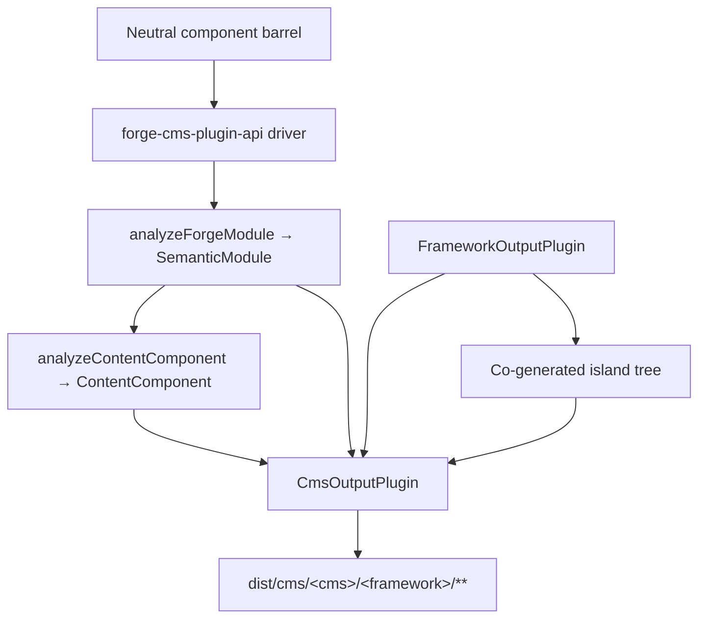

# Forge 컴파일러 파이프라인

정식 영어 원문을 기계 지원으로 번역한 문서입니다. 필요 시 사람이 검수하세요. 패키지 이름, 명령, 경로, 기술 식별자는 그대로 둡니다.

> packages/tooling/vite/forge/docs/reference/compiler.md: [packages/tooling/vite/forge/docs/reference/compiler.md](../../../reference/compiler.md)
> 언어: 한국어 (ko)

이는 프레임워크 중립적인 방법을 이해해야 하는 미션 플랫폼 관리자를 위한 아키텍처 설명입니다.
Forge 모듈은 기본 프레임워크 패키지가 됩니다. 중요한 경계는 내부의 "프레임워크당 하나의 소스 이미터"가 아닙니다.
Vite 플러그인. Forge에는 중립 컴파일러 드라이버, 명시적 대상 플러그인 계약 및 프레임워크 소유 네이티브가 있습니다.
어댑터를 빌드합니다.

## 책임 분할

Forge 컴파일은 의도적으로 제한된 책임을 맡은 여러 패키지에 걸쳐 있습니다.

| 레이어                                           | 소유                                                                                                         | 소유하지 않음                                                |
| :----------------------------------------------- | :----------------------------------------------------------------------------------------------------------- | :----------------------------------------------------------- |
| `@mission-platform/vite-plugin-forge`            | 구문 분석, 정규화, 중립 분석, 의미적 IR, 공유 최적화, 캐시/검색, 디스패치 및 일반 Vite/tsdown 오케스트레이션 | React, Vue, Solid, Svelte, 웹 구성 요소 또는 CMS 소스 이미터 |
| `@mission-platform/forge-plugin-api`             | `FrameworkOutputPlugin`, 의미 체계 대상 계약, 생성된 모듈 유형, 대상 메타데이터 및 Vite/tsdown 어댑터 유형   | 프레임워크 구현 또는 대상 선택 레지스트리                    |
| 내장형 `@mission-platform/forge-plugin-*` 패키지 | 대상 낮추기, 대상 최적화, 소스 생성, 대상 진단, 런타임 메타데이터 및 기본 빌드 어댑터                        | 중립 구문 분석 및 교차 대상 오케스트레이션                   |
| `@mission-platform/forge-cms-plugin-api`         | `CmsOutputPlugin`, 중립 콘텐츠 모델, 발견→분석→발산→쓰기 드라이버, 아일랜드 공동 생성 및 CMS 빌드 도우미     | 플랫폼별 스키마, 템플릿 또는 매니페스트 형태                 |
| `@mission-platform/forge-cms-*` 패키지           | 각각 하나의 콘텐츠 플랫폼: 필드 매핑, 템플릿 방언, 매니페스트 형태 및 플랫폼 진단                            | 중립 소품 분류 또는 교차 대상 오케스트레이션                 |
| `tsdown.config.ts` 파일 패키지                   | 대상 플러그인 인스턴스 및 패키지별 재정의 선택                                                               | 컴파일러 단계 또는 프레임워크 스위치 테이블 재구현           |

종속성 방향은 명시적입니다. 패키지는 원하는 대상 플러그인을 가져오고 해당 인스턴스를 중립에 전달합니다.
드라이버를 받고 타겟별 빌드 구성을 받습니다. 드라이버는 문자열에서 대상을 구성하거나 가져오지 않습니다.
필요한 경우를 대비해 모든 프레임워크 패키지.

## 엄격한 파이프라인

표준 흐름은 단일 중립 프런트 엔드와 대상 소유 단계 및 기본 빌드가 뒤따르는 것입니다. 각 대상은 수신
동일한 의미론적 사실; 생성된 소스 파일에서 중립 모듈을 재구성할 필요가 없습니다.



### 구문 분석 및 정규화

드라이버는 중립 TypeScript/JSX를 읽고 컴파일러에서 사용하는 일반 AST 표현을 생성합니다. 정규화
중립적인 작성 규칙을 안정적인 사실로 해결합니다: 가져오기, 지시문, 구성 요소 및 후크 경계, JSX 노드,
슬롯, 정적 마커 및 이후 단계에 필요한 기타 구성. 진단은 소스 위치와 함께 수집됩니다.
대상 이미 터에 숨겨지는 대신.

### 중립 최적화 및 의미적 IR

중립 패스는 프레임워크가 포함되기 전에 작동합니다. 구성요소와 도우미를 검색하고, 가져오기를 다시 작성하고, 제거할 수 있습니다.
컴파일러 지시어, 안정적인 키 추론, 중립 데드 브랜치 정리, 재사용 가능한 분석 캐시. 결과는
`SemanticModule`: 모듈의 구성 요소 또는 구성 가능한 동작과 중립 사실을 명시적으로 표현합니다.

의미론적 IR은 일반 컴파일러와 대상 플러그인 간의 계약입니다. 프런트엔드도 원본을 유지합니다.
TypeScript `SourceFile`을 의미 체계 모듈의 열거할 수 없는 런타임 세부 정보로 구문 분석했습니다. 타겟 이미터는 다음을 소비할 수 있습니다.
소스 지원 리프에 대한 공유 구문 분석 트리이지만 모듈 소스에서 `parseTsx`을 다시 호출해서는 안 됩니다. 이
소스가 한 번만 구문 분석되도록 하면서 캐시 직렬화를 유지합니다.

### 목표 하향 및 최적화

호출자는 `FrameworkOutputPlugin` 인스턴스를 제공합니다. 드라이버는 의미 모듈을 사용하여 `lower` 함수를 호출합니다.
`TargetContext`는 `TargetIntentions`을 생성합니다. 중립 개념을 대상 개념으로 낮추는 방법: 예를 들어,
중립 후크와 슬롯은 대상의 상태/라이프사이클 및 슬롯 표현이 되고 중립 요소는
대상의 요소 또는 구성 요소 모델.

그러면 플러그인의 `optimize` 기능이 대상별 단순화를 수행합니다. 공유 중립 옵션을 받습니다.
대상 옵션의 확장 지점과 함께. 이는 중립 최적화 프로그램에서 프레임워크 규칙을 유지하는 동시에 다음을 허용합니다.
소스 생성 전에 자체 생성된 표현을 최적화하는 타겟입니다.

### 소스 생성 및 네이티브 컴파일

플러그인의 `generate` 함수는 `GeneratedModule`을 반환합니다. 여기에는 기본 소스, 보조 모듈 및
표적 진단. 생성된 소스는 의도적으로 대상 패키지 React가 소유한 중간 아티팩트입니다.
Vue, Solid, Svelte 및 웹 구성 요소는 각각 기본 도구 체인이 기대하는 소스 형태를 선택할 수 있습니다.

마지막 단계는 또 다른 Forge 이미터가 아닙니다. 플러그인의 `build.vite` 또는 `build.tsdown` 어댑터는 기본
생성된 트리에 대한 프레임워크 플러그인 및 빌드 설정입니다. 네이티브 Vite/롤다운 컴파일, 선언 생성,
외부화 및 출력 패키징은 해당 대상의 일반 툴체인을 사용하여 발생합니다.

### 진단 및 캐싱

진단에는 컴파일러 단계, 대상, 소스 범위 및 실행 가능한 이유가 포함됩니다. 대상은 지원되지 않는 오류를 보고해야 합니다.
일반 런타임 클로저 또는 유효하지 않은 기본 소스를 자동으로 내보내는 대신 의미론적 node을 사용합니다. 중립 의미 모듈
소스 콘텐츠, 모듈 종류, 의미에 영향을 주는 옵션에 따라 캐시됩니다. 대상 단계는 동일한 캐시를 받습니다.
목표를 낮추고 최적화를 독립적으로 유지하면서 선택한 각 프레임워크에 대한 모듈을 제공합니다.

## 서비스 수명주기 및 증분 빌드

Vite 및 tsdown 도우미는 빌드 세션의 수명 동안 프로세스 내 `ForgeCompilerService` 하나를 사용합니다. 서비스가 소유한
소스 스냅샷, 그래프, 구문 분석된 프런트엔드, 중립 최적화, 의미론적 IR 및 대상 아티팩트 캐시. 그것은 안전하다
여러 명시적인 대상을 순차적으로 또는 동시에 제공합니다. 대상 아티팩트는 대상 ID로 입력되며 절대 공유하지 않습니다.
생성된 디렉토리 원샷 도우미는 빌드 후 서비스를 삭제하고, 감시 도우미는 Vite가 나올 때까지 서비스를 유지합니다.
서버가 닫힙니다.

효과적인 캐시 키에는 소스 지문, 모듈 종류, 컴파일러 및 라우터 옵션, 소스 루트/구성이 포함됩니다.
지문, 대상 ID 및 플러그인 지문 및 관련 조건. 변경된 파일은 역 그래프를 무효화합니다
관련되지 않은 대상을 지우는 대신 전이적 구성 요소 및 후크 항목을 포함한 종속 항목을 삭제합니다. `tsconfig.json`
`baseUrl` 및 `paths`는 그래프 준비에 포함되어 있으므로 별칭은 Vite 및 tsdown 빌드에서 일관되게 확인됩니다.
사용자 정의 감시 통합에서 `invalidate(changedFiles)`을 호출하고 서비스가 더 이상 필요하지 않은 경우 `dispose()`를 호출하십시오.

서비스 보고서에는 단계 타이밍, 캐시 적중/실패, 무효화된 파일, 경고, 오류 및 방출된 아티팩트가 표시됩니다.
중요합니다. 누락된 파일, 지원되지 않는 확장명, 해결되지 않은 별칭, 잘못된 내보내기 및 대상 구성 오류는 다음과 같습니다.
구조화된 진단. 경고는 빌드 보고자에게 전달됩니다. 오류가 발생하면 생성 및 승격이 방지됩니다.

모든 대상 스냅샷에는 생성된 모듈, 추가 모듈, 선언, 소스 맵, 자산을 나열하는 아티팩트 매니페스트가 있습니다.
항목 및 체크섬. 기본 프로모션은 매니페스트를 교체하기 전에 매니페스트가 완전하고 대상 범위인지 확인합니다.
마지막으로 성공한 출력. 실패, 취소 또는 시간 초과된 빌드는 해당 단계만 제거하고 형제 대상 및
이전 `dist` 트리.

대상 플러그인에는 호출자가 소유한 함수와 기본 기능이 포함되어 있으므로 첫 번째 구현은 의도적으로 진행 중입니다.
어댑터. 작업자 또는 크로스 프로세스 전송/데몬은 나중에 동일한 서비스 계약 뒤에 도입될 수 있습니다. 그것은 아니다
프레임워크 레지스트리이며 현재 Vite/tsdown 워크플로에는 필요하지 않습니다.

## 명시적인 대상 소유권

중앙 계약은 `packages/compiler/plugins/forge-plugin-api/src/framework.ts`에 있습니다:

- `FrameworkOutputPlugin`은 대상을 식별하고 `lower`, `optimize`, `generate` 및 `build`를 소유합니다.
- `TargetContext`는 모듈 종류, 구성 요소 이름 및 검색된 구성 요소 폴더와 같은 일반 빌드 컨텍스트를 전달합니다.
- `TargetIntentions`은 진단을 유지하면서 대상을 낮춘 후 의미 모듈을 래핑합니다.
- `GeneratedModule`은 생성된 소스, 해당 출력 언어, 보조 모듈 및 진단을 설명합니다.
- `FrameworkBuildAdapters`은 독립적인 유형의 Vite 및 tsdown 어댑터를 제공합니다.
- `FrameworkSourceMetadata`, 런타임 외부 및 표시 이름 메타데이터를 통해 일반 오케스트레이션에서 출력 세부 정보를 파생할 수 있습니다.
  대상 스위치 문 없이.

내장 대상은 자체 패키지로 구성됩니다(예: `forgeReactFramework()`, `forgeVueFramework()`,
`forgeSolidFramework()`, `forgeSvelteFramework()` 및 `forgeWebComponentsFramework()`. 패키지는 다음 항목만 선택합니다.
게시 대상:

```ts
import { defineTsdownForgeComponents } from '@mission-platform/vite-plugin-forge';
import { forgeReactFramework } from '@mission-platform/forge-plugin-react';
import { forgeSolidFramework } from '@mission-platform/forge-plugin-solid';
import { forgeSvelteFramework } from '@mission-platform/forge-plugin-svelte';
import { forgeVueFramework } from '@mission-platform/forge-plugin-vue';
import { forgeWebComponentsFramework } from '@mission-platform/forge-plugin-web-components';

export default defineTsdownForgeComponents({
  rootDir: import.meta.dirname,
  frameworks: [
    forgeVueFramework(),
    forgeReactFramework(),
    forgeSvelteFramework(),
    forgeSolidFramework(),
    forgeWebComponentsFramework(),
  ],
  componentsModule: `${import.meta.dirname}/src/components/index.ts`,
  name: 'MissionPlatformComponents',
});
```

## 웹 구성요소 애플리케이션 및 `mp:web-component`

웹 구성 요소 대상은 등록된 사용자 정의 요소를 내보내며 정적 문서에서 사용되는 프레임워크가 없는 Forge 빌드입니다.
및 기타 DOM 소비자. 대상별 패키지를 가져오는 것이 아닌 공유된 내보내기 조건을 통해 선택
경로; 이는 모든 `@mission-platform/*` 가져오기 일관성을 유지하고 Vue 또는 다른 프레임워크 런타임이
번들 입력:

```ts
import { defineConfig } from 'vite';
import { frameworkResolveConditions } from '@mission-platform/vite-config';

export default defineConfig({
  resolve: { conditions: frameworkResolveConditions('mp:web-component') },
});
```

일치하는 TypeScript 사전 설정은 `@mission-platform/typescript-config/framework-web-component`입니다.
`customConditions: ['mp:web-component']`. 브라우저 애플리케이션은 기본 브라우저 기록을 사용할 수 있습니다. 정적/사전 렌더링 빌드
렌더 패스 중에 메모리 기록을 제공하고 요소를 등록해야 합니다. 라우터 콘센트와 링크 요소는 허용됩니다.
복잡한 경로는 속성으로 대상이 되며 Forge 컴파일러의 구성 요소 작성 모델과 독립적입니다.

인스턴스는 호출자가 소유합니다. 새로운 인스턴스는 대상별 옵션 및 메타데이터와 빈 플러그인 목록을 전달할 수 있습니다.
숨겨진 기본 레지스트리를 사용하라는 요청이 아닌 구성 오류입니다. 이렇게 하면 새 대상을 추가할 수 있습니다.
추가 패키지 변경: 출력 플러그인 계약을 구현하고, 빌드 어댑터를 게시하고, 소비자에서 선택합니다.



소비자에서 드라이버와 대상 패키지로의 화살표는 의도적인 것입니다. 소비자는 목표 선택을 소유합니다.
드라이버는 일반 오케스트레이션을 소유합니다. 각 대상 패키지는 프레임워크 구현을 소유합니다.

## 구성요소 빌드

구성 요소 패키지는 일반적으로 중립 구성 요소 배럴을 통해 `@mission-platform/forge`에 대한 중립 모듈을 작성합니다.
`defineTsdownForgeComponents`은 제공된 각 플러그인에 대해 하나의 대상 빌드를 생성합니다. 각 대상에 대해 다음을 수행합니다.

1. 중립 구성 요소 모듈을 구문 분석, 정규화 및 분석합니다.
2. 중립 패스를 실행하고 의미 모듈을 생성합니다.
3. 선택한 플러그인의 낮추기, 최적화 및 생성 단계를 호출합니다.
4. 대상 특정 캐시에 대상 소스 및 보조 모듈을 씁니다.
5. 플러그인의 tsdown/Vite 어댑터를 호출합니다.
6. 대상 디렉터리, 선언, 런타임 외부 항목 및 패키지 항목 아티팩트를 내보냅니다.

중립 소스는 공유되지만 생성된 트리와 선언은 대상별로 다릅니다. 따라서 Vue 빌드는 Vue을 사용할 수 있습니다.
SFC 및 Vue 선언 도구, React 빌드는 React JSX 및 React 기본 유형을 사용할 수 있습니다. 패키지 구성은
호출자 재정의, CSS 처리, 선언 플러그인 또는 대상별 Vite 옵션을 이동하지 않고 계속 추가합니다.
일반 컴파일러에 대한 우려.

## 후크 및 구성 가능한 빌드

후크는 UI 구성요소가 아닌 중립 컴포저블이지만 동일한 명시적 대상 소유권 경계를 사용합니다. 후크
소비자는 하나의 `FrameworkOutputPlugin`을 `defineTsdownForgeHooks`에 전달합니다. 일반 드라이버는 중립 항목을 구문 분석합니다.
가능한 경우 프레임워크에 구애받지 않는 모듈을 유지하고 플러그인의 엄격한 모듈을 통해 대상 종속 모듈을 보냅니다.
경로 낮추기/최적화/생성.

선택한 플러그인은 후크 출력 언어와 기본 어댑터를 제어합니다. 예를 들어 React 후크 빌드를 허용합니다.
중립 유틸리티 모듈은 유지하면서 React 호환 가져오기 및 Vue 후크 빌드를 사용하여 Vue `Ref` 기반 동작을 노출합니다.
변함없이. 각 대상은 생성된 대상 트리에서 자체 선언을 받습니다. 공유 선언은 그런 척하지 않습니다
모든 프레임워크 소비자는 동일한 후크 유형을 갖습니다.

## CMS 프로젝션

*콘텐츠 플랫폼*에 구성 요소를 투영하는 것은 프레임워크가 아니라 프레임워크 낮추기와 직교하는 축입니다.
메인 드라이버 내부에 구현이 숨겨져 있습니다. 구성 요소는 Storyblok 블록, Astro Island, Ghost 부분,
Jekyll 포함 또는 Webflow 코드 구성 요소 — 그리고 각각은 **모든** 프레임워크 출력 플러그인과 쌍을 이룰 수 있습니다.
따라서 `storyblok × vue`, `astro × solid` 및 `ghost × web-components`는 새 코드가 아닌 구성입니다.

`@mission-platform/forge-cms-plugin-api`은 해당 솔기를 소유합니다. 이는 세 가지에 기여합니다.

1. **중립적인 콘텐츠 모델.** `analyzeContentComponent`은 구성 요소의 props 인터페이스를 주문된 항목에 매핑합니다.
   종류가 있는 `ContentField`s(`text`, `richtext`, `number`, `boolean`, `option`, `asset`, `link`, `children`), JSDoc
   설명, 필수 플래그, 리터럴 기본값, 슬롯 메타데이터 및 `@cmsSetting` 플래그. 콜백 소품이 삭제되었습니다.
   `string`/`number`와 통합 혼합 문자열 리터럴은 `text`으로 저하됩니다. — 한 번 결정되므로 모든 플랫폼
   동의합니다. 의미론적 IR이 제공되면 `ContentComponent.interactive`는 구성 요소가 상태를 전달하는지 여부를 보고합니다.
   심판, 효과 또는 이벤트.
2. **대상 계약.** `CmsOutputPlugin`는 하나가 아닌 `FrameworkOutputPlugin`을 *구성*하고 다음을 선언합니다.
   이미터 `emitSchema`, `emitTemplate`, `emitManifest` 및 `emitEntry`. `defineForgeCmsPlugin`이 이를 검증합니다.
   대상의 `supportedFrameworks` 제한을 포함한 구성 시간.
3. **일반 드라이버 및 빌드 도우미.** `generateCmsArtifacts`은 중립 배럴을 발견하고 각 구성 요소의
   `analyzeForgeModule`를 통한 IR, 콘텐츠 모델 분석, 대상의 이미터를 호출하고 반환된 모든 항목을 씁니다.
   `CmsArtifact`. `defineTsdownForgeCms(All)`은 이를 대상별 캐시로 실행하고 내보냅니다.
   `dist/cms/<cms>/<framework>/**`, `asset: true` 아티팩트를 `dist/cms/<cms>/`에 미러링합니다.

드라이버는 문자열 ID를 대상에 매핑하지 않습니다. 소비자는 인스턴스를 구성하고 전달하는 것과 똑같이 인스턴스를 전달합니다.
프레임워크 플러그인:

```ts
import { defineTsdownForgeCmsAll } from '@mission-platform/forge-cms-plugin-api';
import { forgeStoryblokCms } from '@mission-platform/forge-cms-storyblok';
import { forgeReactFramework } from '@mission-platform/forge-plugin-react';
import { forgeVueFramework } from '@mission-platform/forge-plugin-vue';

export default defineTsdownForgeCmsAll({
  rootDir: import.meta.dirname,
  targets: [
    forgeStoryblokCms({
      packageName: '@mission-platform/components',
      plugin: forgeReactFramework(),
      storyblokRuntime: '@storyblok/react',
    }),
    forgeStoryblokCms({
      packageName: '@mission-platform/components',
      plugin: forgeVueFramework(),
      storyblokRuntime: '@storyblok/vue',
    }),
  ],
  componentsModule: `${import.meta.dirname}/src/components/index.ts`,
});
```



### 목표

| 패키지                                  | 공장                | 방출                                                                               |
| :-------------------------------------- | :------------------ | :--------------------------------------------------------------------------------- |
| `@mission-platform/forge-cms-storyblok` | `forgeStoryblokCms` | 구성 요소당 구성 요소 개체, 프레임워크 블록 래퍼, `components.json`, 입력된 항목   |
| `@mission-platform/forge-cms-astro`     | `forgeAstroCms`     | 정적 `.astro` 또는 `client:load` 섬 및 zod `content.config.ts`                     |
| `@mission-platform/forge-cms-ghost`     | `forgeGhostCms`     | 핸들바 부분과 `config.custom` 테마 조각                                            |
| `@mission-platform/forge-cms-jekyll`    | `forgeJekyllCms`    | Liquid에는 `_data/forge-components.yml` 및 `_config.yml` 조각이 포함되어 있습니다. |
| `@mission-platform/forge-cms-webflow`   | `forgeWebflowCms`   | `declareComponent` 코드 구성 요소 선언 및 `webflow.json` 라이브러리 조각           |

지원되지 않는 모든 매핑은 단계, 코드 및 실행 가능한 이유가 포함된 `CompilerDiagnostic`을 생성합니다.
자동 누락 — Ghost는 숫자 필드에 대해 경고하고 최대 20개 설정 한도를 초과하면 Webflow는 숫자가 입력될 때 경고합니다.
텍스트로 저하되고 소품 기본값이 섬 경계를 넘을 수 없을 때 Astro에서 경고합니다. 경고가 기록됩니다. 오류 중단
빌드.

### 섬

`island: 'framework'`(Astro, Webflow)을 선언하는 대상에는 하이드레이트할 실제 런타임 구성 요소가 필요합니다. 보다는
호스트 패키지의 이미 빌드된 `./vue` 또는 `./react` 하위 경로 가져오기 - 이로 인해 CMS 출력이 다른 패키지에 종속됩니다.
먼저 실행된 빌드 — 드라이버는 동일한 중립 배럴을 통해 형제로 **바운드 프레임워크 플러그인**을 실행합니다.
`island/` 디렉터리이며 내보낸 템플릿은 자신이 소유한 파일을 가져옵니다. 섬은 해당 플러그인의 자체 tsdown으로 컴파일됩니다.
동일한 빌드에서 플러그인을 스테이지합니다.

Astro가 프레임워크 플러그인이 아닌 CMS 타겟인 이유는 다음과 같습니다. 이전에는 손으로 만든 바닐라 DOM 아일랜드를 출시했습니다.
IR의 상태, 참조, 효과 및 이벤트를 다시 구현한 런타임입니다. 대신 프레임워크 플러그인을 구성한다는 것은
대화형 Astro 구성 요소는 다른 모든 빌드의 동일한 구성 요소와 똑같이 작동합니다.

## 디버깅할 때 확인할 위치

먼저 생성된 파일이 아닌 책임별로 빌드를 추적합니다.

1. **입력 및 진단:** 구문 분석, 검색, 중립 최적화를 위해 `packages/tooling/vite/forge/src/compiler/`을 검사합니다.
   의미론적 IR 구성 및 진단 집계.
2. **대상 동작:** 선택한 `forge-plugin-*` 패키지와 해당 `lower`, `optimize`, `generate`를 검사하고 빌드합니다.
   어댑터 구현.
3. **일반 빌드 형태:** 캐시에 대해 `packages/tooling/vite/forge/src/generate.ts`, `generate-hooks.ts` 및 `tsdown.ts`을 검사합니다.
   출력, 선언 및 호출자 재정의 동작.
4. **CMS 출력:** 콘텐츠 모델, 드라이버 및 빌드에 대해 `packages/compiler/plugins/forge-cms-plugin-api/`을 검사합니다.
   헬퍼, 이미터 및 플랫폼 매핑을 위한 특정 `packages/compiler/plugins/forge-cms-*` 타겟입니다.
5. **패키지 선택:** 소비 패키지의 `tsdown.config.ts`을 검사하고 `forge-plugin-*` 종속성을 직접 검사합니다.

반복 또는 감시 빌드의 경우 `ForgeCompilationReport`을 먼저 검사하십시오. 적중률이 낮으면 소스/구성 또는 대상을 가리킵니다.
영향을 받는 큰 파일 세트는 그래프 가장자리 또는 별칭 구성을 가리킵니다. 대상 매니페스트 확인
네이티브 번들러 출력을 검사하기 전에 누락된 생성된 아티팩트와 기본 컴파일 오류를 구별합니다.

가장 유용한 증거는 첫 번째 실패 단계와 해당 진단입니다. 의미론적 IR이 잘못된 경우 중립 구문 분석을 수정하거나
분석. IR은 정확하지만 기본 소스가 잘못된 경우 선택한 대상 플러그인을 수정하세요. 생성된 소스가 맞는 경우
하지만 번들링이 실패하면 해당 플러그인의 Vite/tsdown 어댑터 또는 소비자 재정의 구성을 검사하세요.

## 대상으로 Forge 확장

중앙 소유권을 다시 도입하지 않고 프레임워크 대상을 추가하려면 다음 안내를 따르세요.

1. `FrameworkOutputPlugin`을 반환하는 팩토리를 사용하여 `forge-plugin-*` 패키지를 생성합니다.
2. `SemanticModule`에서 목표 의도로 낮추어 구현합니다.
3. 보조 모듈 및 진단을 포함한 타겟 최적화 및 소스 생성을 추가합니다.
4. 대상 소스 메타데이터, 런타임 외부 이름 및 Vite/tsdown 어댑터를 제공합니다.
5. 의미론적 엣지 케이스 및 생성된 아티팩트에 대한 집중 테스트를 추가합니다.
6. 대상을 게시하는 각 패키지에 플러그인을 직접 종속성으로 추가합니다.
7. 해당 패키지의 빌드 구성에 새로운 플러그인 인스턴스를 전달합니다.

`vite-plugin-forge`의 레지스트리에 프레임워크 ID를 추가하거나 중립 드라이버에서 프레임워크 패키지를 가져오거나 추가하지 마십시오.
일반 구문 분석 및 출력 조정에 대한 대상별 분기입니다. 계약은 의도적으로 열려 있으므로 대상
중립 파이프라인이 안정적으로 유지되는 동안 패키지는 소스 표현을 발전시킬 수 있습니다.

## CMS 대상으로 Forge 확장

콘텐츠 플랫폼을 추가하면 동일한 추가 형태를 따르며 한 레이어 위로 이동합니다.

1. `@mission-platform/forge-cms-plugin-api`에 따라 `forge-cms-*` 패키지를 생성합니다.
2. 프레임워크 플러그인을 사용하여 `defineForgeCmsPlugin({ id, framework, packageName, … })`를 반환하는 팩토리를 내보냅니다.
   하나를 선택하는 대신 발신자로부터;
3. `emitTemplate`과 `emitSchema`, `emitManifest`, `emitEntry` 중 플랫폼에 필요한 것을 구현합니다.
   Ghost 또는 Jekyll과 같은 템플릿 전용 플랫폼은 처음 두 개만 구현하고 드라이버는 자리 표시자를 작성합니다.
   입장;
4. 중립적인 `ContentFieldKind`을 플랫폼의 필드 어휘에 한 곳으로 매핑하고
   플랫폼이 충실하게 표현할 수 없는 모든 매핑에 대해 `CompilerDiagnostic`;
5. 플랫폼에 하이드레이션된 런타임이 필요한 경우 `island: 'framework'`를 설정하고, 허용하는 경우에만 `supportedFrameworks`을 설정합니다.
   일부 프레임워크 플러그인;
6. `@mission-platform/forge-cms-plugin-api/fixtures`에서 내보낸 공유 고정 장치에 사양을 추가하면 새
   목표는 다른 모든 입력과 정확히 동일한 입력에 대해 실행됩니다.
7. 대상을 게시하고 새 인스턴스를 전달하는 각 소비자의 직접 종속성으로 패키지를 추가합니다.
   `defineTsdownForgeCms`.

소품 분류 논리를 대상에 추가하지 마세요. 통합, JSDoc, 기본값 또는 슬롯 처리에 대한 수정 사항은
공유 콘텐츠 모델을 통해 모든 플랫폼이 동시에 혜택을 누릴 수 있습니다.

빌드 시스템 개요 및 플랫폼 전체 종속성 방향은 다음을 참조하세요. [시스템 구축](../../../../../../docs/locales/ko/build-system.md) 및
[미션 플랫폼 아키텍처](../../../../../../docs/locales/ko/architecture.md).
