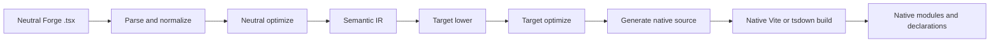
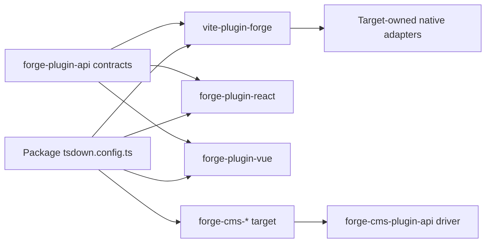
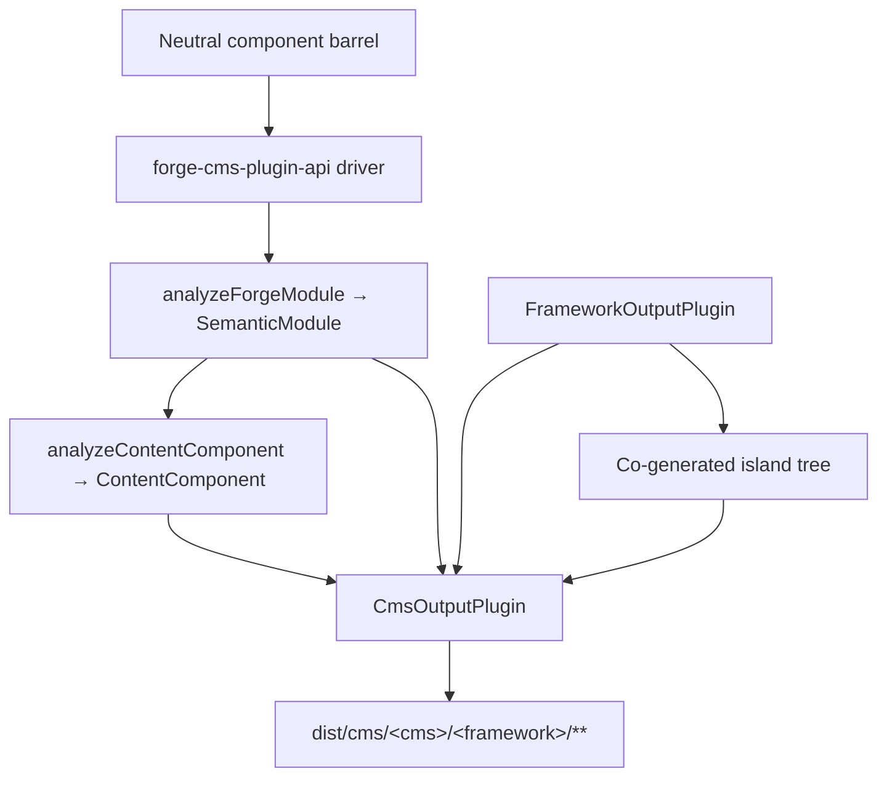

# Forge Compiler-pijplijn

Machineondersteunde vertaling van de canonieke Engelse bron. Handmatig nalezen indien nodig. Pakketnamen, opdrachten, paden en technische identificatoren blijven ongewijzigd.

> packages/tooling/vite/forge/docs/reference/compiler.md: [packages/tooling/vite/forge/docs/reference/compiler.md](../../../reference/compiler.md)
> Taal: Nederlands (nl)

Dit is een architectuurverklaring voor beheerders van Mission Platform die moeten begrijpen hoe een raamwerkneutraal is
Forge-module wordt een native framework-pakket. De belangrijke grens is niet “één bronzender per raamwerk” daarbinnen
de Vite-plug-in. Forge heeft een neutraal compilerstuurprogramma, een expliciet doelplug-incontract en native framework-eigendom
adapters bouwen.

## De verantwoordelijkheid splitste zich

Forge-compilatie omvat verschillende pakketten, elk met een opzettelijk beperkte verantwoordelijkheid:

| Laag                                                    | Eigenaar                                                                                                                                                   | Is geen eigenaar van                                                |
| :------------------------------------------------------ | :--------------------------------------------------------------------------------------------------------------------------------------------------------- | :------------------------------------------------------------------ |
| `@mission-platform/vite-plugin-forge`                   | Parsing, normalisatie, neutrale analyse, semantische IR, gedeelde optimalisatie, cache/ontdekking, verzending en generieke Vite/tsdown-orkestratie         | React, Vue, Solid, Svelte, webcomponenten of CMS-bronzenders        |
| `@mission-platform/forge-plugin-api`                    | `FrameworkOutputPlugin`, semantische doelcontracten, gegenereerde moduletypen, doelmetagegevens en Vite/tsdown-adaptertypen                                | Een raamwerkimplementatie of doelselectieregister                   |
| Ingebouwde `@mission-platform/forge-plugin-*`-pakketten | Doelverlaging, doeloptimalisatie, brongeneratie, doeldiagnostiek, runtime-metagegevens en native build-adapters                                            | Neutrale parsering en cross-target-orkestratie                      |
| `@mission-platform/forge-cms-plugin-api`                | `CmsOutputPlugin`, het neutrale inhoudsmodel, de driver voor ontdekken → analyseren → uitzenden → schrijven, eiland-cogeneratie en de CMS-bouwhulpmiddelen | Elk platformspecifiek schema, sjabloon of manifestvorm              |
| `@mission-platform/forge-cms-*`-pakketten               | Elk één inhoudsplatform: de veldtoewijzing, het sjabloondialect, de manifestvorm en de platformdiagnostiek                                                 | Neutrale propclassificatie of cross-target-orkestratie              |
| `tsdown.config.ts`-bestanden verpakken                  | Selecteren van de doelplug-ins en pakketspecifieke overschrijvingen                                                                                        | Opnieuw implementeren van compilerfasen of framework-switchtabellen |

De afhankelijkheidsrichting is expliciet: een pakket importeert de gewenste doelplug-in en geeft die instantie door aan de neutrale
driver, en ontvangt een doelspecifieke buildconfiguratie. De driver construeert nooit een doel uit een string of importeert
elk raamwerkpakket voor het geval dat nodig is.

## De strikte pijplijn

De canonieke stroom is een enkele neutrale front-end, gevolgd door podia die eigendom zijn van het doelwit en een native build. Elk doelwit ontvangt
dezelfde semantische feiten; het hoeft de neutrale module niet te reconstrueren op basis van een gegenereerd bronbestand.



### Parseer en normaliseer

Het stuurprogramma leest de neutrale TypeScript/JSX en creëert de generieke AST-representatie die door de compiler wordt gebruikt. Normalisatie
zet neutrale auteursconventies om in stabiele feiten: imports, richtlijnen, component- en hookgrenzen, JSX-knooppunten,
slots, statische markeringen en andere constructies die latere fasen nodig hebben. Diagnostiek wordt verzameld met bronlocaties
in plaats van verborgen te zijn in een doelzender.

### Neutrale optimalisatie en semantische IR

Neutrale passen werken voordat er een raamwerk bij betrokken is. Ze kunnen componenten en helpers ontdekken, importen herschrijven, strippen
compilerrichtlijnen, stabiele sleutels afleiden, neutrale dode takken snoeien en herbruikbare analyses in de cache opslaan. Het resultaat is een
`SemanticModule`: een expliciete weergave van het component- of samenstelbare gedrag van de module en de neutrale feiten ervan.

De semantische IR is het contract tussen de generieke compiler en een doelplug-in. De frontend behoudt ook het origineel
TypeScript `SourceFile` geparseerd als een niet-opsombaar runtimedetail op de semantische module. Doelzenders kunnen consumeren
die gedeelde geparseerde boom voor door de bron ondersteunde bladeren, maar ze mogen nooit meer `parseTsx` op de modulebron aanroepen. Dit
houdt de cache serialiseerbaar en zorgt ervoor dat de bron slechts één keer wordt geparseerd.

### Doelverlaging en optimalisatie

De aanroeper levert een exemplaar `FrameworkOutputPlugin`. Het stuurprogramma roept zijn functie `lower` aan met de semantische module
en een `TargetContext`, die `TargetIntentions` produceert. Verlagen brengt neutrale concepten in kaart met doelconcepten: bijvoorbeeld
neutrale hooks en slots worden de status/levenscyclus en slotrepresentatie van het doelwit, terwijl neutrale elementen de
het element- of componentenmodel van het doelwit.

De `optimize`-functie van de plug-in voert vervolgens doelspecifieke vereenvoudiging uit. Het ontvangt de gedeelde neutrale opties
naast een uitbreidingspunt voor doelopties. Dit houdt raamwerkregels buiten de neutrale optimizer, terwijl a
doel om de eigen gegenereerde representatie te optimaliseren vóór het genereren van de bron.

### Brongeneratie en native compilatie

De functie `generate` van de plug-in retourneert een `GeneratedModule`. Het kan de primaire bron, hulpmodules en
doeldiagnostiek. De gegenereerde broncode is opzettelijk een tussenproduct dat eigendom is van het doelpakket: React,
Vue, Solid, Svelte en Web Components kunnen elk de bronvorm kiezen die hun eigen toolchain verwacht.

De laatste fase is niet nog een Forge-zender. De `build.vite`- of `build.tsdown`-adapter van de plug-in levert de native
framework-plug-ins en build-instellingen voor de gegenereerde boom. Native Vite/Rolldown-compilatie, genereren van declaraties,
externalisatie en output-verpakking gebeuren dan met behulp van de normale toolchain van dat doel.

### Diagnostiek en caching

Diagnostiek omvat de compilerfase, het doel, de bronreeks en een bruikbare reden. Een doel moet een niet-ondersteund rapport melden
semantische node in plaats van stilletjes een generieke runtime-afsluiting of een ongeldige native bron uit te zenden. Neutrale semantische modules
worden in de cache opgeslagen op basis van broninhoud, moduletype en semantisch beïnvloedende opties; de doelfasen ontvangen dezelfde cache
module voor elk geselecteerd raamwerk, terwijl doelverlaging en optimalisatie onafhankelijk blijven.

## Servicelevenscyclus en incrementele builds

Vite- en tsdown-helpers gebruiken één in-process `ForgeCompilerService` voor de levensduur van een buildsessie. De dienst is eigenaar
de bronmomentopname, grafiek, geparseerde frontend, neutrale optimalisatie, semantische IR en doelartefactcaches. Het is veilig om
meerdere expliciete doelen na elkaar of gelijktijdig bedienen; doelartefacten worden gecodeerd op doel-ID en delen nooit een
gegenereerde map. One-shot-helpers verwijderen de service na de build, terwijl wachthelpers deze behouden tot de Vite
server sluit.

Een effectieve cachesleutel omvat de bronvingerafdruk, het moduletype, de compiler- en routeropties, source-root/config
vingerafdrukken, doel-ID en plug-invingerafdruk, en relevante voorwaarden. Een gewijzigd bestand maakt de omgekeerde grafiek ongeldig
afhankelijke items, inclusief transitieve componenten en hook-invoeren, in plaats van niet-gerelateerde doelen op te ruimen. `tsconfig.json`
`baseUrl` en `paths` zijn opgenomen in de grafiekvoorbereiding, zodat aliassen consistent worden opgelost in Vite en tsdown-builds.
Bel `invalidate(changedFiles)` vanuit aangepaste watch-integraties en bel `dispose()` wanneer een service niet langer nodig is.

Het servicerapport legt fasetimings, cachetreffers/-missers, ongeldige bestanden, waarschuwingen, fouten en uitgezonden artefacten bloot
telt. Ontbrekende bestanden, niet-ondersteunde extensies, onopgeloste aliassen, verkeerd ingedeelde exports en doelconfiguratiefouten zijn
gestructureerde diagnostiek. Waarschuwingen bereiken de bouwverslaggever; fouten voorkomen generatie en promotie.

Elke doelsnapshot heeft een artefactmanifest met een lijst van gegenereerde modules, extra modules, declaraties, bronkaarten, assets,
invoer en controlesommen. Native promotie valideert dat het manifest compleet en doelgericht is voordat het wordt vervangen
laatste succesvolle uitvoer. Bij een mislukte, geannuleerde of time-out-build wordt alleen het podium verwijderd en blijven de doelen van broers en zussen behouden
de vorige `dist`-structuur.

De eerste implementatie is bewust in-process omdat doelplug-ins functies van de beller en native bevatten
adapters. Een werker of cross-process transport/daemon kan later achter hetzelfde servicecontract worden geïntroduceerd; het is niet een
framework-register en is niet vereist voor de huidige Vite/tsdown-workflow.

## Expliciet doeleigendom

De centrale contracten staan ​​in `packages/compiler/plugins/forge-plugin-api/src/framework.ts`:

- `FrameworkOutputPlugin` identificeert een doelwit en is eigenaar van `lower`, `optimize`, `generate` en `build`.
- `TargetContext` bevat een generieke bouwcontext, zoals modulesoort, componentnaam en ontdekte componentmappen.
- `TargetIntentions` verpakt de semantische module na het verlagen van het doel, terwijl de diagnostiek behouden blijft.
- `GeneratedModule` beschrijft de gegenereerde bron, de uitvoertaal, hulpmodules en diagnostiek.
- `FrameworkBuildAdapters` biedt onafhankelijk getypeerde Vite- en tsdown-adapters.
- `FrameworkSourceMetadata`, externe runtime-instellingen en metagegevens van de weergavenaam zorgen ervoor dat generieke orkestratie uitvoerdetails kan afleiden
  zonder een doelschakelaarinstructie.

Ingebouwde doelen worden geconstrueerd door hun eigen pakketten, bijvoorbeeld `forgeReactFramework()`, `forgeVueFramework()`,
`forgeSolidFramework()`, `forgeSvelteFramework()` en `forgeWebComponentsFramework()`. Een pakket selecteert alleen de
doelstellingen die het publiceert:

```ts
import { defineTsdownForgeComponents } from '@mission-platform/vite-plugin-forge';
import { forgeReactFramework } from '@mission-platform/forge-plugin-react';
import { forgeSolidFramework } from '@mission-platform/forge-plugin-solid';
import { forgeSvelteFramework } from '@mission-platform/forge-plugin-svelte';
import { forgeVueFramework } from '@mission-platform/forge-plugin-vue';
import { forgeWebComponentsFramework } from '@mission-platform/forge-plugin-web-components';

export default defineTsdownForgeComponents({
  rootDir: import.meta.dirname,
  frameworks: [
    forgeVueFramework(),
    forgeReactFramework(),
    forgeSvelteFramework(),
    forgeSolidFramework(),
    forgeWebComponentsFramework(),
  ],
  componentsModule: `${import.meta.dirname}/src/components/index.ts`,
  name: 'MissionPlatformComponents',
});
```

## Web Components-applicaties en `mp:web-component`

Het Web Components-doel zendt geregistreerde aangepaste elementen uit en is de raamwerkvrije Forge-build die wordt gebruikt door statische documenten
en andere DOM-consumenten. Selecteer het via de gedeelde exportvoorwaarde in plaats van een doelspecifiek pakket te importeren
pad; Hierdoor blijft elke `@mission-platform/*`-import consistent en wordt voorkomen dat Vue of een andere framework-runtime
invoeren van de bundel:

```ts
import { defineConfig } from 'vite';
import { frameworkResolveConditions } from '@mission-platform/vite-config';

export default defineConfig({
  resolve: { conditions: frameworkResolveConditions('mp:web-component') },
});
```

De bijpassende TypeScript-voorinstelling is `@mission-platform/typescript-config/framework-web-component` met
`customConditions: ['mp:web-component']`. Browserapplicaties kunnen gebruik maken van de eigen browsergeschiedenis; statische/prerender-builds
zou geheugengeschiedenis en registerelementen moeten bieden tijdens de renderpass. De routeruitgang en verbindingselementen accepteren
complexe routedoelen als eigenschappen en zijn onafhankelijk van het component-auteurmodel van de Forge-compiler.

De exemplaren zijn eigendom van de beller. Nieuwe exemplaren kunnen doelspecifieke opties en metagegevens bevatten, en een lege plug-inlijst
is een configuratiefout in plaats van een verzoek om een verborgen standaardregister te gebruiken. Dit maakt het toevoegen van een nieuw doel een
Additionele pakketwijziging: implementeer het output-plugin-contract, publiceer de build-adapters en selecteer deze bij consumenten.



De pijlen van een consument naar zowel het driver- als het doelpakket zijn opzettelijk. De consument is eigenaar van de doelgroepselectie;
de bestuurder is eigenaar van generieke orkestratie; en elk doelpakket is eigenaar van de raamwerkimplementatie.

## Componenten bouwen

Componentpakketten schrijven neutrale modules tegen `@mission-platform/forge-jsx`, meestal via een neutraal componentenvat.
`defineTsdownForgeComponents` maakt één doelbuild voor elke meegeleverde plug-in. Voor elk doel geldt het volgende:

1. parseert, normaliseert en analyseert de neutrale componentmodules;
2. voert neutrale passen uit en creëert semantische modules;
3. roept de verlagings-, optimalisatie- en generatiefasen van de geselecteerde plug-in op;
4. schrijft doelbron- en hulpmodules naar een doelspecifieke cache;
5. roept de tsdown/Vite-adapters van de plug-in aan;
6. zendt de doelmap, declaraties, externe runtime-items en pakketinvoerartefacten uit.

De neutrale bron wordt gedeeld, maar de gegenereerde bomen en aangiften zijn doelspecifiek. Een Vue-build kan daarom Vue gebruiken
SFC- en Vue-declaratietools, terwijl een React-build React JSX- en React-native typen kan gebruiken. Pakketconfiguratie kan
voeg nog steeds caller-overrides, CSS-afhandeling, declaratieplug-ins of doelspecifieke Vite-opties toe zonder deze te verplaatsen
zorgen in de generieke compiler.

## Hook- en composable builds

Hooks zijn neutrale composables in plaats van UI-componenten, maar gebruiken dezelfde expliciete doeleigendomsgrens. Een haak
De consument geeft één `FrameworkOutputPlugin` door aan `defineTsdownForgeHooks`. De generieke bestuurder analyseert de neutrale invoer,
behoudt waar mogelijk raamwerk-agnostische modules en verzendt doelafhankelijke modules via de strikte plug-in
pad verlagen/optimaliseren/genereren.

De geselecteerde plug-in bestuurt de hook-uitvoertaal en de native adapter. Hierdoor kan bijvoorbeeld een React hook worden gebouwd
gebruik React-compatibele importbestanden en een Vue hook-build om Vue `Ref`-gebaseerd gedrag bloot te leggen, terwijl neutrale hulpprogrammamodules behouden blijven
onveranderd. Elk doel ontvangt zijn eigen verklaringen van de gegenereerde doelboom; geen enkele gedeelde verklaring beweert dat
alle raamwerkconsumenten hebben dezelfde haaktypes.

## CMS-projectie

Het projecteren van componenten op een _contentplatform_ is een as loodrecht op het verlagen van het raamwerk, niet een raamwerk
implementatie verborgen in de hoofddriver. Een component wordt een Storyblok-blok, een Astro-eiland, een Ghost-gedeelte, een
Jekyll bevat, of een Webflow-codecomponent - en elk daarvan kan worden gecombineerd met **elke** framework-uitvoerplug-in.
`storyblok × vue`, `astro × solid` en `ghost × web-components` zijn daarom configuratie in plaats van nieuwe code.

`@mission-platform/forge-cms-plugin-api` is eigenaar van die naad. Het draagt ​​drie dingen bij:

1. **Een neutraal inhoudsmodel.** `analyzeContentComponent` wijst de rekwisieteninterface van een component toe aan bestelde
   `ContentField`s met een soort (`text`, `richtext`, `number`, `boolean`, `option`, `asset`, `link`, `children`), een JSDoc
   beschrijving, een vereiste vlag, een letterlijke standaard, slotmetagegevens en een `@cmsSetting`-vlag. Callback-props worden verwijderd
   en een unie die letterlijke tekenreeksen mengt met `string`/`number` degradeert naar `text` - één keer besloten, dus elk platform
   is het daarmee eens. Wanneer de semantische IR wordt geleverd, rapporteert `ContentComponent.interactive` of de component de status draagt,
   refs, effecten of gebeurtenissen.
2. **Een doelcontract.** `CmsOutputPlugin` _stelt_ een `FrameworkOutputPlugin` samen in plaats van er één te zijn, en verklaart de
   zenders `emitSchema`, `emitTemplate`, `emitManifest` en `emitEntry`. `defineForgeCmsPlugin` valideert het op
   configuratietijd, inclusief de `supportedFrameworks`-beperking van een doel.
3. **Een generieke driver en bouwhulpjes.** `generateCmsArtifacts` ontdekt de neutrale loop, verkrijgt de
   IR via `analyzeForgeModule`, analyseert het inhoudsmodel, roept de zenders van het doel op en schrijft elke geretourneerde
   `CmsArtifact`. `defineTsdownForgeCms(All)` voert het uit in een cache per doel en verzendt het
   `dist/cms/<cms>/<framework>/**`, waarbij `asset: true`-artefacten worden gespiegeld in `dist/cms/<cms>/`.

Het stuurprogramma koppelt nooit een string-ID aan een doel; consumenten construeren en geven instances door, precies zoals zij dat doen
framework-plug-ins:

```ts
import { defineTsdownForgeCmsAll } from '@mission-platform/forge-cms-plugin-api';
import { forgeStoryblokCms } from '@mission-platform/forge-cms-storyblok';
import { forgeReactFramework } from '@mission-platform/forge-plugin-react';
import { forgeVueFramework } from '@mission-platform/forge-plugin-vue';

export default defineTsdownForgeCmsAll({
  rootDir: import.meta.dirname,
  targets: [
    forgeStoryblokCms({
      packageName: '@mission-platform/components',
      plugin: forgeReactFramework(),
      storyblokRuntime: '@storyblok/react',
    }),
    forgeStoryblokCms({
      packageName: '@mission-platform/components',
      plugin: forgeVueFramework(),
      storyblokRuntime: '@storyblok/vue',
    }),
  ],
  componentsModule: `${import.meta.dirname}/src/components/index.ts`,
});
```



### De doelen

| Pakket                                  | Fabriek             | Zendt uit                                                                                          |
| :-------------------------------------- | :------------------ | :------------------------------------------------------------------------------------------------- |
| `@mission-platform/forge-cms-storyblok` | `forgeStoryblokCms` | een componentobject per component, een frameworkblok-wrapper, `components.json`, een getypte entry |
| `@mission-platform/forge-cms-astro`     | `forgeAstroCms`     | statisch `.astro` of een `client:load` eiland, plus een zod `content.config.ts`                    |
| `@mission-platform/forge-cms-ghost`     | `forgeGhostCms`     | Stuurgedeelten plus een `config.custom`-themafragment                                              |
| `@mission-platform/forge-cms-jekyll`    | `forgeJekyllCms`    | Vloeistof bevat plus `_data/forge-components.yml` en een `_config.yml`-fragment                    |
| `@mission-platform/forge-cms-webflow`   | `forgeWebflowCms`   | `declareComponent`-codecomponentdeclaraties plus een `webflow.json`-bibliotheekfragment            |

Elke niet-ondersteunde mapping produceert een `CompilerDiagnostic` met een fase, een code en een bruikbare reden in plaats van een
stille weglating — Ghost waarschuwt voor numerieke velden en bij het overschrijden van de limiet van ~20, Webflow waarschuwt wanneer een getal
degradeert naar tekst, en Astro waarschuwt wanneer een standaard prop de eilandgrens niet kan overschrijden. Waarschuwingen worden geregistreerd; fouten worden afgebroken
de bouw.

### Eilanden

Een doel dat `island: 'framework'` (Astro, Webflow) declareert, heeft een echte runtime-component nodig om te hydrateren. In plaats van
het importeren van het reeds gebouwde `./vue`- of `./react`-subpad van het hostpakket - waardoor de CMS-uitvoer afhankelijk zou zijn van een ander
build eerst uitgevoerd: de driver voert de **gebonden framework-plug-in** over hetzelfde neutrale vat uit naar een broer of zus
`island/` map, en de verzonden sjabloon importeert een bestand waarvan het eigenaar is. Het eiland wordt samengesteld door de eigen tsdown van die plug-in
stage-plug-ins in dezelfde build.

Dit is de reden waarom Astro een CMS-doel is in plaats van een framework-plug-in: het leverde eerder een handgerold vanille-DOM-eiland
runtime die de status, refs, effecten en gebeurtenissen van de IR opnieuw implementeerde. Het samenstellen van een framework-plug-in betekent in plaats daarvan een
interactieve Astro-component gedraagt zich precies hetzelfde als dezelfde component in elke andere build.

## Waar u op moet letten bij het debuggen

Traceer een build eerst op verantwoordelijkheid in plaats van op gegenereerd bestand:

1. **Invoer en diagnostiek:** inspecteer `packages/tooling/vite/forge/src/compiler/` op parseren, ontdekken, neutrale optimalisatie,
   semantische IR-constructie en diagnostische aggregatie.
2. **Doelgedrag:** inspecteer het geselecteerde `forge-plugin-*`-pakket en de bijbehorende `lower`, `optimize`, `generate`, en bouw
   adapter-implementaties.
3. **Generieke buildvorm:** inspecteer `packages/tooling/vite/forge/src/generate.ts`, `generate-hooks.ts` en `tsdown.ts` op cache,
   uitvoer-, declaratie- en caller-override-gedrag.
4. **CMS-uitvoer:** inspecteer `packages/compiler/plugins/forge-cms-plugin-api/` op het inhoudsmodel, het stuurprogramma en de build
   helpers, en vervolgens het specifieke `packages/compiler/plugins/forge-cms-*`-doel voor de zenders en platformtoewijzing.
5. **Pakketselectie:** inspecteer de `tsdown.config.ts` van het verbruikende pakket en directe `forge-plugin-*`-afhankelijkheden.

Voor een herhaalde of bekeken build, inspecteer eerst de `ForgeCompilationReport`: een laag trefferpercentage wijst naar bron/configuratie of doel
vingerafdrukken, terwijl een groot getroffen bestand verwijst naar grafiekranden of aliasconfiguratie. Controleer het doelmanifest
voordat de oorspronkelijke bundeluitvoer wordt geïnspecteerd; het onderscheidt een ontbrekend gegenereerd artefact van een native compilatiefout.

Het nuttigste bewijs is de eerste falende fase en de diagnostiek ervan. Als semantische IR verkeerd is, herstel dan de neutrale parsering of
analyse. Als de IR correct is, maar de oorspronkelijke bron onjuist is, corrigeer dan de geselecteerde doelplug-in. Als de gegenereerde bron correct is
maar het bundelen mislukt, inspecteer dan de Vite/tsdown-adapter of de consumentenoverride-configuratie van die plug-in.

## Forge uitbreiden met een doelwit

Om een ​​kaderdoel toe te voegen zonder centraal eigenaarschap opnieuw in te voeren:

1. maak een `forge-plugin-*`-pakket met een door de fabriek geretourneerde `FrameworkOutputPlugin`;
2. verlaging implementeren van `SemanticModule` naar doelintenties;
3. doeloptimalisatie en brongeneratie toevoegen, inclusief hulpmodules en diagnostiek;
4. metagegevens van de doelbron, externe runtimenamen en Vite/tsdown-adapters verstrekken;
5. voeg gerichte tests toe voor semantische randgevallen en gegenereerde artefacten;
6. voeg de plug-in toe als een directe afhankelijkheid in elk pakket dat het doel publiceert;
7. nieuwe plugin-instances doorgeven in de build-configuratie van dat pakket.

Voeg geen raamwerk-ID toe aan een register in `vite-plugin-forge`, importeer geen raamwerkpakket van het neutrale stuurprogramma en voeg geen
een doelspecifieke aftakking naar generieke parsering en uitvoerorkestratie. Het contract is opzettelijk open, dus doelwit
pakketten kunnen hun bronrepresentatie evolueren terwijl de neutrale pijplijn stabiel blijft.

## Forge uitbreiden met een CMS-doel

Het toevoegen van een inhoudsplatform volgt dezelfde additieve vorm, één laag hoger:

1. maak een `forge-cms-*`-pakket afhankelijk van `@mission-platform/forge-cms-plugin-api`;
2. exporteer een fabriek die `defineForgeCmsPlugin({ id, framework, packageName, … })` retourneert, met behulp van de framework-plug-in
   van de beller in plaats van er één te kiezen;
3. `emitTemplate` implementeren, en welke van `emitSchema`, `emitManifest` en `emitEntry` het platform ook nodig heeft: een
   Een sjabloonplatform zoals Ghost of Jekyll implementeert alleen de eerste twee en de driver schrijft een tijdelijke aanduiding
   binnenkomst;
4. breng de neutrale `ContentFieldKind`'s op één plek in kaart in de veldvocabulaire van het platform en druk op een
   `CompilerDiagnostic` voor elke mapping die het platform niet getrouw kan weergeven;
5. stel `island: 'framework'` in als het platform een gehydrateerde runtime nodig heeft, en `supportedFrameworks` als het alleen
   enkele framework-plug-ins;
6. voeg een specificatie toe over de gedeelde armaturen die zijn geëxporteerd vanuit `@mission-platform/forge-cms-plugin-api/fixtures`, dus het nieuwe
   doel wordt uitgeoefend tegen precies dezelfde input als alle andere;
7. voeg het pakket toe als een directe afhankelijkheid van elke consument die het doel publiceert en geef er een nieuw exemplaar aan door
   `defineTsdownForgeCms`.

Voeg geen prop-classificatielogica toe aan het doel: een oplossing voor union-, JSDoc-, standaard- of slotafhandeling hoort thuis in de
gedeeld contentmodel, zodat elk platform er meteen van profiteert.

Zie voor het overzicht van het buildsysteem en de platformbrede afhankelijkheidsrichting [Bouw systeem](../../../../../../docs/locales/nl/build-system.md) en
[Missieplatformarchitectuur](../../../../../../docs/locales/nl/architecture.md).
