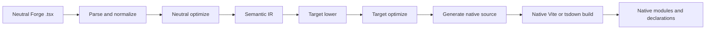
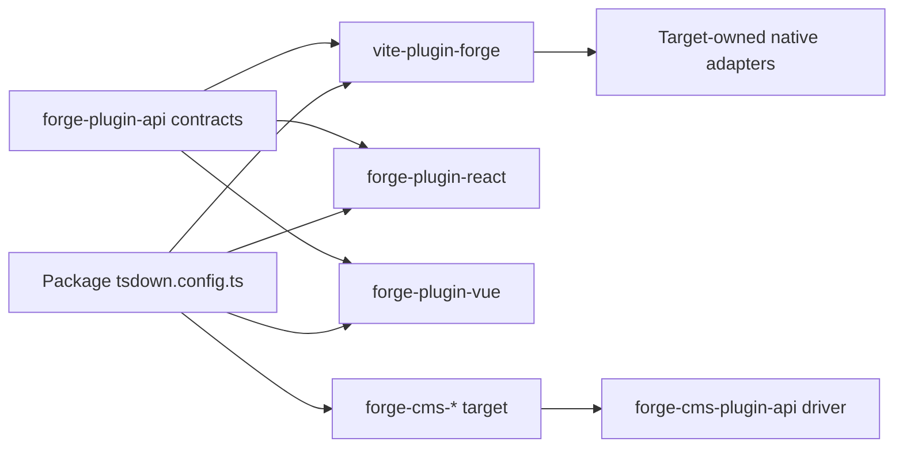
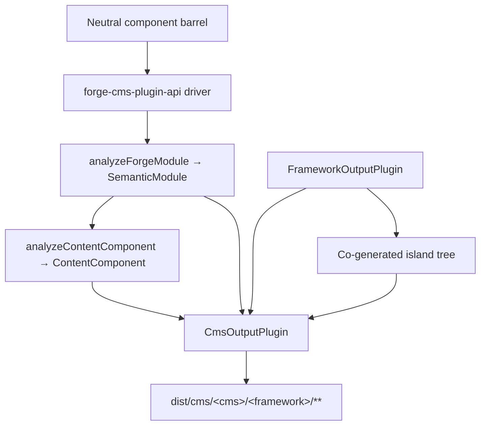

# صياغة خط أنابيب مترجم

ترجمة آلية مساعدة من المصدر الإنجليزي الأساسي. تُراجع يدويًا عند الحاجة. تبقى أسماء الحزم والأوامر والمسارات والمعرّفات التقنية دون تغيير.

> vite-plugins/forge/docs/reference/compiler.md: [vite-plugins/forge/docs/reference/compiler.md](../../../reference/compiler.md)
> اللغة: العربية (ar)

هذا هو شرح البنية لمشرفي Mission Platform الذين يحتاجون إلى فهم كيفية محايدة الإطار
تصبح وحدة Forge حزمة إطار عمل أصلية. الحدود المهمة ليست "باعث مصدر واحد لكل إطار" في الداخل
البرنامج المساعد Vite. لدى Forge برنامج تشغيل مترجم محايد، وعقد مكون إضافي مستهدف واضح، وموطن أصلي مملوك لإطار العمل
بناء محولات.

## انقسمت المسؤولية

تتقاطع مجموعة Forge مع العديد من الحزم، ولكل منها مسؤولية محدودة عن عمد:

| طبقة                                           | يملك                                                                                                                                               | لا يملك                                                      |
| :--------------------------------------------- | :------------------------------------------------------------------------------------------------------------------------------------------------- | :----------------------------------------------------------- |
| `@mission-platform/vite-plugin-forge`          | التحليل والتطبيع والتحليل المحايد والأشعة تحت الحمراء الدلالية والتحسين المشترك وذاكرة التخزين المؤقت/الاكتشاف والإرسال والتنسيق العام Vite/tsdown | React، Vue، Solid، Svelte، Web Components، أو بواعث مصدر CMS |
| `@mission-platform/forge-plugin-api`           | `FrameworkOutputPlugin`، العقود المستهدفة الدلالية، أنواع الوحدات التي تم إنشاؤها، البيانات التعريفية المستهدفة، وأنواع المحولات Vite/tsdown       | تنفيذ الإطار أو تسجيل اختيار الهدف                           |
| حزم `@mission-platform/forge-plugin-*` المدمجة | خفض الهدف، وتحسين الهدف، وإنشاء المصدر، وتشخيص الهدف، وبيانات تعريف وقت التشغيل، ومحولات البناء الأصلية                                            | التحليل المحايد والتنسيق عبر الأهداف                         |
| `@mission-platform/forge-cms-plugin-api`       | `CmsOutputPlugin`، نموذج المحتوى المحايد، اكتشاف → تحليل → إرسال → محرك الكتابة، التوليد المشترك للجزيرة، ومساعدي بناء CMS                         | أي مخطط أو قالب أو شكل بيان خاص بالمنصة                      |
| حزم `@mission-platform/forge-cms-*`            | منصة محتوى واحدة لكل منها: رسم الخرائط الميدانية ولهجة القالب وشكل البيان وتشخيص النظام الأساسي                                                    | تصنيف الدعامة المحايدة أو التنسيق عبر الأهداف                |
| حزمة ملفات `tsdown.config.ts`                  | تحديد مثيلات البرنامج المساعد الهدف والتجاوزات الخاصة بالحزمة                                                                                      | إعادة تنفيذ مراحل المترجم أو جداول تبديل الإطار              |

اتجاه التبعية واضح: تستورد الحزمة المكون الإضافي المستهدف الذي تريده، وتمرر هذا المثيل إلى الحياد
برنامج التشغيل، ويتلقى تكوين بناء خاص بالهدف. لا يقوم برنامج التشغيل أبدًا بإنشاء هدف من سلسلة أو عمليات استيراد
كل حزمة إطارية فقط في حالة الحاجة إليها.

## خط الأنابيب الصارم

التدفق الأساسي عبارة عن واجهة أمامية محايدة واحدة تليها مراحل مملوكة للهدف وبناء أصلي. يتلقى كل هدف
نفس الحقائق الدلالية. لا يحتاج إلى إعادة بناء الوحدة المحايدة من ملف مصدر تم إنشاؤه.



### تحليل وتطبيع

يقرأ برنامج التشغيل TypeScript/JSX المحايد ويقوم بإنشاء تمثيل AST العام الذي يستخدمه المترجم. التطبيع
يحل اصطلاحات التأليف المحايدة إلى حقائق ثابتة: الواردات، والتوجيهات، وحدود المكونات والربط، وعقد JSX،
الفتحات والعلامات الثابتة والبنيات الأخرى التي تحتاجها المراحل اللاحقة. يتم جمع التشخيصات مع مواقع المصدر
بدلا من أن تكون مخفية في باعث الهدف.

### التحسين المحايد والأشعة تحت الحمراء الدلالية

تعمل التمريرات المحايدة قبل مشاركة الإطار. يمكنهم اكتشاف المكونات والمساعدين، وإعادة كتابة الواردات، والتجريد
توجيهات المترجم، واستنتاج المفاتيح المستقرة، وتقليم الفروع الميتة المحايدة، وتحليل ذاكرة التخزين المؤقت القابلة لإعادة الاستخدام. والنتيجة هي أ
`SemanticModule`: تمثيل صريح لمكون الوحدة أو السلوك القابل للتركيب وحقائقه المحايدة.

IR الدلالي هو العقد بين المترجم العام والمكون الإضافي المستهدف. تحافظ الواجهة الأمامية أيضًا على النسخة الأصلية
تم تحليل TypeScript `SourceFile` كتفاصيل وقت تشغيل غير قابلة للتعداد في الوحدة الدلالية. قد تستهلك بواعث الهدف
تلك الشجرة التي تم تحليلها المشتركة للأوراق المدعومة بالمصدر، لكن يجب ألا يقوموا مطلقًا باستدعاء `parseTsx` على مصدر الوحدة النمطية مرة أخرى. هذا
يحافظ على إمكانية تسلسل ذاكرة التخزين المؤقت مع ضمان تحليل المصدر مرة واحدة فقط.

### خفض الهدف والتحسين

يوفر المتصل مثيل `FrameworkOutputPlugin`. يقوم برنامج التشغيل باستدعاء الدالة `lower` الخاصة به باستخدام الوحدة الدلالية
و`TargetContext`، لإنتاج `TargetIntentions`. خفض خرائط المفاهيم المحايدة إلى مفاهيم مستهدفة: على سبيل المثال،
تصبح الخطافات والفتحات المحايدة هي حالة/دورة حياة الهدف وتمثيل الفتحة، بينما تصبح العناصر المحايدة هي الحالة/دورة الحياة والفتحة
عنصر الهدف أو نموذج المكون.

تقوم وظيفة `optimize` الخاصة بالمكون الإضافي بعد ذلك بإجراء تبسيط خاص بالهدف. يتلقى الخيارات المحايدة المشتركة
بجانب نقطة تمديد لخيارات الهدف. يؤدي هذا إلى إبقاء قواعد إطار العمل خارج المُحسِّن المحايد مع السماح بـ
الهدف لتحسين التمثيل الذي تم إنشاؤه قبل إنشاء المصدر.

### توليد المصدر والتجميع الأصلي

تقوم وظيفة `generate` الخاصة بالمكون الإضافي بإرجاع `GeneratedModule`. ويمكن أن تشمل المصدر الأساسي، والوحدات المساعدة، و
التشخيص المستهدف. المصدر الذي تم إنشاؤه هو قطعة أثرية وسيطة مملوكة للحزمة المستهدفة: React،
يمكن لكل من Vue وSolid وSvelte وWeb Components اختيار شكل المصدر الذي تتوقعه سلسلة الأدوات الأصلية الخاصة بهم.

المرحلة النهائية ليست باعثًا آخر للتشكيل. يوفر محول `build.vite` أو `build.tsdown` الخاص بالمكون الإضافي
المكونات الإضافية لإطار العمل وإعدادات البناء للشجرة التي تم إنشاؤها. تجميع Vite/Rolldown الأصلي، وإنشاء الإعلان،
ويتم بعد ذلك الإضفاء الخارجي وتغليف المخرجات باستخدام سلسلة الأدوات العادية لذلك الهدف.

### التشخيص والتخزين المؤقت

تحمل التشخيصات مرحلة المترجم والهدف وامتداد المصدر وسببًا قابلاً للتنفيذ. يجب أن يقوم الهدف بالإبلاغ عن حالة غير مدعومة
node الدلالي بدلاً من إصدار إغلاق وقت تشغيل عام أو مصدر أصلي غير صالح بصمت. وحدات دلالية محايدة
يتم تخزينها مؤقتًا حسب محتوى المصدر ونوع الوحدة والخيارات المؤثرة على الدلالات؛ تتلقى المراحل المستهدفة نفس ذاكرة التخزين المؤقت
وحدة لكل إطار عمل محدد مع الحفاظ على استقلالية خفض الهدف وتحسينه.

## دورة حياة الخدمة والبنيات الإضافية

يستخدم مساعدا Vite وtsdown `ForgeCompilerService` قيد التشغيل طوال مدة جلسة الإنشاء. تمتلك الخدمة
لقطة المصدر، والرسم البياني، والواجهة الأمامية التي تم تحليلها، والتحسين المحايد، والأشعة تحت الحمراء الدلالية، وذاكرة التخزين المؤقت للعناصر المستهدفة. أنها آمنة ل
خدمة عدة أهداف واضحة بالتسلسل أو بالتزامن؛ يتم ربط القطع الأثرية المستهدفة بواسطة معرف الهدف ولا يتم مشاركة ملف
الدليل الذي تم إنشاؤه. يتخلص مساعدو اللقطة الواحدة من الخدمة بعد الإنشاء، بينما يحتفظ مساعدو المشاهدة بها حتى Vite
إغلاق الخادم.

يتضمن مفتاح التخزين المؤقت الفعال بصمة المصدر ونوع الوحدة وخيارات المترجم وجهاز التوجيه وجذر المصدر/التكوين
بصمات الأصابع ومعرف الهدف وبصمة البرنامج المساعد والشروط ذات الصلة. الملف الذي تم تغييره يبطل الرسم البياني العكسي الخاص به
التابعين، بما في ذلك المكونات المتعدية وإدخالات الخطاف، بدلاً من مسح الأهداف غير ذات الصلة. `tsconfig.json`
يتم تضمين `baseUrl` و`paths` في إعداد الرسم البياني، لذلك يتم حل الأسماء المستعارة بشكل متسق في إصدارات Vite وtsdown.
اتصل بـ `invalidate(changedFiles)` من عمليات تكامل المراقبة المخصصة واتصل بـ `dispose()` عندما لا تكون هناك حاجة إلى الخدمة.

يكشف تقرير الخدمة عن توقيتات المرحلة، وضربات/أخطاء ذاكرة التخزين المؤقت، والملفات التي تم إبطال صلاحيتها، والتحذيرات، والأخطاء، والعناصر المنبعثة
التهم. الملفات المفقودة، والملحقات غير المدعومة، والأسماء المستعارة التي لم يتم حلها، وعمليات التصدير المشوهة، وأخطاء تكوين الهدف
التشخيص المنظم. تصل التحذيرات إلى مراسل البناء؛ الأخطاء تمنع التوليد والترقية.

تحتوي كل لقطة مستهدفة على بيان قطعة أثرية يسرد الوحدات التي تم إنشاؤها، والوحدات الإضافية، والإعلانات، وخرائط المصدر، والأصول،
الإدخالات، والمجاميع الاختبارية. يتحقق الترويج الأصلي من اكتمال البيان ونطاقه المستهدف قبل استبدال
آخر إخراج ناجح. يؤدي البناء الفاشل أو الملغى أو المنقضي إلى إزالة مرحلته فقط ويحافظ على الأهداف والأخوة
شجرة `dist` السابقة.

التنفيذ الأول قيد التنفيذ عمدًا لأن المكونات الإضافية المستهدفة تحتوي على وظائف مملوكة للمتصل ووظائف أصلية
محولات. قد يتم تقديم البرنامج الخفي/العامل أو النقل عبر العمليات لاحقًا خلف نفس عقد الخدمة؛ انها ليست أ
سجل إطار العمل وهو غير مطلوب لسير العمل Vite/tsdown الحالي.

## ملكية الهدف الصريحة

العقود المركزية موجودة في `forge-plugins/forge-plugin-api/src/framework.ts`:

- يحدد `FrameworkOutputPlugin` هدفًا ويمتلك `lower` و`optimize` و`generate` و`build`.
- يحمل `TargetContext` سياق بناء عام مثل نوع الوحدة النمطية واسم المكون ومجلدات المكونات المكتشفة.
- يقوم `TargetIntentions` بتغليف الوحدة الدلالية بعد خفض الهدف مع الاحتفاظ بالتشخيصات.
- يصف `GeneratedModule` المصدر الذي تم إنشاؤه ولغة الإخراج والوحدات المساعدة والتشخيصات.
- يوفر `FrameworkBuildAdapters` محولات Vite وtsdown مكتوبة بشكل مستقل.
- يتيح `FrameworkSourceMetadata` والبيانات التعريفية لوقت التشغيل وبيانات تعريف اسم العرض للتنسيق العام استخلاص تفاصيل الإخراج
  بدون بيان التبديل الهدف.

يتم إنشاء الأهداف المضمنة بواسطة الحزم الخاصة بها، على سبيل المثال `forgeReactFramework()`، `forgeVueFramework()`،
`forgeSolidFramework()`، `forgeSvelteFramework()`، و`forgeWebComponentsFramework()`. الحزمة تختار فقط
الأهداف التي ينشرها:

```ts
import { defineTsdownForgeComponents } from '@mission-platform/vite-plugin-forge';
import { forgeReactFramework } from '@mission-platform/forge-plugin-react';
import { forgeSolidFramework } from '@mission-platform/forge-plugin-solid';
import { forgeSvelteFramework } from '@mission-platform/forge-plugin-svelte';
import { forgeVueFramework } from '@mission-platform/forge-plugin-vue';
import { forgeWebComponentsFramework } from '@mission-platform/forge-plugin-web-components';

export default defineTsdownForgeComponents({
  rootDir: import.meta.dirname,
  frameworks: [
    forgeVueFramework(),
    forgeReactFramework(),
    forgeSvelteFramework(),
    forgeSolidFramework(),
    forgeWebComponentsFramework(),
  ],
  componentsModule: `${import.meta.dirname}/src/components/index.ts`,
  name: 'MissionPlatformComponents',
});
```

## تطبيقات مكونات الويب و`mp:web-component`

يقوم هدف Web Components بإصدار عناصر مخصصة مسجلة وهو عبارة عن بنية Forge خالية من إطار العمل تستخدمها المستندات الثابتة
ومستهلكي DOM الآخرين. حدده من خلال شرط التصدير المشترك بدلاً من استيراد حزمة خاصة بالهدف
المسار؛ وهذا يحافظ على اتساق كل استيراد `@mission-platform/*` ويمنع Vue أو وقت تشغيل إطار عمل آخر من
دخول الحزمة:

```ts
import { defineConfig } from 'vite';
import { frameworkResolveConditions } from '@mission-platform/vite-config';

export default defineConfig({
  resolve: { conditions: frameworkResolveConditions('mp:web-component') },
});
```

الإعداد المسبق المطابق TypeScript هو `@mission-platform/typescript-config/framework-web-component`
`customConditions: ['mp:web-component']`. يمكن لتطبيقات المتصفح استخدام سجل المتصفح الأصلي؛ بنيات ثابتة/العرض المسبق
يجب أن يوفر محفوظات الذاكرة ويسجل العناصر أثناء عملية العرض. يقبل منفذ جهاز التوجيه وعناصر الارتباط
يستهدف المسار المعقد كخصائص وهو مستقل عن نموذج تأليف مكون برنامج التحويل البرمجي Forge.

المثيلات مملوكة للمتصل. يمكن أن تحمل المثيلات الجديدة خيارات وبيانات تعريفية خاصة بالهدف وقائمة مكونات إضافية فارغة
هو خطأ في التكوين وليس طلبًا لاستخدام سجل افتراضي مخفي. وهذا يجعل إضافة هدف جديد
تغيير الحزمة الإضافية: تنفيذ عقد البرنامج الإضافي للإخراج، ونشر محولات البناء الخاصة به، وتحديده لدى المستهلكين.



الأسهم من المستهلك إلى كل من برنامج التشغيل والحزمة المستهدفة مقصودة. يمتلك المستهلك اختيار الهدف؛
يمتلك السائق تزامنًا عامًا؛ وكل حزمة مستهدفة تمتلك تنفيذ الإطار.

## يبني المكون

تقوم حزم المكونات بتأليف وحدات محايدة مقابل `@mission-platform/forge`، عادةً من خلال أسطوانة مكون محايدة.
يقوم `defineTsdownForgeComponents` بإنشاء بنية مستهدفة واحدة لكل مكون إضافي متوفر. لكل هدف:

1. توزيع وتطبيع وتحليل الوحدات المكونة المحايدة؛
2. يدير تمريرات محايدة وينشئ وحدات دلالية؛
3. يستدعي مراحل التخفيض والتحسين والتوليد للمكون الإضافي المحدد؛
4. يكتب المصدر المستهدف والوحدات المساعدة إلى ذاكرة تخزين مؤقت خاصة بالهدف؛
5. يستدعي محولات tsdown/Vite الخاصة بالمكون الإضافي؛
6. يصدر الدليل الهدف، والإعلانات، والعناصر الخارجية لوقت التشغيل، وعناصر إدخال الحزمة.

المصدر المحايد مشترك، لكن الأشجار والإعلانات التي تم إنشاؤها تكون خاصة بالهدف. وبالتالي، يمكن للبنية Vue استخدام Vue
أدوات التصريح SFC وVue، بينما يمكن أن يستخدم إصدار React أنواع React JSX وReact الأصلية. يمكن تكوين الحزمة
الاستمرار في إضافة تجاوزات المتصل، أو معالجة CSS، أو المكونات الإضافية للإعلان، أو خيارات Vite الخاصة بالهدف دون نقل تلك
المخاوف في المترجم العام.

## خطاف وبنيات قابلة للتركيب

الخطافات عبارة عن مكونات محايدة وليست مكونات لواجهة المستخدم، ولكنها تستخدم نفس حدود ملكية الهدف الصريحة. خطاف
يقوم المستهلك بتمرير `FrameworkOutputPlugin` إلى `defineTsdownForgeHooks`. يقوم برنامج التشغيل العام بتوزيع الإدخال المحايد،
يحافظ على الوحدات الحيادية لإطار العمل حيثما أمكن، ويرسل الوحدات المعتمدة على الهدف من خلال الضوابط الصارمة للمكون الإضافي
خفض/تحسين/إنشاء المسار.

يتحكم البرنامج المساعد المحدد في لغة إخراج الخطاف والمحول الأصلي. يسمح هذا، على سبيل المثال، بإنشاء خطاف React
استخدم عمليات الاستيراد المتوافقة مع React وإنشاء خطاف Vue لكشف السلوك المستند إلى Vue `Ref`، مع بقاء وحدات الأداة المساعدة المحايدة
دون تغيير. يتلقى كل هدف إعلاناته الخاصة من شجرة الهدف التي تم إنشاؤها؛ ولا يوجد إعلان مشترك يدعي ذلك
جميع مستهلكي الإطار لديهم نفس أنواع الخطاف.

## إسقاط CMS

يعد عرض المكونات على _منصة المحتوى_ محورًا متعامدًا لخفض إطار العمل، وليس إطار عمل
تنفيذ مخفي داخل برنامج التشغيل الرئيسي. يصبح المكون عبارة عن Storyblok blok، أو Astro Island، أو Ghost جزئيًا، أو a
يتضمن Jekyll، أو مكون كود Webflow - ويمكن إقران كل منهما مع ** أي ** مكون إضافي لإخراج إطار العمل.
وبالتالي فإن `storyblok × vue` و`astro × solid` و`ghost × web-components` هي تكوينات وليست تعليمات برمجية جديدة.

يمتلك `@mission-platform/forge-cms-plugin-api` هذا التماس. يساهم بثلاثة أشياء:

1. **نموذج محتوى محايد.** يقوم `analyzeContentComponent` بتعيين واجهة عناصر المكون على الترتيب
   `ContentField`s بنوع (`text`، `richtext`، `number`، `boolean`، `option`، `asset`، `link`، `children`)، JSDoc
   الوصف، وعلامة مطلوبة، وافتراضي حرفي، وبيانات تعريف الفتحة، وعلامة `@cmsSetting`. تم إسقاط دعائم رد الاتصال
   ويتحلل اتحاد سلسلة المزج الحرفي مع `string`/`number` إلى `text` - يتم تحديده مرة واحدة، لذلك كل منصة
   يوافق. عندما يتم توفير IR الدلالي، يقوم `ContentComponent.interactive` بالإبلاغ عما إذا كان المكون يحمل الحالة،
   المراجع أو التأثيرات أو الأحداث.
2. **عقد مستهدف.** `CmsOutputPlugin` _يؤلف_ `FrameworkOutputPlugin` بدلاً من أن يكون واحدًا، ويعلن عن
   بواعث `emitSchema`، `emitTemplate`، `emitManifest`، و`emitEntry`. `defineForgeCmsPlugin` يتحقق من صحة ذلك في
   وقت التكوين، بما في ذلك تقييد `supportedFrameworks` الخاص بالهدف.
3. ** برنامج تشغيل عام ومساعدي بناء. ** يكتشف `generateCmsArtifacts` البرميل المحايد، ويحصل على معلومات كل مكون
   يقوم IR من خلال `analyzeForgeModule` بتحليل نموذج المحتوى واستدعاء بواعث الهدف وكتابة كل ما يتم إرجاعه
   `CmsArtifact`. يقوم `defineTsdownForgeCms(All)` بتشغيله في ذاكرة التخزين المؤقت لكل هدف وإصداره
   `dist/cms/<cms>/<framework>/**`، يعكس عناصر `asset: true` في `dist/cms/<cms>/`.

لا يقوم برنامج التشغيل أبدًا بتعيين معرف سلسلة على الهدف، حيث يقوم المستهلكون ببناء المثيلات وتمريرها، تمامًا كما يفعلون
ملحقات الإطار:

```ts
import { defineTsdownForgeCmsAll } from '@mission-platform/forge-cms-plugin-api';
import { forgeStoryblokCms } from '@mission-platform/forge-cms-storyblok';
import { forgeReactFramework } from '@mission-platform/forge-plugin-react';
import { forgeVueFramework } from '@mission-platform/forge-plugin-vue';

export default defineTsdownForgeCmsAll({
  rootDir: import.meta.dirname,
  targets: [
    forgeStoryblokCms({
      packageName: '@mission-platform/components',
      plugin: forgeReactFramework(),
      storyblokRuntime: '@storyblok/react',
    }),
    forgeStoryblokCms({
      packageName: '@mission-platform/components',
      plugin: forgeVueFramework(),
      storyblokRuntime: '@storyblok/vue',
    }),
  ],
  componentsModule: `${import.meta.dirname}/src/components/index.ts`,
});
```



### الأهداف

| Package                                 | مصنع                | ينبعث                                                                                      |
| :-------------------------------------- | :------------------ | :----------------------------------------------------------------------------------------- |
| `@mission-platform/forge-cms-storyblok` | `forgeStoryblokCms` | كائن مكون لكل مكون، مجمع كتلة الإطار، `components.json`، إدخال مكتوب                       |
| `@mission-platform/forge-cms-astro`     | `forgeAstroCms`     | `.astro` ثابت أو جزيرة `client:load`، بالإضافة إلى zod `content.config.ts`                 |
| `@mission-platform/forge-cms-ghost`     | `forgeGhostCms`     | أجزاء المقاود بالإضافة إلى جزء سمة `config.custom`                                         |
| `@mission-platform/forge-cms-jekyll`    | `forgeJekyllCms`    | يتضمن السائل بالإضافة إلى `_data/forge-components.yml` وجزء `_config.yml`                  |
| `@mission-platform/forge-cms-webflow`   | `forgeWebflowCms`   | إعلانات مكونات التعليمات البرمجية `declareComponent` بالإضافة إلى جزء مكتبة `webflow.json` |

ينتج عن كل تعيين غير مدعوم `CompilerDiagnostic` بمرحلة ورمز وسبب قابل للتنفيذ بدلاً من
الإغفال الصامت - يحذر Ghost من الحقول الرقمية وعند تجاوز الحد الأقصى البالغ 20 إعدادًا، يحذر Webflow عندما يكون هناك رقم
يتحلل إلى نص، ويحذر Astro عندما يتعذر على الدعامة الافتراضية عبور حدود الجزيرة. يتم تسجيل التحذيرات. إحباط الأخطاء
البناء.

### جزر

يحتاج الهدف الذي يعلن عن `island: 'framework'` (Astro، Webflow) إلى مكون وقت تشغيل حقيقي لترطيبه. بدلا من
استيراد المسار الفرعي `./vue` أو `./react` المبني بالفعل للحزمة المضيفة - مما قد يجعل مخرجات نظام إدارة المحتوى (CMS) تعتمد على مسار فرعي آخر
البناء بعد التشغيل أولاً - يقوم برنامج التشغيل بتشغيل **البرنامج الإضافي لإطار العمل المنضم** على نفس البرميل المحايد إلى أحد الأخوة
`island/`، ويقوم القالب المنبعث باستيراد الملف الذي يمتلكه. يتم تجميع الجزيرة بواسطة tsdown الخاص بهذا البرنامج المساعد
الإضافات المرحلة في نفس البنية.

هذا هو السبب في أن Astro هو هدف CMS وليس مكونًا إضافيًا لإطار العمل: لقد قام سابقًا بشحن جزيرة Vanilla-DOM ملفوفة يدويًا
وقت التشغيل الذي أعاد تنفيذ الحالة والمراجع والتأثيرات والأحداث من IR. إن إنشاء مكون إضافي لإطار العمل يعني بدلاً من ذلك
يتصرف مكون Astro التفاعلي تمامًا مثل نفس المكون في كل إصدار آخر.

## أين ننظر عند التصحيح

تتبع البناء حسب المسؤولية بدلاً من الملف الذي تم إنشاؤه أولاً:

1. **الإدخال والتشخيص:** فحص `vite-plugins/forge/src/compiler/` للتحليل والاكتشاف والتحسين المحايد،
   بناء الأشعة تحت الحمراء الدلالية، وتجميع التشخيص.
2. **السلوك المستهدف:** افحص الحزمة `forge-plugin-*` المحددة و`lower` و`optimize` و`generate` ثم قم بالبناء
   تطبيقات المحول.
3. **شكل البناء العام:** افحص `vite-plugins/forge/src/generate.ts` و`generate-hooks.ts` و`tsdown.ts` بحثًا عن ذاكرة التخزين المؤقت،
   الإخراج والإعلان وسلوك تجاوز المتصل.
4. **إخراج CMS:** افحص `forge-plugins/forge-cms-plugin-api/` لنموذج المحتوى وبرنامج التشغيل والبنية
   helpers، ثم الهدف `forge-plugins/forge-cms-*` المحدد للبواعث ورسم خرائط النظام الأساسي.
5. **اختيار الحزمة:** افحص تبعيات `tsdown.config.ts` و`forge-plugin-*` المباشرة للحزمة المستهلكة.

بالنسبة للإصدار المتكرر أو المشاهدة، افحص `ForgeCompilationReport` أولاً: يشير معدل الدخول المنخفض إلى المصدر/التكوين أو الهدف
بصمات الأصابع، بينما تشير مجموعة الملفات الكبيرة المتأثرة إلى حواف الرسم البياني أو تكوين الاسم المستعار. تحقق من بيان الهدف
قبل فحص مخرجات المجمع الأصلي؛ إنه يميز القطعة الأثرية المفقودة عن خطأ الترجمة الأصلي.

الدليل الأكثر فائدة هو مرحلة الفشل الأولى وتشخيصها. إذا كان IR الدلالي خاطئًا، فقم بإصلاح التحليل المحايد أو
التحليل. إذا كان IR صحيحًا ولكن المصدر الأصلي خاطئ، فقم بإصلاح المكون الإضافي المستهدف المحدد. إذا كان المصدر الذي تم إنشاؤه صحيحا
ولكن فشل التجميع، قم بفحص محول Vite/tsdown أو تكوين تجاوز المستهلك لهذا المكون الإضافي.

## تمديد صياغة مع الهدف

لإضافة هدف إطار عمل دون إعادة تقديم الملكية المركزية:

1. قم بإنشاء حزمة `forge-plugin-*` مع إرجاع المصنع `FrameworkOutputPlugin`؛
2. تنفيذ التخفيض من `SemanticModule` إلى النوايا المستهدفة؛
3. إضافة تحسين الهدف وتوليد المصدر، بما في ذلك الوحدات المساعدة والتشخيصات؛
4. توفير بيانات تعريف المصدر المستهدف، والأسماء الخارجية لوقت التشغيل، ومحولات Vite/tsdown؛
5. إضافة اختبارات مركزة لحالات الحافة الدلالية والتحف المولدة؛
6. إضافة البرنامج المساعد باعتباره تبعية مباشرة في كل حزمة تنشر الهدف؛
7. قم بتمرير مثيلات المكونات الإضافية الجديدة في تكوين بناء تلك الحزمة.

لا تقم بإضافة معرف إطار عمل إلى التسجيل في `vite-plugin-forge`، أو استيراد حزمة إطار عمل من برنامج التشغيل المحايد، أو إضافة
فرع خاص بالهدف للتحليل العام وتنسيق الإخراج. العقد مفتوح عمدا لذلك الهدف
يمكن للحزم أن تطور تمثيل مصدرها بينما يظل خط الأنابيب المحايد مستقرًا.

## توسيع Forge باستخدام هدف CMS

تتبع إضافة منصة محتوى نفس الشكل الإضافي، طبقة واحدة للأعلى:

1. قم بإنشاء حزمة `forge-cms-*` اعتمادًا على `@mission-platform/forge-cms-plugin-api`؛
2. قم بتصدير المصنع الذي يُرجع `defineForgeCmsPlugin({ id, framework, packageName, … })`، مع أخذ البرنامج الإضافي للإطار
   من المتصل بدلاً من اختيار واحد؛
3. قم بتنفيذ `emitTemplate`، وأيهما يحتاجه النظام الأساسي من `emitSchema` و`emitManifest` و`emitEntry` - أ
   يقوم النظام الأساسي للقالب فقط مثل Ghost أو Jekyll بتنفيذ أول اثنين فقط ويقوم السائق بكتابة عنصر نائب
   دخول؛
4. قم بتعيين `ContentFieldKind`s المحايدة على المفردات الميدانية الخاصة بالمنصة في مكان واحد، ثم اضغط على
   `CompilerDiagnostic` لكل تعيين لا يمكن للنظام الأساسي تمثيله بأمانة؛
5. قم بتعيين `island: 'framework'` إذا كان النظام الأساسي يحتاج إلى وقت تشغيل رطب، و`supportedFrameworks` إذا كان يقبل فقط
   بعض الإضافات الإطارية؛
6. قم بإضافة مواصفات على التركيبات المشتركة المصدرة من `@mission-platform/forge-cms-plugin-api/fixtures`، وبالتالي فإن الجديد
   يتم ممارسة الهدف ضد نفس المدخلات تمامًا مثل أي هدف آخر؛
7. أضف الحزمة باعتبارها تبعية مباشرة لكل مستهلك ينشر الهدف وتمرير مثيل جديد إليه
   `defineTsdownForgeCms`.

لا تقم بإضافة منطق تصنيف الدعامة إلى الهدف: ينتمي إصلاح الوحدة أو JSDoc أو الافتراضي أو معالجة الفتحة إلى
نموذج محتوى مشترك بحيث تستفيد كل منصة في وقت واحد.

للحصول على نظرة عامة على نظام البناء واتجاه التبعية على مستوى النظام الأساسي، راجع [بناء النظام](../../../../../../docs/locales/ar/build-system.md) و
[هندسة منصة المهمة](../../../../../../docs/locales/ar/architecture.md).
