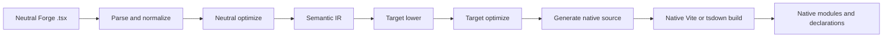
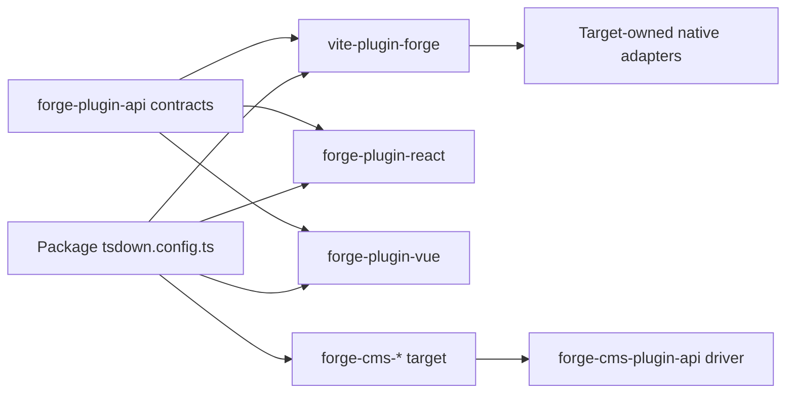
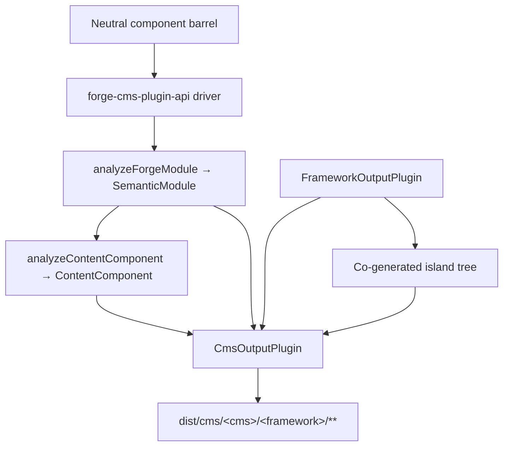

# Forge Compiler Pipeline

תרגום בסיוע מכונה מהמקור האנגלי הקנוני. יש לבדוק ידנית בעת הצורך. שמות חבילות, פקודות, נתיבים ומזהים טכניים נשארים ללא שינוי.

> vite-plugins/forge/docs/reference/compiler.md: [vite-plugins/forge/docs/reference/compiler.md](../../../reference/compiler.md)
> שפה: עברית (he)

זהו הסבר ארכיטקטורה לתחזקי פלטפורמת המשימה שצריכים להבין כיצד מסגרת ניטראלית
מודול Forge הופך לחבילת מסגרת מקורית. הגבול החשוב אינו "פולט מקור אחד לכל מסגרת" בפנים
התוסף Vite. ל-Forge יש מנהל התקן מהדר ניטרלי, חוזה פלגין יעד מפורש ומקור בבעלות מסגרת
לבנות מתאמים.

## פיצול האחריות

אוסף Forge חוצה מספר חבילות, שלכל אחת יש אחריות צרה במתכוון:

| שכבה                                             | בעל                                                                                                                   | אינו בעל                                                   |
| :----------------------------------------------- | :-------------------------------------------------------------------------------------------------------------------- | :--------------------------------------------------------- |
| `@mission-platform/vite-plugin-forge`            | ניתוח, נורמליזציה, ניתוח ניטרלי, IR סמנטי, אופטימיזציה משותפת, מטמון/גילוי, שיגור ותזמור Vite/tsdown גנרי             | React, Vue, Solid, Svelte, רכיבי אינטרנט או פולטי מקור CMS |
| `@mission-platform/forge-plugin-api`             | `FrameworkOutputPlugin`, חוזי יעד סמנטיים, סוגי מודול שנוצר, מטא נתונים של יעד וסוגי מתאמים Vite/tsdown               | רישום יישום מסגרת או בחירת יעד                             |
| חבילות `@mission-platform/forge-plugin-*` מובנות | הורדת יעדים, אופטימיזציה של יעדים, יצירת מקור, אבחון יעדים, מטא נתונים של זמן ריצה ומתאמי בנייה מקוריים               | ניתוח ניטרלי ותזמור חוצה יעדים                             |
| `@mission-platform/forge-cms-plugin-api`         | `CmsOutputPlugin`, מודל התוכן הנייטרלי, מנהל ההתקן של discover→analyse→emit→write, יצירת משותף באי, ועוזרים לבנות CMS | כל סכימה, תבנית או צורת מניפסט ספציפיים לפלטפורמה          |
| חבילות `@mission-platform/forge-cms-*`           | פלטפורמת תוכן אחת כל אחת: מיפוי שדות, ניב תבנית, צורת מניפסט ואבחון פלטפורמה                                          | סיווג אבזר ניטרלי או תזמור חוצה מטרות                      |
| חבילת קבצי `tsdown.config.ts`                    | בחירת מופעי הפלאגין היעד ועקיפות ספציפיות לחבילה                                                                      | יישום מחדש של שלבי מהדר או טבלאות מתג מסגרת                |

כיוון התלות הוא מפורש: חבילה מייבאת את תוסף היעד שהיא רוצה, מעבירה את המופע הזה לנייטרלי
מנהל התקן, ומקבל תצורת בנייה ספציפית ליעד. הדרייבר לעולם אינו בונה יעד ממחרוזת או מייבא
כל חבילת מסגרת למקרה הצורך.

## הצינור הקפדני

הזרימה הקנונית היא חזית נייטרלי אחת ואחריה שלבים בבעלות מטרה ומבנה מקורי. כל יעד מקבל
אותן עובדות סמנטיות; אין צורך לשחזר את המודול הנייטרלי מקובץ מקור שנוצר.



### לנתח ולנרמל

מנהל ההתקן קורא TypeScript/JSX ניטרלי ויוצר את ייצוג ה-AST הגנרי המשמש את המהדר. נורמליזציה
פותר מוסכמות יצירה ניטרליות לעובדות יציבות: יבוא, הנחיות, גבולות רכיבים והוק, צמתי JSX,
חריצים, סמנים סטטיים ושאר מבנים שדרושים בשלבים מאוחרים יותר. אבחון נאסף עם מיקומי מקור
במקום להיות מוסתר בפולט מטרה.

### אופטימיזציה ניטראלית ו-IR סמנטי

מעברים ניטרליים פועלים לפני מעורבות של מסגרת. הם יכולים לגלות רכיבים ועוזרים, לשכתב יבוא, להפשיט
הנחיות מהדר, להסיק מפתחות יציבים, לגזום ענפים מתים ניטרליים וניתוח לשימוש חוזר במטמון. התוצאה היא א
`SemanticModule`: ייצוג מפורש של רכיב המודול או ההתנהגות הניתנת לחיבור והעובדות הנייטרליות שלו.

ה-IR הסמנטי הוא החוזה בין המהדר הגנרי לבין תוסף יעד. החזית שומר גם על המקור
ניתוח TypeScript `SourceFile` כפרט זמן ריצה שאינו ניתן למספר במודול הסמנטי. פולטי מטרה עשויים לצרוך
אותו עץ מנותח משותף עבור עלים מגובים במקור, אך אסור להם לקרוא שוב `parseTsx` במקור המודול. זה
שומר את המטמון ניתן לסידרה תוך הבטחה שהמקור מנותח פעם אחת בלבד.

### הורדת יעד ואופטימיזציה

המתקשר מספק מופע `FrameworkOutputPlugin`. הדרייבר קורא לפונקציה `lower` שלו עם המודול הסמנטי
ו-`TargetContext`, המייצר `TargetIntentions`. הנמכה ממפה מושגים ניטרליים למושגי יעד: למשל,
ווים וחריצים ניטרליים הופכים למצב/מחזור החיים של המטרה וייצוג החריצים, בעוד שאלמנטים ניטרליים הופכים להיות
מודל האלמנט או הרכיב של המטרה.

פונקציית `optimize` של התוסף מבצעת פישוט ספציפי ליעד. הוא מקבל את האפשרויות הנייטרליות המשותפות
לצד נקודת הרחבה לאפשרויות יעד. זה מרחיק את כללי המסגרת מהאופטימיזציה הנייטרלית תוך אפשרות א
מטרה לבצע אופטימיזציה של הייצוג שנוצר בעצמו לפני יצירת המקור.

### יצירת מקורות וקומפילציה מקורית

הפונקציה `generate` של התוסף מחזירה `GeneratedModule`. זה יכול לכלול את המקור הראשי, מודולי עזר ו
אבחון מטרות. המקור שנוצר הוא בכוונה חפץ ביניים בבעלות חבילת היעד: React,
Vue, Solid, Svelte ו-Web Components יכולים כל אחד לבחור את צורת המקור שמצפה לו שרשרת הכלים המקורית שלו.

השלב האחרון הוא לא עוד פולט פורג'. מתאם `build.vite` או `build.tsdown` של התוסף מספק את המקור
תוספי מסגרת והגדרות בנייה עבור העץ שנוצר. אוסף Vite/Rolldown מקורי, יצירת הצהרות,
החצנה ואריזת פלט מתרחשות לאחר מכן באמצעות שרשרת הכלים הרגילה של אותו יעד.

### אבחון ושמירה במטמון

אבחון נושא את שלב המהדר, היעד, טווח המקור וסיבה ניתנת לפעולה. יעד חייב לדווח על לא נתמך
node סמנטי במקום לפלוט בשקט סגירת זמן ריצה גנרית או מקור מקורי לא חוקי. מודולים סמנטיים ניטרליים
מאוחסנים במטמון לפי תוכן מקור, סוג מודול ואפשרויות המשפיעות על סמנטיות; שלבי היעד מקבלים את אותו מטמון
מודול עבור כל מסגרת שנבחרה תוך שמירה על עצמאות הורדת יעד ואופטימיזציה.

## מחזור חיי שירות ובנייה מצטברת

עוזרי Vite ו-tsdown משתמשים ב-`ForgeCompilerService` אחד בתהליך למשך כל החיים של הפעלת בנייה. השירות הוא בבעלותו
תמונת המצב של המקור, הגרף, החזית המנתחת, אופטימיזציה ניטרלית, IR סמנטי ומטמונים של חפצי יעד. זה בטוח לעשות
לשרת מספר מטרות מפורשות ברצף או במקביל; חפצי יעד מקודדים לפי מזהה יעד ולעולם אינם חולקים א
ספרייה שנוצרה. עוזרים חד-פעמיים מפטרים את השירות לאחר הבנייה, בעוד שעוזרי שעונים שומרים עליו עד Vite
שרת נסגר.

מפתח מטמון יעיל כולל את טביעת האצבע של המקור, סוג המודול, אפשרויות המהדר והנתב, מקור-שורש/תצורה
טביעות אצבע, מזהה יעד וטביעת אצבע של תוסף, ותנאים רלוונטיים. קובץ שהשתנה מבטל את תוקף הגרף ההפוך שלו
תלויים, לרבות כניסות רכיבים טרנזיטיביים והוק, במקום ניקוי מטרות לא קשורות. `tsconfig.json`
`baseUrl` ו-`paths` כלולים בהכנת גרפים, כך שכינויים נפתרים באופן עקבי ב-Vite ו-tsdown.
התקשר ל-`invalidate(changedFiles)` מאינטגרציות של שעונים מותאמים אישית והתקשר ל-`dispose()` כאשר אין עוד צורך בשירות.

דוח השירות חושף תזמוני שלב, כניסות/החמצות של מטמון, קבצים לא חוקיים, אזהרות, שגיאות וחפץ שנפלט
נחשב. קבצים חסרים, הרחבות לא נתמכות, כינויים לא פתורים, ייצוא שגוי ושגיאות תצורת יעד הם
אבחון מובנה. אזהרות מגיעות לכתב הבנייה; שגיאות מונעות יצירה וקידום.

לכל תמונת מצב יש מניפסט חפץ המפרט מודולים שנוצרו, מודולים נוספים, הצהרות, מפות מקור, נכסים,
ערכים וסיכומי ביקורת. קידום מקורי מאמת שהמניפסט שלם ובהיקף יעד לפני החלפת
הפלט המוצלח האחרון. בנייה שנכשלה, בוטלה או קצוב זמן קצוב מסיר רק את השלב שלו ומשמר יעדי אחים ו
העץ `dist` הקודם.

ההטמעה הראשונה נמצאת בתהליך מכוון מכיוון שתוספי יעד מכילים פונקציות בבעלות מתקשר ומקוריות
מתאמים. עובד או הובלה/דמון חוצה תהליכים עשויים להיות מוצגים מאוחר יותר מאחורי אותו חוזה שירות; זה לא א
ה-framework registry ואינו נדרש עבור זרימת העבודה הנוכחית של Vite/tsdown.

## בעלות על יעד מפורש

החוזים המרכזיים חיים ב-`forge-plugins/forge-plugin-api/src/framework.ts`:

- `FrameworkOutputPlugin` מזהה יעד ובבעלותו `lower`, `optimize`, `generate` ו-`build`.
- `TargetContext` נושא הקשר בנייה גנרי כגון סוג מודול, שם רכיב ותיקיות רכיבים שהתגלו.
- `TargetIntentions` עוטף את המודול הסמנטי לאחר הורדת יעד תוך שמירה על אבחון.
- `GeneratedModule` מתאר מקור שנוצר, שפת הפלט שלו, מודולי עזר ואבחון.
- `FrameworkBuildAdapters` מספק מתאמי Vite ו-tsdown המוקלדים באופן עצמאי.
- `FrameworkSourceMetadata`, רכיבים חיצוניים של זמן ריצה ומטא נתונים של שם תצוגה מאפשרים לתזמור גנרי לגזור פרטי פלט
  ללא הצהרת מתג יעד.

יעדים מובנים בנויים על ידי חבילות משלהם, למשל `forgeReactFramework()`, `forgeVueFramework()`,
`forgeSolidFramework()`, `forgeSvelteFramework()` ו-`forgeWebComponentsFramework()`. חבילה בוחרת רק את
יעדים שהוא מפרסם:

```ts
import { defineTsdownForgeComponents } from '@mission-platform/vite-plugin-forge';
import { forgeReactFramework } from '@mission-platform/forge-plugin-react';
import { forgeSolidFramework } from '@mission-platform/forge-plugin-solid';
import { forgeSvelteFramework } from '@mission-platform/forge-plugin-svelte';
import { forgeVueFramework } from '@mission-platform/forge-plugin-vue';
import { forgeWebComponentsFramework } from '@mission-platform/forge-plugin-web-components';

export default defineTsdownForgeComponents({
  rootDir: import.meta.dirname,
  frameworks: [
    forgeVueFramework(),
    forgeReactFramework(),
    forgeSvelteFramework(),
    forgeSolidFramework(),
    forgeWebComponentsFramework(),
  ],
  componentsModule: `${import.meta.dirname}/src/components/index.ts`,
  name: 'MissionPlatformComponents',
});
```

## יישומי רכיבי אינטרנט ו-`mp:web-component`

היעד של רכיבי הרשת פולט רכיבים מותאמים אישית רשומים והוא ה-Forge build ללא מסגרת המשמש מסמכים סטטיים
וצרכני DOM אחרים. בחר אותו באמצעות תנאי הייצוא המשותף במקום לייבא חבילה ספציפית ליעד
נתיב; זה שומר על עקביות של כל ייבוא `@mission-platform/*` ומונע מ-Vue או זמן ריצה אחר של מסגרת
נכנסים לחבילה:

```ts
import { defineConfig } from 'vite';
import { frameworkResolveConditions } from '@mission-platform/vite-config';

export default defineConfig({
  resolve: { conditions: frameworkResolveConditions('mp:web-component') },
});
```

ההגדרה המוגדרת מראש של TypeScript היא `@mission-platform/typescript-config/framework-web-component` עם
`customConditions: ['mp:web-component']`. יישומי דפדפן יכולים להשתמש בהיסטוריית דפדפן מקורית; בנייה סטטית/עיבוד מראש
צריך לספק היסטוריית זיכרון ולרשום אלמנטים במהלך העיבוד. רכיבי השקע והקישור של הנתב מקבלים
יעדי מסלול מורכבים כמאפיינים ואינם תלויים במודל עריכת הרכיבים של Forge.

המופעים הם בבעלות המתקשר. מופעים טריים יכולים לשאת אפשרויות ומטא נתונים ספציפיים ליעד, ורשימת תוספים ריקה
הוא שגיאת תצורה ולא בקשה להשתמש ברישום ברירת מחדל נסתר. זה הופך את הוספת יעד חדש ל-an
שינוי חבילת תוסף: יישם את חוזה הפלט-פלאגין, פרסם את מתאמי הבנייה שלו ובחר אותו בצרכנים.



החצים מצרכן הן לחבילת הנהג והן לחבילת היעד הם מכוונים. הצרכן הוא הבעלים של בחירת יעד;
הנהג הוא הבעלים של תזמור גנרי; וכל חבילת יעד היא הבעלים של יישום המסגרת.

## בונה רכיבים

רכיב חבילות מחבר מודולים ניטרליים כנגד `@mission-platform/forge`, בדרך כלל דרך חבית רכיב ניטרלי.
`defineTsdownForgeComponents` יוצר יעד אחד עבור כל תוסף שסופק. לכל מטרה זה:

1. מנתח, מנרמל ומנתח את מודולי הרכיב הנייטרלי;
2. מפעיל מעברים ניטרליים ויוצר מודולים סמנטיים;
3. מפעיל את שלבי ההורדה, האופטימיזציה והיצירה של התוסף הנבחר;
4. כותב מקור יעד ומודול עזר למטמון ספציפי ליעד;
5. מפעיל את מתאמי tsdown/Vite של התוסף;
6. פולט את ספריית היעד, הצהרות, רכיבי זמן ריצה חיצוניים וחפצי הזנת חבילה.

המקור הנייטרלי משותף, אך העצים וההצהרות שנוצרו הינם ספציפיים למטרה. לפיכך, מבנה Vue יכול להשתמש ב-Vue
כלי הצהרת SFC ו-Vue, בעוד ש-build React יכול להשתמש בסוגים מקוריים של React JSX ו-React. תצורת החבילה יכולה
עדיין להוסיף עקיפות מתקשרים, טיפול ב-CSS, תוספים להכרזה או אפשרויות Vite ספציפיות ליעד מבלי להזיז את אלה
דאגות לתוך המהדר הגנרי.

## קרס ובנייה ניתנת לחיבור

הוקס הם רכיבי חיבור ניטרליים ולא רכיבי ממשק משתמש, אך משתמשים באותו גבול בעלות יעד מפורש. וו
הצרכן מעביר `FrameworkOutputPlugin` אחד ל-`defineTsdownForgeHooks`. הדרייבר הגנרי מנתח את הערך הנייטרלי,
שומר על מודולים אגנוסטיים של מסגרת במידת האפשר, ושולח מודולים תלויי יעד דרך התוסף המחמיר
להוריד/למטב/ליצור נתיב.

התוסף שנבחר שולט בשפת פלט ה-hook ובמתאם המקורי. זה מאפשר, למשל, לבנות וו React
השתמש ביבוא תואם React ובבניית וו Vue כדי לחשוף התנהגות מבוססת Vue `Ref`, בעוד מודולי שירות ניטרליים נשארים
ללא שינוי. כל יעד מקבל הצהרות משלו מעץ המטרה שנוצר; שום הצהרה משותפת לא מתיימרת לזה
לכל צרכני המסגרת יש את אותם סוגי וו.

## הקרנת CMS

הקרנת רכיבים על גבי _פלטפורמת תוכן_ היא ציר אורתוגונלי להורדת המסגרת, לא מסגרת
יישום מוסתר בתוך הדרייבר הראשי. רכיב הופך לבלוק של Storyblok, לאי אסטרו, לחלקי רפאים, א
Jekyll כוללים, או רכיב קוד Webflow - וכל אחד מאלה ניתן לשיוך עם **כל** תוסף פלט מסגרת.
לכן `storyblok × vue`, `astro × solid` ו-`ghost × web-components` הם תצורה ולא קוד חדש.

`@mission-platform/forge-cms-plugin-api` הוא הבעלים של התפר הזה. זה תורם שלושה דברים:

1. **מודל תוכן נייטרלי.** `analyzeContentComponent` ממפה את ממשק האביזרים של רכיב לפי הזמנה
   `ContentField`s עם סוג (`text`, `richtext`, `number`, `boolean`, `option`, `asset`, `link`, `children`), a JSDoc
   תיאור, דגל נדרש, ברירת מחדל מילולית, מטא נתונים של משבצת ודגל `@cmsSetting`. אביזרי התקשרות חוזרים נשמטים
   ואיגוד מערבב מחרוזת מילולית עם `string`/`number` מתדרדר ל-`text` - הוחלט פעם אחת, אז כל פלטפורמה
   מסכים. כאשר ה-IR הסמנטי מסופק, `ContentComponent.interactive` מדווח אם הרכיב נושא מצב,
   שופטים, אפקטים או אירועים.
2. **חוזה יעד.** `CmsOutputPlugin` _מרכיב_ `FrameworkOutputPlugin` במקום להיות אחד, ומצהיר על
   פולטים `emitSchema`, `emitTemplate`, `emitManifest` ו-`emitEntry`. `defineForgeCmsPlugin` מאמת אותו ב
   זמן הגדרה, כולל הגבלת `supportedFrameworks` של יעד.
3. **נהג גנרי ועוזרים לבנות.** `generateCmsArtifacts` מגלה את החבית הניטרלית, משיג את כל רכיב
   IR דרך `analyzeForgeModule`, מנתחת את מודל התוכן, מתקשרת לפולטות היעד וכותבת כל מוחזר
   `CmsArtifact`. `defineTsdownForgeCms(All)` מריץ אותו לתוך מטמון לכל יעד ופולט
   `dist/cms/<cms>/<framework>/**`, שיקוף חפצי `asset: true` לתוך `dist/cms/<cms>/`.

הנהג אף פעם לא ממפה מזהה מחרוזת על יעד - צרכנים בונים ומעבירים מופעים, בדיוק כפי שהם עושים עבור
תוספי מסגרת:

```ts
import { defineTsdownForgeCmsAll } from '@mission-platform/forge-cms-plugin-api';
import { forgeStoryblokCms } from '@mission-platform/forge-cms-storyblok';
import { forgeReactFramework } from '@mission-platform/forge-plugin-react';
import { forgeVueFramework } from '@mission-platform/forge-plugin-vue';

export default defineTsdownForgeCmsAll({
  rootDir: import.meta.dirname,
  targets: [
    forgeStoryblokCms({
      packageName: '@mission-platform/components',
      plugin: forgeReactFramework(),
      storyblokRuntime: '@storyblok/react',
    }),
    forgeStoryblokCms({
      packageName: '@mission-platform/components',
      plugin: forgeVueFramework(),
      storyblokRuntime: '@storyblok/vue',
    }),
  ],
  componentsModule: `${import.meta.dirname}/src/components/index.ts`,
});
```



### המטרות

| חבילה                                   | מפעל                | פולט                                                                  |
| :-------------------------------------- | :------------------ | :-------------------------------------------------------------------- |
| `@mission-platform/forge-cms-storyblok` | `forgeStoryblokCms` | אובייקט רכיב לכל רכיב, מעטפת בלוק מסגרת, `components.json`, ערך מודפס |
| `@mission-platform/forge-cms-astro`     | `forgeAstroCms`     | `.astro` סטטי או אי `client:load`, בתוספת זוד `content.config.ts`     |
| `@mission-platform/forge-cms-ghost`     | `forgeGhostCms`     | חלקי כידון בתוספת קטע נושא `config.custom`                            |
| `@mission-platform/forge-cms-jekyll`    | `forgeJekyllCms`    | נוזל כולל בתוספת `_data/forge-components.yml` ושבר `_config.yml`      |
| `@mission-platform/forge-cms-webflow`   | `forgeWebflowCms`   | הצהרות רכיבי קוד `declareComponent` בתוספת קטע ספריית `webflow.json`  |

כל מיפוי לא נתמך מייצר `CompilerDiagnostic` עם שלב, קוד וסיבה ניתנת לפעולה ולא עם
השמטה שקטה - Ghost מתריע על שדות מספריים ועל חריגה מהמכסה של ~20 הגדרות, Webflow מזהיר כאשר מספר
מדרדר לטקסט, ואסטרו מזהירה כאשר ברירת מחדל של אבזר לא יכולה לחצות את גבול האי. אזהרות נרשמות; שגיאות לבטל
המבנה.

### איים

יעד שמצהיר על `island: 'framework'` (Astro, Webflow) זקוק לרכיב זמן ריצה אמיתי כדי לחות. במקום
ייבוא נתיב המשנה `./vue` או `./react` שנבנה כבר מהחבילה המארח - מה שיגרום לפלט CMS להיות תלוי באחר
לבנות לאחר הפעלה ראשונה - הנהג מריץ את **תוסף המסגרת הכרוכה** על אותו חבית ניטרלי לתוך אח
`island/`, והתבנית הנפלטת מייבאת קובץ שבבעלותה. האי מחולק על ידי ה-tsdown של התוסף עצמו
פלאגין שלב באותו מבנה ממש.

זו הסיבה שאסטרו היא יעד CMS ולא תוסף מסגרת: היא שלחה בעבר אי וניל-DOM מגולגל ביד
זמן ריצה שהטמיע מחדש את המצב, הפסים, האפקטים והאירועים מה-IR. חיבור תוסף מסגרת פירושו במקום זאת
רכיב Astro אינטראקטיבי מתנהג בדיוק כמו אותו רכיב בכל מבנה אחר.

## היכן לחפש בעת ניפוי באגים

עקוב תחילה אחר מבנה לפי אחריות ולא לפי קובץ שנוצר:

1. **קלט ואבחון:** בדוק את `vite-plugins/forge/src/compiler/` לניתוח, גילוי, אופטימיזציה ניטרלית,
   בניית IR סמנטי, וצבירה אבחנתית.
2. **התנהגות יעד:** בדוק את חבילת `forge-plugin-*` שנבחרה ואת `lower`, `optimize`, `generate` שלה, ובנה
   יישומי מתאם.
3. **צורת מבנה כללית:** בדוק את `vite-plugins/forge/src/generate.ts`, `generate-hooks.ts` ו-`tsdown.ts` עבור מטמון,
   פלט, הצהרה והתנהגות של ביטול מתקשר.
4. **פלט CMS:** בדוק את `forge-plugins/forge-cms-plugin-api/` עבור דגם התוכן, מנהל ההתקן והמבנה
   עוזרים, ולאחר מכן היעד הספציפי של `forge-plugins/forge-cms-*` עבור הפולטות שלה ומיפוי הפלטפורמה.
5. **בחירת חבילה:** בדוק את התלות ה-`tsdown.config.ts` והישירה של `forge-plugin-*` של החבילה הצורכת.

לבנייה חוזרת או שעון, בדוק תחילה את ה-`ForgeCompilationReport`: שיעור פגיעה נמוך מצביע על מקור/תצורה או יעד
טביעות אצבע, בעוד שקבוצת קבצים מושפעים גדולה מציינת קצוות גרפים או תצורת כינוי. בדוק את מניפסט היעד
לפני בדיקת פלט צרור מקורי; הוא מבחין בין חפץ שנוצר חסר לבין שגיאת קומפילציה מקורית.

העדות השימושית ביותר היא שלב הכשל הראשון והאבחון שלו. אם IR סמנטי שגוי, תקן ניתוח ניטרלי או
ניתוח. אם ה-IR תקין אבל המקור המקורי שגוי, תקן את תוסף היעד שנבחר. אם המקור שנוצר נכון
אך הצרור נכשל, בדוק את מתאם Vite/tsdown של התוסף או את תצורת ביטול הצרכן.

## הרחבת פורג' עם מטרה

כדי להוסיף יעד מסגרת מבלי להכניס מחדש בעלות מרכזית:

1. צור חבילת `forge-plugin-*` עם `FrameworkOutputPlugin` המחזיר מפעל;
2. ליישם הורדה מ-`SemanticModule` לכוונות היעד;
3. להוסיף אופטימיזציה של יעדים ויצירת מקור, כולל מודולי עזר ואבחון;
4. לספק מטא נתונים של מקור יעד, שמות חיצוניים של זמן ריצה ומתאמי Vite/tsdown;
5. הוסף בדיקות ממוקדות למקרי קצה סמנטיים וחפצים שנוצרו;
6. הוסף את התוסף כתלות ישירה בכל חבילה שמפרסמת את היעד;
7. להעביר מופעי פלאגין חדשים בתצורת ה-build של אותה חבילה.

אין להוסיף מזהה מסגרת לרישום ב-`vite-plugin-forge`, לייבא חבילת מסגרת ממנהל ההתקן הנייטרלי, או להוסיף
ענף ספציפי למטרה לניתוח ותזמור גנרי של פלט. החוזה פתוח בכוונה אז המטרה
חבילות יכולות לפתח את ייצוג המקור שלהן בעוד שהצינור הנייטרלי נשאר יציב.

## הרחבת Forge עם יעד CMS

הוספת פלטפורמת תוכן עוקבת אחר אותה צורה תוסף, שכבה אחת למעלה:

1. צור חבילת `forge-cms-*` בהתאם ל-`@mission-platform/forge-cms-plugin-api`;
2. ייצא מפעל שמחזיר `defineForgeCmsPlugin({ id, framework, packageName, … })` תוך שימוש בתוסף המסגרת
   מהמתקשר במקום לבחור אחד;
3. ליישם את `emitTemplate`, ומה מבין `emitSchema`, `emitManifest` ו-`emitEntry` שהפלטפורמה צריכה - א
   פלטפורמת תבניות בלבד כגון Ghost או Jekyll מיישמת רק את השניים הראשונים והנהג כותב מציין מיקום
   כניסה;
4. מפה את ה-`ContentFieldKind`s הנייטרלי על אוצר המילים של הפלטפורמה במקום אחד, ודחוף א
   `CompilerDiagnostic` עבור כל מיפוי שהפלטפורמה לא יכולה לייצג נאמנה;
5. הגדר את `island: 'framework'` אם הפלטפורמה צריכה זמן ריצה hydrated, ואת `supportedFrameworks` אם היא מקבלת רק
   כמה תוספי מסגרת;
6. הוסף מפרט על המתקנים המשותפים המיוצאים מ-`@mission-platform/forge-cms-plugin-api/fixtures`, כך שהחדש
   המטרה מופעלת כנגד אותן תשומות בדיוק כמו כל אחת אחרת;
7. להוסיף את החבילה כתלות ישירה של כל צרכן שמפרסם את היעד ולהעביר מופע חדש אל
   `defineTsdownForgeCms`.

אל תוסיף לוגיקת סיווג אבזרי למטרה: תיקון לאיחוד, JSDoc, ברירת מחדל או טיפול במשבצת שייך ל-
מודל תוכן משותף כך שכל פלטפורמה מרוויחה בבת אחת.

לסקירה כללית של בניית מערכת וכיוון התלות בפלטפורמה, ראה [בניית מערכת](../../../../../../docs/locales/he/build-system.md) ו
[ארכיטקטורת פלטפורמת המשימה](../../../../../../docs/locales/he/architecture.md).
