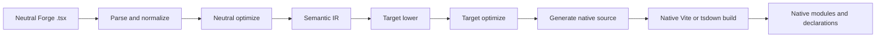
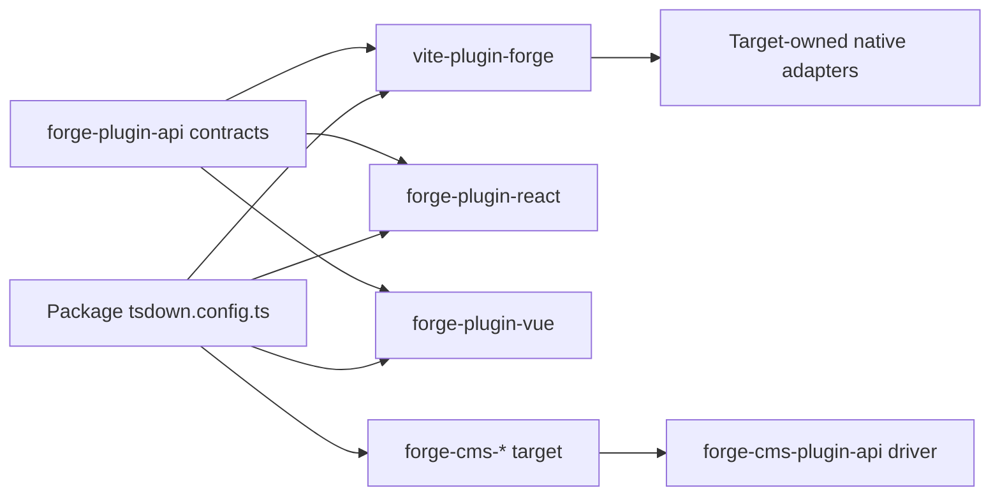
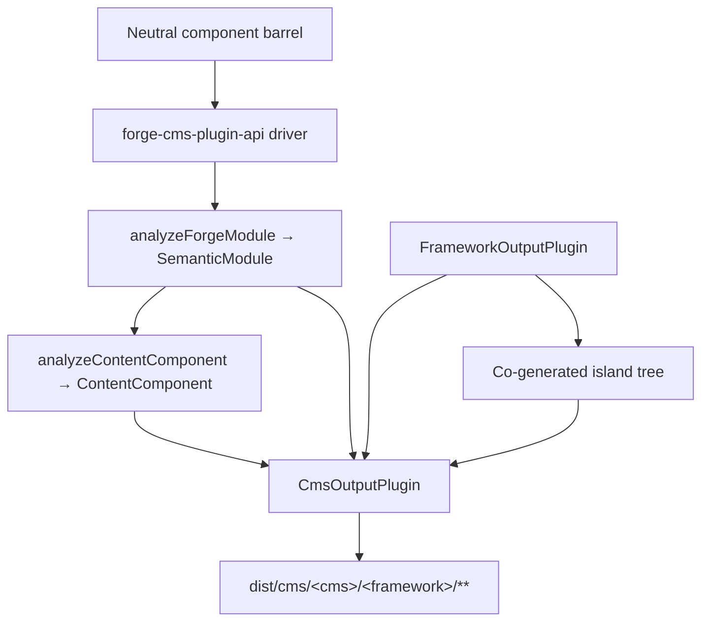

# Pipeline del compilatore Forge

Traduzione assistita da macchina dalla fonte inglese canonica. Da rivedere manualmente se necessario. Nomi di pacchetti, comandi, percorsi e identificatori tecnici restano invariati.

> vite-plugins/forge/docs/reference/compiler.md: [vite-plugins/forge/docs/reference/compiler.md](../../../reference/compiler.md)
> Lingua: Italiano (it)

Questa è una spiegazione dell'architettura per i manutentori di Mission Platform che devono capire come è neutrale rispetto al framework
Il modulo Forge diventa un pacchetto framework nativo. Il confine importante non è “un emettitore di sorgente per quadro” all’interno
il plugin Vite. Forge ha un driver del compilatore neutro, un contratto di plug-in di destinazione esplicito e un nativo di proprietà del framework
costruire adattatori.

## La divisione delle responsabilità

La compilazione di Forge attraversa diversi pacchetti, ciascuno con una responsabilità volutamente ristretta:

| Strato                                                 | Possiede                                                                                                                                                | Non possiede                                                                               |
| :----------------------------------------------------- | :------------------------------------------------------------------------------------------------------------------------------------------------------ | :----------------------------------------------------------------------------------------- |
| `@mission-platform/vite-plugin-forge`                  | Analisi, normalizzazione, analisi neutra, IR semantico, ottimizzazione condivisa, cache/discovery, invio e orchestrazione Vite/tsdown generica          | React, Vue, Solid, Svelte, Componenti Web o emettitori di origini CMS                      |
| `@mission-platform/forge-plugin-api`                   | `FrameworkOutputPlugin`, contratti di destinazione semantica, tipi di moduli generati, metadati di destinazione e tipi di adattatori Vite/tsdown        | Un'implementazione del framework o un registro di selezione degli obiettivi                |
| Pacchetti `@mission-platform/forge-plugin-*` integrati | Riduzione del target, ottimizzazione del target, generazione di sorgenti, diagnostica del target, metadati di runtime e adattatori di build nativi      | Analisi neutra e orchestrazione cross-target                                               |
| `@mission-platform/forge-cms-plugin-api`               | `CmsOutputPlugin`, il modello di contenuto neutro, il driver scopri→analizza→emetti→scrivi, la cogenerazione dell'isola e gli aiutanti di creazione CMS | Qualsiasi schema, modello o forma manifest specifica della piattaforma                     |
| `@mission-platform/forge-cms-*` pacchetti              | Una piattaforma di contenuti ciascuna: mappatura dei campi, dialetto del modello, forma del manifest e diagnostica della piattaforma                    | Classificazione dell'elica neutra o orchestrazione tra target                              |
| Pacchetto file `tsdown.config.ts`                      | La selezione delle istanze del plug-in di destinazione e le sostituzioni specifiche del pacchetto                                                       | Reimplementazione delle fasi del compilatore o delle tabelle di commutazione del framework |

La direzione della dipendenza è esplicita: un pacchetto importa il plugin di destinazione che desidera, passa quell'istanza al neutro
driver e riceve una configurazione di build specifica per la destinazione. Il driver non costruisce mai una destinazione da una stringa né importa
ogni pacchetto framework nel caso sia necessario.

## Il gasdotto rigoroso

Il flusso canonico è un singolo front-end neutro seguito da fasi di proprietà del target e da una build nativa. Ogni bersaglio riceve
gli stessi fatti semantici; non è necessario ricostruire il modulo neutro da un file sorgente generato.



### Analizzare e normalizzare

Il driver legge TypeScript/JSX neutro e crea la rappresentazione AST generica utilizzata dal compilatore. Normalizzazione
risolve le convenzioni di creazione neutre in fatti stabili: importazioni, direttive, limiti di componenti e hook, nodi JSX,
slot, marcatori statici e altri costrutti necessari nelle fasi successive. La diagnostica viene raccolta con le posizioni di origine
invece di essere nascosto in un emettitore bersaglio.

### Ottimizzazione neutra e IR semantico

I passaggi neutrali operano prima che venga coinvolta una struttura. Possono scoprire componenti e aiutanti, riscrivere le importazioni, eliminare
direttive del compilatore, dedurre chiavi stabili, eliminare rami morti neutri e analisi riutilizzabili della cache. Il risultato è un
`SemanticModule`: una rappresentazione esplicita del comportamento componente o componibile del modulo e dei suoi fatti neutri.

L'IR semantico è il contratto tra il compilatore generico e un plugin di destinazione. Anche il frontend mantiene l'originale
analizzato TypeScript `SourceFile` come dettaglio di runtime non enumerabile sul modulo semantico. Gli emettitori target possono consumare
quell'albero analizzato condiviso per le foglie supportate dal codice sorgente, ma non devono mai più chiamare `parseTsx` sul codice sorgente del modulo. Questo
mantiene la cache serializzabile garantendo al tempo stesso che l'origine venga analizzata una sola volta.

### Abbassamento e ottimizzazione del target

Il chiamante fornisce un'istanza `FrameworkOutputPlugin`. Il driver chiama la sua funzione `lower` con il modulo semantico
e un `TargetContext`, che produce `TargetIntentions`. Abbassare i concetti neutri delle mappe per indirizzare i concetti: ad esempio,
hook e slot neutri diventano lo stato/ciclo di vita del target e la rappresentazione degli slot, mentre gli elementi neutrali diventano il
modello di elemento o componente del target.

La funzione `optimize` del plugin esegue quindi una semplificazione specifica per il target. Riceve le opzioni neutre condivise
accanto a un punto di estensione per le opzioni di destinazione. Ciò mantiene le regole quadro fuori dall'ottimizzatore neutrale consentendo al tempo stesso a
target per ottimizzare la propria rappresentazione generata prima della generazione della sorgente.

### Generazione del sorgente e compilazione nativa

La funzione `generate` del plugin restituisce un `GeneratedModule`. Può includere la sorgente primaria, moduli ausiliari e
diagnostica del bersaglio. La fonte generata è deliberatamente un artefatto intermedio di proprietà del pacchetto di destinazione: React,
Vue, Solid, Svelte e i componenti Web possono scegliere ciascuno la forma di origine prevista dalla toolchain nativa.

Lo stadio finale non è un altro emettitore di Forge. L'adattatore `build.vite` o `build.tsdown` del plugin fornisce il file nativo
plugin del framework e impostazioni di creazione per l'albero generato. Vite nativo/Compilazione rolldown, generazione di dichiarazioni,
l’esternalizzazione e il confezionamento dell’output avvengono quindi utilizzando la normale toolchain di quel target.

### Diagnostica e memorizzazione nella cache

La diagnostica riporta la fase del compilatore, la destinazione, l'intervallo di origine e un motivo utilizzabile. Una destinazione deve segnalare un valore non supportato
node semantico invece di emettere silenziosamente una chiusura di runtime generica o un'origine nativa non valida. Moduli semantici neutri
vengono memorizzati nella cache in base al contenuto di origine, al tipo di modulo e alle opzioni che influiscono sulla semantica; le fasi di destinazione ricevono la stessa memorizzazione nella cache
modulo per ciascun framework selezionato mantenendo l'abbassamento e l'ottimizzazione del target indipendenti.

## Ciclo di vita del servizio e build incrementali

Vite e gli helper tsdown utilizzano un `ForgeCompilerService` in-process per tutta la durata di una sessione di compilazione. Il servizio possiede
lo snapshot di origine, il grafico, il frontend analizzato, l'ottimizzazione neutra, l'IR semantico e le cache degli artefatti di destinazione. È sicuro farlo
servire diversi obiettivi espliciti in sequenza o contemporaneamente; gli artefatti di destinazione sono codificati in base all'ID di destinazione e non condividono mai un file
directory generata. Gli helper one-shot eliminano il servizio dopo la compilazione, mentre gli helper watch lo conservano fino al Vite
il server si chiude.

Una chiave di cache efficace include l'impronta digitale di origine, il tipo di modulo, le opzioni del compilatore e del router, source-root/config
impronte digitali, ID di destinazione e impronta digitale del plug-in e condizioni pertinenti. Un file modificato invalida il suo grafico inverso
dipendenti, inclusi componenti transitivi e voci di hook, invece di cancellare obiettivi non correlati. `tsconfig.json`
`baseUrl` e `paths` sono inclusi nella preparazione del grafico, quindi gli alias vengono risolti in modo coerente nelle build Vite e tsdown.
Chiama `invalidate(changedFiles)` dalle integrazioni di orologi personalizzati e chiama `dispose()` quando un servizio non è più necessario.

Il report del servizio espone tempi di fase, riscontri positivi/mancati nella cache, file non validi, avvisi, errori e artefatti emessi
conta. File mancanti, estensioni non supportate, alias non risolti, esportazioni non valide ed errori di configurazione di destinazione sono
diagnostica strutturata. Gli avvisi raggiungono il reporter della build; gli errori impediscono la generazione e la promozione.

Ogni snapshot di destinazione ha un manifest degli artefatti che elenca i moduli generati, i moduli aggiuntivi, le dichiarazioni, le mappe di origine, le risorse,
voci e checksum. La promozione nativa verifica che il manifest sia completo e con ambito di destinazione prima di sostituire il file
ultimo risultato riuscito. Una build fallita, annullata o scaduta rimuove solo la sua fase e preserva i target fratelli e
l'albero `dist` precedente.

La prima implementazione è deliberatamente in corso perché i plugin di destinazione contengono funzioni native e di proprietà del chiamante
adattatori. Un lavoratore o un trasporto/daemon tra processi incrociati può essere introdotto successivamente dietro lo stesso contratto di servizio; non è un
registro del framework e non è richiesto per il flusso di lavoro Vite/tsdown corrente.

## Proprietà target esplicita

I contratti centrali risiedono in `forge-plugins/forge-plugin-api/src/framework.ts`:

- `FrameworkOutputPlugin` identifica una destinazione e possiede `lower`, `optimize`, `generate` e `build`.
- `TargetContext` contiene un contesto di build generico come il tipo di modulo, il nome del componente e le cartelle dei componenti rilevati.
- `TargetIntentions` avvolge il modulo semantico dopo l'abbassamento del target mantenendo la diagnostica.
- `GeneratedModule` descrive l'origine generata, la lingua di output, i moduli ausiliari e la diagnostica.
- `FrameworkBuildAdapters` fornisce adattatori Vite e tsdown tipizzati in modo indipendente.
- `FrameworkSourceMetadata`, elementi esterni di runtime e metadati del nome visualizzato consentono all'orchestrazione generica di ricavare i dettagli di output
  senza un'istruzione target switch.

Le destinazioni integrate sono costruite dai propri pacchetti, ad esempio `forgeReactFramework()`, `forgeVueFramework()`,
`forgeSolidFramework()`, `forgeSvelteFramework()` e `forgeWebComponentsFramework()`. Un pacchetto seleziona solo il
obiettivi che pubblica:

```ts
import { defineTsdownForgeComponents } from '@mission-platform/vite-plugin-forge';
import { forgeReactFramework } from '@mission-platform/forge-plugin-react';
import { forgeSolidFramework } from '@mission-platform/forge-plugin-solid';
import { forgeSvelteFramework } from '@mission-platform/forge-plugin-svelte';
import { forgeVueFramework } from '@mission-platform/forge-plugin-vue';
import { forgeWebComponentsFramework } from '@mission-platform/forge-plugin-web-components';

export default defineTsdownForgeComponents({
  rootDir: import.meta.dirname,
  frameworks: [
    forgeVueFramework(),
    forgeReactFramework(),
    forgeSvelteFramework(),
    forgeSolidFramework(),
    forgeWebComponentsFramework(),
  ],
  componentsModule: `${import.meta.dirname}/src/components/index.ts`,
  name: 'MissionPlatformComponents',
});
```

## Applicazioni dei componenti Web e `mp:web-component`

Il target Web Components emette elementi personalizzati registrati ed è la build Forge priva di framework utilizzata dai documenti statici
e altri consumatori DOM. Selezionalo tramite la condizione di esportazione condivisa anziché importando un pacchetto specifico di destinazione
percorso; ciò mantiene coerente ogni importazione di `@mission-platform/*` e impedisce a Vue o ad un altro runtime del framework di
inserendo il pacchetto:

```ts
import { defineConfig } from 'vite';
import { frameworkResolveConditions } from '@mission-platform/vite-config';

export default defineConfig({
  resolve: { conditions: frameworkResolveConditions('mp:web-component') },
});
```

La preimpostazione TypeScript corrispondente è `@mission-platform/typescript-config/framework-web-component` con
`customConditions: ['mp:web-component']`. Le applicazioni browser possono utilizzare la cronologia nativa del browser; build statiche/prerendering
dovrebbe fornire la cronologia della memoria e registrare gli elementi durante il passaggio di rendering. L'uscita del router e gli elementi di collegamento accettano
target di percorsi complessi come proprietà e sono indipendenti dal modello di creazione dei componenti del compilatore Forge.

Le istanze sono di proprietà del chiamante. Le nuove istanze possono contenere opzioni e metadati specifici del target e un elenco di plug-in vuoto
è un errore di configurazione piuttosto che una richiesta di utilizzare un registro predefinito nascosto. Ciò rende l'aggiunta di un nuovo target un
modifica additiva del pacchetto: implementa il contratto del plug-in di output, pubblica i suoi adattatori di build e selezionalo nei consumatori.



Le frecce dal consumatore sia al conducente che al pacchetto target sono intenzionali. Il consumatore possiede la selezione del target;
il conducente possiede un'orchestrazione generica; e ogni pacchetto target possiede l'implementazione del framework.

## Costruzioni di componenti

I pacchetti di componenti creano moduli neutri rispetto a `@mission-platform/forge`, solitamente attraverso un barile di componenti neutri.
`defineTsdownForgeComponents` crea una build di destinazione per ciascun plug-in fornito. Per ogni target:

1. analizza, normalizza e analizza i moduli dei componenti neutri;
2. esegue passaggi neutri e crea moduli semantici;
3. richiama le fasi di abbassamento, ottimizzazione e generazione del plugin selezionato;
4. scrive il sorgente di destinazione e i moduli ausiliari in una cache specifica del target;
5. richiama gli adattatori tsdown/Vite del plugin;
6. emette la directory di destinazione, le dichiarazioni, gli elementi esterni di runtime e gli artefatti delle voci del pacchetto.

L'origine neutra è condivisa, ma gli alberi e le dichiarazioni generati sono specifici dell'obiettivo. Una build Vue può quindi utilizzare Vue
Strumenti di dichiarazione SFC e Vue, mentre una build React può utilizzare i tipi nativi React JSX e React. La configurazione del pacchetto può
aggiungi comunque sostituzioni del chiamante, gestione CSS, plug-in di dichiarazione o opzioni Vite specifiche del target senza spostarli
preoccupazioni nel compilatore generico.

## Hook e costruzioni componibili

Gli hook sono componenti componibili neutri anziché componenti dell'interfaccia utente, ma utilizzano lo stesso limite esplicito di proprietà di destinazione. Un gancio
il consumatore passa un `FrameworkOutputPlugin` a `defineTsdownForgeHooks`. Il driver generico analizza la voce neutra,
preserva i moduli indipendenti dal framework ove possibile e invia i moduli dipendenti dal target attraverso il file strict
abbassa/ottimizza/genera percorso.

Il plugin selezionato controlla la lingua di output del hook e l'adattatore nativo. Ciò consente, ad esempio, la creazione di un hook React
utilizzare importazioni compatibili con React e una build di hook Vue per esporre il comportamento basato su Vue `Ref`, mentre rimangono i moduli di utilità neutri
invariato. Ciascun target riceve le proprie dichiarazioni dall'albero target generato; nessuna dichiarazione condivisa pretende questo
tutti i consumatori del framework hanno gli stessi tipi di hook.

## Proiezione CMS

Proiettare elementi su una _piattaforma di contenuti_ è un asse ortogonale all'abbassamento del quadro, non un quadro
implementazione nascosta all'interno del driver principale. Un componente diventa un blocco Storyblok, un'isola Astro, un parziale Ghost, a
Jekyll include o un componente di codice Webflow e ognuno di questi può essere abbinato a **qualsiasi** plugin di output del framework.
`storyblok × vue`, `astro × solid` e `ghost × web-components` sono quindi configurazioni anziché un nuovo codice.

`@mission-platform/forge-cms-plugin-api` possiede quella cucitura. Contribuisce a tre cose:

1. **Un modello di contenuto neutro.** `analyzeContentComponent` mappa l'interfaccia degli oggetti di scena di un componente su
   `ContentField` con un tipo (`text`, `richtext`, `number`, `boolean`, `option`, `asset`, `link`, `children`), un JSDoc
   descrizione, un flag obbligatorio, un valore predefinito letterale, metadati dello slot e un flag `@cmsSetting`. Gli oggetti di richiamata vengono eliminati
   e un'unione che mescola valori letterali stringa con `string`/`number` degrada a `text`: decisa una volta, quindi ogni piattaforma
   è d'accordo. Quando viene fornito l'IR semantico, `ContentComponent.interactive` segnala se il componente trasporta lo stato,
   riferimenti, effetti o eventi.
2. **Un contratto target.** `CmsOutputPlugin` _compone_ un `FrameworkOutputPlugin` anziché essere uno solo e dichiara il
   emettitori `emitSchema`, `emitTemplate`, `emitManifest` e `emitEntry`. `defineForgeCmsPlugin` lo convalida su
   tempo di configurazione, inclusa la restrizione `supportedFrameworks` di una destinazione.
3. **Un driver generico e aiutanti di creazione.** `generateCmsArtifacts` scopre il cilindro neutro, ottiene i dati di ciascun componente
   IR tramite `analyzeForgeModule`, analizza il modello di contenuto, chiama gli emettitori del target e scrive ogni reso
   `CmsArtifact`. `defineTsdownForgeCms(All)` lo esegue in una cache per destinazione ed emette
   `dist/cms/<cms>/<framework>/**`, rispecchiando gli artefatti `asset: true` in `dist/cms/<cms>/`.

Il driver non mappa mai un ID stringa su un target: i consumatori costruiscono e passano istanze, esattamente come fanno per
plugin del quadro:

```ts
import { defineTsdownForgeCmsAll } from '@mission-platform/forge-cms-plugin-api';
import { forgeStoryblokCms } from '@mission-platform/forge-cms-storyblok';
import { forgeReactFramework } from '@mission-platform/forge-plugin-react';
import { forgeVueFramework } from '@mission-platform/forge-plugin-vue';

export default defineTsdownForgeCmsAll({
  rootDir: import.meta.dirname,
  targets: [
    forgeStoryblokCms({
      packageName: '@mission-platform/components',
      plugin: forgeReactFramework(),
      storyblokRuntime: '@storyblok/react',
    }),
    forgeStoryblokCms({
      packageName: '@mission-platform/components',
      plugin: forgeVueFramework(),
      storyblokRuntime: '@storyblok/vue',
    }),
  ],
  componentsModule: `${import.meta.dirname}/src/components/index.ts`,
});
```



### Gli obiettivi

| Pacchetto                               | Fabbrica            | Emette                                                                                                      |
| :-------------------------------------- | :------------------ | :---------------------------------------------------------------------------------------------------------- |
| `@mission-platform/forge-cms-storyblok` | `forgeStoryblokCms` | un oggetto componente per componente, un wrapper del blocco framework, `components.json`, una voce digitata |
| `@mission-platform/forge-cms-astro`     | `forgeAstroCms`     | `.astro` statico o un'isola `client:load`, più un zod `content.config.ts`                                   |
| `@mission-platform/forge-cms-ghost`     | `forgeGhostCms`     | Parziali del manubrio più un frammento del tema `config.custom`                                             |
| `@mission-platform/forge-cms-jekyll`    | `forgeJekyllCms`    | Il liquido include più `_data/forge-components.yml` e un frammento `_config.yml`                            |
| `@mission-platform/forge-cms-webflow`   | `forgeWebflowCms`   | Dichiarazioni del componente codice `declareComponent` più un frammento della libreria `webflow.json`       |

Ogni mappatura non supportata produce un `CompilerDiagnostic` con una fase, un codice e un motivo utilizzabile anziché un
omissione silenziosa: Ghost avvisa sui campi numerici e al superamento del limite di ~ 20 impostazioni, Webflow avvisa quando un numero
si degrada in testo e Astro avvisa quando un oggetto predefinito non può attraversare il confine dell'isola. Gli avvisi vengono registrati; gli errori interrompono
la costruzione.

### Isole

Un target che dichiara `island: 'framework'` (Astro, Webflow) necessita di un componente runtime reale per l'idratazione. Piuttosto che
importando il sottopercorso `./vue` o `./react` già creato del pacchetto host, che farebbe dipendere l'output CMS da un altro
build dopo essere stato eseguito per primo: il driver esegue il **plugin del framework associato** sullo stesso barile neutro in un fratello
`island/` e il modello emesso importa un file di sua proprietà. L'isola è compilata dal tsdown di quel plugin
stage plugin nella stessa build.

Questo è il motivo per cui Astro è un target CMS piuttosto che un plugin per framework: in precedenza aveva spedito un'isola DOM vanigliata arrotolata a mano
runtime che ha reimplementato stato, riferimenti, effetti ed eventi dall'IR. Comporre un framework plugin significa invece un
Il componente interattivo Astro si comporta esattamente come lo stesso componente in ogni altra build.

## Dove cercare durante il debug

Traccia prima una build per responsabilità anziché per file generato:

1. **Input e diagnostica:** ispeziona `vite-plugins/forge/src/compiler/` per analisi, rilevamento, ottimizzazione neutra,
   costruzione IR semantica e aggregazione diagnostica.
2. **Comportamento target:** ispeziona il pacchetto `forge-plugin-*` selezionato e i relativi `lower`, `optimize`, `generate` e crea
   implementazioni dell'adattatore.
3. **Forma di build generica:** controlla la cache di `vite-plugins/forge/src/generate.ts`, `generate-hooks.ts` e `tsdown.ts`,
   comportamento di output, dichiarazione e override del chiamante.
4. **Output CMS:** controlla `forge-plugins/forge-cms-plugin-api/` per il modello di contenuto, il driver e la build
   helper, quindi il target specifico `forge-plugins/forge-cms-*` per i suoi emettitori e la mappatura della piattaforma.
5. **Selezione del pacchetto:** ispezionare `tsdown.config.ts` del pacchetto utilizzatore e dirigere le dipendenze `forge-plugin-*`.

Per una build ripetuta o osservata, ispeziona prima `ForgeCompilationReport`: una percentuale di successo bassa punta all'origine/configurazione o alla destinazione
impronte digitali, mentre un set di file interessati di grandi dimensioni punta ai bordi del grafico o alla configurazione degli alias. Controlla il manifest di destinazione
prima di ispezionare l'output del bundler nativo; distingue un artefatto generato mancante da un errore di compilazione nativa.

La prova più utile è la prima fase di fallimento e la sua diagnostica. Se l'IR semantico è sbagliato, correggi l'analisi neutra o
analisi. Se l'IR è corretto ma la sorgente nativa è sbagliata, correggi il plug-in di destinazione selezionato. Se la fonte generata è corretta
ma il raggruppamento non riesce, controlla l'adattatore Vite/tsdown del plugin o la configurazione di override del consumatore.

## Estendere la Forgia con un bersaglio

Per aggiungere un obiettivo framework senza reintrodurre la proprietà centrale:

1. creare un pacchetto `forge-plugin-*` con una fabbrica che restituisce `FrameworkOutputPlugin`;
2. implementare l'abbassamento da `SemanticModule` alle intenzioni target;
3. aggiungere l'ottimizzazione del target e la generazione della sorgente, inclusi moduli ausiliari e diagnostica;
4. fornire metadati di origine di destinazione, nomi esterni di runtime e adattatori Vite/tsdown;
5. aggiungere test mirati per casi limite semantici e artefatti generati;
6. aggiungi il plugin come dipendenza diretta in ogni pacchetto che pubblica il target;
7. passa nuove istanze del plugin nella configurazione di build di quel pacchetto.

Non aggiungere un ID framework a un registro in `vite-plugin-forge`, importare un pacchetto framework dal driver neutro o aggiungere
un ramo specifico della destinazione per l'analisi generica e l'orchestrazione dell'output. Il contratto è volutamente aperto, quindi target
i pacchetti possono evolvere la loro rappresentazione di origine mentre la pipeline neutra rimane stabile.

## Estendere Forge con un target CMS

L'aggiunta di una piattaforma di contenuti segue la stessa forma additiva, uno strato più in alto:

1. creare un pacchetto `forge-cms-*` dipendente da `@mission-platform/forge-cms-plugin-api`;
2. esportare una factory che restituisce `defineForgeCmsPlugin({ id, framework, packageName, … })`, prendendo il plugin del framework
   dal chiamante anziché sceglierne uno;
3. implementare `emitTemplate` e qualunque tra `emitSchema`, `emitManifest` e `emitEntry` sia necessario alla piattaforma: un
   la piattaforma solo modello come Ghost o Jekyll implementa solo i primi due e il driver scrive un segnaposto
   ingresso;
4. mappare gli `ContentFieldKind` neutri sul vocabolario del campo della piattaforma in un unico posto e premere un
   `CompilerDiagnostic` per ogni mappatura che la piattaforma non riesce a rappresentare fedelmente;
5. impostare `island: 'framework'` se la piattaforma necessita di un runtime idratato e `supportedFrameworks` se accetta solo
   alcuni plugin del framework;
6. aggiungere una specifica sulle apparecchiature condivise esportate da `@mission-platform/forge-cms-plugin-api/fixtures`, quindi il nuovo
   l'obiettivo viene esercitato esattamente contro gli stessi input di ogni altro;
7. aggiungi il pacchetto come dipendenza diretta di ciascun consumatore che pubblica la destinazione e passa una nuova istanza a
   `defineTsdownForgeCms`.

Non aggiungere la logica di classificazione delle prop alla destinazione: una correzione per l'unione, JSDoc, il valore predefinito o la gestione degli slot appartiene al
modello di contenuto condiviso in modo che ogni piattaforma ne tragga vantaggio contemporaneamente.

Per la panoramica del sistema di compilazione e la direzione delle dipendenze a livello di piattaforma, vedere [Costruisci sistema](../../../../../../docs/locales/it/build-system.md) e
[Architettura della piattaforma di missione](../../../../../../docs/locales/it/architecture.md).
