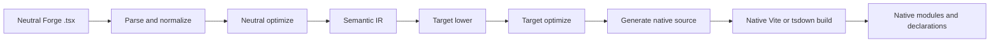
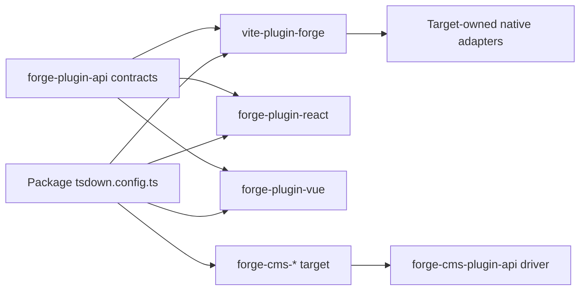
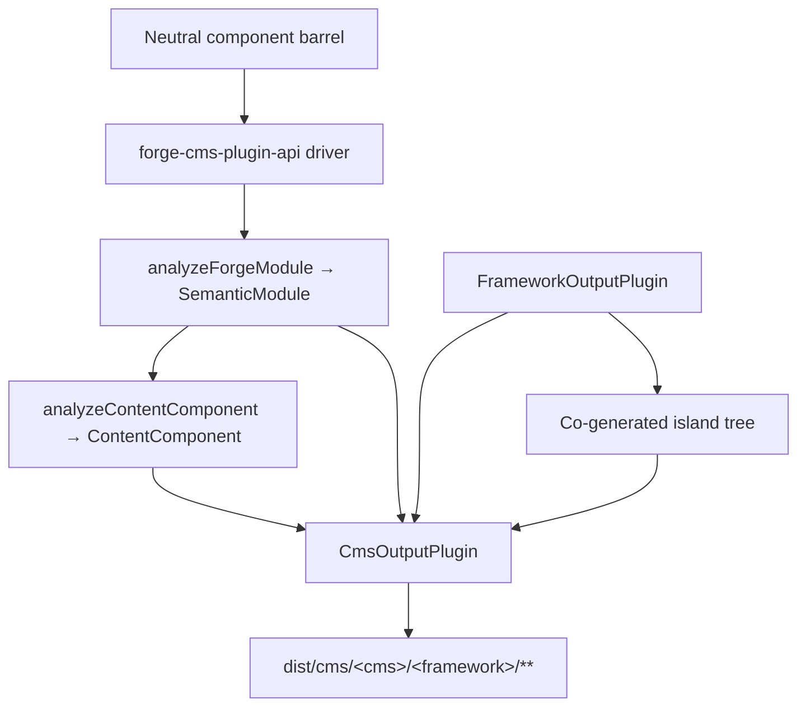

# Forge コンパイラ パイプライン

正規の英語ソースからの機械支援翻訳です。必要に応じて人手で確認してください。パッケージ名、コマンド、パス、技術識別子は変更しません。

> vite-plugins/forge/docs/reference/compiler.md: [vite-plugins/forge/docs/reference/compiler.md](../../../reference/compiler.md)
> 言語: 日本語 (ja)

これは、フレームワークに依存しないミッション プラットフォームのメンテナンス方法を理解する必要があるミッション プラットフォームのメンテナー向けのアーキテクチャの説明です。
Forge モジュールはネイティブ フレームワーク パッケージになります。重要な境界は、内部の「フレームワークごとに 1 つのソース エミッター」ではありません。
Vite プラグイン。 Forge には中立的なコンパイラ ドライバー、明示的なターゲット プラグイン コントラクト、およびフレームワーク所有のネイティブがあります。
アダプターを構築します。

## 責任分担

Forge のコンパイルは複数のパッケージにまたがっており、それぞれのパッケージの責任は意図的に限定されています。

|レイヤー |所有 |所有していない |
| :--------------------------------------------------- | :------------------------------------------------------------------------------------------------------------------------------------------- | :---------------------------------------------------------------------- |
| `@mission-platform/vite-plugin-forge` |解析、正規化、中立分析、セマンティック IR、共有最適化、キャッシュ/検出、ディスパッチ、および汎用 Vite/tsdown オーケストレーション | React、Vue、Solid、Svelte、Web コンポーネント、または CMS ソース エミッター |
| `@mission-platform/forge-plugin-api` | `FrameworkOutputPlugin`、セマンティック ターゲット コントラクト、生成されたモジュール タイプ、ターゲット メタデータ、および Vite/tsdown アダプター タイプ |フレームワーク実装またはターゲット選択レジストリ |
|組み込みの `@mission-platform/forge-plugin-*` パッケージ |ターゲットの引き下げ、ターゲットの最適化、ソース生成、ターゲット診断、ランタイム メタデータ、ネイティブ ビルド アダプター |中立的な解析とターゲット間のオーケストレーション |
| `@mission-platform/forge-cms-plugin-api` | `CmsOutputPlugin`、ニュートラル コンテンツ モデル、discover→analyse→emit→write ドライバー、アイランド コジェネレーション、および CMS ビルド ヘルパー |プラットフォーム固有のスキーマ、テンプレート、またはマニフェスト形状 |
| `@mission-platform/forge-cms-*` パッケージ |それぞれ 1 つのコンテンツ プラットフォーム: フィールド マッピング、テンプレートダイアレクト、マニフェスト形状、プラットフォーム診断 |中立的なプロップ分類またはターゲット間のオーケストレーション |
| `tsdown.config.ts` ファイルをパッケージ化する |ターゲットのプラグイン インスタンスとパッケージ固有のオーバーライドの選択 |コンパイラ ステージまたはフレームワーク スイッチ テーブルの再実装 |

依存関係の方向は明示的です。パッケージは必要なターゲット プラグインをインポートし、そのインスタンスをニュートラル プラグインに渡します。
ドライバーを取得し、ターゲット固有のビルド構成を受け取ります。ドライバーは文字列からターゲットを構築したり、インポートしたりすることはありません。
必要な場合に備えて、すべてのフレームワーク パッケージを保存します。

## 厳格なパイプライン

正規のフローは、単一の中立的なフロント エンドと、それに続くターゲット所有のステージとネイティブ ビルドです。各ターゲットが受け取るのは、
同じ意味論的事実。生成されたソース ファイルからニュートラル モジュールを再構築する必要はありません。



### 解析して正規化する

ドライバーはニュートラル TypeScript/JSX を読み取り、コンパイラーで使用される汎用 AST 表現を作成します。正規化
中立的なオーサリング規則を安定した事実に解決します: インポート、ディレクティブ、コンポーネントとフックの境界、JSX ノード、
スロット、静的マーカー、および後のステージで必要となるその他の構成要素。診断はソースの場所とともに収集されます
ターゲットエミッタに隠される代わりに。

### 中立的な最適化とセマンティック IR

ニュートラルパスはフレームワークが関与する前に機能します。コンポーネントとヘルパーを検出し、インポートを書き換え、ストリップすることができます。
コンパイラ ディレクティブ、安定したキーの推論、中立的なデッド ブランチのプルーニング、および再利用可能な分析のキャッシュ。結果は、
`SemanticModule`: モジュールのコンポーネントまたはコンポーザブルの動作とその中立的な事実の明示的な表現。

セマンティック IR は、汎用コンパイラーとターゲット プラグインの間の契約です。フロントエンドもオリジナルを維持します
TypeScript `SourceFile` をセマンティック モジュールの列挙不可能なランタイム詳細として解析しました。ターゲットエミッターは消費する可能性があります
ソースにバックアップされたリーフの解析済みツリーを共有しますが、モジュール ソースで `parseTsx` を再度呼び出すことはできません。これ
ソースが 1 回だけ解析されるようにしながら、キャッシュをシリアル化可能に保ちます。

### 目標の引き下げと最適化

呼び出し元は `FrameworkOutputPlugin` インスタンスを提供します。ドライバーは、セマンティック モジュールを使用して `lower` 関数を呼び出します。
`TargetContext` から `TargetIntentions` が生成されます。下げると、ニュートラルな概念がターゲットの概念にマップされます。たとえば、次のようになります。
ニュートラルなフックとスロットはターゲットの状態/ライフサイクルとスロットの表現になり、ニュートラルな要素はターゲットの状態/ライフサイクルとスロットの表現になります。
ターゲットの要素またはコンポーネント モデル。

次に、プラグインの `optimize` 関数は、ターゲット固有の単純化を実行します。共有中立オプションを受け取ります
ターゲット オプションの拡張ポイントと並んで。これにより、フレームワーク ルールが中立的なオプティマイザーから除外される一方で、
ターゲットは、ソース生成前に独自に生成された表現を最適化します。

### ソース生成とネイティブコンパイル

プラグインの `generate` 関数は `GeneratedModule` を返します。これには、一次ソース、補助モジュール、および
ターゲット診断。生成されたソースは、ターゲット パッケージが所有する中間アーティファクトとして意図的に作成されています: React、
Vue、Solid、Svelte、および Web コンポーネントはそれぞれ、ネイティブ ツールチェーンが予期するソース形状を選択できます。

最終ステージは別の Forge エミッターではありません。プラグインの `build.vite` または `build.tsdown` アダプターは、ネイティブ
フレームワーク プラグインと、生成されたツリーのビルド設定。ネイティブ Vite/ロールダウン コンパイル、宣言生成、
外部化と出力のパッケージ化は、そのターゲットの通常のツールチェーンを使用して行われます。

### 診断とキャッシュ

診断には、コンパイラのフェーズ、ターゲット、ソース範囲、および実行可能な理由が含まれます。ターゲットはサポートされていないことを報告する必要があります
一般的なランタイム クロージャまたは無効なネイティブ ソースをサイレントに発行する代わりに、セマンティック node を使用します。中立的なセマンティックモジュール
ソースコンテンツ、モジュールの種類、セマンティックに影響するオプションによってキャッシュされます。ターゲットステージはキャッシュされたものと同じものを受け取ります
ターゲットの引き下げと最適化を独立した状態に保ちながら、選択したフレームワークごとにモジュールを追加します。

## サービスのライフサイクルと増分ビルド

Vite および tsdown ヘルパーは、ビルド セッションの存続期間中、1 つのインプロセス `ForgeCompilerService` を使用します。サービスが所有する
ソース スナップショット、グラフ、解析されたフロントエンド、中立的な最適化、セマンティック IR、およびターゲット アーティファクト キャッシュ。安全です
複数の明示的なターゲットを順番にまたは同時に処理します。ターゲット アーティファクトはターゲット ID によってキー設定されており、ターゲット アーティファクトを共有することはありません。
生成されたディレクトリ。ワンショット ヘルパーはビルド後にサービスを破棄しますが、監視ヘルパーは Vite が完了するまでサービスを保持します。
サーバーが閉じます。

有効なキャッシュ キーには、ソース フィンガープリント、モジュールの種類、コンパイラとルーターのオプション、source-root/config が含まれます。
フィンガープリント、ターゲット ID とプラグインのフィンガープリント、および関連する条件。変更されたファイルはその逆グラフを無効にします
無関係なターゲットをクリアする代わりに、推移的なコンポーネントやフック エントリを含む依存関係を削除します。 `tsconfig.json`
`baseUrl` および `paths` はグラフの準備に含まれるため、Vite および tsdown ビルドではエイリアスが一貫して解決されます。
カスタム監視統合から `invalidate(changedFiles)` を呼び出し、サービスが必要なくなったら `dispose()` を呼び出します。

サービス レポートは、フェーズのタイミング、キャッシュのヒット/ミス、無効化されたファイル、警告、エラー、生成されたアーティファクトを明らかにします。
カウントします。ファイルの欠落、サポートされていない拡張子、未解決のエイリアス、不正な形式のエクスポート、およびターゲット設定エラーが発生します。
構造化された診断。警告はビルド レポーターに届きます。エラーがあると、生成と昇格が妨げられます。

すべてのターゲット スナップショットには、生成されたモジュール、追加モジュール、宣言、ソース マップ、アセット、
エントリとチェックサム。ネイティブ プロモーションでは、マニフェストが完全であり、対象範囲が定められていることを、マニフェストを置き換える前に検証します。
最後に成功した出力。失敗、キャンセル、またはタイムアウトしたビルドでは、そのステージのみが削除され、兄弟ターゲットと
以前の `dist` ツリー。

最初の実装は、ターゲット プラグインに呼び出し元所有の関数とネイティブが含まれているため、意図的にインプロセスになっています。
アダプター。ワーカーまたはクロスプロセス トランスポート/デーモンは、同じサービス コントラクトの背後で後で導入される場合があります。それはありません
フレームワーク レジストリに含まれており、現在の Vite/tsdown ワークフローには必要ありません。

## 明示的なターゲットの所有権

中央コントラクトは `forge-plugins/forge-plugin-api/src/framework.ts` にあります。

- `FrameworkOutputPlugin` はターゲットを識別し、`lower`、`optimize`、`generate`、および `build` を所有します。
- `TargetContext` には、モジュールの種類、コンポーネント名、検出されたコンポーネント フォルダーなどの一般的なビルド コンテキストが含まれます。
- `TargetIntentions` は、診断を保持しながらターゲットを下げた後にセマンティック モジュールをラップします。
- `GeneratedModule` は、生成されたソース、その出力言語、補助モジュール、および診断について説明します。
- `FrameworkBuildAdapters` は、独立して型指定された Vite および tsdown アダプターを提供します。
- `FrameworkSourceMetadata`、ランタイム外部、および表示名のメタデータにより、汎用オーケストレーションが出力の詳細を導き出すことができます
  target switch ステートメントなし。

組み込みターゲットは、`forgeReactFramework()`、`forgeVueFramework()`、などの独自のパッケージによって構築されます。
`forgeSolidFramework()`、`forgeSvelteFramework()`、および `forgeWebComponentsFramework()`。パッケージは、
公開するターゲット:

```ts
import { defineTsdownForgeComponents } from "@mission-platform/vite-plugin-forge";
import { forgeReactFramework } from "@mission-platform/forge-plugin-react";
import { forgeSolidFramework } from "@mission-platform/forge-plugin-solid";
import { forgeSvelteFramework } from "@mission-platform/forge-plugin-svelte";
import { forgeVueFramework } from "@mission-platform/forge-plugin-vue";
import { forgeWebComponentsFramework } from "@mission-platform/forge-plugin-web-components";

export default defineTsdownForgeComponents({
  rootDir: import.meta.dirname,
  frameworks: [
    forgeVueFramework(),
    forgeReactFramework(),
    forgeSvelteFramework(),
    forgeSolidFramework(),
    forgeWebComponentsFramework(),
  ],
  componentsModule: `${import.meta.dirname}/src/components/index.ts`,
  name: "MissionPlatformComponents",
});
```

## Web コンポーネント アプリケーションと `mp:web-component`

Web コンポーネント ターゲットは、登録されたカスタム要素を出力し、静的ドキュメントで使用されるフレームワークフリーの Forge ビルドです。
および他の DOM コンシューマ。ターゲット固有のパッケージをインポートするのではなく、共有エクスポート条件を通じて選択します。
パス;これにより、すべての `@mission-platform/*` インポートの一貫性が維持され、Vue または別のフレームワーク ランタイムがインポートされるのを防ぎます。
バンドルに入る:

```ts
import { defineConfig } from 'vite';
import { frameworkResolveConditions } from '@mission-platform/vite-config';

export default defineConfig({
  resolve: { conditions: frameworkResolveConditions('mp:web-component') },
});
```

一致する TypeScript プリセットは `@mission-platform/typescript-config/framework-web-component` です。
`customConditions: ['mp:web-component']`。ブラウザ アプリケーションはネイティブのブラウザ履歴を使用できます。静的/プリレンダービルド
レンダリング パス中にメモリ履歴とレジスタ要素を提供する必要があります。ルーターのアウトレットおよびリンク要素は受け入れます
複雑なルート ターゲットはプロパティとして使用され、Forge コンパイラーのコンポーネント オーサリング モデルから独立しています。

インスタンスは呼び出し元が所有します。新しいインスタンスは、ターゲット固有のオプションとメタデータ、および空のプラグイン リストを保持できます。
これは、非表示のデフォルト レジストリを使用する要求ではなく、構成エラーです。これにより、新しいターゲットを追加できるようになります。
追加のパッケージ変更: 出力プラグイン コントラクトを実装し、そのビルド アダプターを公開して、コンシューマーで選択します。



コンシューマーからドライバーとターゲット パッケージの両方への矢印は意図的なものです。消費者はターゲットの選択を所有します。
ドライバーは汎用オーケストレーションを所有します。各ターゲット パッケージはフレームワーク実装を所有します。

## コンポーネントのビルド

コンポーネント パッケージは、通常はニュートラル コンポーネント バレルを通じて、`@mission-platform/forge` に対してニュートラル モジュールを作成します。
`defineTsdownForgeComponents` は、提供されたプラグインごとに 1 つのターゲット ビルドを作成します。ターゲットごとに次のことを行います。

1. ニュートラルコンポーネントモジュールを解析、正規化、分析します。
2. ニュートラルパスを実行し、セマンティックモジュールを作成します。
3. 選択したプラグインの低下、最適化、生成ステージを呼び出します。
4. ターゲット ソースおよび補助モジュールをターゲット固有のキャッシュに書き込みます。
5. プラグインの tsdown/Vite アダプターを呼び出します。
6. ターゲット ディレクトリ、宣言、ランタイム外部、およびパッケージ エントリ アーティファクトを生成します。

中立的なソースは共有されますが、生成されるツリーと宣言はターゲット固有です。したがって、Vue ビルドでは Vue を使用できます。
SFC および Vue 宣言ツールですが、React ビルドでは React JSX および React ネイティブ型を使用できます。パッケージ構成は、
呼び出し元のオーバーライド、CSS 処理、宣言プラグイン、またはターゲット固有の Vite オプションを移動せずに追加します。
懸念事項を汎用コンパイラに取り込みます。

## フックとコンポーザブルビルド

フックは UI コンポーネントではなく中立的なコンポーザブルですが、同じ明示的なターゲット所有権境界を使用します。フック
コンシューマは 1 つの `FrameworkOutputPlugin` を `defineTsdownForgeHooks` に渡します。汎用ドライバーはニュートラル エントリを解析し、
可能な場合はフレームワークに依存しないモジュールを保持し、プラグインの厳密な機能を介してターゲット依存のモジュールを送信します。
パスを低く/最適化/生成します。

選択したプラグインは、フック出力言語とネイティブ アダプターを制御します。これにより、たとえば、React フックのビルドが可能になります。
React 互換のインポートと Vue フック ビルドを使用して、Vue `Ref` ベースの動作を公開しますが、中立的なユーティリティ モジュールはそのままです
変わらない。各ターゲットは、生成されたターゲット ツリーから独自の宣言を受け取ります。それを装う共有宣言はありません
すべてのフレームワーク コンシューマーは同じフック タイプを持ちます。

## CMS プロジェクション

コンポーネントを *コンテンツ プラットフォーム* に投影することは、フレームワークの降下に直交する軸であり、フレームワークではありません
メインドライバー内に隠された実装。コンポーネントは、Storyblok ブロック、Astro アイランド、Ghost パーシャル、
Jekyll には、Webflow コード コンポーネントが含まれており、これらのそれぞれは、**任意** のフレームワーク出力プラグインと組み合わせることができます。
したがって、`storyblok × vue`、`astro × solid`、および `ghost × web-components` は、新しいコードではなく構成です。

`@mission-platform/forge-cms-plugin-api` がその継ぎ目を所有しています。それは次の 3 つのことに貢献します。

1. **中立的なコンテンツ モデル。** `analyzeContentComponent` は、コンポーネントの props インターフェイスを順序付けされたものにマップします。
   `ContentField` と種類 (`text`、`richtext`、`number`、`boolean`、`option`、`asset`、`link`、`children`)、JSDoc
   説明、必須フラグ、リテラルデフォルト、スロットメタデータ、および `@cmsSetting` フラグ。コールバックプロパティは削除されます
   文字列リテラルと `string`/`number` を混合する共用体は `text` に劣化します。一度決定されるため、すべてのプラットフォームで使用されます。
   同意します。セマンティック IR が提供されると、`ContentComponent.interactive` はコンポーネントが状態を伝達するかどうかを報告します。
   参照、エフェクト、またはイベント。
2. **ターゲット コントラクト** `CmsOutputPlugin` は、`FrameworkOutputPlugin` を 1 つではなく *構成*し、
   エミッター `emitSchema`、`emitTemplate`、`emitManifest`、および `emitEntry`。 `defineForgeCmsPlugin` は次の場所で検証します。
   ターゲットの `supportedFrameworks` 制限を含む構成時間。
3. **汎用ドライバーとビルド ヘルパー。** `generateCmsArtifacts` はニュートラル バレルを検出し、各コンポーネントの
   IR は `analyzeForgeModule` を通じて、コンテンツ モデルを分析し、ターゲットのエミッタを呼び出し、返されたすべてのメッセージを書き込みます
   `CmsArtifact`。 `defineTsdownForgeCms(All)` はそれをターゲットごとのキャッシュに実行し、出力します
   `dist/cms/<cms>/<framework>/**`、`asset: true` アーティファクトを `dist/cms/<cms>/` にミラーリングします。

ドライバーは文字列 ID をターゲットにマップすることはありません。コンシューマーはインスタンスを構築して渡します。これは、ドライバーに対して行うのとまったく同じです。
フレームワークプラグイン:

```ts
import { defineTsdownForgeCmsAll } from "@mission-platform/forge-cms-plugin-api";
import { forgeStoryblokCms } from "@mission-platform/forge-cms-storyblok";
import { forgeReactFramework } from "@mission-platform/forge-plugin-react";
import { forgeVueFramework } from "@mission-platform/forge-plugin-vue";

export default defineTsdownForgeCmsAll({
  rootDir: import.meta.dirname,
  targets: [
    forgeStoryblokCms({
      packageName: "@mission-platform/components",
      plugin: forgeReactFramework(),
      storyblokRuntime: "@storyblok/react",
    }),
    forgeStoryblokCms({
      packageName: "@mission-platform/components",
      plugin: forgeVueFramework(),
      storyblokRuntime: "@storyblok/vue",
    }),
  ],
  componentsModule: `${import.meta.dirname}/src/components/index.ts`,
});
```



### ターゲット

|パッケージ |工場 |排出 |
| :----------------------------------------- | :-------------------- | :---------------------------------------------------------------------------- |
| `@mission-platform/forge-cms-storyblok` | `forgeStoryblokCms` |コンポーネントごとのコンポーネント オブジェクト、フレームワーク ブロック ラッパー、`components.json`、型付きエントリ |
| `@mission-platform/forge-cms-astro` | `forgeAstroCms` | static `.astro` または `client:load` アイランド、および zod `content.config.ts` |
| `@mission-platform/forge-cms-ghost` | `forgeGhostCms` |ハンドルバーの部分と `config.custom` テーマのフラグメント |
| `@mission-platform/forge-cms-jekyll` | `forgeJekyllCms` |液体には、`_data/forge-components.yml` および `_config.yml` フラグメントが含まれています。
| `@mission-platform/forge-cms-webflow` | `forgeWebflowCms` | `declareComponent` コードコンポーネント宣言と `webflow.json` ライブラリ フラグメント |

サポートされていないマッピングはすべて、フェーズ、コード、および実用的な理由を含む `CompilerDiagnostic` を生成します。
サイレント省略 — Ghost は数値フィールドと最大 20 設定の上限を超えると警告し、Webflow は数値が入力された場合に警告します。
テキストに劣化し、プロップのデフォルトが島の境界を越えられない場合、Astro が警告します。警告はログに記録されます。エラーによる中止
ビルド。

### 島々

`island: 'framework'` (Astro、Webflow) を宣言するターゲットには、ハイドレートするための実際のランタイム コンポーネントが必要です。むしろ
ホスト パッケージの既に構築されている `./vue` または `./react` サブパスをインポートします。これにより、CMS 出力が別のサブパスに依存するようになります。
ビルドが最初に実行されている - ドライバーは、**バインドされたフレームワーク プラグイン**を同じニュートラル バレル上で兄弟として実行します。
`island/` ディレクトリにあり、発行されたテンプレートは、それが所有するファイルをインポートします。アイランドはそのプラグイン独自の tsdown によってコンパイルされます
まったく同じビルド内のステージプラグイン。

これが、Astro がフレームワーク プラグインではなく CMS ターゲットである理由です。Astro は以前、手作業で展開されたバニラ DOM アイランドを出荷していました。
IR からの状態、参照、効果、イベントを再実装するランタイム。代わりにフレームワーク プラグインを作成するということは、
インタラクティブな Astro コンポーネントは、他のすべてのビルドの同じコンポーネントとまったく同じように動作します。

## デバッグ時に確認する場所

最初に生成されたファイルではなく、責任ごとにビルドをトレースします。

1. **入力と診断:** `vite-plugins/forge/src/compiler/` を検査して、解析、検出、中立的な最適化、
   セマンティック IR 構築、および診断集約。
2. **ターゲット動作:** 選択した `forge-plugin-*` パッケージとその `lower`、`optimize`、`generate` を検査し、ビルドします
   アダプターの実装。
3. **一般的なビルド形状:** キャッシュの `vite-plugins/forge/src/generate.ts`、`generate-hooks.ts`、および `tsdown.ts` を検査します。
   出力、宣言、および呼び出し元オーバーライドの動作。
4. **CMS 出力:** `forge-plugins/forge-cms-plugin-api/` のコンテンツ モデル、ドライバー、ビルドを検査します。
   ヘルパー、次にそのエミッターとプラットフォーム マッピングの特定の `forge-plugins/forge-cms-*` ターゲット。
5. **パッケージの選択:** 使用するパッケージの `tsdown.config.ts` 依存関係と直接 `forge-plugin-*` 依存関係を検査します。

繰り返しビルドまたは監視ビルドの場合は、最初に `ForgeCompilationReport` を検査します。ヒット率が低い場合は、ソース/構成またはターゲットを指します。
フィンガープリント、影響を受ける大規模なファイル セットはグラフ エッジまたはエイリアス構成を指します。ターゲットマニフェストを確認する
ネイティブバンドラー出力を検査する前。これにより、生成されたアーティファクトの欠落とネイティブ コンパイル エラーが区別されます。

最も有用な証拠は、最初の失敗段階とその診断です。セマンティック IR が間違っている場合は、中立的な解析を修正するか、
分析。 IR は正しいが、ネイティブ ソースが間違っている場合は、選択したターゲット プラグインを修正します。生成されたソースが正しい場合
しかしバンドルが失敗する場合は、そのプラグインの Vite/tsdown アダプターまたはコンシューマ オーバーライド設定を調べてください。

## ターゲットを使用して Forge を拡張する

中央所有権を再導入せずにフレームワーク ターゲットを追加するには:

1. `FrameworkOutputPlugin` を返すファクトリを含む `forge-plugin-*` パッケージを作成します。
2. `SemanticModule` から目標意図までの引き下げを実施します。
3. 補助モジュールと診断を含む、ターゲットの最適化とソース生成を追加します。
4. ターゲット ソース メタデータ、ランタイム外部名、および Vite/tsdown アダプターを提供します。
5. セマンティックなエッジケースと生成されたアーティファクトに焦点を当てたテストを追加します。
6. ターゲットを公開する各パッケージにプラグインを直接の依存関係として追加します。
7. そのパッケージのビルド構成に新しいプラグイン インスタンスを渡します。

`vite-plugin-forge` のレジストリにフレームワーク ID を追加したり、ニュートラル ドライバーからフレームワーク パッケージをインポートしたり、
汎用解析と出力オーケストレーションへのターゲット固有の分岐。契約は意図的にオープンなのでターゲット
パッケージは、中立的なパイプラインが安定したままで、ソース表現を進化させることができます。

## CMS ターゲットを使用した Forge の拡張

コンテンツ プラットフォームの追加は、1 層上の同じ追加形式に従います。

1. `@mission-platform/forge-cms-plugin-api` に応じて `forge-cms-*` パッケージを作成します。
2. フレームワーク プラグインを使用して、`defineForgeCmsPlugin({ id, framework, packageName, … })` を返すファクトリをエクスポートします。
   どちらかを選択するのではなく、発信者から。
3. `emitTemplate` と、プラットフォームに必要な `emitSchema`、`emitManifest`、`emitEntry` のいずれかを実装します。
   Ghost や Jekyll などのテンプレートのみのプラットフォームは最初の 2 つだけを実装し、ドライバーはプレースホルダーを書き込みます
   エントリー;
4. 中立的な `ContentFieldKind` を 1 か所のプラットフォームのフィールド語彙にマッピングし、
   `CompilerDiagnostic` すべてのマッピングについて、プラットフォームは忠実に表現できません。
5. プラットフォームがハイドレート ランタイムを必要とする場合は `island: 'framework'` を設定し、プラットフォームがハイドレート ランタイムのみを受け入れる場合は `supportedFrameworks` を設定します。
   いくつかのフレームワークプラグイン。
6. `@mission-platform/forge-cms-plugin-api/fixtures` からエクスポートされた共有フィクスチャにスペックを追加します。
   target は、他のすべての入力とまったく同じ入力に対して実行されます。
7. ターゲットを公開する各コンシューマーの直接の依存関係としてパッケージを追加し、新しいインスタンスを
   `defineTsdownForgeCms`。

プロパティ分類ロジックをターゲットに追加しないでください。ユニオン、JSDoc、デフォルト、またはスロット処理への修正は、
共有コンテンツ モデルなので、すべてのプラットフォームが同時にメリットを享受できます。

ビルドシステムの概要とプラットフォーム全体の依存関係の方向については、を参照してください。 [ビルドシステム](../../../../../../docs/locales/ja/build-system.md) および
[ミッションプラットフォームのアーキテクチャ](../../../../../../docs/locales/ja/architecture.md)。
