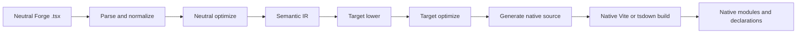
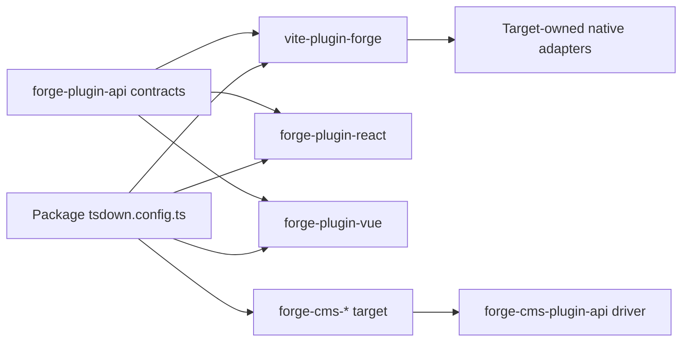
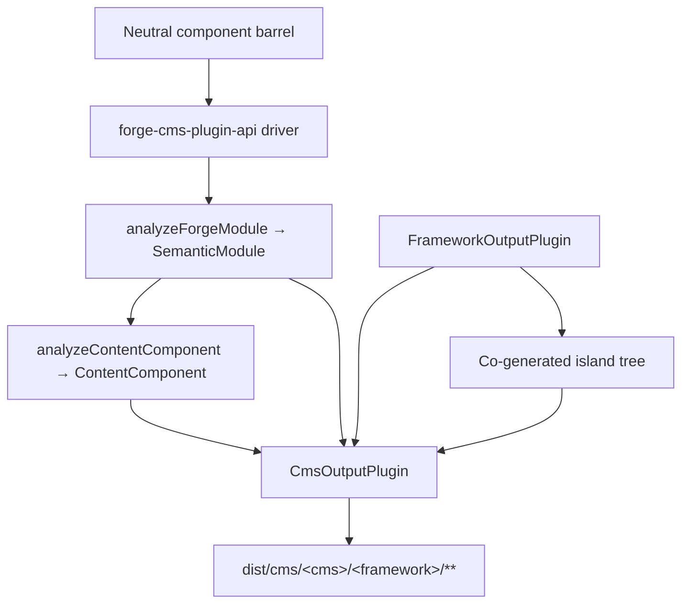

# Forge 编译器管道

由规范英文源进行的机器辅助翻译。必要时请人工审校。包名、命令、路径与技术标识符保持不变。

> vite-plugins/forge/docs/reference/compiler.md: [vite-plugins/forge/docs/reference/compiler.md](../../../reference/compiler.md)
> 语言: 简体中文 (zh)

这是为任务平台维护者提供的架构解释，他们需要了解框架中立的框架如何
Forge 模块成为原生框架包。重要的边界不是内部“每个框架一个源发射器”
Vite 插件。 Forge 有一个中立的编译器驱动程序、一个明确的目标插件合约和框架拥有的本机
构建适配器。

## 责任划分

Forge 编译跨越多个包，每个包都有一个故意缩小的职责：

|层|拥有 |不拥有 |
| :--------------------------------------------------- | :------------------------------------------------------------------------------------------------------------------------------------------- | :---------------------------------------------------------------------- |
| `@mission-platform/vite-plugin-forge` |解析、规范化、中性分析、语义 IR、共享优化、缓存/发现、调度和通用 Vite/tsdown 编排 | React、Vue、Solid、Svelte、Web 组件或 CMS 源发射器 |
| `@mission-platform/forge-plugin-api` | `FrameworkOutputPlugin`、语义目标契约、生成模块类型、目标元数据和 Vite/tsdown 适配器类型 |框架实现或目标选择注册表|
|内置`@mission-platform/forge-plugin-*`包|目标降低、目标优化、源代码生成、目标诊断、运行时元数据和本机构建适配器中性解析和跨目标编排 |
| `@mission-platform/forge-cms-plugin-api` | `CmsOutputPlugin`，中性内容模型，发现→分析→发出→编写驱动程序，岛屿联合发电和 CMS 构建助手 |任何特定于平台的架构、模板或清单形状 |
| `@mission-platform/forge-cms-*` 包 |每个内容平台：其字段映射、模板方言、清单形状和平台诊断 |中性 prop 分类或跨目标编排 |
|打包 `tsdown.config.ts` 文件 |选择目标插件实例和特定于包的覆盖 |重新实现编译器阶段或框架切换表|

依赖方向是明确的：包导入它想要的目标插件，将该实例传递给中立的
驱动程序，并接收特定于目标的构建配置。驱动程序从不从字符串构造目标或导入
每个框架包以防万一需要。

## 严格的管道

规范流程是一个中立的前端，后面是目标拥有的阶段和本机构建。每个目标接收
相同的语义事实；它不需要从生成的源文件重建中性模块。



### 解析和规范化

驱动程序读取中性 TypeScript/JSX 并创建编译器使用的通用 AST 表示形式。标准化
将中立的创作约定解析为稳定的事实：导入、指令、组件和钩子边界、JSX 节点、
插槽、静态标记和后续阶段需要的其他结构。通过源位置收集诊断信息
而不是隐藏在目标发射器中。

### 中性优化和语义 IR

中性传递在涉及框架之前运行。他们可以发现组件和助手、重写导入、剥离
编译器指令、推断稳定键、修剪中性死分支以及缓存可重用分析。结果是
`SemanticModule`：模块的组件或可组合行为及其中性事实的显式表示。

语义 IR 是通用编译器和目标插件之间的契约。前端也保留了原来的
将 TypeScript `SourceFile` 解析为语义模块上的不可枚举运行时详细信息。目标排放者可能会消耗
共享解析树以获取源支持的叶子，但它们绝不能再次在模块源上调用 `parseTsx`。这个
保持缓存可序列化，同时确保源仅解析一次。

### 目标降低和优化

调用者提供 `FrameworkOutputPlugin` 实例。驱动程序使用语义模块调用其 `lower` 函数
和 `TargetContext`，生成 `TargetIntentions`。降低将中性概念映射到目标概念：例如，
中性钩子和槽成为目标的状态/生命周期和槽表示，而中性元素成为
目标的元素或组件模型。

然后，插件的 `optimize` 函数执行特定于目标的简化。它接收共享的中性选项
旁边是目标选项的扩展点。这使得框架规则不受中立优化器的影响，同时允许
目标是在源生成之前优化其自己生成的表示。

### 源代码生成和本地编译

该插件的 `generate` 函数返回 `GeneratedModule`。它可以包括主要源、辅助模块和
目标诊断。生成的源故意是目标包拥有的中间工件：React，
Vue、Solid、Svelte 和 Web 组件都可以选择其本机工具链期望的源形状。

最后阶段不是另一个 Forge 发射器。该插件的 `build.vite` 或 `build.tsdown` 适配器提供本机
生成的树的框架插件和构建设置。原生 Vite/Rolldown 编译、声明生成、
然后使用该目标的正常工具链进行外部化和输出打包。

### 诊断和缓存

诊断包含编译器阶段、目标、源范围和可操作的原因。目标必须报告不受支持的
语义 node 而不是默默地发出通用运行时闭包或无效的本机源。中性语义模块
按源内容、模块类型和影响语义的选项进行缓存；目标阶段接收相同的缓存
每个选定框架的模块，同时保持目标降低和优化独立。

## 服务生命周期和增量构建

Vite 和 tsdown 帮助程序在构建会话的生命周期内使用一个进程内 `ForgeCompilerService`。该服务拥有
源快照、图形、已解析的前端、中性优化、语义 IR 和目标工件缓存。这是安全的
依次或同时服务于几个明确的目标；目标工件由目标 ID 键入，并且从不共享
生成的目录。一次性助手在构建后处理服务，而监视助手保留它直到 Vite
服务器关闭。

有效的缓存密钥包括源指纹、模块类型、编译器和路由器选项、source-root/config
指纹、目标ID和插件指纹以及相关条件。更改的文件使其反向图无效
依赖项，包括传递组件和钩子条目，而不是清除不相关的目标。 `tsconfig.json`
`baseUrl` 和 `paths` 包含在图形准备中，因此别名在 Vite 和 tsdown 版本中得到一致解析。
从自定义监视集成中调用 `invalidate(changedFiles)`，并在不再需要服务时调用 `dispose()`。

服务报告公开阶段计时、缓存命中/未命中、无效文件、警告、错误和发出的工件
很重要。丢失文件、不支持的扩展、未解析的别名、格式错误的导出和目标配置错误
结构化诊断。警告到达构建报告者；错误阻碍了生成和推广。

每个目标快照都有一个工件清单，列出生成的模块、额外模块、声明、源映射、资产、
条目和校验和。本机升级会在替换之前验证清单是否完整且在目标范围内
最后成功输出。失败、取消或超时的构建仅删除其阶段并保留同级目标和
之前的 `dist` 树。

第一个实现是故意在进程中实现的，因为目标插件包含调用者拥有的函数和本机函数
适配器。稍后可能会在同一服务合约后面引入工作线程或跨进程传输/守护进程；它不是一个
框架注册表，当前 Vite/tsdown 工作流程不需要。

## 明确的目标所有权

中央合约位于 `forge-plugins/forge-plugin-api/src/framework.ts` 中：

- `FrameworkOutputPlugin` 标识目标并拥有 `lower`、`optimize`、`generate` 和 `build`。
- `TargetContext` 携带通用构建上下文，例如模块类型、组件名称和发现的组件文件夹。
- `TargetIntentions` 在目标降低后包装语义模块，同时保留诊断。
- `GeneratedModule` 描述生成的源、其输出语言、辅助模块和诊断。
- `FrameworkBuildAdapters` 提供独立类型的 Vite 和 tsdown 适配器。
- `FrameworkSourceMetadata`、运行时外部和显示名称元数据让通用编排导出输出详细信息
  没有目标 switch 语句。

内置目标由自己的包构建，例如 `forgeReactFramework()`、`forgeVueFramework()`、
`forgeSolidFramework()`、`forgeSvelteFramework()` 和 `forgeWebComponentsFramework()`。包仅选择
它发布的目标：

```ts
import { defineTsdownForgeComponents } from "@mission-platform/vite-plugin-forge";
import { forgeReactFramework } from "@mission-platform/forge-plugin-react";
import { forgeSolidFramework } from "@mission-platform/forge-plugin-solid";
import { forgeSvelteFramework } from "@mission-platform/forge-plugin-svelte";
import { forgeVueFramework } from "@mission-platform/forge-plugin-vue";
import { forgeWebComponentsFramework } from "@mission-platform/forge-plugin-web-components";

export default defineTsdownForgeComponents({
  rootDir: import.meta.dirname,
  frameworks: [
    forgeVueFramework(),
    forgeReactFramework(),
    forgeSvelteFramework(),
    forgeSolidFramework(),
    forgeWebComponentsFramework(),
  ],
  componentsModule: `${import.meta.dirname}/src/components/index.ts`,
  name: "MissionPlatformComponents",
});
```

## Web 组件应用程序和 `mp:web-component`

Web Components 目标发出已注册的自定义元素，并且是静态文档使用的无框架 Forge 构建
和其他 DOM 消费者。通过共享导出条件选择它，而不是导入特定于目标的包
路径；这使每个 `@mission-platform/*` 导入保持一致，并防止 Vue 或其他框架运行时
进入捆绑包：

```ts
import { defineConfig } from 'vite';
import { frameworkResolveConditions } from '@mission-platform/vite-config';

export default defineConfig({
  resolve: { conditions: frameworkResolveConditions('mp:web-component') },
});
```

匹配的 TypeScript 预设是 `@mission-platform/typescript-config/framework-web-component`，其中
`customConditions: ['mp:web-component']`。浏览器应用程序可以使用本机浏览器历史记录；静态/预渲染构建
应在渲染过程中提供内存历史记录和寄存器元素。路由器出口和链接元件接受
复杂的路由目标作为属性，并且独立于 Forge 编译器的组件创作模型。

这些实例由调用者拥有。新实例可以携带特定于目标的选项和元数据以及空的插件列表
是配置错误而不是使用隐藏的默认注册表的请求。这使得添加新目标成为可能
附加包更改：实现输出插件合约，发布其构建适配器，并在消费者中选择它。



从消费者到驱动程序和目标包的箭头是有意的。消费者拥有目标选择；
驱动程序拥有通用编排；每个目标包都拥有框架实现。

## 组件构建

组件包通常通过中性组件桶针对 `@mission-platform/forge` 创建中性模块。
`defineTsdownForgeComponents` 为每个提供的插件创建一个目标构建。对于每个目标：

1.对中性组件模块进行解析、规范化和分析；
2. 运行中性通道并创建语义模块；
3. 调用所选插件的降低、优化和生成阶段；
4. 将目标源和辅助模块写入目标特定的缓存；
5. 调用插件的 tsdown/Vite 适配器；
6. 发出目标目录、声明、运行时外部和包入口工件。

中立源是共享的，但生成的树和声明是特定于目标的。因此，Vue 版本可以使用 Vue
SFC 和 Vue 声明工具，而 React 构建可以使用 React JSX 和 React 本机类型。套餐配置即可
仍然添加调用者覆盖、CSS 处理、声明插件或特定于目标的 Vite 选项，而不移动这些
关注通用编译器。

## 挂钩和可组合构建

Hook 是中性的可组合项，而不是 UI 组件，但使用相同的显式目标所有权边界。一个钩子
消费者将一个 `FrameworkOutputPlugin` 传递给 `defineTsdownForgeHooks`。通用驱动程序解析中性条目，
尽可能保留与框架无关的模块，并通过插件的严格发送与目标相关的模块
降低/优化/生成路径。

所选插件控制挂钩输出语言和本机适配器。例如，这允许构建 React 挂钩
使用 React 兼容的导入和 Vue 挂钩构建来公开 Vue 基于 `Ref` 的行为，同时保留中性实用程序模块
不变。每个目标从生成的目标树接收自己的声明；没有共同声明假装
所有框架使用者都具有相同的钩子类型。

## CMS投影

将组件投影到“内容平台”上是与框架降低正交的轴，而不是框架
隐藏在主驱动程序内部的实现。一个组件变成了 Storyblok 块、Astro 岛、Ghost 部分、
Jekyll 包含或 Webflow 代码组件 - 其中每一个都可以与**任何**框架输出插件配对。
因此，`storyblok × vue`、`astro × solid` 和 `ghost × web-components` 是配置而不是新代码。

`@mission-platform/forge-cms-plugin-api` 拥有该接缝。它贡献了三件事：

1. **中性内容模型。** `analyzeContentComponent` 将组件的 props 接口映射到有序的
   `ContentField`s 具有一种（`text`、`richtext`、`number`、`boolean`、`option`、`asset`、`link`、`children`）、一个 JSDoc
   描述、必需的标志、默认值、槽元数据和 `@cmsSetting` 标志。回调道具被丢弃
   并且与 `string`/`number` 混合字符串文字的联合会降级为 `text` — 决定一次，因此每个平台
   同意。当提供语义 IR 时，`ContentComponent.interactive` 报告组件是否携带状态，
   参考、效果或事件。
2. **目标合约。** `CmsOutputPlugin` *组成*一个 `FrameworkOutputPlugin` 而不是一个，并声明
   发射器 `emitSchema`、`emitTemplate`、`emitManifest` 和 `emitEntry`。 `defineForgeCmsPlugin` 对其进行验证
   配置时间，包括目标的 `supportedFrameworks` 限制。
3. **通用驱动程序和构建助手。** `generateCmsArtifacts` 发现中性桶，获取每个组件的
   IR通过`analyzeForgeModule`，分析内容模型，调用目标的发射器，并写入每个返回的
   `CmsArtifact`。 `defineTsdownForgeCms(All)` 将其运行到每个目标缓存中并发出
   `dist/cms/<cms>/<framework>/**`，将 `asset: true` 工件镜像到 `dist/cms/<cms>/`。

驱动程序从不将字符串 id 映射到目标 — 消费者构造并传递实例，就像他们所做的那样
框架插件：

```ts
import { defineTsdownForgeCmsAll } from "@mission-platform/forge-cms-plugin-api";
import { forgeStoryblokCms } from "@mission-platform/forge-cms-storyblok";
import { forgeReactFramework } from "@mission-platform/forge-plugin-react";
import { forgeVueFramework } from "@mission-platform/forge-plugin-vue";

export default defineTsdownForgeCmsAll({
  rootDir: import.meta.dirname,
  targets: [
    forgeStoryblokCms({
      packageName: "@mission-platform/components",
      plugin: forgeReactFramework(),
      storyblokRuntime: "@storyblok/react",
    }),
    forgeStoryblokCms({
      packageName: "@mission-platform/components",
      plugin: forgeVueFramework(),
      storyblokRuntime: "@storyblok/vue",
    }),
  ],
  componentsModule: `${import.meta.dirname}/src/components/index.ts`,
});
```



### 目标

|套餐 |工厂|发出 |
| :----------------------------------------- | :-------------------- | :---------------------------------------------------------------------------- |
| `@mission-platform/forge-cms-storyblok` | `forgeStoryblokCms` |每个组件一个组件对象、一个框架块包装器、`components.json`、一个类型化条目 |
| `@mission-platform/forge-cms-astro` | `forgeAstroCms` |静态 `.astro` 或 `client:load` 岛，加上 zod `content.config.ts` |
| `@mission-platform/forge-cms-ghost` | `forgeGhostCms` |车把部分加上 `config.custom` 主题片段 |
| `@mission-platform/forge-cms-jekyll` | `forgeJekyllCms` | Liquid 包括 `_data/forge-components.yml` 和 `_config.yml` 片段 |
| `@mission-platform/forge-cms-webflow` | `forgeWebflowCms` | `declareComponent` 代码组件声明以及 `webflow.json` 库片段 |

每个不受支持的映射都会生成一个 `CompilerDiagnostic`，其中包含阶段、代码和可操作的原因，而不是
无声遗漏 — Ghost 对数字字段以及超过其 ~20 设置上限发出警告，Webflow 在数字字段出现警告时发出警告
降级为文本，当默认道具无法跨越岛屿边界时，Astro 会发出警告。记录警告；错误中止
构建。

### 岛屿

声明 `island: 'framework'`（Astro、Webflow）的目标需要一个真正的运行时组件来进行水合。而不是
导入主机包已构建的 `./vue` 或 `./react` 子路径 — 这将使 CMS 输出依赖于另一个
首先运行构建 - 驱动程序在同一个中性桶上运行**绑定框架插件**到同级中
`island/` 目录，发出的模板导入它拥有的文件。该岛是由该插件自己的 tsdown 编译的
在同一构建中阶段插件。

这就是为什么 Astro 是一个 CMS 目标而不是一个框架插件：它之前发布了一个手卷的 vanilla-DOM 岛
重新实现 IR 中的状态、引用、效果和事件的运行时。相反，编写一个框架插件意味着
交互式 Astro 组件的行为与其他构建中的相同组件完全相同。

## 调试时看哪里

首先按责任而不是按生成的文件跟踪构建：

1. **输入和诊断：** 检查 `vite-plugins/forge/src/compiler/` 进行解析、发现、中性优化、
   语义 IR 构建和诊断聚合。
2. **目标行为：** 检查选定的 `forge-plugin-*` 包及其 `lower`、`optimize`、`generate`，并构建
   适配器实现。
3. **通用构建形状：** 检查 `vite-plugins/forge/src/generate.ts`、`generate-hooks.ts` 和 `tsdown.ts` 的缓存，
   输出、声明和调用者覆盖行为。
4. **CMS 输出：** 检查 `forge-plugins/forge-cms-plugin-api/` 的内容模型、驱动程序和构建
   助手，然后是其发射器和平台映射的特定 `forge-plugins/forge-cms-*` 目标。
5. **包选择：** 检查使用包的 `tsdown.config.ts` 和直接 `forge-plugin-*` 依赖项。

对于重复或监视构建，请首先检查 `ForgeCompilationReport`：低命中率指向源/配置或目标
指纹，而大型受影响文件集则指向图形边缘或别名配置。检查目标清单
在检查本机捆绑器输出之前；它将丢失的生成工件与本机编译错误区分开来。

最有用的证据是第一个失败阶段及其诊断。如果语义 IR 错误，请修复中性解析或
分析。如果 IR 正确但本机源错误，请修复所选的目标插件。如果生成的来源正确
但捆绑失败，请检查该插件的 Vite/tsdown 适配器或消费者覆盖配置。

## 用目标扩展 Forge

要添加框架目标而不重新引入中央所有权：

1. 创建一个 `forge-plugin-*` 包，其中工厂返回 `FrameworkOutputPlugin`；
2.实施从`SemanticModule`降低到目标意图；
3.添加目标优化和源生成，包括辅助模块和诊断；
4. 提供目标源元数据、运行时外部名称和 Vite/tsdown 适配器；
5. 添加针对语义边缘情况和生成工件的重点测试；
6. 在发布目标的每个包中添加插件作为直接依赖项；
7. 在该包的构建配置中传递新的插件实例。

不要将框架 ID 添加到 `vite-plugin-forge` 中的注册表、从中性驱动程序导入框架包或添加
通用解析和输出编排的特定目标分支。合同是有意开放的，因此目标
包可以发展其源表示，同时中性管道保持稳定。

## 使用 CMS 目标扩展 Forge

添加内容平台遵循相同的附加形状，向上一层：

1.根据`@mission-platform/forge-cms-plugin-api`创建`forge-cms-*`包；
2.导出返回`defineForgeCmsPlugin({ id, framework, packageName, … })`的工厂，采用框架插件
   来自呼叫者而不是选择一个；
3. 实施 `emitTemplate` 以及平台需要的 `emitSchema`、`emitManifest` 和 `emitEntry` 中的一个 —
   仅模板平台（例如 Ghost 或 Jekyll）仅实现前两个，并且驱动程序编写占位符
   进入；
4. 将中立的 `ContentFieldKind` 映射到平台的字段词汇表中的一处，并推送
   `CompilerDiagnostic` 对于平台无法忠实代表的每个映射；
5. 如果平台需要水合运行时，则设置 `island: 'framework'`，如果仅接受，则设置 `supportedFrameworks`
   一些框架插件；
6. 在从 `@mission-platform/forge-cms-plugin-api/fixtures` 导出的共享灯具上添加规范，因此新的
   目标的执行与其他输入完全相同；
7. 将包添加为发布目标的每个使用者的直接依赖项，并将新实例传递给
   `defineTsdownForgeCms`。

不要向目标添加属性分类逻辑：对 union、JSDoc、默认值或槽处理的修复属于
共享内容模型，让每个平台都能同时受益。

有关构建系统概述和平台范围的依赖方向，请参阅 [构建系统](../../../../../../docs/locales/zh/build-system.md) 和
[任务平台架构](../../../../docs/architecture.md）。
